# 052：风力发电探索阶段检查点 🧭

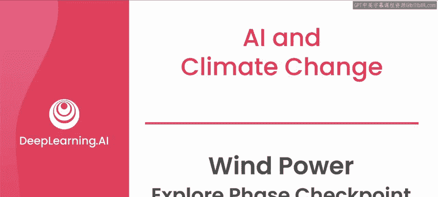

在本节课中，我们将回顾风力发电预测项目的数据探索阶段。我们将学习如何评估是否已具备进入下一阶段（设计阶段）所需的一切条件，并了解在此过程中需要回答的关键问题。

## 数据探索回顾

上一节我们介绍了风力发电预测项目的数据探索实验。在本节中，我们来看看探索阶段的主要发现。

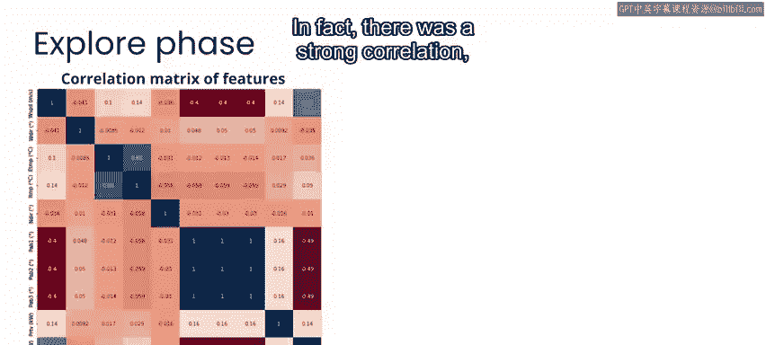

在数据探索中，你观察到数据集中的某些变量是相关的。事实上，风速与功率输出之间存在强烈的相关性，但这种关系是非线性的。数据中的这些模式和关系是一个良好的指标，表明人工智能可能有助于利用这些变量的组合来预测输出。

具体来说，这种非线性关系可以用一个**公式**来描述：`功率输出 = f(风速)`，其中 `f` 是一个非线性函数。

## AI应用的现实依据

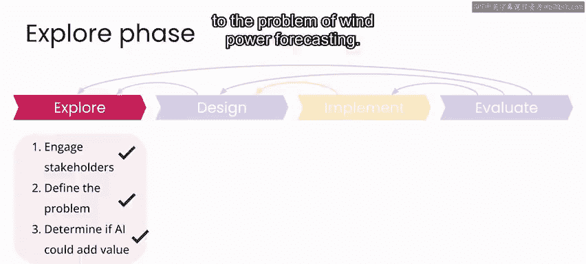

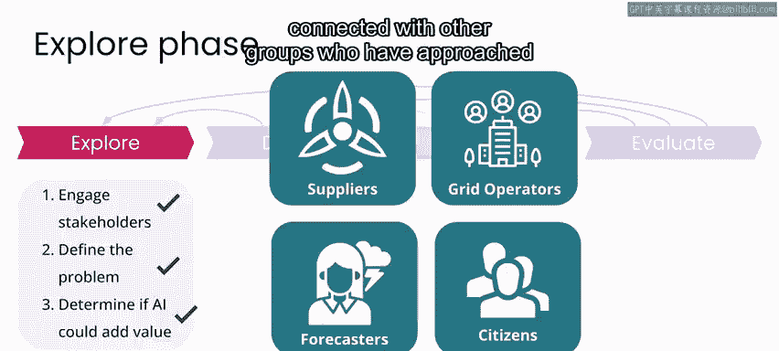

现在，正如我们所看到的，现实中有许多团队正在使用人工智能进行风力发电预测，并且结果令人鼓舞。因此，可以更稳妥地说，人工智能通常能为风力发电预测问题增加价值。

对于此类项目，除了直接的利益相关者（如风电场运营商和电力公司）外，联系其他曾处理过此问题的团队并向他们学习最佳实践和需要避免的陷阱，也是非常重要的。

## 评估项目可行性

无论如何，即使其他团队已经取得成功，你仍然需要确定你所掌握的数据是否足以构建解决方案。

在考虑人工智能能否作为解决方案的一部分增加价值时，开始思考“不伤害”原则并考虑你的工作可能带来的任何负面影响，同样至关重要。

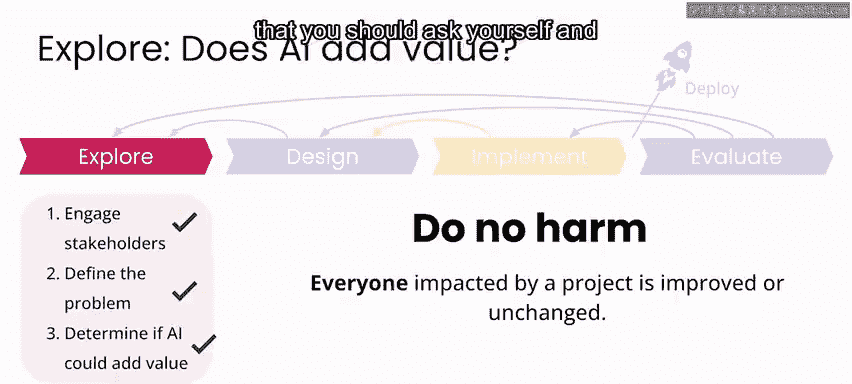

在项目开始时，你的工作可能如何造成伤害可能并不明显。但如果你在项目开发的每个阶段都考虑潜在的负面结果，你将更有可能避免这些结果。

## 探索阶段结束的检查点

在框架的每个阶段结束时，你都应该向自己和团队提出一系列问题，以确保你已具备进入下一阶段所需的条件。

以下是探索阶段结束时你需要能够回答的问题：

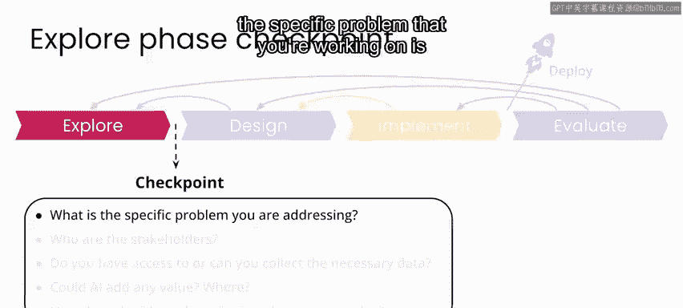

*   **问题一**：你要解决的具体问题是什么？
*   **问题二**：利益相关者是谁？
*   **问题三**：你是否能够获取或获得必要的数据？
*   **问题四**：人工智能能否增加价值？具体在何处以及如何增加？
*   **问题五**：“不伤害”原则在此如何体现？

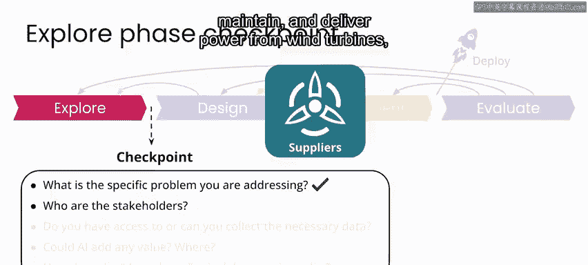

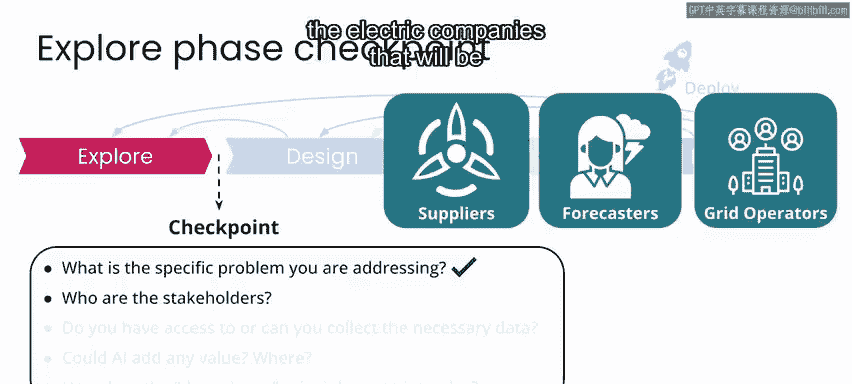

## 风力发电预测案例解答

在你正在进行的风力发电预测示例中，上述问题的答案如下：

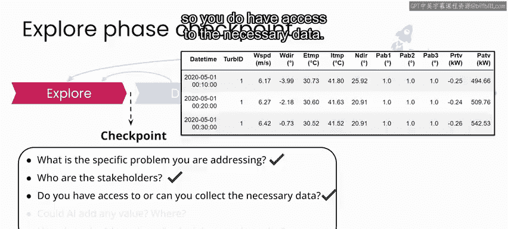

**具体问题**：电力公司需要至少提前24小时对风力发电输出进行可靠预测，以便更好地规划电网所需的其他电力输入源。

**利益相关者**：包括建造、维护风力涡轮机并从中输送电力的公司、天气预报机构、电力公司内部负责平衡风力发电与其他来源的人员，以及过去或现在研究过此问题的团队。

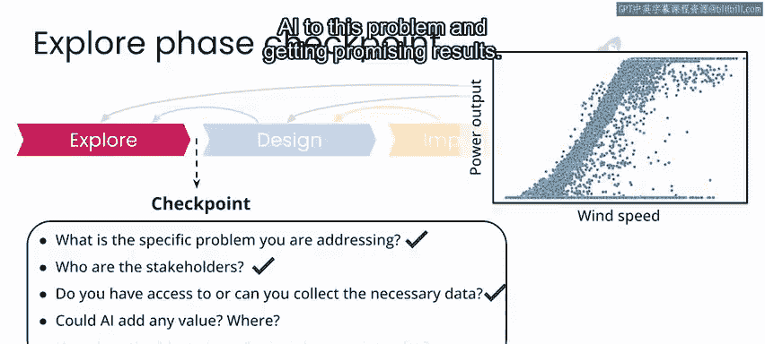

**数据获取**：运行风力涡轮机的公司提供了解决此问题所需的数据，因此你能够获取必要的数据。

**AI价值**：在探索中，你识别了数据中复杂的关系和模式，这意味着人工智能可能能够从这些模式中学习。全球许多团队正在将人工智能应用于此问题并取得有希望的结果，这也证实了这一点。

**“不伤害”原则**：你已经在重点视频中看到了一个例子，说明太阳能发电场的选址可能会影响当地社区的环境，风力发电场也是如此。在我们正在研究的这个特定用例中，我们关注的是提高现有风力发电系统的效率，而不是寻找安装新系统的地方。但如果你的研究是预测新风电场选址解决方案的一部分，那么你就需要考虑这些以及其他潜在的危害。

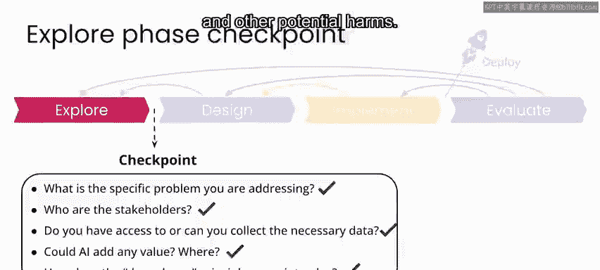

## 总结与过渡

如果你发现自己在未来探索另一个项目时，对其中一些问题的答案仍不清楚，那么最好花更多时间探索问题，直到收集到足以让你安心推进的所有信息。

在本案例中，你已经准备好进入风力发电预测的设计阶段。在下一节课中，我们将一起深入探讨设计阶段。