# 053：风力发电预测 - 建立基准模型 🌀


在本节课中，我们将进入风力发电预测项目的设计阶段。我们将深入调查数据，开始测试不同的建模策略，并思考最终用户体验。首先，我们将尝试基于数据集中的所有数据（包括风速、温度和每个风力涡轮机的配置）来估算风力发电输出。请注意，这还不是风力发电预测，我们只是用数据建模问题，暂时不涉及未来预测。


## 数据清理与异常值处理


上一节我们介绍了项目背景和目标，本节中我们来看看如何处理数据中的异常值。首先，我们需要清理数据，移除异常值和其他异常情况。

以下是数据清理的主要步骤：

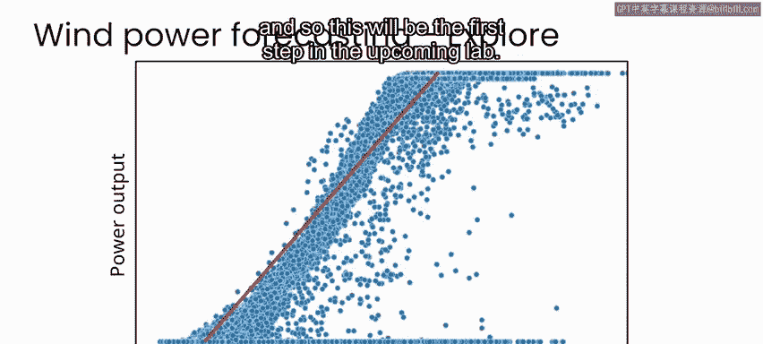

1.  **导入必要的Python包**：首先导入所有需要的Python库。
2.  **读取数据并执行基本操作**：读取数据集，将涡轮机数量减少到发电量最高的前10台，并将日期和时间戳列转换为正确的日期时间格式。
3.  **识别并剔除异常值**：根据数据描述论文中的“注意事项”部分，识别缺失、未知或异常的条目，并将其标记为排除项。

在现实应用中，需要考虑如何在处理流程中处理这些缺失或异常值。在本实验中，我们将直接剔除所有标记为异常的条目。

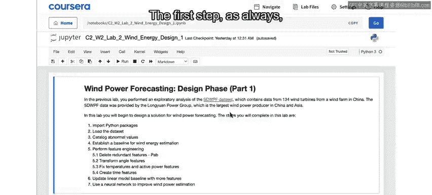

## 建立基准模型

完成数据清理后，下一步是建立一个基准模型。基准模型是指用你能想到的最简单、合理的模型来衡量你能多好地建模这个问题。

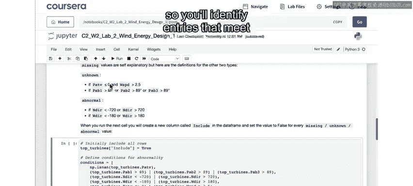

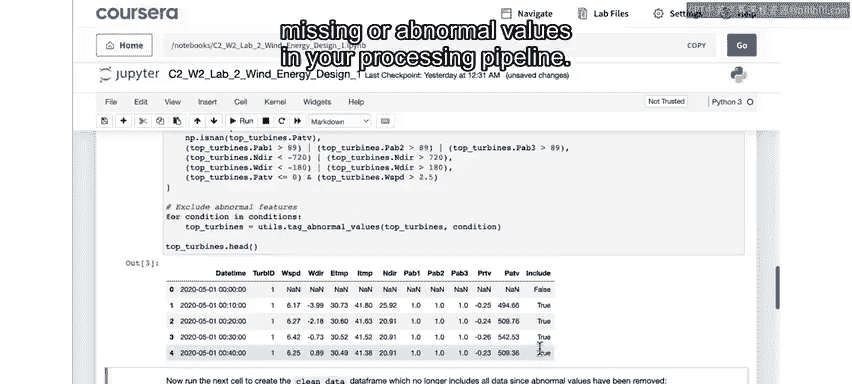

在开始探索更复杂的解决方案之前，建立简单模型的基准有几个原因：

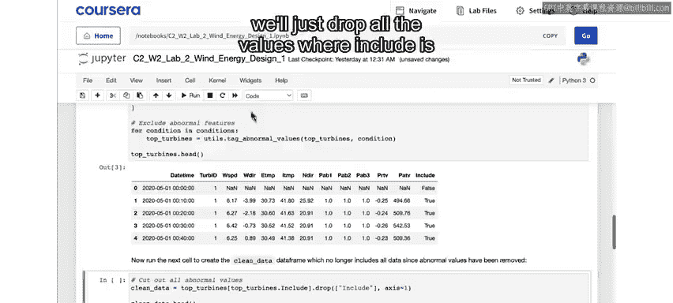

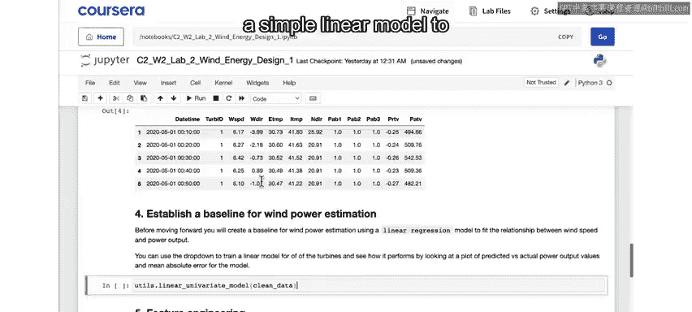

*   你可能会发现，一个简单模型的结果对于最终用例来说已经足够好，从而节省开发和支持长期解决方案的时间和成本。
*   简单模型的结果通常更容易理解和解释。
*   如果你后续转向更复杂的建模工作，基准可以提供一个量化的方式，来展示从更复杂模型的投资中获得了多少性能提升。

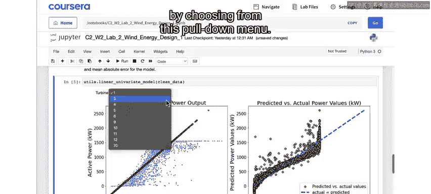

在之前探索数据的实验中，我们发现风速和发电输出之间存在强烈的相关性。表示相关变量之间关系的最简单方法之一是使用线性模型，即画一条最拟合数据的直线。

**公式表示**：`功率输出 ≈ 斜率 × 风速 + 截距`

虽然风速与功率输出的关系并不完全遵循直线，但作为简单的基准，这是一个完全合理的起点。这将是接下来实验的第一步。

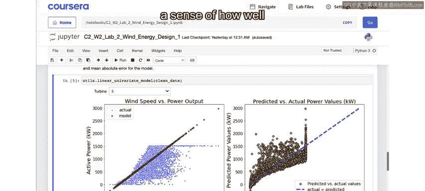

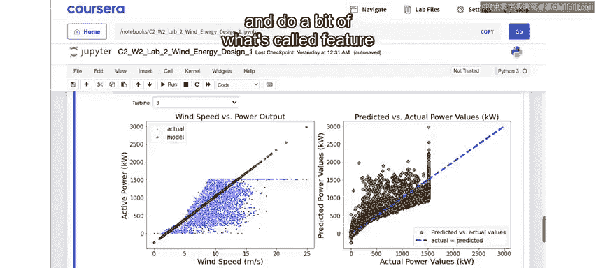

## 特征工程

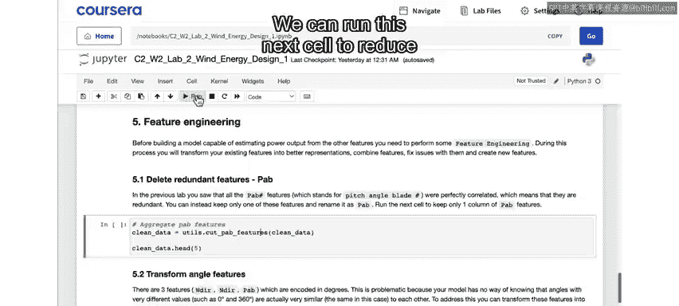

有了基准之后，我们希望看看如何通过更复杂的模型来改进这个基准。为此，下一步是清理数据集并进行一些特征工程，为建模准备数据。

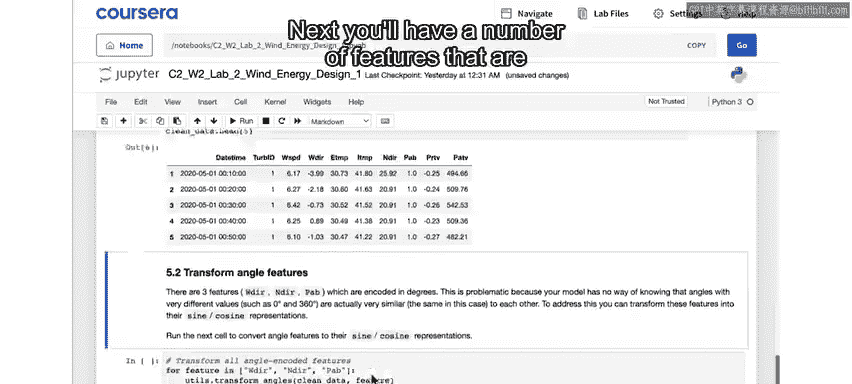

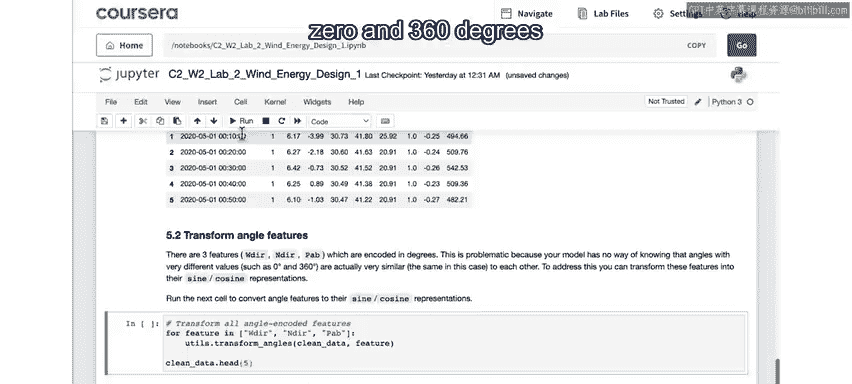

数据集中的每一列都可能包含关于你预测目标（即功率输出）的信息，这些列被称为**特征**。

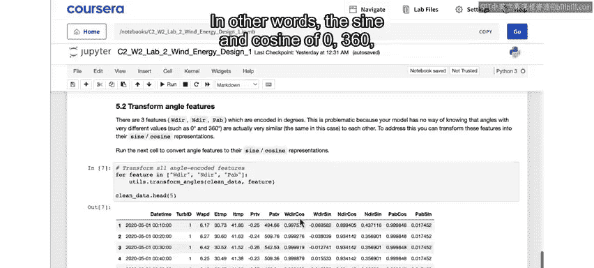

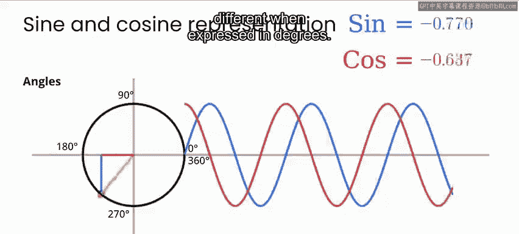

以下是特征工程的主要步骤：

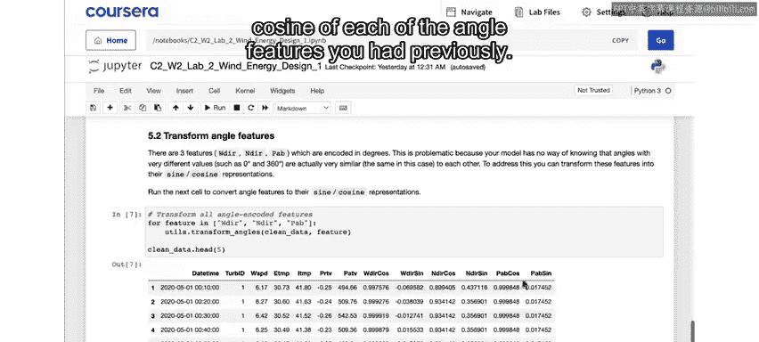

1.  **合并冗余特征**：例如，涡轮机叶片桨距角特征完全相关，是冗余的，可以将其三个特征减少为一个。
2.  **处理角度特征**：将用度数表示的角度特征（如风向）转换为正弦和余弦表示。这是因为对于模型来说，0度和360度是截然不同的数字，但通过正弦/余弦转换，模型能识别它们在数值上是相近的。
    *   **代码示例**：
        ```python
        # 假设 `wind_direction` 是角度列
        df[‘wind_direction_sin‘] = np.sin(np.radians(df[‘wind_direction‘]))
        df[‘wind_direction_cos‘] = np.cos(np.radians(df[‘wind_direction‘]))
        ```
3.  **清理温度和功率数据**：修正温度数据中的异常值（如接近-273°C的值），并将负的功率读数设置为零。
4.  **转换时间特征**：将一天中的时间也转换为正弦和余弦表示，原理与处理角度特征相同，以确保模型能理解23:59和00:01在时间上是接近的。
5.  **重新排列列**：将所有用于预测的特征放在左侧，将目标变量（本例中为有功功率）放在右侧。

## 总结

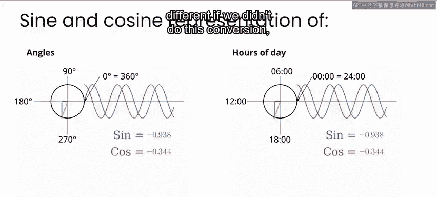

本节课中我们一起学习了风力发电预测项目设计阶段的前期工作。我们首先清理了数据，移除了异常值。然后，我们建立了一个简单的线性模型作为基准，以评估问题的基本可建模性。最后，我们进行了特征工程，包括处理冗余特征、转换角度和时间数据、清理异常值等，为后续尝试更复杂的模型（如使用全部特征的线性模型和神经网络）做好了数据准备。

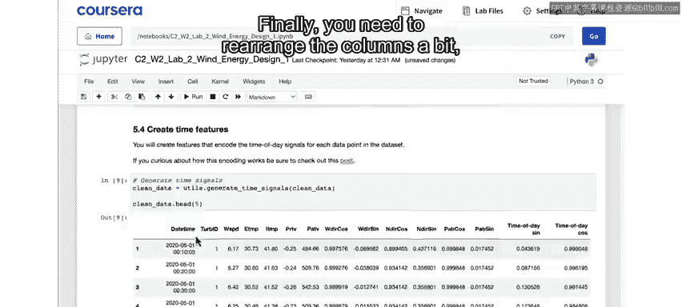

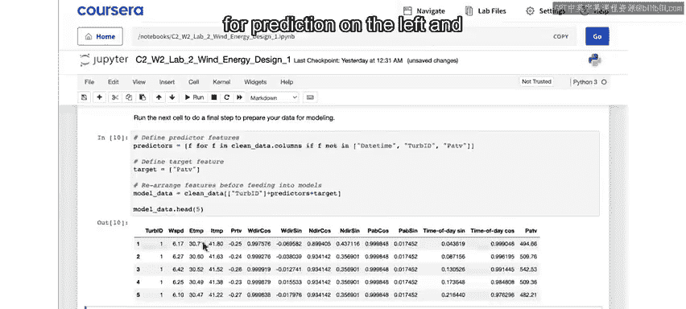

在接下来的课程中，我们将使用准备好的数据集，尝试用包含所有特征的线性模型和神经网络模型来提升预测性能。