# 054：风力发电预测 - 改进基准模型 🌀

在本节课中，我们将学习如何改进风力发电预测的基准模型。我们将从简单的单特征线性模型出发，扩展到使用多个特征进行预测，并初步了解特征重要性的概念。

---

在上一节视频中，我们完成了风力发电预测设计实验的第一部分。我们首先清理了数据集以移除异常值，然后建立了一个使用简单线性模型拟合风速与风力涡轮机输出功率之间关系的基准模型。

之后，我们进行了一些特征工程，以便更好地为更复杂的模型准备数据。

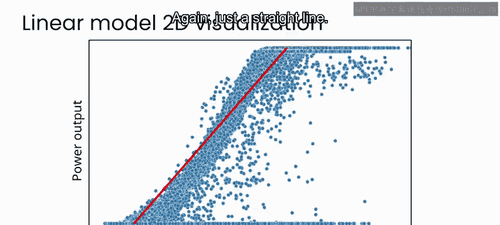

实验下一部分的第一步，是尝试使用不止一个特征的线性模型。

在二维空间中，线性模型相对容易可视化，它仍然只是一条直线。但如果进入三维空间，线性模型实际上会变成一个平面。而在高维空间中，没有很好的可视化方法，但你可以将这个高维线性模型视为一个仍然简单、但使用更多信息来尝试估计目标变量（功率输出）的模型。

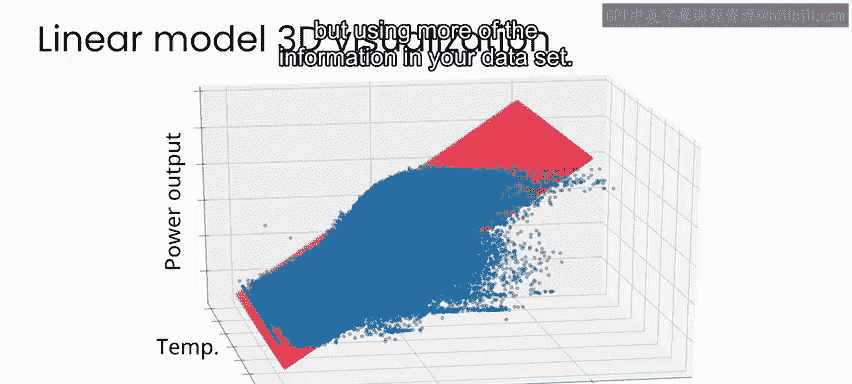

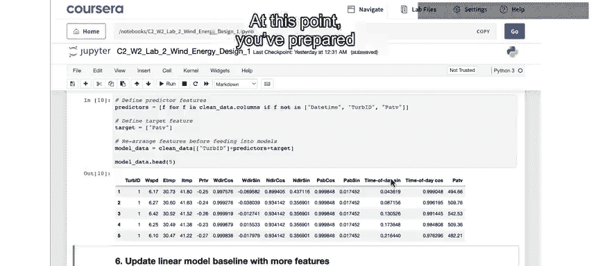

因此，在某种意义上，你可以将其视为一个仍然简单、但使用了数据中更多信息的基准。

回到实验笔记本中，此时你已经准备好使用除风速外的所有特征来开发模型，以预测功率输出。

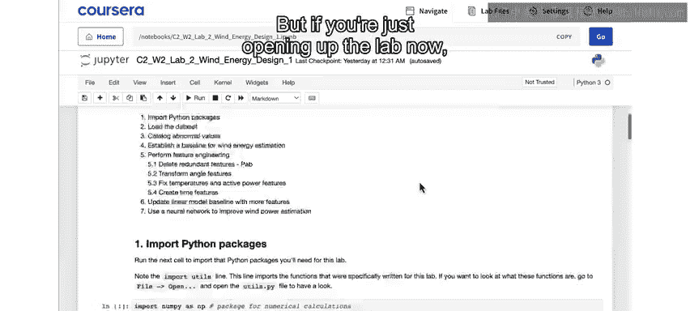

如果你一直跟随实验并运行了至此的所有单元格，你可以从这里继续。但如果你是现在才打开实验，请确保运行至此的所有单元格。

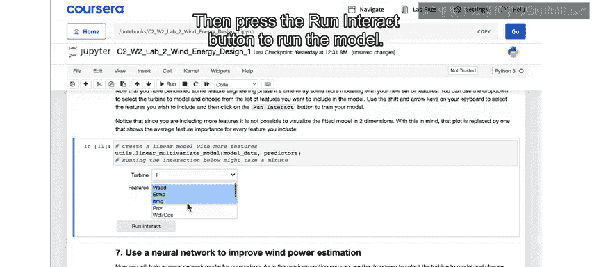

当你运行下一个单元格时，可以在下拉菜单中选择你想在模型中使用的特征。

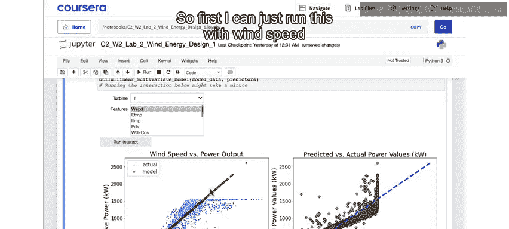

使用鼠标的Shift键和点击，或使用向下箭头键，可以选择多个特征。然后按下运行按钮来运行模型。

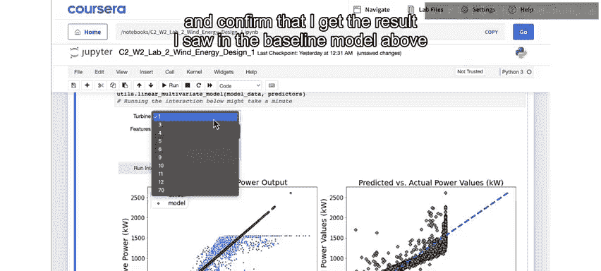

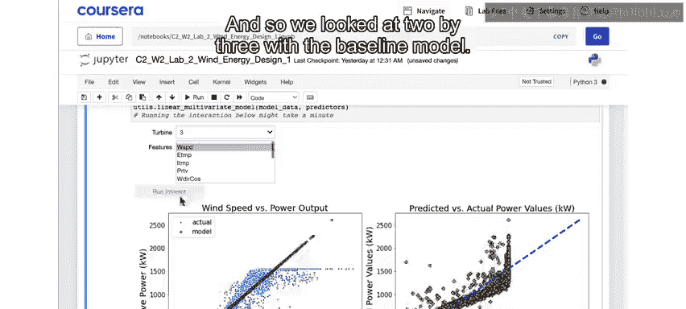

首先，我可以只使用风速来运行，以确认我得到了与上面基准模型相同的结果——一个简单的线性模型。我们之前查看了涡轮机3的基准模型，因此你可以在这里确认你得到的平均绝对误差与上面看到的相同。

在任何数据分析中，加入这类抽查和冗余检查都非常重要。

在这里，你可以再次看到蓝色绘制的是真实数据，而你的模型是这条橙色的点线。右侧则是实际功率输出与预测功率输出的对比图。

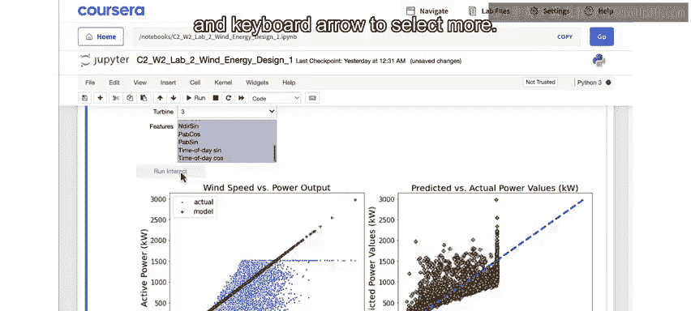

然后，你可以回到这里，现在可以从列表中选择多个特征并再次运行模型。

你可以通过点击一个特征，然后使用Shift键和键盘箭头来选择多个特征。我将选择所有特征，看看效果如何。

现在，你会看到你的模型（再次由这里的橙色点表示）在这个风速与功率输出的二维空间中不再遵循一条直线。这是因为它从更多特征中提取了信息。在本例中，它使用了数据集中的所有特征，这使你能够做出稍好一点的预测。

你现在可以看到，平均绝对误差比仅使用风速时要低一些，现在大约为135。这表明，由于你使用了所有特征，你的模型在估计功率输出方面做得更好。

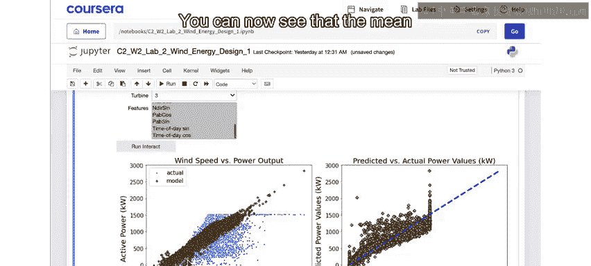

当你使用多个特征时，下方会出现一个名为“特征重要性”的指标。在机器学习中，特征重要性是一个分数或排名，表示每个特征对给定预测的贡献程度。

在这里，你可以看到风速是最重要的特征，这并不意外。但叶片的桨距角也很重要。这些是该特征的正弦和余弦表示形式，以及内部和外部温度。然而，你的其余特征在预测价值方面贡献不大。

但需要注意的是，不应过于从字面上理解这些特征重要性值，它们会因你选择的模型类型而异。现在，请尝试为不同的涡轮机和不同的特征组合运行你的线性模型，看看这些特征重要性排名以及平均绝对误差可能会如何变化。

如果你学习过本专业课程的第一门课，你已经使用过神经网络来估计空气质量。在本实验的下一部分，你将使用非常相似的技术来估计风力发电。请加入下一个实验，我们将使用神经网络来估计风力涡轮机的功率输出。

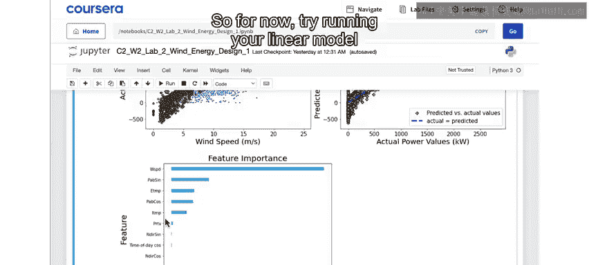

---

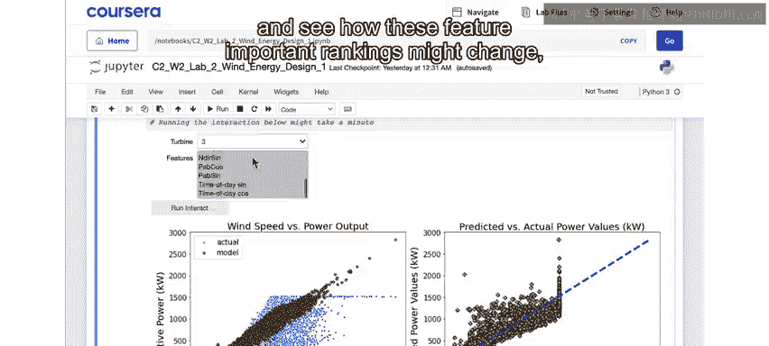

**本节课总结**

本节课中，我们一起学习了如何改进风力发电预测的基准模型。我们从单特征线性模型扩展到多特征线性模型，观察到使用更多特征可以降低预测误差。我们还初步了解了特征重要性的概念，它帮助我们理解哪些特征对模型预测的贡献更大。这为后续使用更复杂的神经网络模型奠定了基础。