# 055：风力发电预测 - 使用神经网络模型 🌀

在本节课中，我们将学习如何使用神经网络模型来预测风力涡轮机的发电功率。我们将看到，相比于之前使用的线性模型，神经网络能够更好地捕捉数据中的非线性关系，从而提供更准确的预测。

## 概述 📋

在上一个视频中，我们尝试使用数据集中的所有特征来拟合一个线性模型，以估算风力涡轮机的发电功率。我们发现，与仅使用风速相比，使用所有特征时，平均绝对误差（MAE）的估算结果实际上更好一些。

现在，我们将尝试使用神经网络，它能够学习数据中的非线性模式来估算发电功率。如果您学习过本专业课程的第一门课，那么您已经使用神经网络来估算空气质量。现在，您将使用非常相似的技术来估算风力发电。

## 神经网络简介 🧠

理解神经网络的一种有用方式是，将其视为多个线性模型的堆叠。当我们拥有一个堆叠的或多层的线性模型时，该网络就可以开始学习非线性关系。因此，神经网络是一种核心策略相对简单的算法。

神经网络由这些所谓的“人工神经元”层组成。正如您在之前的课程中所见，神经网络是跨越这些神经元的计算机器，它们接收一组输入，运行计算，然后生成输出。

正如我所说，您可以将单个神经元视为一个简单的线性模型。然后，您将一堆神经元连接在一起，形成神经网络的一层。这样，您就得到了一个可以表示我们在数据中观察到的非线性模式的模型的雏形。

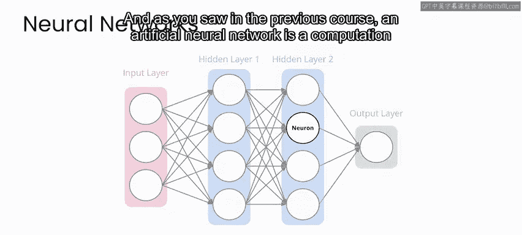

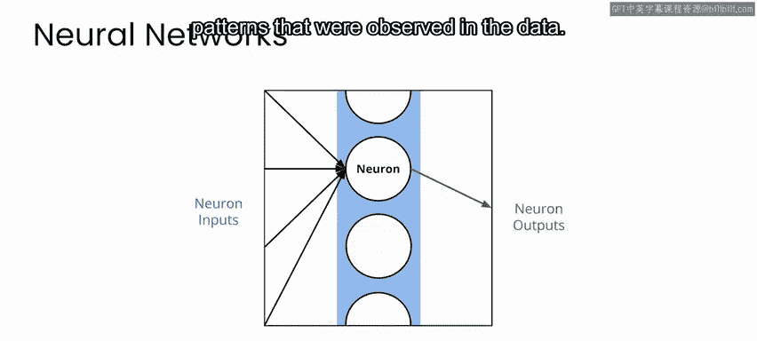

**核心概念**：一个简单的神经元可以表示为：
`输出 = 激活函数(权重 * 输入 + 偏置)`

当网络中具有多个层时，一层的输出会被馈送到下一层，该层再生成自己的输出。最终，您到达网络的末端，网络生成最终输出。

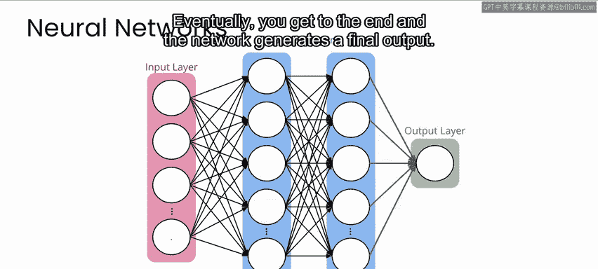

## 应用于风力发电预测 ⚡

在我们的项目中，这个输出将是一个简单的数字，代表对风力涡轮机输出功率的估算。

在左侧，您将输入每组测量值所拥有的所有信息，即：风速、一天中的时间、叶片角度特征以及温度。然后，您要求网络对输出功率进行预测。

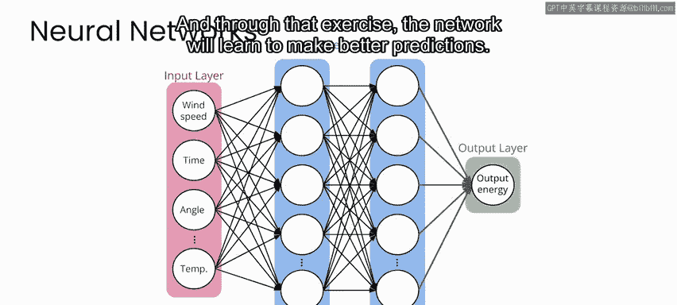

您将在已知正确答案的历史示例上训练网络。通过这个练习，网络将学会做出更好的预测。

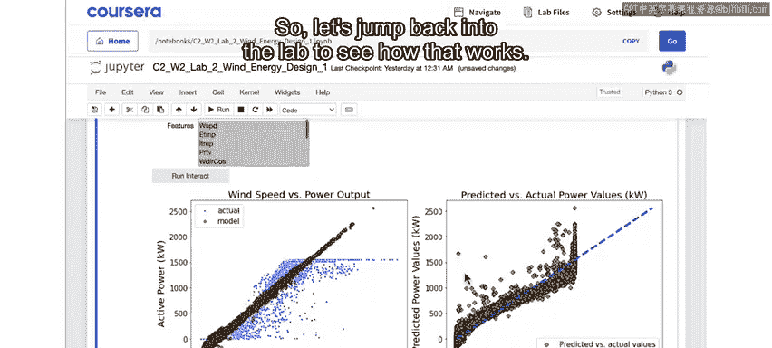

## 回到实验环境 🔬

让我们跳回实验环境，看看这是如何工作的。

我们回到了笔记本中。和往常一样，如果您一直跟随学习并运行了实验室中到此为止的所有单元格，那么您已准备就绪。如果您刚刚打开实验室，请确保运行直到这里的所有单元格，然后就可以继续了。

就像之前为线性模型所做的那样，您可以从下拉菜单中选择不同的特征子集，然后单击“运行交互”按钮来训练您的模型。

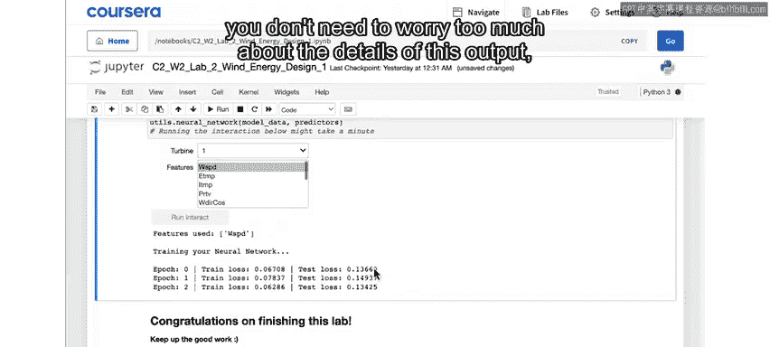

现在，您可以看到网络训练时的一些输出。您不需要过多担心这些输出的细节，只需知道您的网络正在尝试最小化所谓的**损失函数**，因此随着每个训练周期（epoch），您的网络都在学习。

## 模型结果分析 📊

然后，在下方您会看到与之前类似的输出，其中风速与输出功率的真实数据以蓝色显示，而您的模型以橙色显示。

与您的线性模型相比，很明显您的网络在预测输出功率方面做得更好。这在右侧最为明显，您正在查看真实输出功率与预测输出功率的对比。

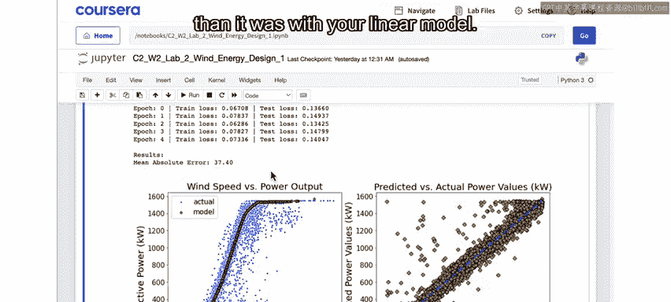

虽然代表完美模型的直线周围存在一些噪声，但您的模型看起来相当稳定，并且在整个输出值范围内没有系统地偏向一个方向或另一个方向。

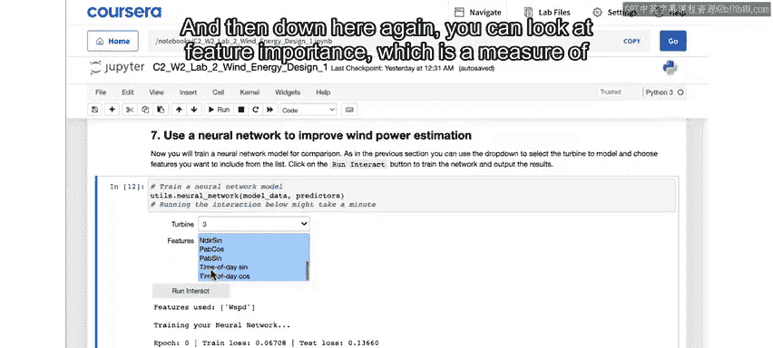

您还可以看到，此处打印的平均绝对误差明显低于线性模型。现在，我可以尝试使用数据集中的所有特征，看看效果如何。

## 特征重要性 🔍

然后，再次向下看，您可以查看**特征重要性**，这是衡量数据集中每个特征对于此预测模型的相对重要性的指标。

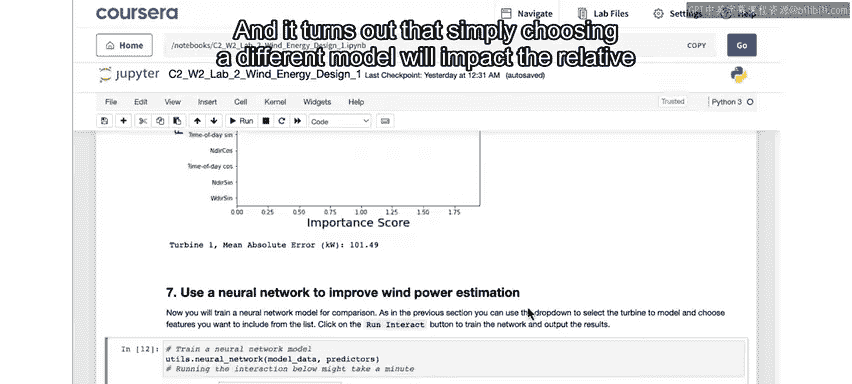

您可以看到，风速仍然是最重要的特征，但叶片角度和温度也很重要。再次强调，将特征重要性视为理解模型行为原因的一个视角很重要。事实证明，仅仅选择不同的模型就会影响特征的相对重要性，当您在此处比较线性模型和神经网络模型的特征重要性时，就可以看到这一点。

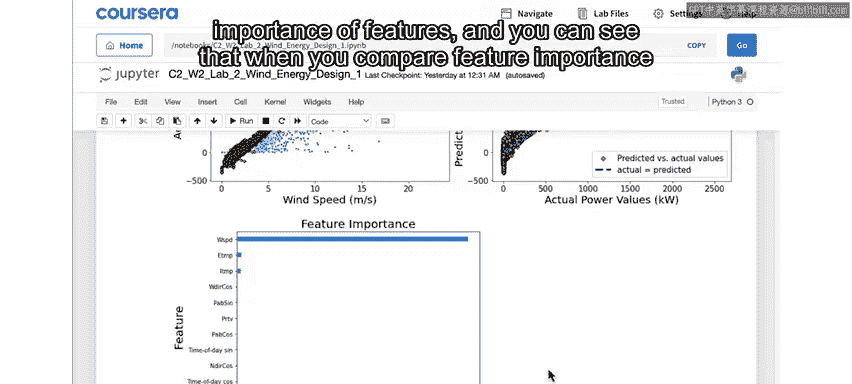

## 动手尝试 🛠️

以下是您可以进行的操作：
*   尝试为不同的涡轮机和不同的特征组合运行此模型。
*   看看您能得到什么结果。
*   您能否在不损失绝对误差性能的情况下，从模型中完全删除某些特征？

## 总结与展望 🎯

本节课中，我们一起学习了风力发电预测设计阶段的第一部分。到目前为止，您已经证明，如果您知道风的强度、风力涡轮机的一些配置情况以及环境温度，那么您就可以很好地预测该风力涡轮机将产生多少电力。

然而，请记住，这里真正的挑战是预测未来24小时内将有多少能源可用。这就是我们将在下一个实验中要做的事情。请在下一个视频中与我一起，看看我们如何进行风力发电预测。

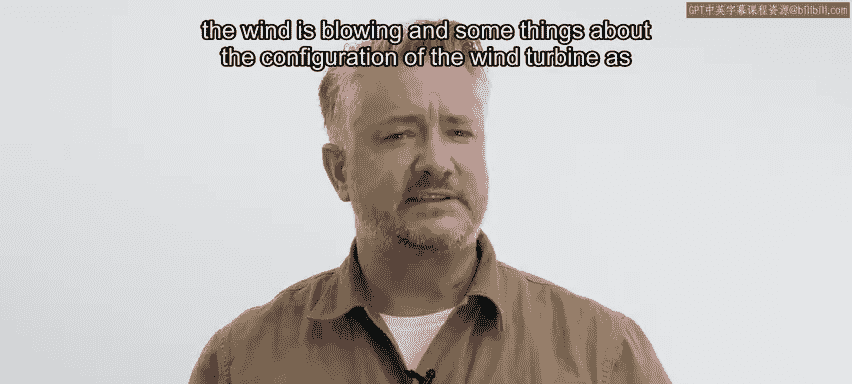

**本节课总结**：我们介绍了神经网络的基本概念，并将其应用于风力发电功率预测。通过实验，我们发现神经网络模型比线性模型表现更好，能够更准确地捕捉数据中的复杂关系。我们还探讨了特征重要性，并鼓励您尝试不同的特征组合以优化模型。