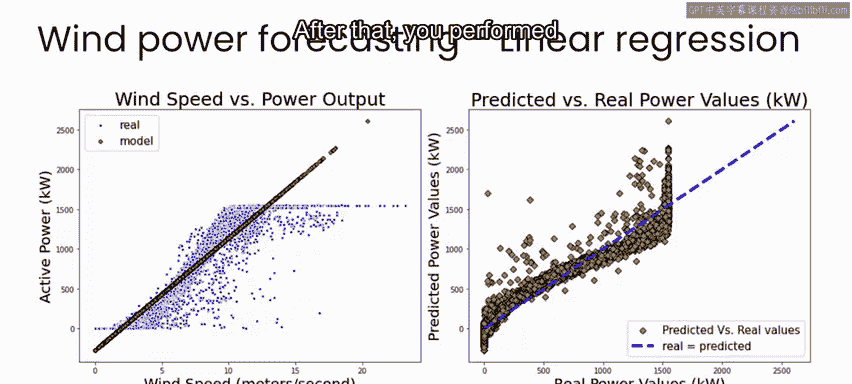
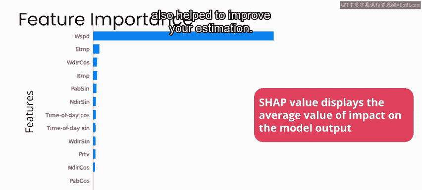
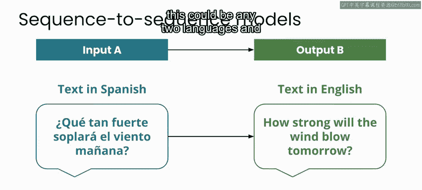
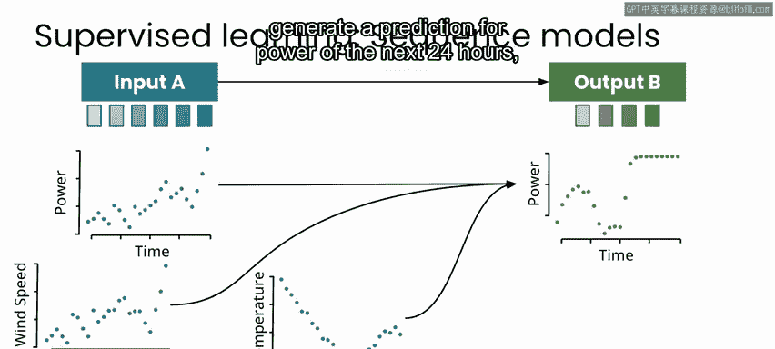

# 056：什么是序列模型 🧠

在本节课中，我们将要学习序列模型的基本概念，并了解如何将其应用于风力发电预测任务。我们将探讨序列到序列模型的工作原理，以及它们在处理时间序列数据时的应用。

---

在之前的两个视频中，我们完成了设计阶段的第一部分。你清理了数据集，并通过拟合风速与功率输出的线性模型建立了基线。之后，你进行了一些特征工程，为使用更复杂的模型准备数据。你发现了为什么通过包含数据中的所有特征可以稍微改进线性模型。一个神经网络在根据这些输入预测功率输出方面表现得更好。

你还看到，考虑到我们已经讨论过的关于特征重要性的注意事项，风速仍然是模型中最重要的特征。内部和外部温度，以及涡轮叶片的桨距角，也有助于改进你的估计。

---

在接下来的设计阶段部分，你将应对预测未来风力发电的挑战。你将通过实现一系列不同的模型来尝试预测风力涡轮机未来24小时的功率输出。

你将从一些简单的基线模型开始，看看在不实现任何复杂模型的情况下能做得有多好。然后，你将尝试一种称为序列到序列模型的神经网络模型。在AI模型的世界里，序列到序列模型用于各种任务，如自动补全或文本翻译。

你可能使用过语言翻译应用程序，在那里你可以输入一种语言并立即获得另一种语言的翻译。这是机器翻译的一个例子，在应用程序的背后是一个序列到序列的机器学习模型，将输入文本映射到输出文本。

在这种情况下，你有一个西班牙语的输入序列和一个英语的输出序列。当然，这可以是任何两种语言。虽然机器翻译应用程序远非完美，但它们在最近取得了很大进展，尤其是在广泛使用的语言之间。

这些序列模型在尝试预测任何感兴趣变量的未来行为时也很有用，就像本项目中的风力发电输出一样。因此，像这样的序列模型可以将历史数据以及其他特征作为输入序列，然后生成预测作为输出序列。

如果你学习了本专业课程的第一门课，你会了解到监督机器学习模型需要一组输入和输出来进行训练，而序列到序列模型是监督机器学习的另一种形式。

要训练这些模型之一，你需要提供它想要学习的那种输入序列的示例，以及代表正确答案的输出序列的示例。

在风力发电的情况下，输入序列可以是过去24小时内每小时产生的功率，输出序列可以是未来24小时内每小时产生的功率。你也可以为模型提供多个序列来学习，就像在这种情况下，不仅仅是历史功率，还包括过去24小时内的历史风速、温度和风力涡轮机的配置。

然后，这些输入被组合起来，以生成对未来24小时功率的预测。

在接下来的实验中，你将尝试这两种方法，并发现不幸的是，在风力发电的情况下，仅使用过去来预测未来实际上效果并不好。之后，你将把风速预测纳入你的模型，并发现情况确实有显著改善。在下一个视频中与我一起开始风力发电预测的实验。

---

本节课中我们一起学习了序列模型的基本原理及其在时间序列预测中的应用。我们了解到序列到序列模型如何将输入序列映射到输出序列，并探讨了在风力发电预测任务中结合多种特征的重要性。