# 057：建立风力发电基准预测 ⚡


在本节课中，我们将学习如何为风力发电建立基准预测模型。我们将从数据准备开始，测试几种简单的预测方法，并评估它们的性能。通过这个过程，我们将了解预测未来24小时风力发电量的挑战，并为后续更复杂的模型建立一个性能比较的基准。

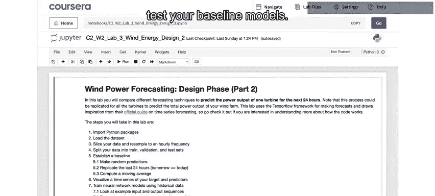

---

## 数据准备 📊

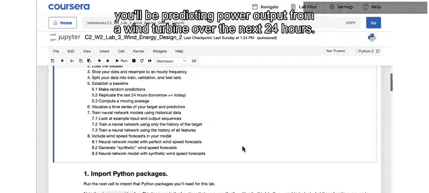

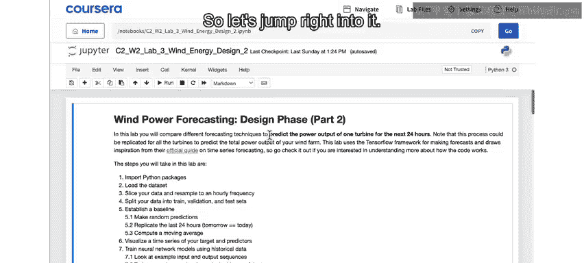

上一节我们介绍了风力发电预测的背景。本节中，我们来看看如何为建模准备数据。

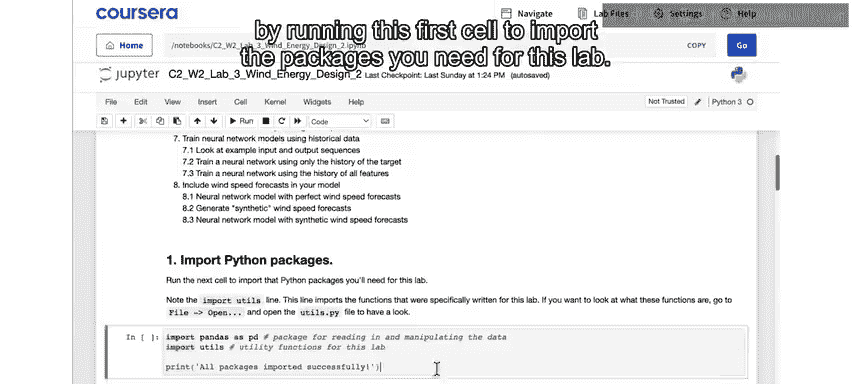

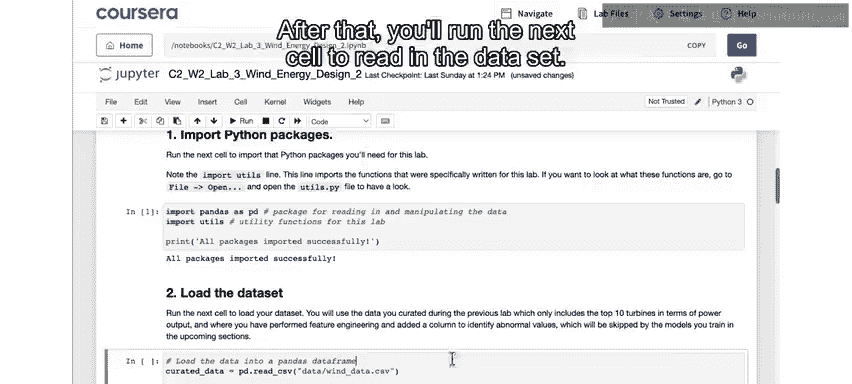

首先，运行代码导入本实验所需的软件包。

```python
# 导入必要的库，例如pandas, numpy, matplotlib等
import pandas as pd
import numpy as np
import matplotlib.pyplot as plt
```

接着，运行下一个单元格来读取数据集。

```python
# 读取经过特征工程处理后的数据集
data = pd.read_csv('wind_turbine_data.csv')
```

现在，你可以看到数据集已经包含了上一个实验完成的所有特征工程。其中，`include`列用于指示哪些行包含有效数据，哪些包含缺失值或异常值。此外，这里只包含了性能排名前10的风力涡轮机数据。

以下是数据准备的具体步骤：

*   **选择单一涡轮机**：为了简化分析，我们将数据进一步缩减，只包含一台涡轮机（当前设置为6号）。你可以将其更改为其他前10的涡轮机。原则上，分析可以扩展到风电场中的任何涡轮机。
*   **降低采样频率**：通过`prepared_data`函数，将数据从原始的10分钟记录频率降采样为每小时一次。这是为了简化分析，但你同样可以在10分钟的频率上运行后续所有步骤。
*   **处理缺失值与列**：用虚拟值替换缺失或异常值，以指示模型应忽略它们。最后，删除`turbine ID`列和`include`列。

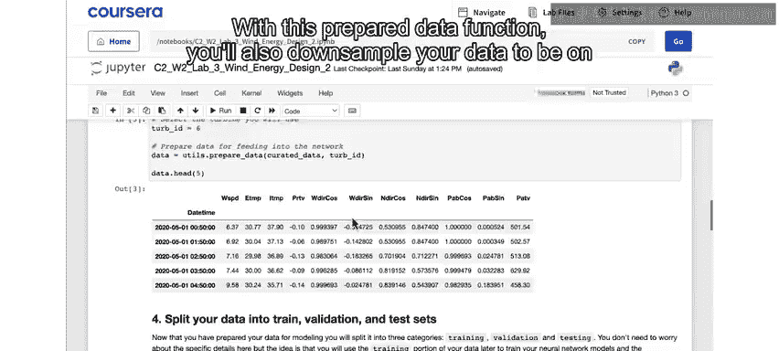

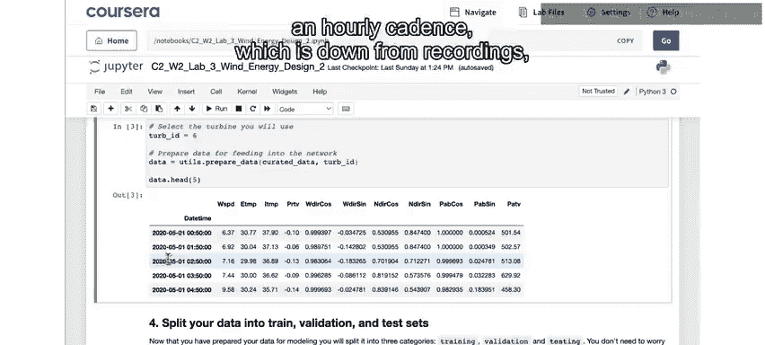

下一步是将数据分为训练集、验证集和测试集。

```python
# 划分数据集
train_data = data[data['date'] < '2020-11-01']
val_data = data[(data['date'] >= '2020-11-01') & (data['date'] < '2020-12-01')]
test_data = data[data['date'] >= '2020-12-01']
```

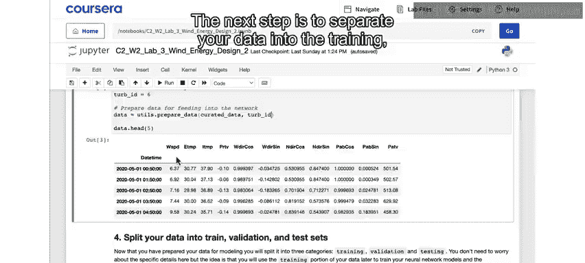

对于接下来要运行的基准建模，实际上并不需要这些分开的数据集。但我们在这里进行划分，是为了让你可以用与后续测试神经网络模型相同的数据来测试基准模型。

你还需要在这里对数据进行归一化。在本例中，这意味着将所有列的值缩放到相同的范围。

---

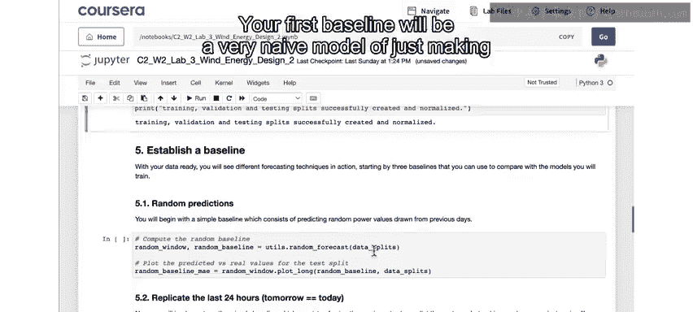

## 建立基准模型 📈

现在我们已经准备好了数据，接下来将建立几个简单的基准预测模型。

### 基准模型一：随机猜测

你的第一个基准将是一个非常朴素的模型：对未来24小时的功率输出进行随机猜测。你可以运行下一个单元格来测试这个模型。

```python
# 随机猜测模型
predictions = np.random.choice(train_data['active_power'], size=len(test_data))
mae_random = np.mean(np.abs(predictions - test_data['active_power']))
print(f"随机猜测模型的平均绝对误差（MAE）为: {mae_random:.2f} 千瓦")
```

在绘图中，你会看到模型的预测值（黄色）与实际功率输出（绿色）的对比。这是针对2020年12月几周内的测试数据集。

这里的猜测并非完全随机。它们是从数据集中有功功率值的实际分布中抽取的猜测值。因此，在图中你会看到你的猜测覆盖了实际数据的范围。

这看起来可能不像一个真正的模型。但它现在可以作为一种最坏情况的基准。这里的**平均绝对误差（MAE）** 告诉你，模型预测值平均偏离真实值多少，单位是你试图预测的目标变量（本例中是千瓦为单位的功率输出）。

**公式：MAE = (1/n) * Σ|y_i - ŷ_i|**

在这里，你平均偏离了大约380千瓦。这是从实际数据分布中抽取随机预测值的最坏情况。

我们在这里报告的是平均绝对误差。根据你正在处理的应用，其他误差指标如均方误差（MSE）或均方根误差（RMSE）可能更合适。本例选择平均绝对误差是因为它直观，可以直接解读为你试图预测事物的单位（本例中是千瓦）。所以，你的估计平均偏离了380千瓦。任何其他模型至少必须比这个随机猜测模型更好。

### 基准模型二：昨日重现

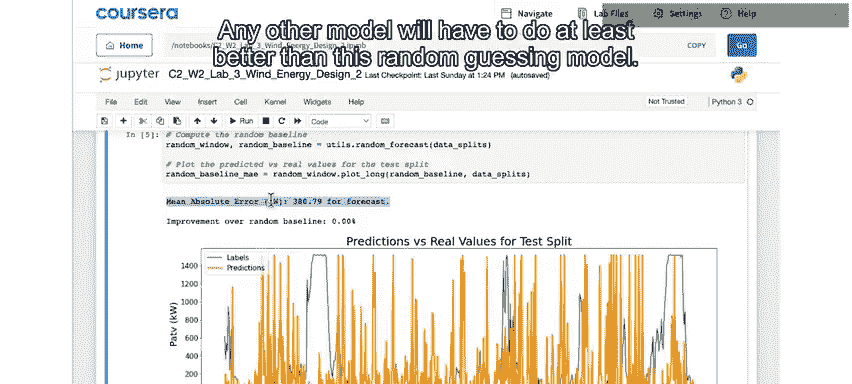

接下来，你将尝试运行另一个简单但稍微聪明一点的基准模型。在这种情况下，你的模型将取过去24小时的风力输出，并将其作为未来24小时的预测。你可以运行这个单元格来测试该基准模型。

```python
# “昨日重现”模型：用过去24小时的数据预测未来24小时
predictions_persist = test_data['active_power'].shift(24).fillna(method='bfill')
mae_persist = np.mean(np.abs(predictions_persist - test_data['active_power']))
print(f"‘昨日重现’模型的平均绝对误差（MAE）为: {mae_persist:.2f} 千瓦")
```

同样，这里你的模型（黄色）和实际值（绿色）是针对2020年12月部分的测试集数据绘制的。你可以看到，你的模型只是通过将实际值在时间上向前移动24小时来进行预测。

这确实是一个非常简单的模型，但你可以看到，在功率输出日复一日相似的那些日子里，它的表现还可以。

尽管如此，这里打印的平均绝对误差表明，你的预测平均仍然偏离大约335千瓦。这并不比随机猜测好多少。因此，从误差减少的角度来看，从前一天预测后一天只比完全随机的基线好大约12%。

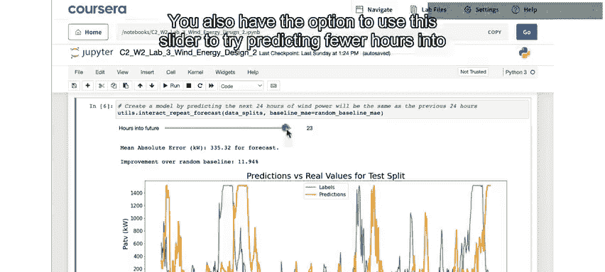

你还可以使用滑块来尝试预测未来更少的小时数。它当前是24小时，但可以将其滑回。

```python
# 使用交互式滑块调整预测步长（例如12小时、1小时）
# 此部分代码通常涉及交互式控件，此处为概念展示
prediction_horizon = 12 # 可调整为1, 6, 12, 24等
```

这里发生的情况是，使用这个基准，我们现在不是猜测24小时后的功率与现在相同，而是猜测12小时后的功率相同。你可以看到你的总体误差减少了。

现在，只预测未来12小时，你能更好地捕捉到这些大的峰值。但那些低输出日期的预测几乎完全错误。

如果将其减少到仅预测未来1小时，意味着你的模型只说一小时后的风力发电功率将与当前测量的相同，那么结果看起来非常棒。我们从24小时预测时基线改进约12%，到仅预测未来1小时时改进约80%。这应该让你很好地体会到，预测一天后的风力发电比预测一小时后要困难得多。

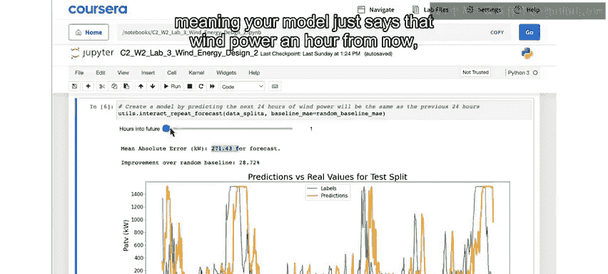

### 基准模型三：移动平均

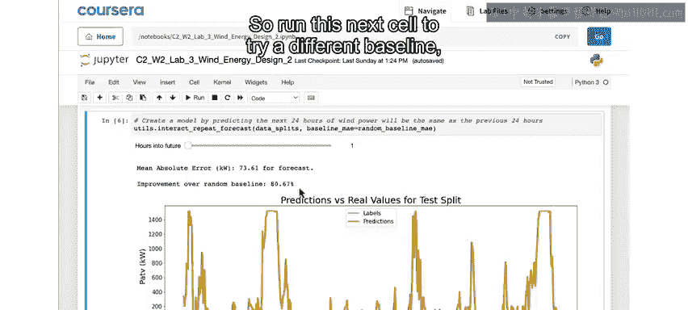

运行下一个单元格，尝试一个不同的基准：计算历史数据的移动平均值来预测未来。

```python
# 移动平均模型：用过去24小时的平均值预测未来
window_size = 24
predictions_ma = test_data['active_power'].rolling(window=window_size).mean().shift(1)
mae_ma = np.mean(np.abs(predictions_ma - test_data['active_power']))
print(f"移动平均模型的平均绝对误差（MAE）为: {mae_ma:.2f} 千瓦")
```

这里，你现在取过去24小时的平均值来做出未来预测。你可以使用这个滑块查看未来1到24小时的预测情况。

你可以看到，这个模型也比随机猜测好不了多少。当你预测未来24小时时，它实际上比你上一个基准模型表现更差。如果你将滑块向下滑动到1，那么你就是在用过去24小时的平均值来预测未来1小时，这比预测24小时后的表现要好。所以，再次证明预测1小时后比预测24小时后更容易。但总体而言，这个模型并没有比之前的基准做得更好，事实上，这比仅用最近一小时进行预测还要差一点。

---

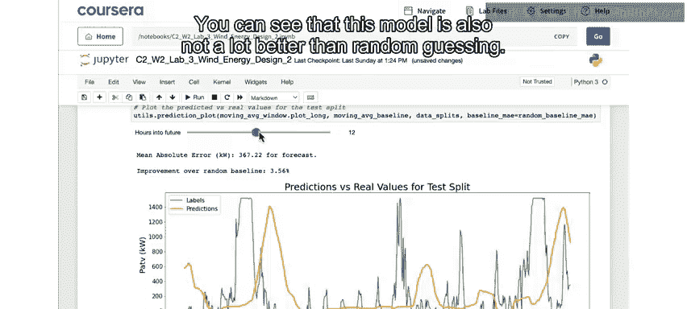

## 总结 🎯

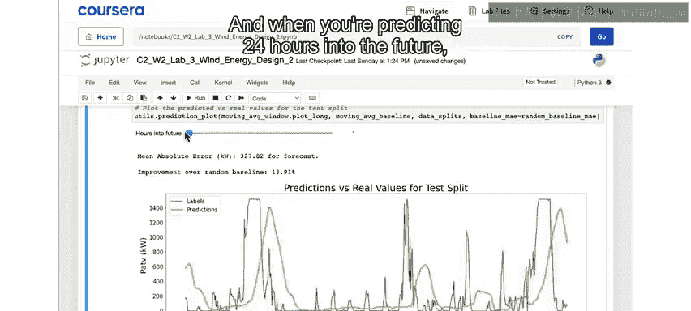

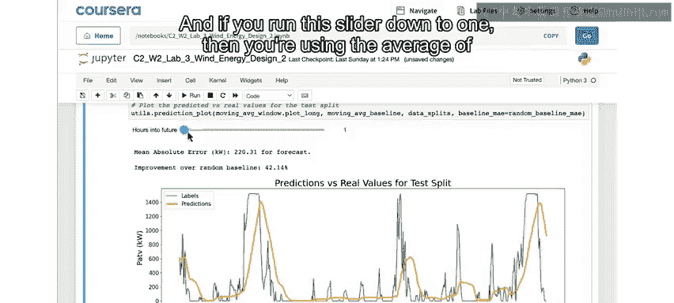

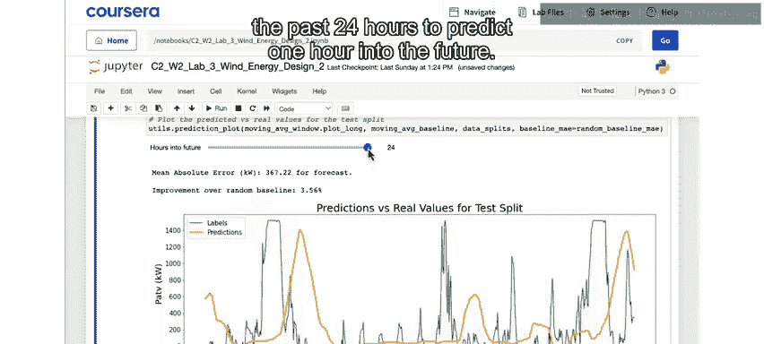

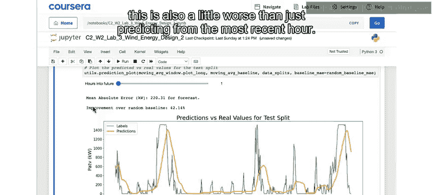

本节课中，我们一起学习了为风力发电预测建立基准模型。

我们首先准备了数据，包括选择单一涡轮机、降采样和处理缺失值。然后，我们建立并测试了三个简单的基准模型：
1.  **随机猜测模型**：作为最坏情况基准，其平均绝对误差约为380千瓦。
2.  **“昨日重现”模型**：用过去24小时数据预测未来24小时，误差约为335千瓦，仅比随机猜测稍好。
3.  **移动平均模型**：用过去24小时的平均值预测未来，性能并未显著优于前一个模型。

通过这些基准模型，我们了解了预测未来24小时风力发电的难度，并获得了模型性能的底线参考值。最重要的是，我们发现预测一小时后的发电量远比预测一天后要准确得多。

虽然这些简单模型的表现并不出色，但请不要气馁。一旦我们开始结合其他变量，我们将看到这些预测值得到改善。请继续学习下一课，我们将开始测试一些序列模型。