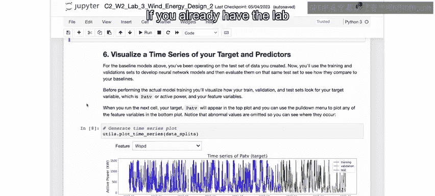
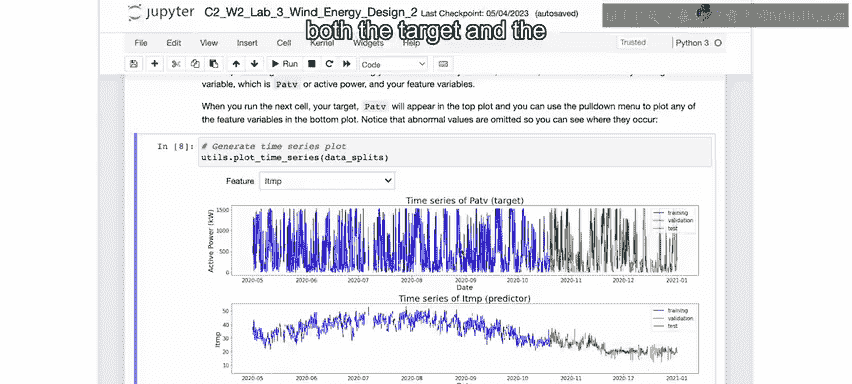
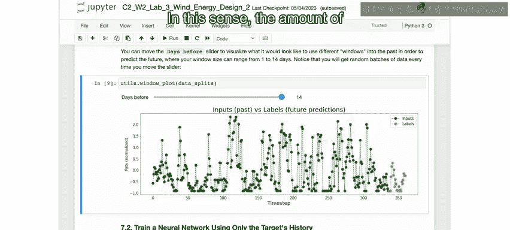
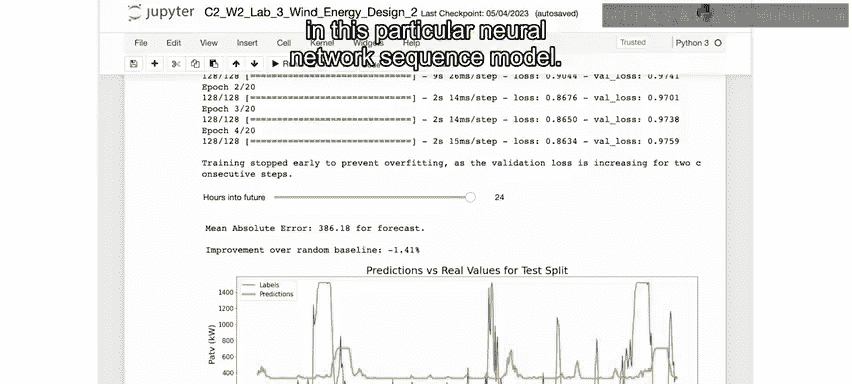
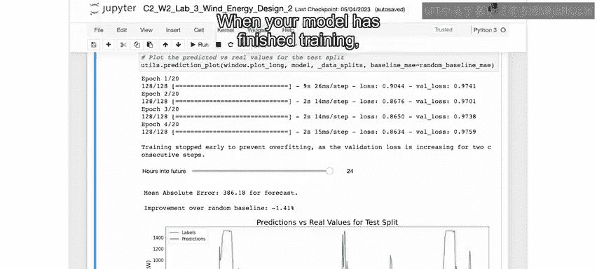
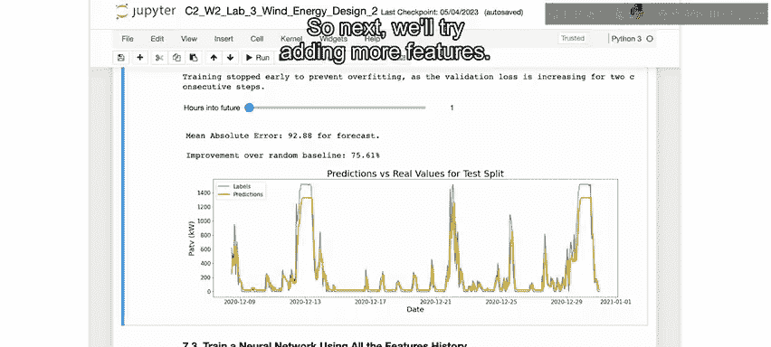
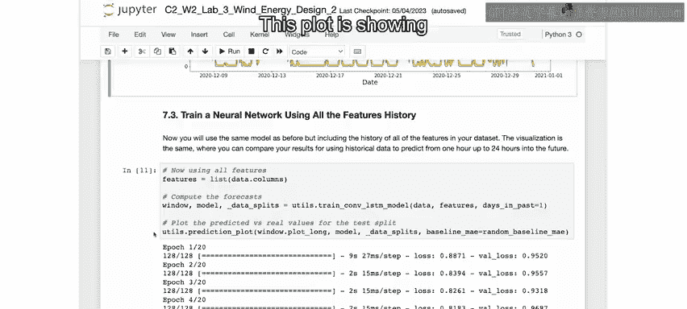
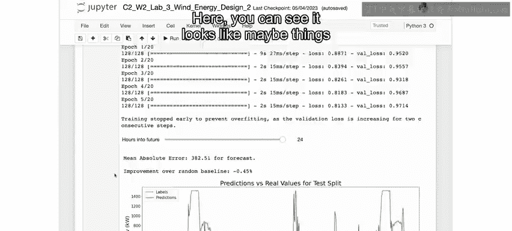

# 058：20_风力发电用序列模型改进性能 🍃

在本节课中，我们将学习如何使用序列模型来改进风力发电的预测性能。我们将从数据准备和基线模型出发，逐步构建更复杂的神经网络模型，并评估其预测效果。

---

在风力发电预测实验的第一部分，我们准备了数据集并建立了一些基线模型用于比较。接下来，我们将从上次结束的地方开始，转向更复杂的序列模型。

如果你已经打开了实验环境并运行了至此为止的所有代码单元，那么你可以从这里开始，跟随接下来的步骤。如果你刚刚打开这个实验，请务必从顶部开始，运行所有直到此处的代码单元。

---

在训练和测试模型之前，我们将运行接下来的两个代码单元来可视化训练集、验证集和测试集数据，以便更好地理解如何训练一个序列模型。

第一个代码单元创建了数据集的版本，这些版本通过屏蔽缺失或异常值，更容易进行可视化。

当你运行下一个代码单元来可视化数据时，你将看到两个图表。

上方的图表展示了数据集中包含的整个八个月期间，特定涡轮机的功率输出。这是我们旨在预测的变量。对于第一个模型，我们将简单地使用历史功率输出来预测未来的功率输出。之后，我们会在输入中包含其他特征来进行预测。

下方的图表展示了其中一个其他特征，例如风速。你可以使用这里的下拉菜单来更改第二个图表中查看的特征。

蓝色和绿色部分分别代表训练集和验证集，它们将在神经网络的训练过程中使用。红色部分代表测试集，我们已经用它来测试基线模型，并将用它来测试每个神经网络模型的性能以进行比较。

数据的划分方式是：前五个月左右的数据用于训练，接下来的两个月左右用于验证，最后一个月用于测试。这里的主要要点是，你的神经网络将尝试从每个变量的历史数据中学习。

---

目标变量和预测变量都是为了预测未来。学习过程包括在蓝色所示的数据上进行训练，并在绿色所示的数据上进行定期评估。当模型似乎不再有改进时，我们将停止训练，然后在红色所示的数据上进行测试，这些数据在训练过程中从未见过。

为了更好地可视化训练过程的工作原理，运行下一个代码单元，查看在训练中使用的输入和输出序列示例。

这里，你看到的是左侧绿色显示的24小时数据，以及右侧橙色显示的另一24小时数据，它们都是关于目标变量“有功功率”（即我们所说的功率输出）。因此，在这种情况下，网络的输入将是左侧绿色的数据序列，而你想要预测的输出是右侧橙色的序列。

在训练过程中，你将向网络展示许多这样的示例，以便它学习可能有助于预测未来24小时情况的任何模式。

这里你看到的只是一个示例，展示了如何使用过去24小时的有功功率来预测未来24小时。但你也可以在输入中包含其他变量（如风速、温度和涡轮机配置）过去24小时的数据，你将在下面看到这样的示例。

通过这个滑块，你可以看到在训练中使用更多历史数据（例如长达14天）会是什么样子。这里只是向你展示，你可以使用这里绿色显示的整个14天数据序列，再次预测右侧橙色显示的未来24小时序列。

从这个意义上说，你在输入序列中使用的历史数据量本质上只是模型的另一个参数。同样，你可以决定训练一个模型来预测少于或多于24小时的未来。

---

现在，你准备好训练第一个神经网络模型了。

运行下一个代码单元，仅使用目标变量“有功功率”的历史数据进行训练。

这里的参数 `days_in_past` 默认设置为1，但你可以将其更改为另一个值，以尝试使用更多历史数据进行训练。

如果你是Python程序员，可以查看 `utils.py` 文件并查看 `train_lstm_model` 函数，以了解更多关于这个特定神经网络序列模型的内部工作原理。你会注意到模型开始训练，并计数周期（如1/20、2/20等），然后它在仅仅四个周期后就停止了。这是因为对于这些特定模型，很容易对数据过拟合，即仅仅拟合训练数据中的精确模式，而不是数据中更普遍的模式。所以你会看到这里的打印输出，上面写着“训练提前停止以防止过拟合，因为验证损失连续两个步骤增加”。换句话说，虽然训练数据的损失在下降，但留出的验证数据告诉我们，这种损失下降是由于过拟合，而不是因为模型变得更准确。

---

你可以在这里的 `Val loss` 中看到验证损失被打印出来，并且在连续步骤中上升。如果你不是AI从业者，不必太担心这意味着什么，但我只是想提一下，这样就不会对训练为何提前停止感到困惑或神秘。

一旦你的模型完成训练，你将在这里看到一个图表，其中模型预测以黄色显示，真实值以绿色显示。

---

你会发现，预测未来24小时，你的模型表现并不好。事实上，它并不比你的基线模型好。这是一个很好的例子，不幸的是，一个复杂的模型相对于简单的基线（即预测未来24小时与过去24小时相同）几乎没有改进。

你可以再次运行这个滑块，让模型只预测未来一小时，你会看到它做得更好。但请记住，我们的目标是预测未来24小时。所以接下来，我们将尝试添加更多特征。

运行下一个代码单元，使用数据集中所有特征的历史数据来训练一个新的序列模型。同样，你可以尝试更改 `n_days` 变量，在每个训练集中使用更多历史数据。

---

这个图表显示的输出与你之前看到的相同。在这里，你可以看到预测24小时后的情况似乎并没有变得更好。

---

事实证明，至少在这种情况下，使用过去来预测未来并不是很成功。值得庆幸的是，在风力发电预测的真实场景中，你还可以获得天气预报，这将允许你改进模型的预测功率。

正如你在上一个实验中看到的，风速和温度都是预测功率输出的重要特征，其他气象因素也可能产生影响。

---

本节课中，我们一起学习了如何为风力发电预测构建和训练序列模型。我们从仅使用目标变量历史数据的简单模型开始，然后扩展到包含所有特征。我们发现，仅依靠历史数据预测未来24小时具有挑战性，模型性能并未显著超越简单基线。这突显了在实际应用中结合天气预报等外部信息的重要性。