# 059：风力发电预测（二）—— 整合风速预测 🌬️📈


在本节课中，我们将学习如何将风速预测数据整合到风力发电预测模型中。上一节我们介绍了仅使用历史数据进行序列模型训练的局限性，本节中我们来看看如何通过加入风速预测信息来显著提升模型的预测能力。


## 概述：整合预测信息的重要性

在之前的视频中，我们完成了使用数据集中历史数据训练序列模型的实验部分。我们发现，仅使用过去的输入数据很难准确预测未来。考虑到风力发电输出与风速密切相关，而知道今天的风速情况并不能告诉你太多关于明天风速的信息，这个结果或许并不令人意外。


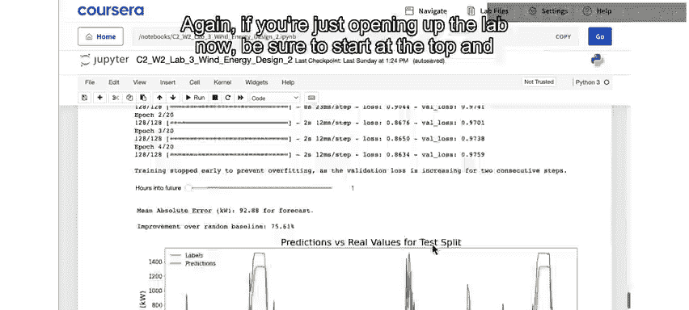

## 第一步：模拟“完美”风速预测

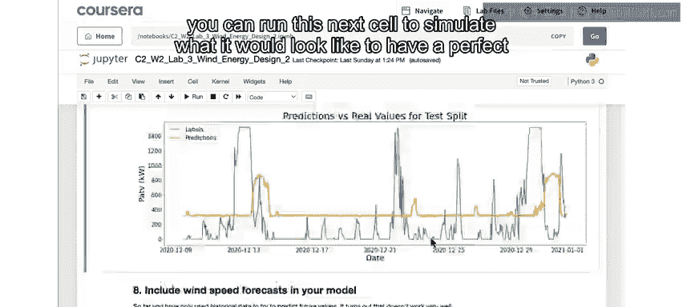

作为向模型添加风速预测的第一步，你可以运行这个代码单元，来模拟在模型训练中包含完美风速预测数据会是什么样子。


```python
# 模拟代码：在训练数据中加入未来24小时的真实风速记录
# 这本质上是一种“作弊”方法，因为在现实训练中无法获得未来的真实测量值
```

具体做法是，除了历史数据，你将在训练中加入接下来24小时实际记录的风速。这当然是一种理想化情况，因为在现实世界的模型训练中，你不可能拥有未来的风速测量值。


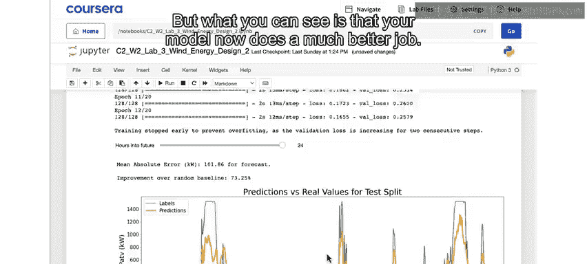

但你可以看到，与本节开头建立的随机猜测基线模型（最差情况）相比，你的模型现在表现要好得多。你可以将这个例子视为一种最佳情况，即你拥有未来24小时风速的完美信息。


## 第二步：迈向更现实的预测

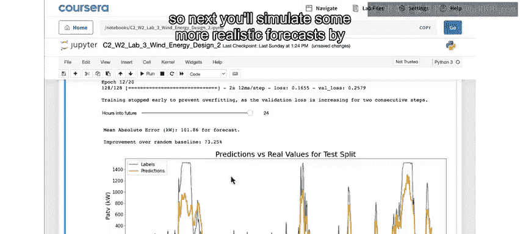

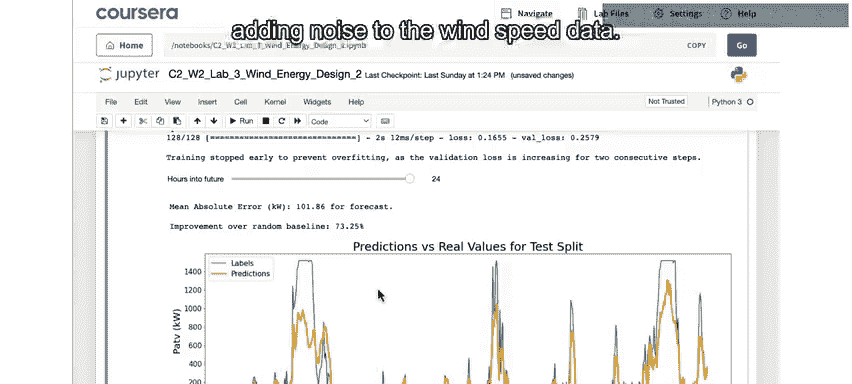

不过请记住，如果你能在模型中纳入温度、气压或许其他一些气象数据，模型的表现可能会更好。当然，在现实世界中你不会有完美的风速预测。因此，接下来你将通过向风速数据添加噪声，来模拟一个更现实的预测。

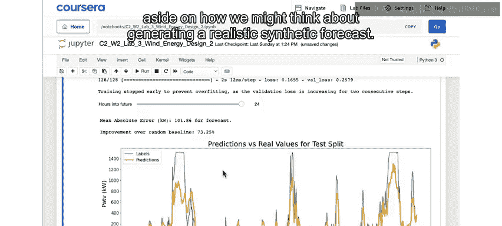

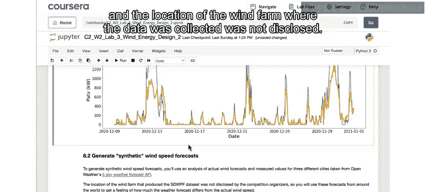

但在添加噪声之前，我们先思考一下如何生成一个现实的合成预测。


## 现实世界风速预测数据来源

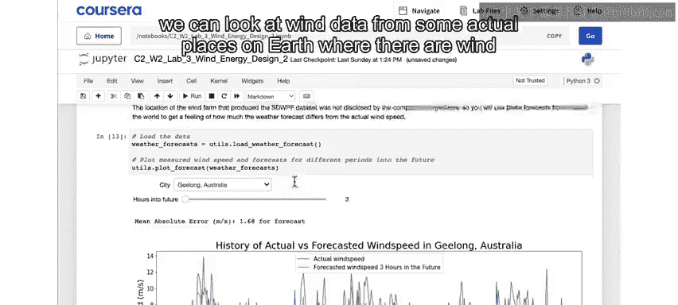

如前所述，原始数据集不包含风速预测信息，并且收集数据的风电场位置也未公开。


如果你查看原始竞赛的参与者，你会发现，就像你一样，他们也无法对未来做出非常准确的预测。在这里，通过查看我们可能想从其他地方导入的合成数据，我们可以观察地球上一些实际建有风电场的地区的风数据。


澳大利亚的杰隆就是这样一个地方。下图显示了2022年12月某些日期内，实际风速（蓝色）与预测风速（橙色）的对比。在这个例子中，你看的是对未来三小时的风速预测与实际风速的对比。


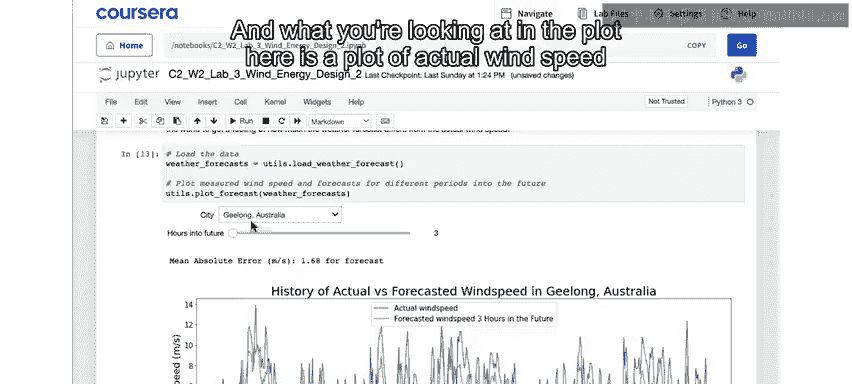

通过这个滑块，你可以看到对未来更长时间的预测，其对比情况如何。在这个案例中，最长可以看到对未来五天（120小时）的预测。我们使用OpenWeather API的数据整理了这个例子，并感谢OpenWeather团队允许我们将这些数据用于本课程。


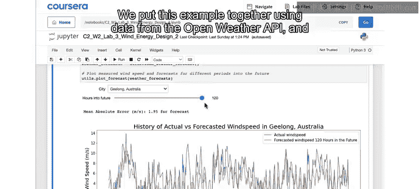

OpenWeather API提供未来最多五天的风速预测，时间间隔为三小时。我们记录了这些未来的预测值，然后在那些日子过去后，也获取了实际记录的风速数据。


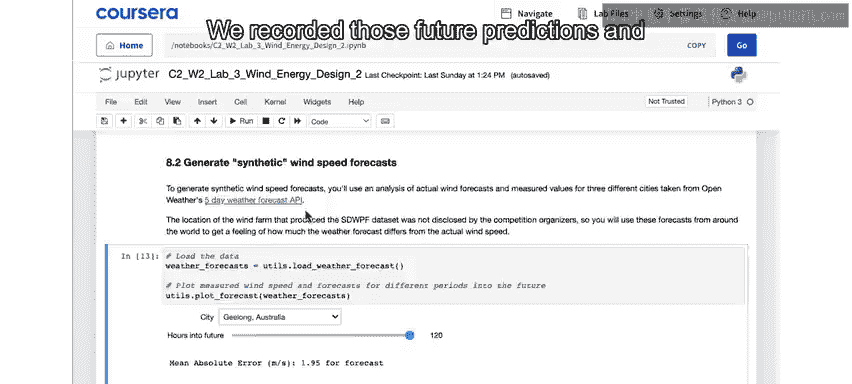

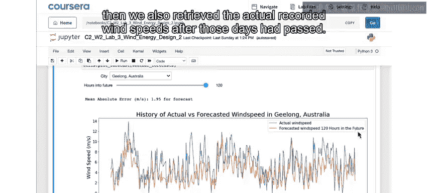

我们还为其他一些地点做了同样的工作。你可以使用这个下拉菜单，查看巴西的Porto O Lereb或美国宾夕法尼亚州匹兹堡的相同对比情况。这两个地方都是拥有大型风电场的其他地点。


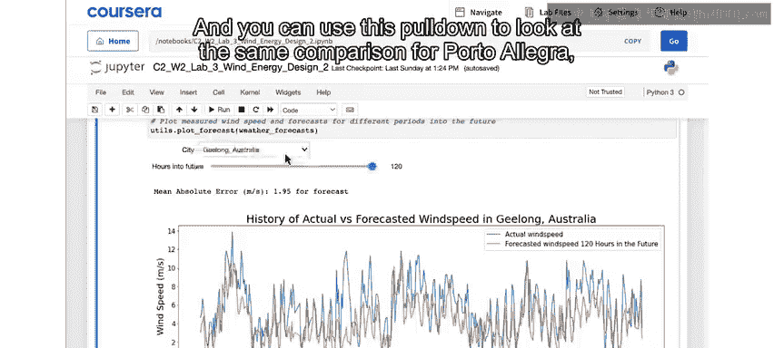

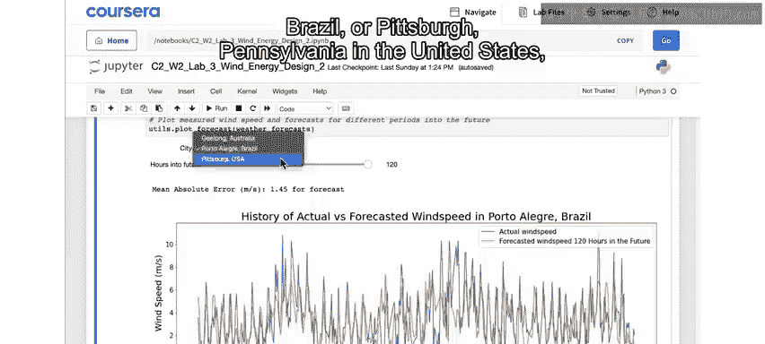

你可以看到，总体而言，对较近未来的预测至少在定性上比预测更远的未来要好，这符合直觉。


## 第三步：量化分析预测误差

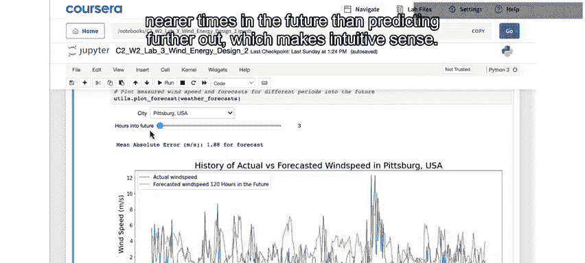

现在你可以运行这个单元，从量化角度查看风速预测的准确性。这里，横轴是预测未来的小时数，纵轴是对应未来小时数预测的平均绝对误差。同样，你可以在上面查看的三个地点之间进行选择。


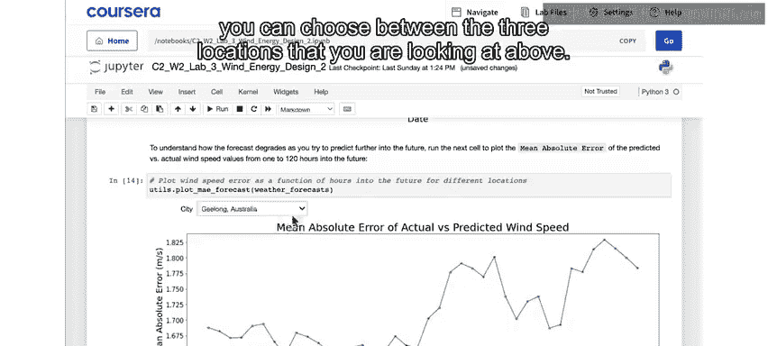

因此，你可以看到，根据地点不同，情况略有差异，但总体而言，预测平均偏差大约在每秒1到2米，并且预测的时间越远，误差往往越大。


了解了这种典型误差后，让我们继续通过向从OpenWeather数据中获得的实际数据添加类似数量的噪声，来模拟风速预测。


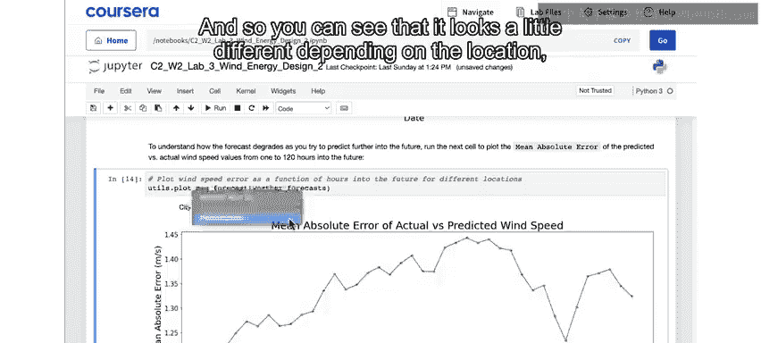

## 第四步：生成并可视化合成预测

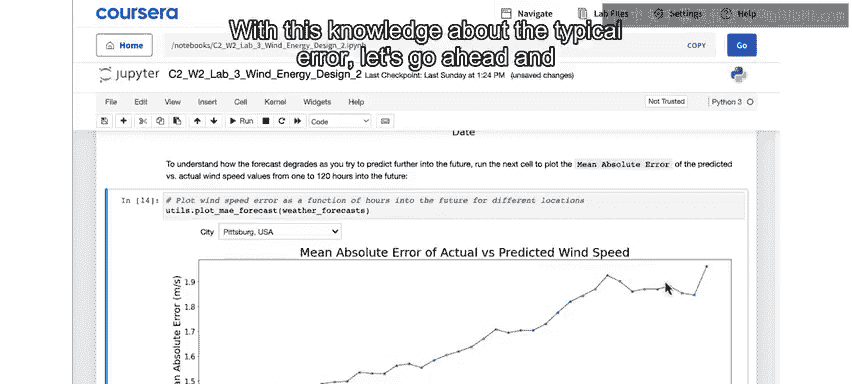

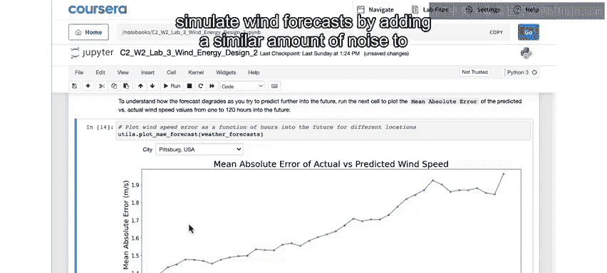

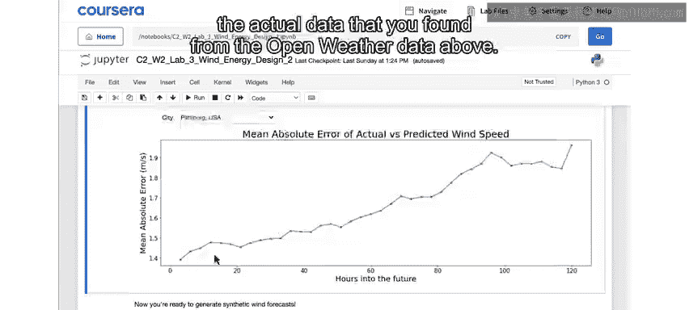

运行这个代码单元，以可视化实际风速值和模拟的带噪声的预测。你可以移动这个滑块，查看添加不同范围噪声值（从接近零到超过每秒2米的平均误差）时，合成预测会是什么样子。


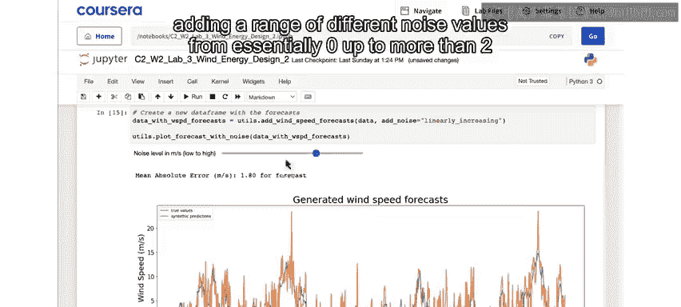

## 第五步：使用合成预测训练最终模型

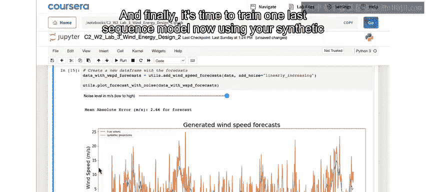

最后，是时候使用你的合成风速预测以及历史数据，训练最后一个序列模型了。


在这里你可以看到，预测未来24小时，你的模型表现相当不错。与基线模型相比，误差减少了近70%。你可以使用这个滑块查看预测少于24小时的情况。与上面的例子类似，预测的未来小时数越少，你通常能做得更好，这是因为你的合成风速预测在这些情况下噪声更少。


正如你所见，这比你之前仅基于历史数据的序列模型有了巨大改进。因此，天气预报将是任何风力发电预测模型的关键组成部分。


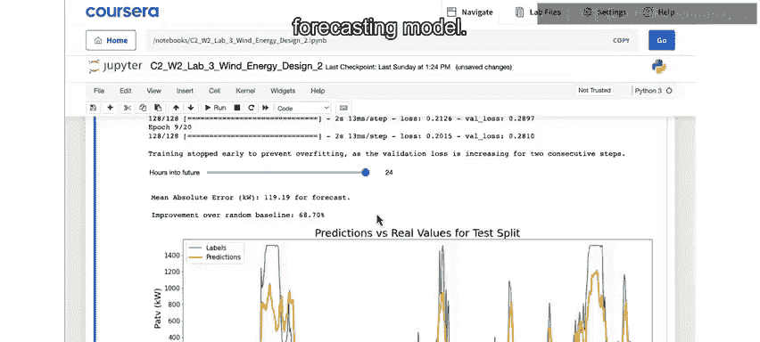

## 总结与展望

在本节课中，我们一起学习了如何将风速预测信息整合到风力发电预测模型中，通过模拟“完美”预测和添加噪声的现实预测，显著提升了模型的准确性。


在现实场景中，你可能会将天气预报的更多方面纳入预测模型，例如温度、湿度、季节变化（因为在这个数据集中我们只有大约八个月的数据），或许还有其他一些气象变量。


就本课程而言，你已经拥有了一个可工作的模型，并对风力发电预测相关的一些挑战有了实际的认识，做得很好。接下来，我们将通过回答在进入解决方案实施阶段之前你需要思考的问题，来结束设计阶段。请加入下一个视频，共同完成风力发电预测的设计阶段总结。