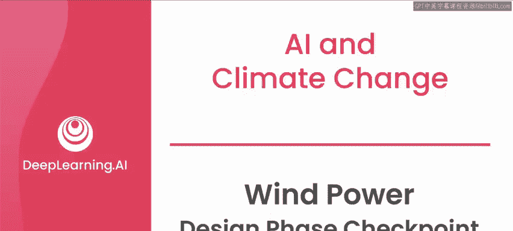
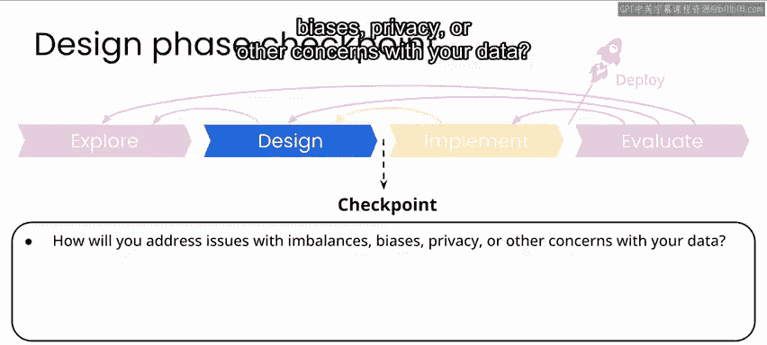
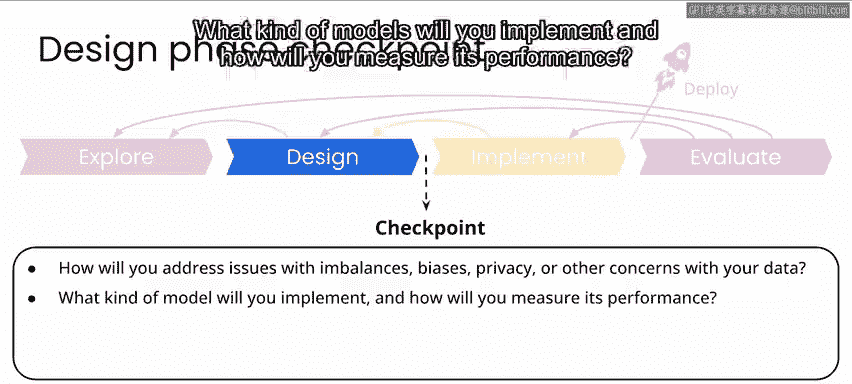
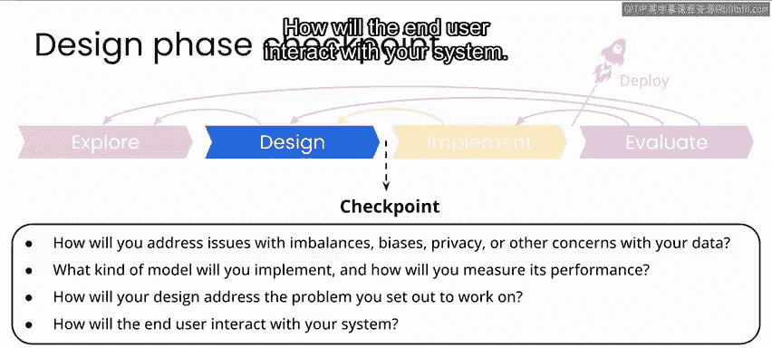
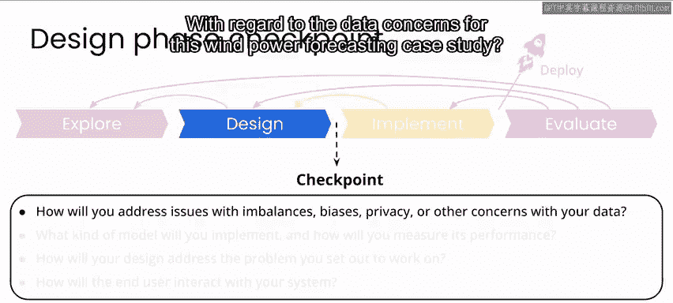
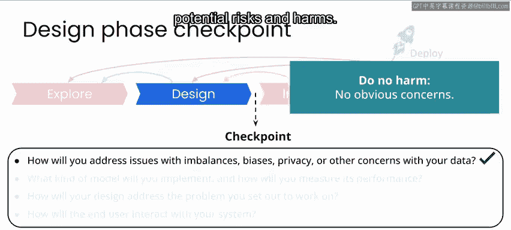
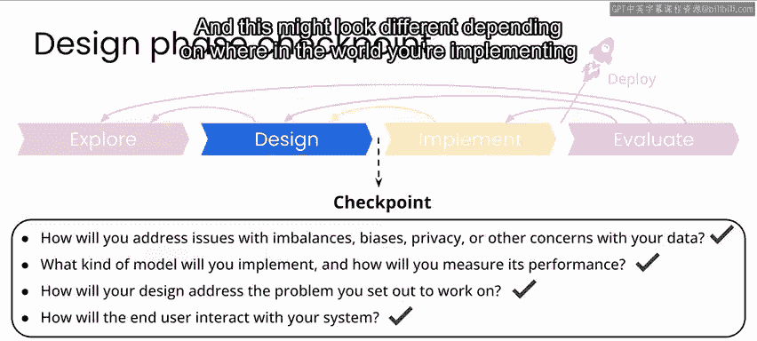

# 060：风力发电预测设计阶段检查点 🍃

在本节课中，我们将学习如何评估一个风力发电预测项目的设计阶段是否完成，并准备好进入实施阶段。我们将依据“AI for Good”项目框架，通过回答一系列关键问题来进行检查。

---

上一节我们介绍了风力发电预测的设计工作。本节中，我们来看看如何通过回答几个核心问题，来确认设计是否成熟，能否进入实施阶段。

以下是设计阶段完成前必须审视的四个关键检查点：

1.  **数据问题处理**：如何处理数据中的不平衡、偏见、隐私或其他问题？
2.  **模型选择与评估**：计划实现何种模型？如何衡量其性能？
3.  **问题解决有效性**：你的设计如何解决最初设定的问题？
4.  **最终用户交互**：最终用户将如何与你的系统交互？

---

### 1. 数据问题处理

针对本风力发电预测案例，所使用的竞赛数据集存在一些问题，包括**数据缺失**、**异常值**以及**缺乏天气预报数据**。要在现实世界中推进此项目，你至少需要获取天气预报数据。同时，拥有更高质量的历史数据也会大有裨益。

从“不造成伤害”的角度看，在偏见或隐私方面没有明显问题。然而，在相关的风力发电设施部署领域可能存在一些担忧。因此，这是一个需要与各方利益相关者以及过去处理过此问题的人员进行沟通的领域，以识别潜在的风险和危害。

### 2. 模型选择与评估

关于计划部署何种模型，同样，在拥有更好数据的真实场景中，你可能会在设计阶段花费大量时间测试不同的模型实现并评估其权衡。

对于风力发电预测，即使预测准确率仅提升**1%**，也可能在减少化石燃料消耗方面产生巨大影响。

在本案例研究中，你已经有了一个可运行的模型，并使用**平均绝对误差**来衡量其性能。你可以证明，该模型比随机猜测的准确率提高了约**70%**。

### 3. 问题解决有效性

我们最初要解决的问题是：电力公司需要至少提前24小时获得可靠的风力发电输出预测，以便规划接入电网的电源平衡。

考虑到如果获得更好、可能更多的数据，结果可能会更优，但基于本项目可用的资源，你的设计已经解决了这个问题。

### 4. 最终用户交互

在本案例中，最终用户是电力公司的个人或团队。你的设计很可能不会为他们专门设计一个用户界面，而是以一种能够平滑集成到他们现有工作平台或用户界面的方式，来提供你的模型预测结果。具体实现形式可能因项目实施地点和数据使用者的不同而有所差异。

---

本节课中，我们一起学习了风力发电预测项目设计阶段的检查流程。我们审视了数据、模型、问题解决和用户交互四个关键方面，以确保设计足够扎实，能够进入下一阶段。

虽然本案例没有实施阶段的实验，但这主要是因为解决方案的实施很大程度上取决于你所处项目的具体环境，涉及部署特定的技术软件组件。不过，你仍然可以加入下一节视频，我们将简要讨论在实施和评估风力发电预测项目时可能需要考虑的一些因素。