# 061：风力发电项目总结 🌬️💡

在本节课中，我们将总结风力发电预测项目的设计阶段，并探讨在现实世界中进行项目实现与评估时需要考虑的关键因素。

上一节我们完成了风力发电预测项目的设计阶段。实际上，全球许多团队正在致力于解决这个问题，并针对我们在实验中遇到的挑战开发解决方案。

正如之前提到的，本项目没有需要您完成的实现阶段实验。这是因为在现实中，此类项目的实现主要涉及定制和优化您的模型，并与不同电力公司使用的各种现有软件进行集成。

尽管如此，在继续之前，我想讨论一下在项目实施和评估过程中您可能会面临的一些考量。

## 实施阶段的考量 🔧

在数据探索中您已经看到，风速是估算涡轮机发电量时最重要的特征。但其他因素，如温度以及涡轮机本身的配置，也起着作用。

您还发现，虽然不同涡轮机在不同条件下的功率输出行为相似，但每台涡轮机都略有不同。

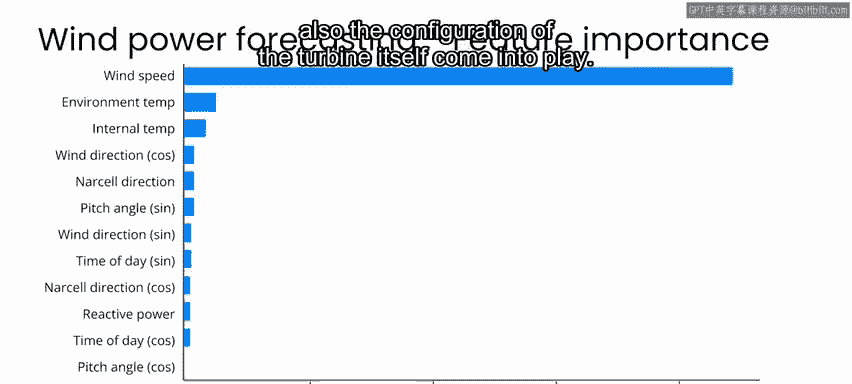

实际上，在建模功率输出时，可能不存在一个“一刀切”的解决方案。

很容易想象，不同的涡轮机构造略有不同，或者处于我们特征未能完全捕捉的略有差异的环境中，又或者其性能会随着使用年限而下降。

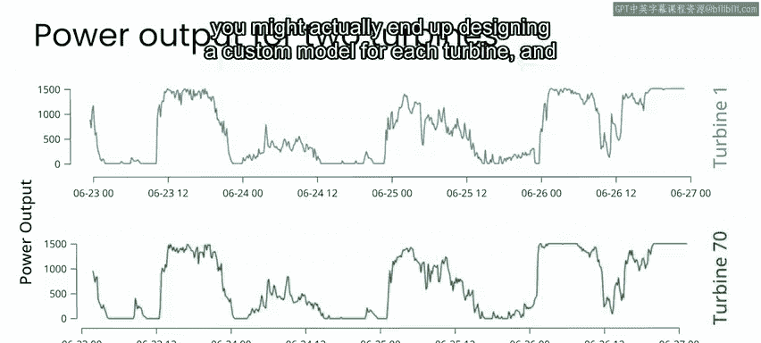

在此类项目的实施阶段，您最终可能需要为每台涡轮机设计一个定制模型。

这可以优化您预测的准确性。

我们在实验中未涉及但同样需要考虑的一个因素是，涡轮机的响应是否会随时间变化。您可能需要开发一个能够随着涡轮机行为变化而自适应调整的模型。

例如，涡轮机可能随时间推移而性能下降，可能随季节变化，或者可能因固件更新使其在给定风速下效率提高而随时间改善。

如果您拥有一个模型，能够在给定特定外部天气条件和涡轮机配置的情况下，准确描述每台涡轮机的功率输出，那么您就为提供有价值的风电预测奠定了良好基础。

再次回顾“AI for Good”项目框架，要成功完成项目实现，您需要肯定回答以下两个问题：
*   您的模型性能是否可接受？
*   最终用户能否成功与您的系统交互？

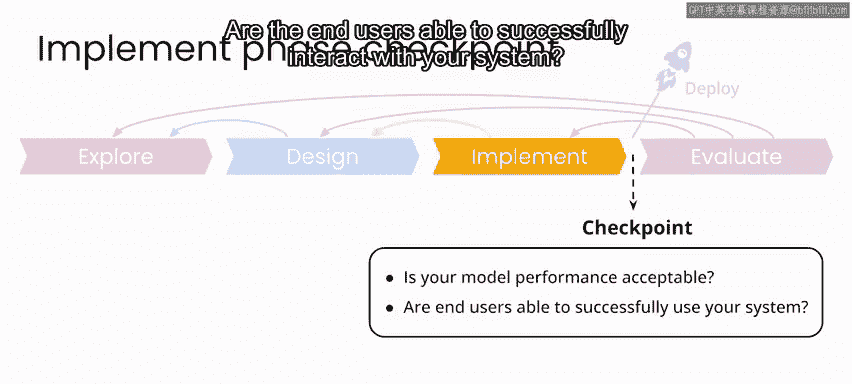

## 项目评估指标 📊

在项目评估方面，模型的性能是衡量成功的一个指标。但从更高层面看，能够准确预测风电，其真正目的是使风电成为化石燃料的可行替代品，并最终减少化石燃料消耗。

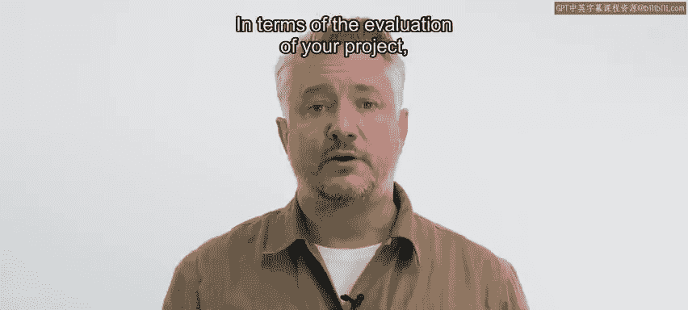

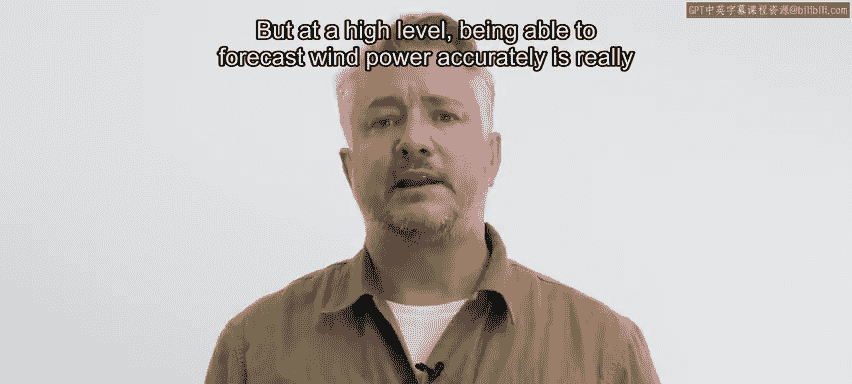

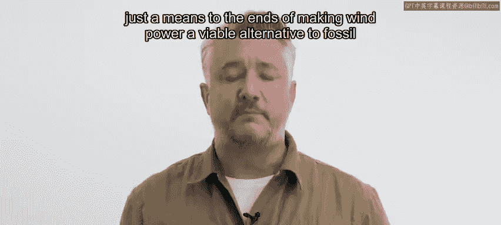

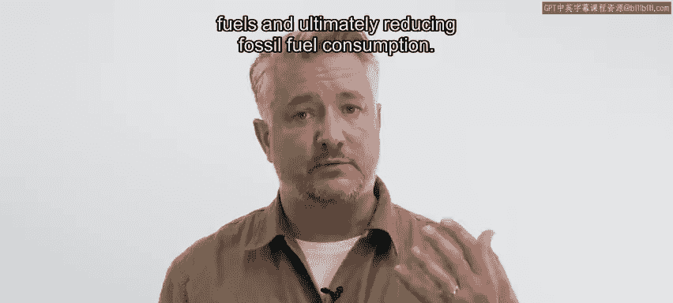

在这种情况下，可行性的一个方面是风电产生的实际经济价值。

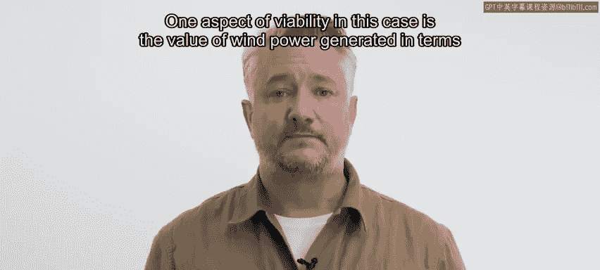

正如谷歌DeepMind团队在其关于提升风电价值的博文中指出的，使用AI预测风电并能够提前向电网做出承诺，使其风电场的风电价值提升了约20%。

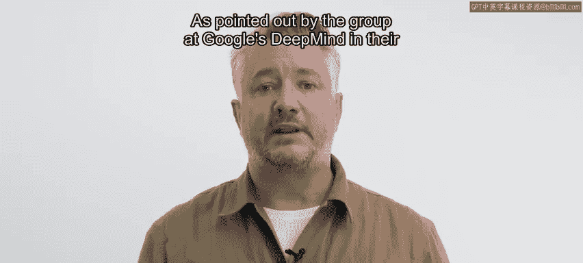

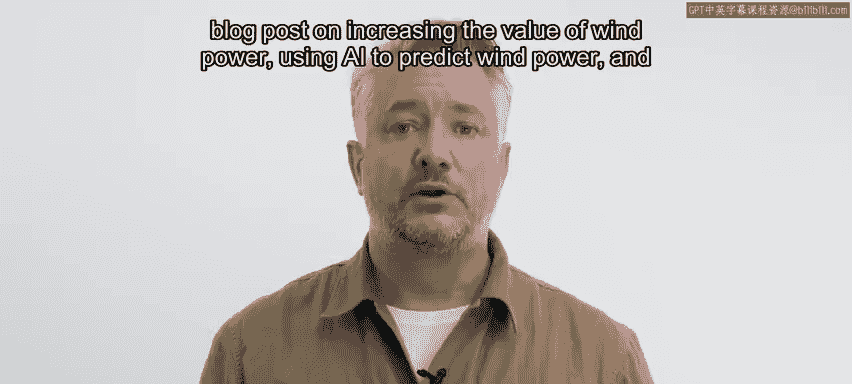

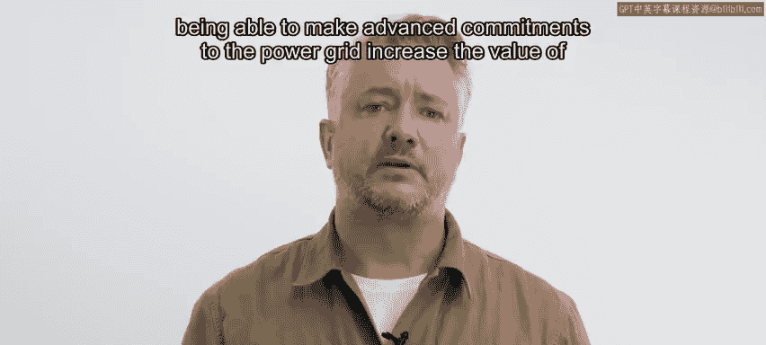

因此，这反过来使风电成为更具吸引力的投资，并有助于加速从化石燃料向可再生能源的转型。

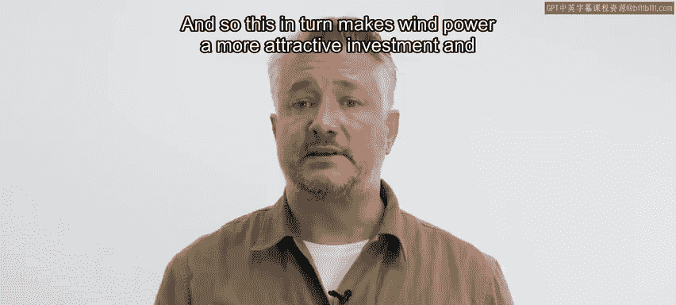

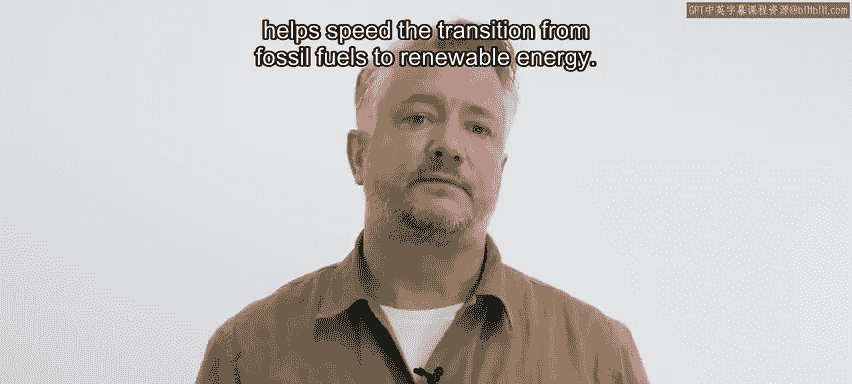

归根结底，评估您项目最重要的指标，将是您能够减少化石燃料消耗的量。

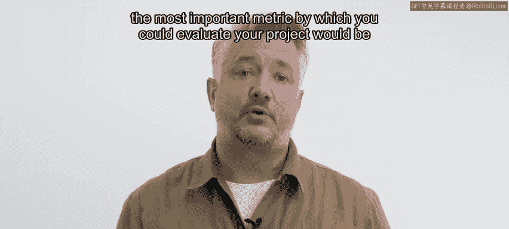

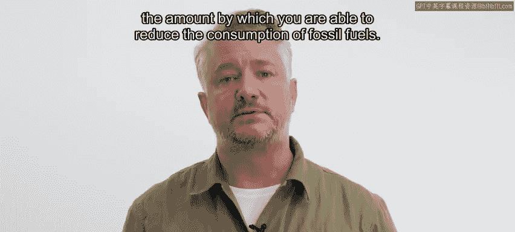

## 过渡到天气预测 🌤️

天气预报本身是一个非常复杂的问题。虽然本课程不会深入探讨天气预报的复杂性，但接下来我们将为您带来一个项目聚焦视频，由微软研究员、前斯坦福大学教授莱斯特·麦基介绍如何利用机器学习改进次季节预报。

请观看下一个关于天气预报的视频，之后我将再次与您见面，总结风力发电预测项目的探索阶段。