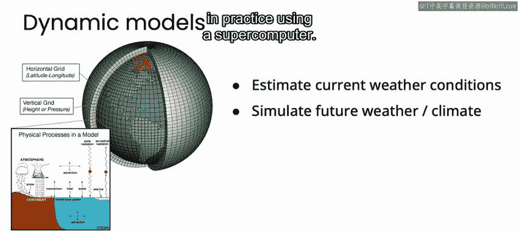
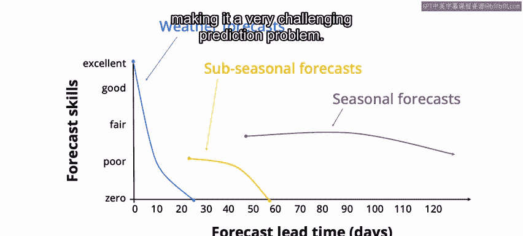
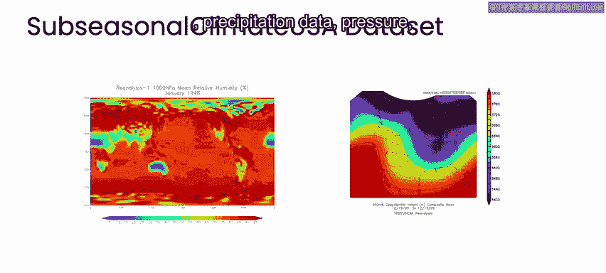
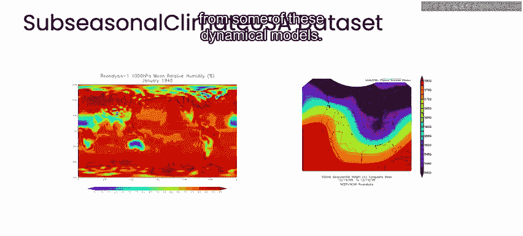

# 062：气候建模与预测 🌍🤖

在本节课中，我们将学习气候建模与预测的基本概念，了解传统物理模型的局限性，并探索机器学习如何提升次季节尺度（未来2到6周）气候预测的准确性。

大家好，我是莱斯特·麦基。今天我想讲述一个故事。这个故事关于气候、机器学习以及美国西部。故事从犹大·科恩开始。

犹大是一位气候学家，也是大气与环境研究中心的季节性预测主任。有一天，犹大找到我，表达了他的担忧。

## 担忧一：历史数据未被充分利用

犹大担心，气象和气候预测领域未能充分利用历史数据。相反，当前的预测格局由动力模型主导。这些是纯粹基于物理的模型，用于模拟海洋和大气的演变过程。

我对动力模型并非专家，但可以简述其原理。首先，我们需要估算当前的天气状况。我们可以在某些地点测量天气，然后估算其他所有地方的情况。接着，我们利用已知的物理定律，了解大气和海洋如何演变，从而模拟出给定当前天气条件下的未来天气。这涉及到模拟所谓的**偏微分方程**。

在实践中，我们无法精确求解这些方程。实际做法是将空间划分为小的网格单元（就像这个地球仪上显示的那样），并将时间离散化为小的增量，然后使用超级计算机进行模拟。

然而，这种方法的准确性是有限的，至少自20世纪60年代以来人们就知道这一点。其局限性源于所谓的**混沌现象**。这意味着，如果输入数据存在任何误差，这些误差将被迅速放大。因此，当我试图预测两周后的天气时，预测结果会变得非常糟糕。

## 应对混沌的两种传统方法

业界有两种主要方法来尝试克服混沌带来的问题。

**第一种方法称为集合预报。** 这意味着使用不同的初始条件（即对当前观测值进行一些扰动）来运行我们的模型，模拟未来，然后从每个模型中获取预测结果，并将它们平均在一起。

**第二种常用方法称为偏差校正。** 我获取模型的预测结果，查看其过去20年的预测记录，减去预测的平均值，然后加上实际观测值的平均值。在某些情况下，这是历史数据进入预测的唯一方式。

以上是第一个担忧。犹大表示他还有第二个担忧。

## 担忧二：次季节预测尤其困难

次季节预测尤其不准确。这意味着什么？我们都熟悉天气预报，这是对温度和降水的短期预测。通常，我们信任未来一天左右的天气预报，但对于未来10天或14天的预报，我们就不再信任了。这是有充分理由的，因为那些预测非常糟糕。

在另一个极端，我们有所谓的**气候预测**，这是对数月、季节、数年甚至数十年的预测。通常，我们在预测这些气候现象时具有更高的技巧和准确性，因为它们平均了更长的时间，目标噪声更小，我们可以做得更好。

然而，在天气预报和气候预测这两个领域之间，存在所谓的**次季节预测**。这是预测未来2到6周的温度和降水。

这里的预测尤其糟糕，因为天气模型由于混沌现象已经失效，而气候模型又因为平均时间不够长而尚未表现良好。此外，对未来2到6周的预测既依赖于本地的当前天气，也依赖于全球的天气状况，这使得它成为一个极具挑战性的预测问题。

## 美国垦务局的挑战

事实证明，在犹大最初联系我的时候，并非只有他一个人担心这个问题。美国垦务局（一个政府机构）也关注这个问题。美国垦务局负责管理美国西部的水资源，他们通过美国第二大水力发电生产商向农民提供灌溉用水。他们指出，在过去十年中，美国西部的每个州都经历了干旱，这影响了当地经济和全球经济。

他们非常担心能否提前预测这种情况，因此决定举办一场比赛。他们称之为“次季节气候预测竞技赛”。之所以叫“竞技赛”，是因为在美国西部，那里有牛仔。他们说，如果你能在次季节尺度（未来2到6周）上更好地预测温度和降水，我们将提供80万美元的奖金。

我们决定参加这场比赛。但这项数据科学挑战的一个棘手之处在于，主办方没有提供任何数据。美国垦务局只是说，做任何你想做的事，只要找到更好的方法来预测温度和降水。

## 构建数据集与解决方案

因此，我们创建了自己的数据集，称之为“美国次季节气候数据”。它包含温度数据、降水数据、气压数据，以及一些更大尺度的现象，如马登-朱利安振荡、厄尔尼诺状态，甚至包含了一些动力模型的预测。

我们将数据放在Azure上，每天在云端更新，你可以通过`subseasonal`数据Python包访问它。

在此基础上，我们决定构建一些**混合（学习+物理）预测模型**。我们发现，这些模型将美国使用的业务化纯物理模型的预测技巧提高了一到两倍，并且也优于针对此问题的最先进的机器学习和深度学习方法。

我在这里顶部展示的是CFSV2（气候预测系统第二版），这是美国使用的业务化次季节预测系统。底部展示的是我们新的**自适应偏差校正方法**，它融合了CFSV2的预测和机器学习校正。你可以看到，在美国各地，我们的方法将预测准确性提高了一到两倍。这是针对温度的预测，我们在降水预测上也看到了类似的效果，预测技巧同样提高了一到两倍。

## 总结与延伸阅读

本节课中，我们一起学习了传统气候动力模型的原理及其因混沌现象带来的局限性，了解了次季节预测的特殊挑战，并看到了如何通过构建专用数据集和开发混合机器学习模型，显著提升预测准确性。

今天的时间就到这里。如果你想了解更多关于这项工作的信息，我可以向你推荐以下论文。我们在arXiv上有几篇预印本出版物：一篇名为《利用机器学习改进美国西部的次季节预测》，另一篇名为《使用Optimal和Dean进行在线学习》，以及《次季节预测的学习基准》。

感谢大家。