# 063：吴恩达《AI for Good专业课程》 - 第2周总结 🌬️📊

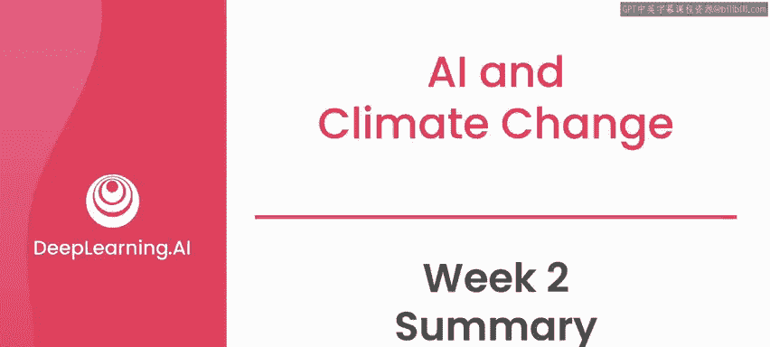

在本节课中，我们将回顾第二周关于风力发电预测项目的核心内容。我们将梳理从问题定义、数据探索、模型设计到最终思考的完整流程，并总结关键的学习要点。

---

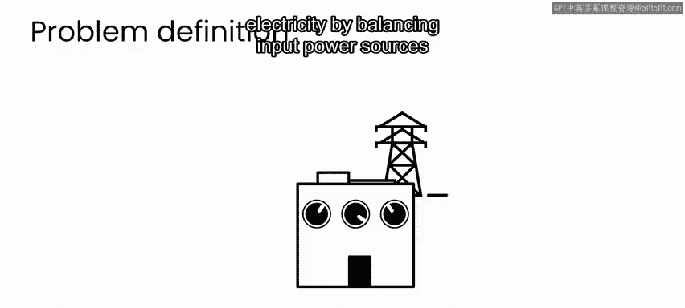

## 概述：风力发电预测项目回顾

本周，我们深入探讨了风力发电预测这一具体应用。通过与龙岩电力公司的合作数据集，我们学习了如何利用AI技术预测风力发电量，以帮助电力公司更好地平衡电网供需。

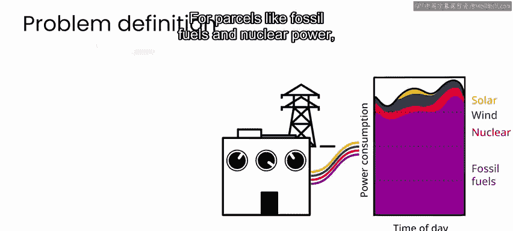

## 问题定义与背景

上一节我们介绍了项目的背景，本节中我们来看看具体的问题陈述。

电力公司需要平衡输入电网的多种能源，以满足不断变化的电力需求。

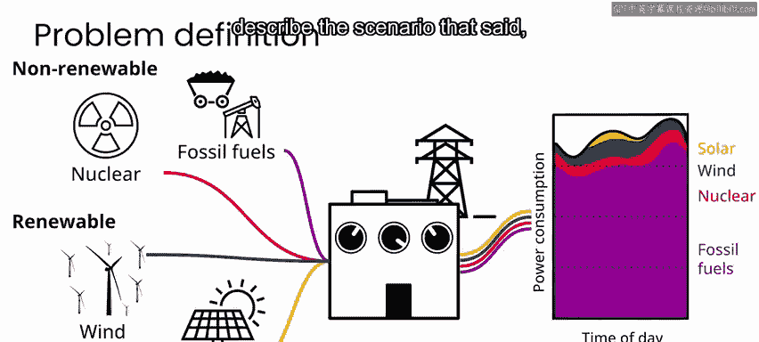

对于化石燃料和核能等传统能源，只要有足够的提前通知，就可以增加供应以满足需求。

然而，要使风能和太阳能等可再生能源成为化石燃料或核能的可行替代品，就必须提高其可预测性。这样，可再生能源供应商才能提前向电网承诺他们能够提供的供应量。

针对风力发电这一具体用例，我们写下了一个问题陈述来描述该场景：

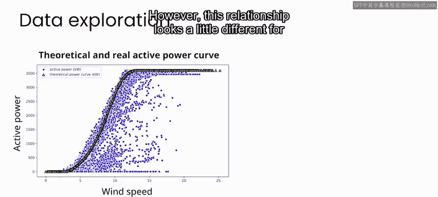

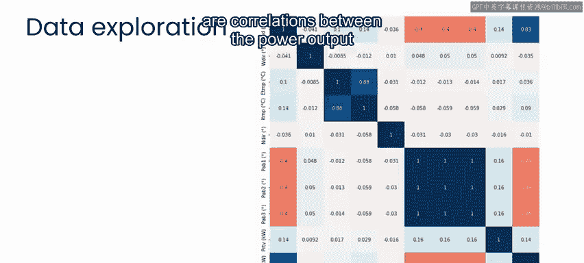

> 电力公司需要至少提前24小时对风力发电输出进行可靠预测，以便更好地规划电网其他电力输入源的需求。

## 数据探索与关键发现

在数据探索阶段，我们分析了影响风力发电的关键因素。

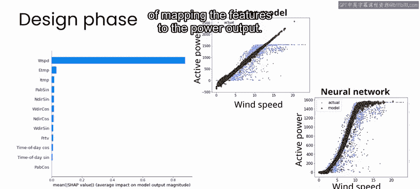

以下是数据探索中的主要发现：
*   风速与风力涡轮机的发电输出之间存在强相关性。
*   这种关系对于每个涡轮机而言略有不同。
*   发电输出与其他变量（如温度）之间也存在相关性。

## 模型设计阶段

在模型设计的第一部分，我们确认了风速是预测发电输出的最强特征，同时温度和涡轮机配置等因素也起着作用。

我们比较了不同模型的性能：
*   **线性模型**：`Power_Output ≈ β0 + β1 * Wind_Speed + β2 * Temperature + ...`
*   **神经网络**：能够更有效地将特征映射到发电输出，表现显著优于线性模型。

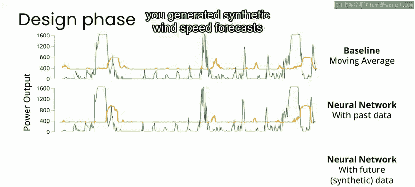

在模型设计的第二部分，我们着手解决对未来风力发电进行实际预测的问题。

我们建立了一系列基线模型，以设定最坏情况场景，并测试简单模型（如“未来等于过去”）的表现。

我们测试了一系列**序列到序列（Seq2Seq）神经网络模型**，使用了数据集中不同的特征组合。结果发现，仅依据过去知识来预测未来尤其困难。

为了模拟更真实的场景，我们生成了合成的风速预测数据。结果发现，将风速预测作为模型的输入，可以显著改进我们的发电量预测。

## 实施挑战与项目价值

虽然我们可以在设计阶段花费更多时间测试更多模型，但我们总结了设计阶段，并探讨了在真实世界的实施和评估中可能面临的挑战。

以下是需要考虑的关键点：
*   最终的解决方案可能需要为每个风力涡轮机进行定制。
*   模型可能需要适应涡轮机行为长期变化的情况。
*   项目的成功最终取决于预测的准确性，以及这些预测如何使风能成为更具价值的化石燃料替代品，从而减少化石燃料消耗。

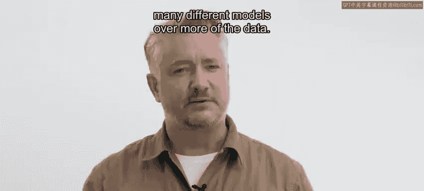

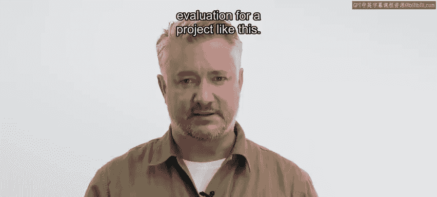

## 核心方法论与迁移应用

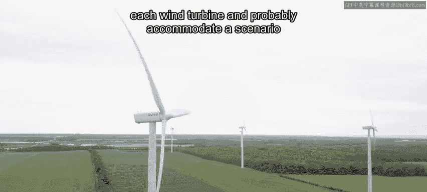

本周课程最重要的收获，并非风力发电预测的具体细节，而是掌握了一套可迁移的问题解决框架。

以下是将此框架应用于其他项目时的关键步骤：
1.  **利益相关者分析**：识别项目涉及的不同方。
2.  **潜在影响评估**：考虑项目可能带来的益处与风险。
3.  **明确问题陈述**：清晰定义要解决的核心问题。
4.  **数据探索与理解**：深入分析可用数据。
5.  **模型设计与迭代**：从探索到设计、实施，并不可避免地循环几次。

尽管不同项目在细节上千差万别，但底层的过程本质上是相同的。当你反思这个风电项目时，请思考如何将相同的框架应用到你感兴趣的问题上。

## 总结与展望

本节课中，我们一起学习了风力发电预测项目的完整流程，从问题定义、数据探索、模型设计到框架总结。我们看到了AI如何帮助提高可再生能源的可预测性，并掌握了一套可应用于广泛问题的通用方法论。

在接下来的课程中，我们将转向新的主题：监测南非卡鲁国家公园的生物多样性。我将在下周的课程材料中与大家再见。