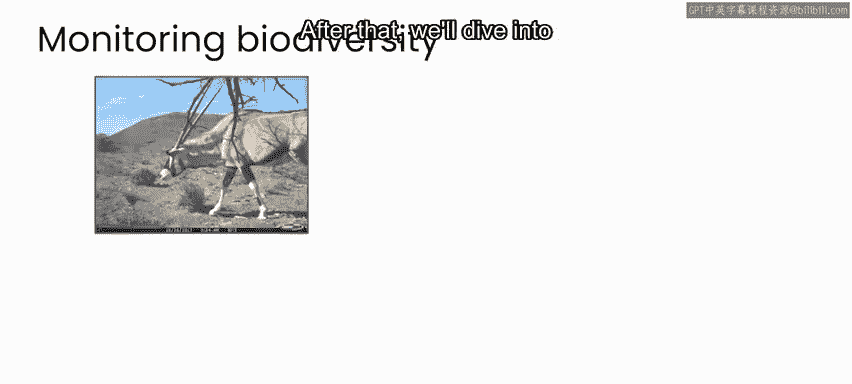

# 064：AI与气候变化（第3周）🌍

在本节课中，我们将要学习人工智能如何应用于气候变化与生物多样性监测领域。我们将探讨气候变化与生物多样性之间的相互关联，并介绍一个具体的案例研究：利用AI技术监测南非考国家公园的动物种群。通过本周及下周的实践项目，你将学会使用目标检测技术来自动识别和分类相机陷阱拍摄的动物图像。

---

## 气候变化与生物多样性的关联 🔄

上一节我们介绍了本周的学习目标，本节中我们来看看气候变化与生物多样性是如何相互影响的。

气候变化导致全球气温上升、极端天气事件增多，这些变化对生态系统造成压力，从而减少生物多样性。相反，保护自然生态系统和生物多样性有助于吸收二氧化碳，是缓解气候变化的重要工具。

因此，监测生物多样性变化不仅能追踪气候影响，还能为制定缓解政策提供依据。

---

## 案例研究：监测南非考国家公园的生物多样性 🦁

在理解了基本关联后，我们将深入本课程的最终案例研究。

该案例研究基于气候变化与生物多样性紧密相连的事实。通过监测生物多样性，可以追踪气候变化的影响，并为制定缓解政策提供信息。

以下是案例研究的具体内容：

*   项目地点位于南非考国家公园。
*   使用相机陷阱记录动物图像。
*   应用AI方法分析图像数据。

---

## 实践项目：动物图像自动识别与分类 📸

本节我们将介绍本周及下周的实践项目。

在本周和下周的实验课中，你将创建一个应用程序，用于自动识别和分类国家公园相机陷阱记录的动物图像。

图像目标检测是一种广泛应用于AI领域的技术，从本项目中的动物种群趋势建模，到工业机器视觉和机器人技术，都有其应用。

以下是本项目的几个关键点：

*   使用**目标检测**技术。
*   代码示例：`model.detect(image)`。
*   方法适用于多种不同场景。

你可以将在本课程中开发的工具应用于你感兴趣的项目，无论是在后院监测生物多样性，还是从事自动驾驶汽车相关工作。

---

## 总结 📝

本节课中我们一起学习了气候变化与生物多样性的相互关联，并介绍了利用AI监测生物多样性的案例。通过接下来的实践项目，你将亲身体验如何应用先进AI技术来解决实际问题。

接下来我们将详细探讨气候变化与生物多样性的具体联系，之后会审视AI如何在旨在监测生物多样性的项目中应用，以制定保护自然生态系统的政策。