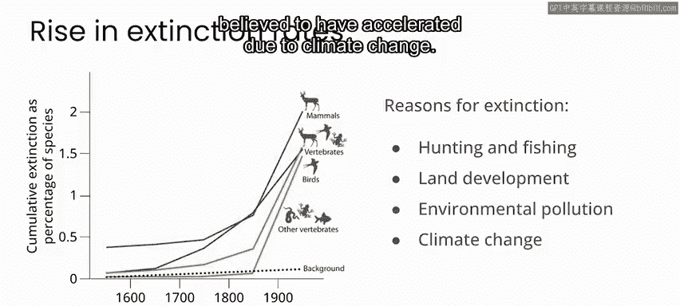
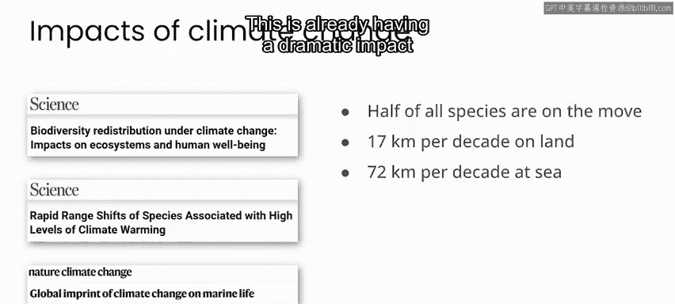
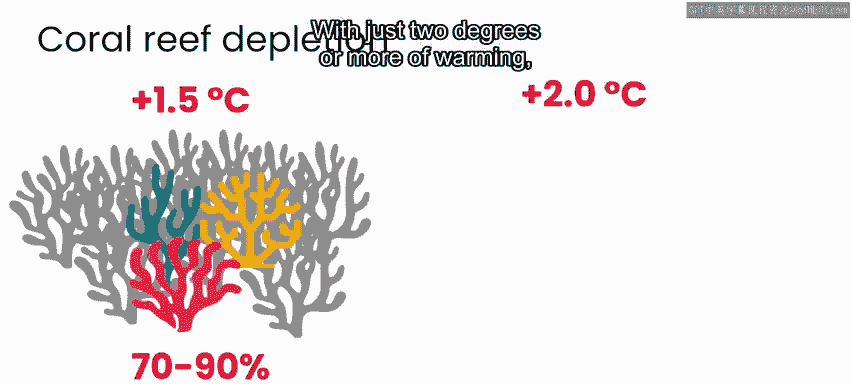
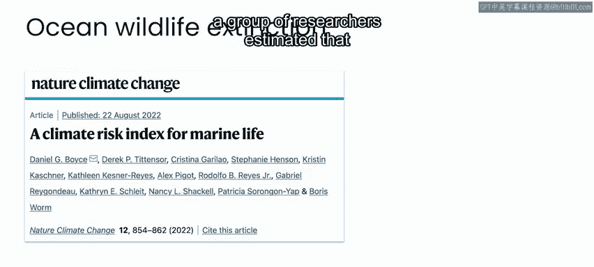
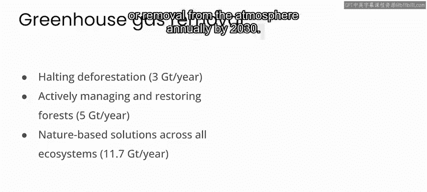
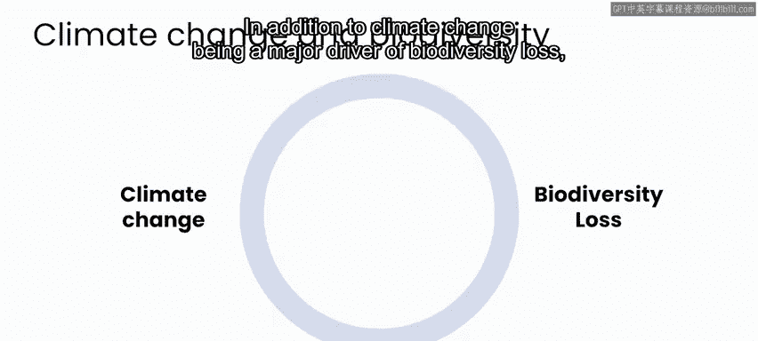
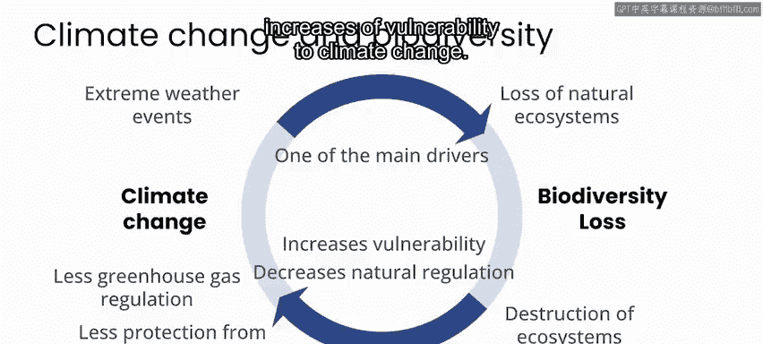

# 065：气候变化与生物多样性 🌍🦋

在本节课中，我们将探讨气候变化与生态系统生物多样性之间的深刻联系。我们将了解气候变化如何威胁物种生存，以及健康的生物多样性如何成为应对气候变化的关键部分。

## 概述：第六次大灭绝与人类活动

我们正处在保护生物学家所称的“第六次大灭绝”之中。这指的是许多生物物种正以恐龙灭绝以来最快的速度消失。大约6600万年前，恐龙以及当时地球上75%的动植物物种一同灭绝。

总体而言，灭绝率的急剧上升归因于过去几个世纪的人类活动，从狩猎、渔业到土地开发和环境污染。然而，近几十年来，人们普遍认为气候变化加速了物种灭绝的速率。

## 气候变化如何威胁物种生存 🌡️

当动植物面临捕食和疾病等外部压力，或者它们所依赖的生态系统发生剧烈变化时，就会走向灭绝。虽然很难确切指出近几十年成百上千的动植物灭绝事件中，哪些具体归因于气候变化，但不难想象气候变化在其中许多灭绝事件中扮演了重要角色。

总体而言，气候变化给动植物种群带来压力，迫使它们要么适应新环境，要么迁移到条件更适宜的地区。对于陆地上的动植物和其他生物而言，这些压力可能包括干旱、洪水、野火、极端高温，或因海平面上升导致咸水入侵淡水水源。

## 物种迁移与灭绝案例 🐾

在某些情况下，种群确实可以迁移。《科学》和《自然·气候变化》期刊近期的文章得出结论，我们一半的动植物物种正在迁移。陆地物种正以每十年约17公里的速度向更寒冷的地区移动，而海洋物种向冷水区域移动的速度则快达四倍。

这已经对全球生态系统产生了巨大影响。例如，北极熊因北极海冰逐年减少而受到威胁，这减少了它们的狩猎场，并迫使它们进入新的区域。

在其他情况下，承受压力的物种会直接灭绝，比如布兰布尔礁裸尾鼠。这是一种仅在南太平洋特定低洼岛屿上发现的小型啮齿动物。近年来，当海平面上升淹没该岛后，它变得不再适宜居住，这种鼠类便灭绝了。2019年，它成为首个因气候变化而正式灭绝的哺乳动物物种。

## 海洋变暖与珊瑚白化 🐠

对于水下动植物而言，迁移或灭绝的主要驱动力是海洋温度的上升。珊瑚礁是地球上生物多样性最丰富的生态系统之一。当水温上升到正常水平以上时，珊瑚会经历一个称为“白化”的过程。在这个过程中，它们会排出通常与之共生的藻类，从而呈现白色。极端的白化事件会导致珊瑚死亡，而随着海洋温度上升，全球的珊瑚礁正在经历这种情况。

联合国气候行动小组估计，仅全球变暖1.5摄氏度，世界上70%至90%的珊瑚礁就会死亡；如果变暖达到两度或更多，超过99%的珊瑚礁将会消失。

## 未来的风险与基于自然的解决方案 🌳

2022年发表在《自然·气候变化》期刊上的一篇论文中，一组研究人员估计，如果不遏制温室气体排放，到2100年，所有海洋、植物和动物物种中的90%可能面临灭绝风险。不过他们补充说，如果排放量能削减到2015年《巴黎协定》所概述的水平，大部分风险是可以避免的。

构成自然生态系统的动植物物种不仅仅是气候变化的潜在受害者，它们也是潜在解决方案的重要组成部分，尤其是植物。为了实现《巴黎协定》设定的目标，我们需要到2030年每年减少300亿吨排入大气的碳排放。这将通过减少温室气体源（如燃烧化石燃料）的排放，以及从大气中清除温室气体（也称为碳封存）相结合的方式来实现。

植物吸收二氧化碳，它们目前是我们从大气中清除碳最有效的解决方案。联合国减少毁林和森林退化所致排放量计划估计，仅通过停止毁林，我们每年就可以从大气中封存超过30亿吨的温室气体。通过积极管理和恢复森林，到2030年，这个数字将上升到每年50亿吨，并且随着生态系统的恢复，未来还会继续增长。

在联合国另一份近期报告中，他们估计，到2030年，在所有生态系统中实施基于自然的解决方案，每年可减少或清除高达117亿吨的温室气体。

“基于自然的解决方案”这一短语，对于减缓气候变化而言，统指保护、可持续管理和恢复作为天然碳汇或碳库的自然或经改造的生态系统的行动。请注意，这不仅仅意味着保护或恢复某些特定的植物或其他物种，而是保护整个生态系统，而生物多样性可以被视为这些自然生态系统健康状况的衡量标准。

总而言之，保护和恢复所有生态系统的生物多样性，是我们对抗气候变化的关键组成部分。

## 气候变化与生物多样性的相互影响 🔄

显然，气候变化和生物多样性是紧密相连的，两者相互作用、调节或放大彼此的影响。除了气候变化是生物多样性丧失的主要驱动因素外，生物多样性的丧失也增加了我们对气候变化的脆弱性，并削弱了自然对气候变化的调节能力。

例如，洪水和野火等极端天气事件会导致自然生态系统的丧失。另一方面，生态系统的破坏削弱了自然调节温室气体排放的能力。因此，保护和恢复生态系统对于减缓气候变化至关重要。

然而，从适应的角度来看，湿地、森林和沿海生态系统也有助于抵御洪水和其他极端天气事件。因此，自然生态系统的丧失增加了我们对气候变化的脆弱性。

## 现状与未来行动方向 📊

不幸的是，与你在第一门课程中看到的空气污染问题类似，生物多样性丧失问题已经处于令人担忧的状态，并且由于人类活动和气候变化本身，情况逐年恶化。生物多样性的保护和恢复将通过政府制定的政策来实现，这些政策可以导致行业实践和文化规范的重大转变。

为了迈向这些未来的政策，我们现在采取步骤监测广泛生态系统的生物多样性、量化人类活动和气候变化的当前影响，并确定向相反方向推动的机会至关重要。

因此，世界各地的团体都在开展监测生物多样性的项目，而在许多情况下，人工智能是解决方案的一部分。在下一个视频中与我一起，我们将看看生物多样性监测领域正在进行的一些激动人心的工作。

## 总结 🌟

本节课中，我们一起学习了气候变化与生物多样性之间复杂的相互作用。我们了解到气候变化如何通过改变栖息地、引发极端事件和导致海洋变暖，对物种生存构成严重威胁，甚至加速了“第六次大灭绝”。同时，我们也认识到健康的、具有生物多样性的生态系统，特别是森林和植物，是应对气候变化、进行碳封存的关键“基于自然的解决方案”。两者相互影响，形成了一个循环：气候变化威胁生物多样性，而生物多样性的丧失又削弱了我们应对和适应气候变化的能力。因此，监测、保护和恢复生物多样性，对于减缓气候变化和增强人类社会的韧性至关重要。