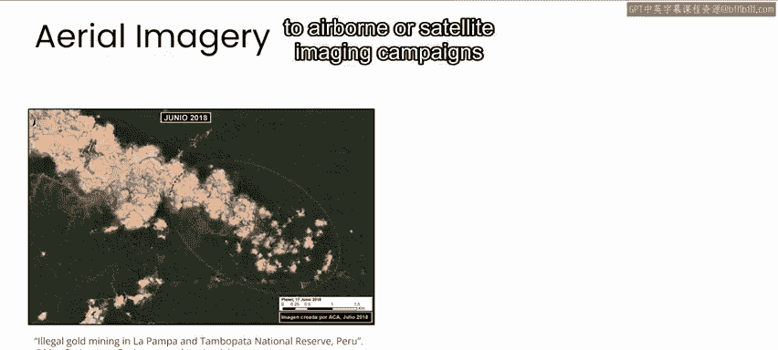
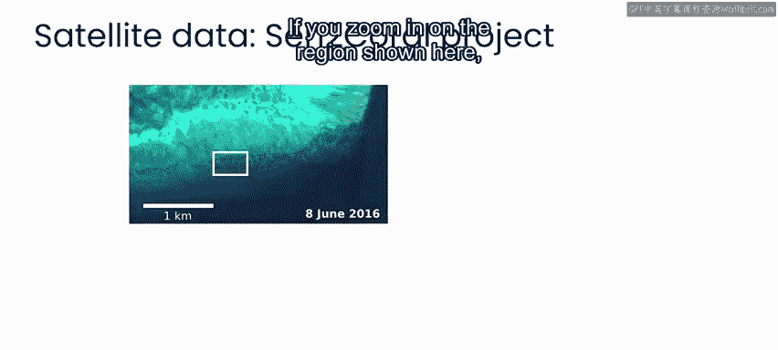
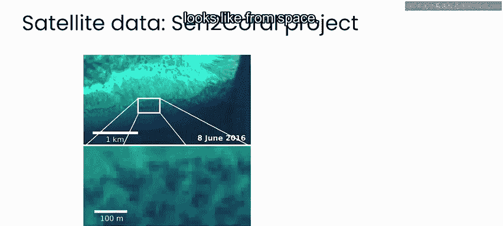
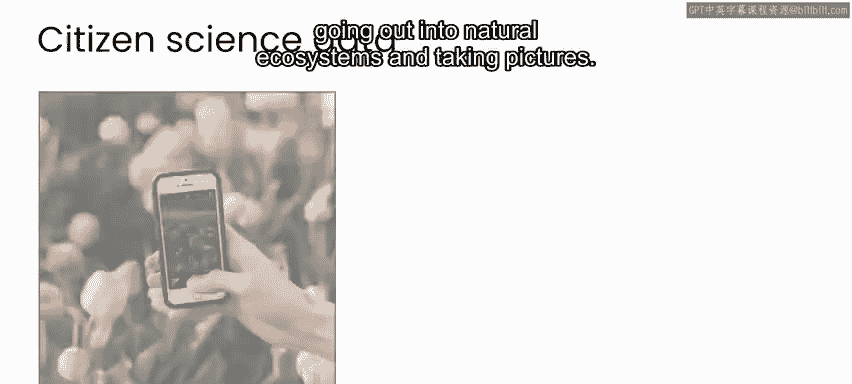
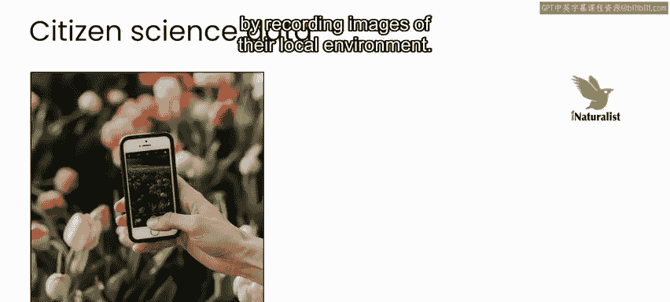
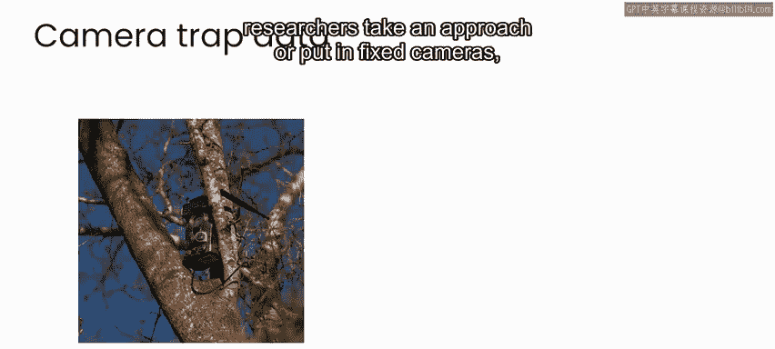
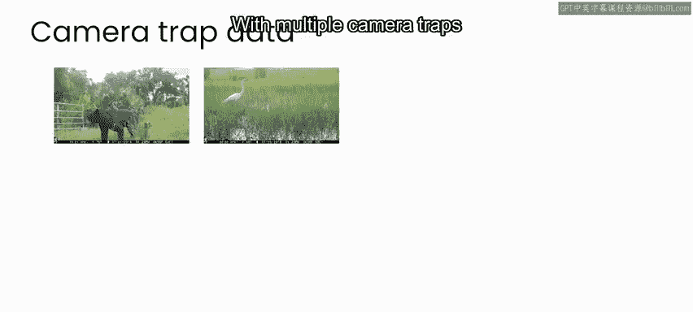
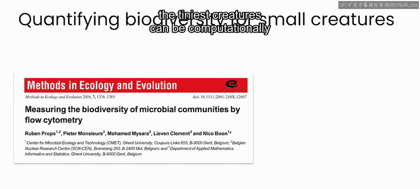

# 066：监测生物多样性 🌍

在本节课中，我们将学习如何监测生物多样性。生物多样性监测对于了解和保护生态系统至关重要。我们将探讨几种不同的监测方法，并了解人工智能如何在这些方法中发挥作用。

气候变化与自然生态系统的健康紧密相连。因此，我们减缓气候变化影响和适应其影响的努力，与保护和恢复生态系统密不可分。一项关键行动是监测生物多样性，以便为制定保护和恢复此类生态系统的政策提供信息。

## 生物多样性监测的多种形式

监测生物多样性可以采取多种不同的形式。以下是几种主要的方法。

*   安装摄像头和麦克风，以观察陆地或海洋上的动物种群。
*   进行空中或卫星成像活动，以追踪森林砍伐或动物种群的迁徙。
*   为单个动物安装地理定位设备，以追踪种群的移动。

在接下来的内容中，我们将通过几个例子来了解不同的监测方法，以及人工智能如何参与其中。

## 方法一：生物声学监测 🎤

了解特定区域存在何种动物种群的一种方法是倾听它们的声音。

在生物声学监测领域，研究人员在自然环境中（如海洋或森林）放置麦克风，以监听鸟类、昆虫或其他动物的声音。随后可以分析这些数据，以确定录音中听到了哪些动物物种。

虽然训练有素的人类有可能识别录音中不同动物或鸟类的声音，但这些项目通常会在许多不同地点录制数百或数千小时的音频。因此，可以训练人工智能算法来识别录音中的动物和鸟类声音，并实时自动记录多个地点的动物种群。这种规模如果仅靠人力，将是难以完成的。

## 方法二：空中成像监测 🛰️

监测生物多样性的另一种方法是对自然生态系统进行空中成像。

例如，可以使用卫星成像来绘制森林砍伐地图。美国宇航局的地球观测站有一个项目，用于追踪亚马逊雨林随时间的森林砍伐情况。另一个使用卫星成像的例子是“珊瑚哨兵”项目，欧洲航天局正在通过该项目监测珊瑚白化事件。

空中成像也可以从飞机或无人机上进行，以监测动植物种群。例如，在纳米比亚，环境、林业和旅游部会进行航空调查，以追踪该地区公园和保护区内大象等动物的种群数量。

与生物声学监测类似，空中成像调查会产生大量数据。人工智能计算机视觉技术特别适用于自动检测物体或绘制不同类型地形范围的任务。

## 方法三：地面图像监测 📸

监测生物多样性的另一种方法是深入生态系统并拍摄照片。

例如，iNaturalist 是一个网站，任何人都可以通过记录当地环境的图像来启动项目或参与现有项目。其中一个项目是“欧洲植物”项目，欧洲各地的个人可以上传自己拍摄的植物照片。

在世界许多地区，研究人员采用的方法是安装固定摄像机或所谓的“相机陷阱”。这些设备由运动探测器触发，能自动捕捉经过其前方的任何物体的图像。多个相机陷阱每天24小时、每周7天持续拍摄图像，一个项目可以快速生成数十万甚至数百万张图像。使用人工智能自动识别这些图像中的内容，可以成为大规模相机陷阱项目中的关键一环。

## 总结与展望

本节课我们一起学习了监测生物多样性的几种主要方法：生物声学监测、空中成像监测和地面图像监测。这些方法都生成了海量数据，而人工智能在自动分析和处理这些数据方面发挥着关键作用，使得大规模、高效的生物多样性监测成为可能。

需要指出的是，这里提到的项目只是生物多样性监测的几个例子。自然生态系统由从微生物到巨型动物的许多不同物种组成，其中一些生物（通常是最小的那些）很难直接观察。量化最微小生物多样性的方法也可能计算密集。

尽管自然界中所有形状和大小的生物对生态系统的生物多样性都很重要，但通常只有那些引人注目的巨型动物的图片最能引起人们对生物多样性监测或保护的关注或兴趣。

为了确保你在本课程后续部分保持兴趣，我们设计了一系列实验，让你与世界上一部分最具魅力的巨型动物——南非的大型哺乳动物——的图片打交道。在本周及本课程后续的实验中，你将使用来自 Snapshot Safari 项目的相机陷阱数据，该项目旨在监测南非卡拉哈里国家公园内的生物多样性。

下一节课，我们将更深入地了解 Snapshot Safari 项目。