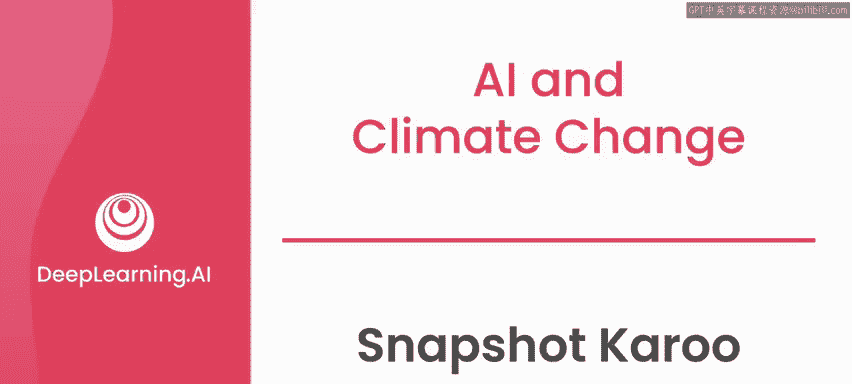
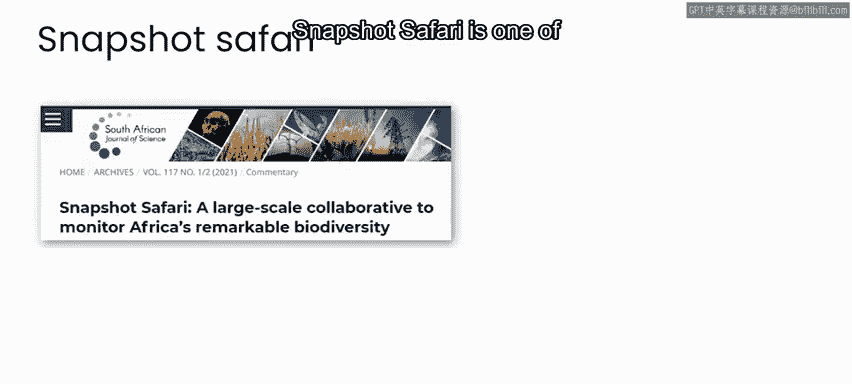
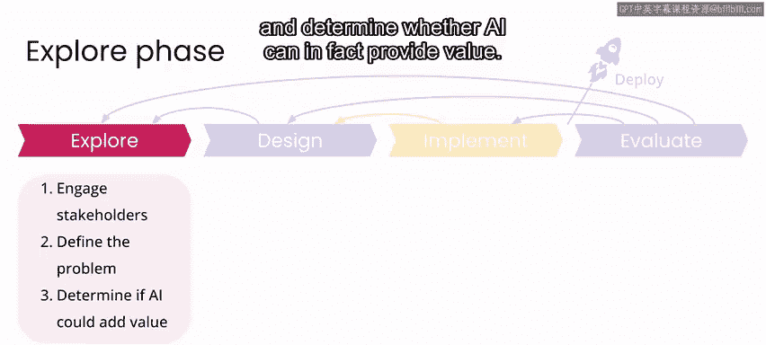
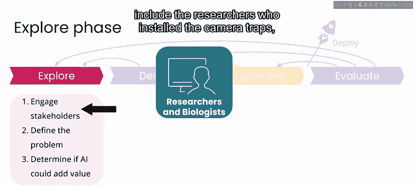
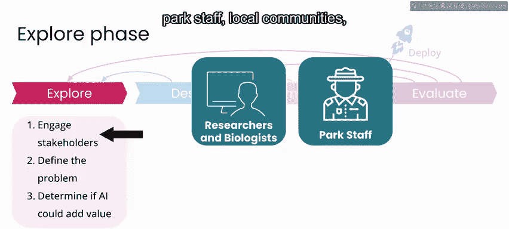
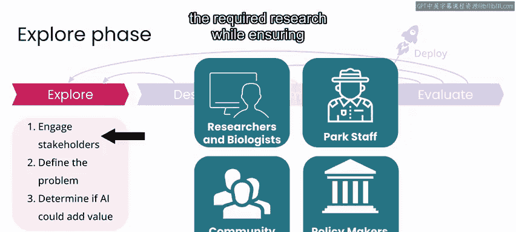
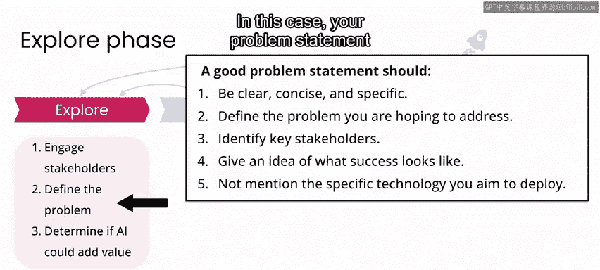
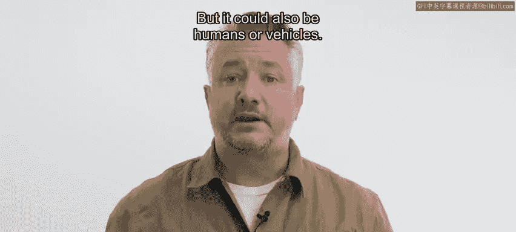

# 067：快照卡罗项目概述 🦓

在本节课中，我们将学习“快照卡罗”项目。这是一个利用相机陷阱网络监测生物多样性的实际案例。我们将了解项目背景、核心目标、关键利益相关者，并探讨如何定义问题陈述以及评估人工智能在该项目中的潜在价值与伦理考量。

---

## 项目背景与目标

快照相机项目是一个名为“快照游猎网络”的大型相机陷阱网络的一部分。该网络建立的目的是测量广泛生态系统和动物物种（包括许多受威胁物种）的基线生物多样性指标和趋势。

快照游猎网络是世界上最大的相机陷阱网络之一，每年收集数百万张图像，以追踪整个非洲受保护生态系统中的动物种群。他们与Zooniverse.org合作，吸引公民科学家帮助标注数据，以便最终能使用人工智能技术进行自动目标检测。

卡罗尔国家公园是位于南非大卡罗地区的一个野生动物保护区。该公园是一个高沙漠生态系统，拥有众多大型哺乳动物物种，包括大羚羊、开普山斑马、红麋羚、西南黑犀牛等。

---

## 项目场景与任务

在本项目中，我们假设你是一个团队的一员，团队成员包括保护生物学家和国家公园工作人员。你的工作是构建一个系统，能够自动追踪公园内的生物多样性和动物种群趋势，从而为制定保护公园生态系统的政策提供信息。

在此过程中，你将使用部署在国家公园内的相机陷阱网络收集的图像数据。以下是一个特定相机陷阱拍摄的示例图像。

你的任务是识别任何给定图像中出现的动物。让人工手动审查和标注数百万张图像是不切实际的。我之前提到的Zooniverse项目旨在吸引人类标注足够的数据，以启动构建自动动物检测器的工作。这就是你将在本项目中开始的地方，数据集已通过Zooniverse.org平台由人类志愿者标注。

目前，你正处于项目的探索阶段。你需要采取的关键步骤是与利益相关者接触、定义你的问题陈述，并确定人工智能是否确实能提供价值。

---

## 关键利益相关者

在这种情况下，关键利益相关者可能包括安装相机陷阱的研究人员、希望研究数据的保护生物学家、公园工作人员、当地社区以及最终需要根据你的工作结果制定法律或法规的政策制定者。

你在本项目中的角色将是向这些利益相关者提供他们进行必要研究所需的信息，同时确保当地社区不会因你的项目受到任何负面影响。

---

## 定义问题陈述

在问题陈述方面，一个好的问题陈述应该清晰、简洁，描述你希望解决的实际问题，并确定关键利益相关者以及你需要向这些关键利益相关者提供什么，且无需提及你认为可能实施的任何具体技术。

在这种情况下，你的问题陈述可能是这样的：研究人员和保护生物学家需要关于卡罗尔国家公园内各个地点每日观测到的动物数量的信息，以便监测生物多样性和动物种群的趋势，从而为制定保护和维护公园生态系统免受伤害的政策提供依据。

---

## 伦理与隐私考量

从数据伦理的角度来看，每当你在公共场所（如本例中的公园摄像头）收集数据时，有几件事你应该考虑。本例中的摄像头旨在拍摄任何经过移动的物体，特别是动物，但也可能是人类或车辆。任何包含人类或车辆的照片都有可能等同于个人身份信息，因为个人或车主的身份可能与特定的时间和地点相关联。

就像任何其他个人身份信息一样，其标准应被视为私密信息，未经照片中信息被披露的个人的明确许可，不得存储、共享或发布。

除了个人身份信息的担忧，你还应考虑你的项目可能产生的其他负面后果。在本例中，照片中出现的许多物种因狩猎和偷猎而濒临灭绝。如果你的项目最终揭示了濒危物种在国家公园中最可能出现的地点，并使偷猎者更容易找到它们，这无疑会对当地社区构成伤害，必须避免。事实上，当我处理一个类似的监测动物以防偷猎的用例时，我们正是出于这个原因故意没有公开数据。

---

## 总结与下一步

考虑到这一点，探索阶段的下一步是确定人工智能是否能为此项目增加价值。在下一节视频中，我们将一起探索你将在快照卡罗项目中处理的数据。

在本节课中，我们一起学习了快照卡罗项目的背景、目标、利益相关者以及如何定义清晰的问题陈述。我们还深入探讨了在公共空间收集数据时必须考虑的伦理和隐私问题，特别是保护濒危物种信息的重要性。接下来，我们将进入数据探索阶段，评估人工智能解决方案的可行性。