# 068：生物多样性探索数据 🐘

在本节课中，我们将学习如何为一个生物多样性监测项目探索和分析数据。我们将以南非卡鲁国家公园的动物监测项目为例，了解数据的基本结构、分布特点以及可能存在的挑战。

---

在上一节视频中，我们启动了一个项目，任务是监测南非卡鲁国家公园的生物多样性和动物种群趋势。我们确定了关键利益相关者并定义了问题陈述。接下来，我们需要确定人工智能是否能为解决方案增添价值。当然，我们已经指出了许多在生物多样性监测项目中应用人工智能的例子。但为了确定人工智能在您的特定项目中是否能增加价值，您需要从查看数据开始。这就是我们接下来要做的事情。让我们进入实验室，深入研究数据。

当您首次打开这个实验室时，会在顶部看到项目描述。如果您点击此链接，可以查看有关CA项目和数据访问的更多信息。

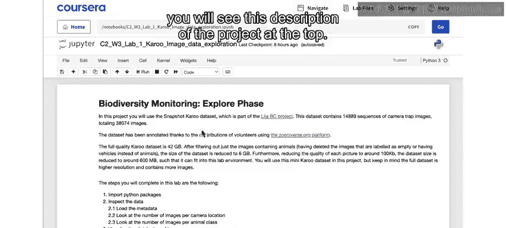

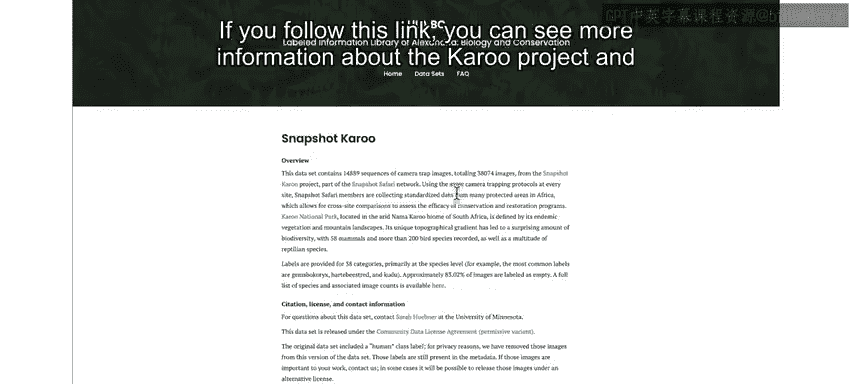

如果您点击另一个链接，将进入Zooniverse.org平台，在那里您可以了解更多关于帮助标注您将要处理的图像的公民科学项目的信息。

在开始运行任何代码之前，请点击左上角的Jupyter图标，打开实验室所在的文件夹。

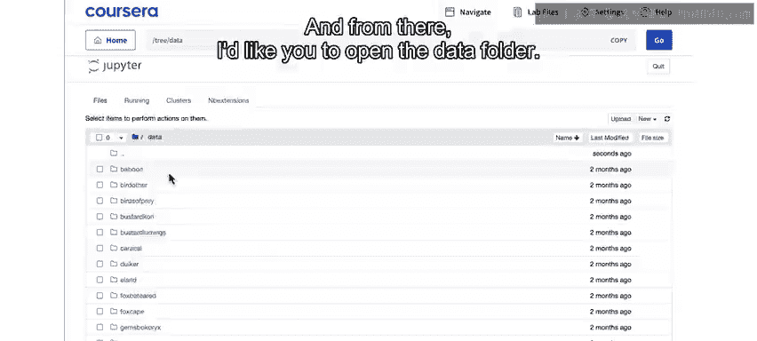

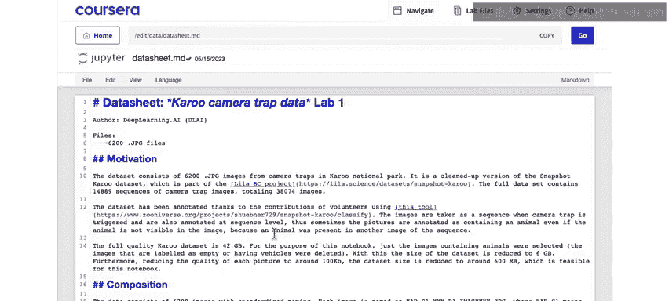

从那里，请打开数据文件夹。和往常一样，您会在这里找到一份数据表，描述了数据的来源。

数据文件夹内部有更多文件夹，包含动物的图像。每个文件夹都以该文件夹中图像所识别出的动物名称命名。

例如，这里有一个包含狒狒图像的文件夹。您可以点击每张图像查看这些图片的样子。或者，您可以查看另一张照片，比如这张南非林羚（也称为羚羊）的照片。您可以查看图像以了解这些图片的外观。

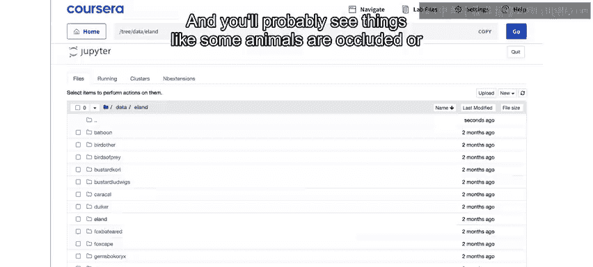

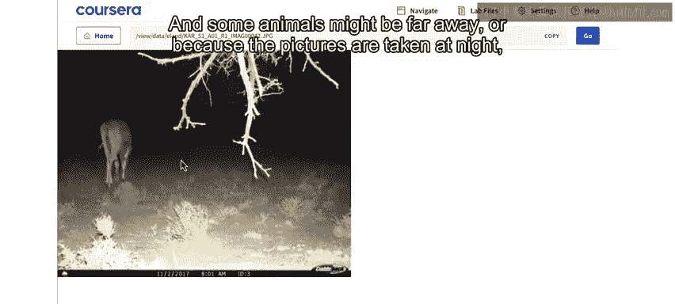

我建议您花一些时间在这里手动探索数据，看看能发现什么，尝试直观地了解识别这些图像中的动物可能面临的一些挑战。您可能会看到一些情况，比如有些动物被遮挡或几乎完全不可见，有些动物可能距离很远，或者因为图片是在夜间拍摄的，所以不清楚到底是什么动物。

一旦您稍微探索了数据，请返回笔记本。

首先运行顶部的第一个单元格，导入本实验室所需的所有Python包。

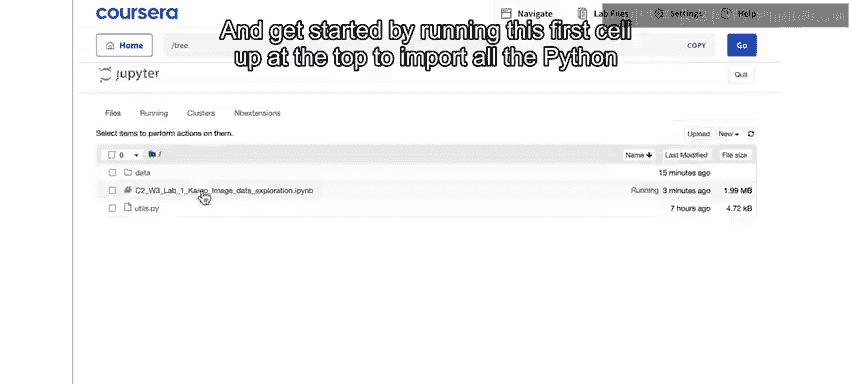

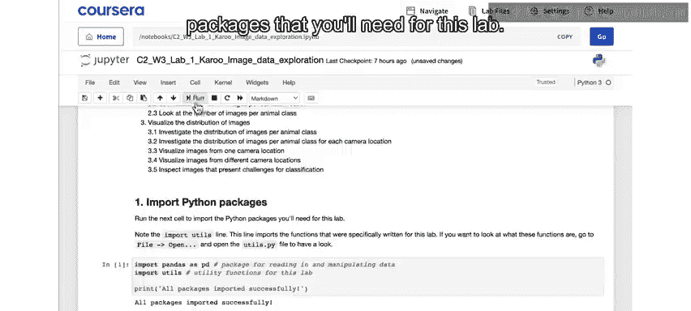

运行此Excel单元格，打印出数据文件夹内的文件夹名称列表。在这里，您将再次看到动物的名称，对应您拥有的每个图像文件夹。

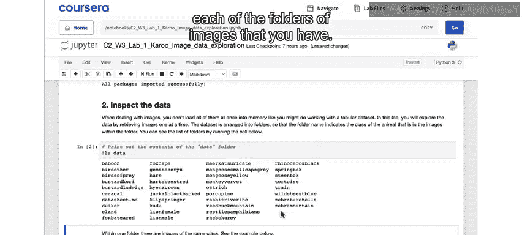

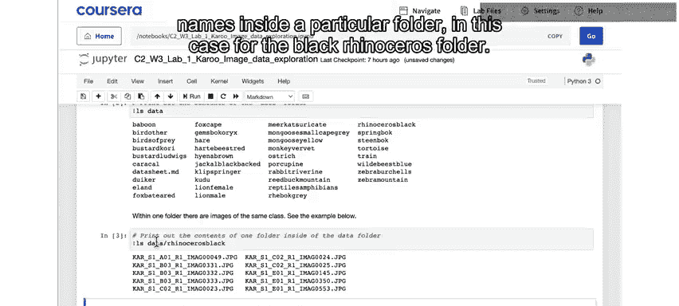

运行此处的下一个命令，查看打印特定文件夹（本例中是黑犀牛文件夹）内图像名称列表的示例。

这个快速检查还会告诉您，这里只有10张犀牛图像。在本例中，每个图像的文件名包含有关图像记录地点和时间的信息。这里的KAR_S1和R1标签仅表示这来自Kery数据集，第一季，第一次重复。A01、B03等数字表示相机陷阱的位置。您可以看到这些图片是从，让我数一下，一到三，从不同的相机拍摄的。所以变化不大。

您可以看到，总共有四个不同的相机陷阱捕捉到了这总共十张图像。最后，这个图像标签给出了图像的编号，这是整个数据集中唯一的标识符。

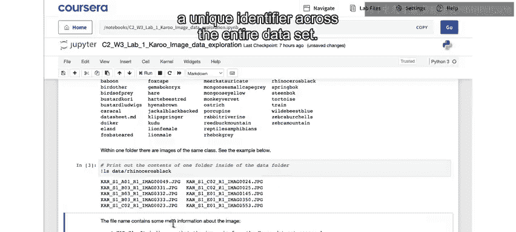

当您运行此Excel单元格时，将运行一个命令，搜索文件结构并提取所有图像信息的数据框。

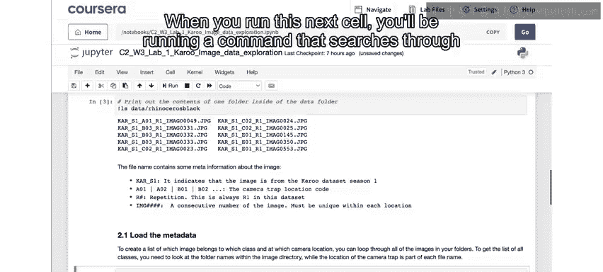

现在，使用每个图像的文件路径，您提取了相机位置（这是每个图像文件名的一部分）、该图像中识别的动物名称以及该图像的文件路径。您将在整个实验室中使用这些信息来自动访问图像。

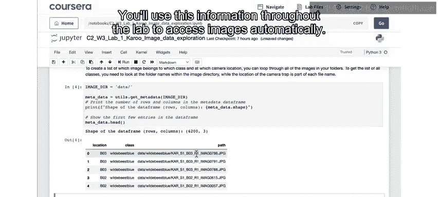

使用下一个单元格，您可以高级查看上一个单元格生成的数据框，看到它包含了不同相机位置的所有动物名称。

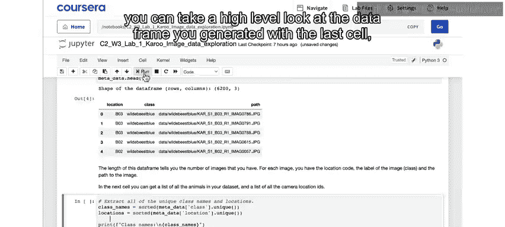

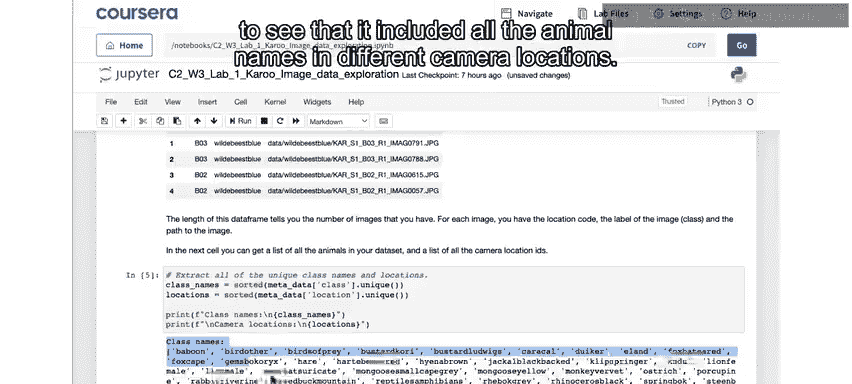

运行此处的Excel单元格，计算每个相机位置的图像数量。您可以看到，有些位置有数百张图像，而其他位置只有几张。

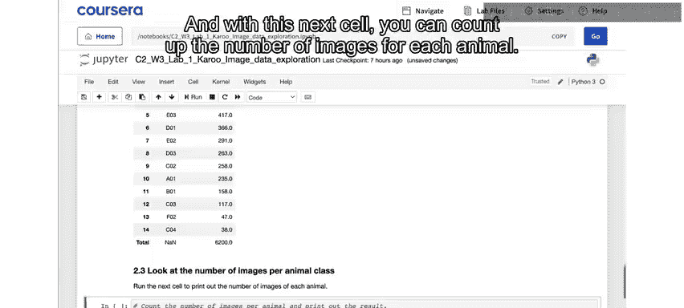

使用下一个单元格，您可以计算每种动物的图像数量。

在这里，您再次会发现，对于某些动物，有数百张图像，而其他动物的图像相对较少。这是我们在整个实验室中会反复遇到的问题：图像较少时，我们预计机器学习算法的准确性会较低。

如果您不熟悉这些动物名称中的许多，不用担心，您将在这些实验室中逐渐熟悉它们。请注意，这里列出的名称有时顺序不对，例如这个是红麂羚，这个是山斑马，这个是黑背豺，这个是卡鲁鸨（一种鸟）。上面这个是南非林羚，也称为羚羊。

可视化数据集中动物分布的另一种方式是占总数的百分比。这就是您运行下一个单元格时要做的。

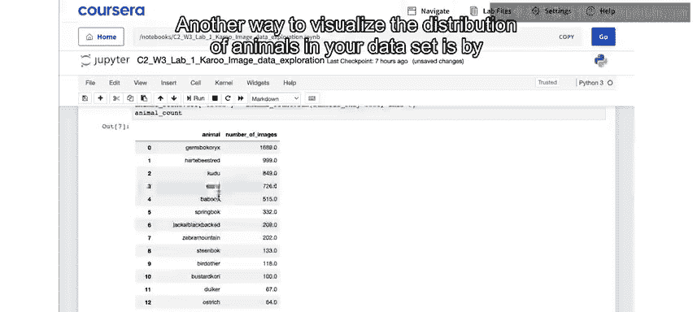

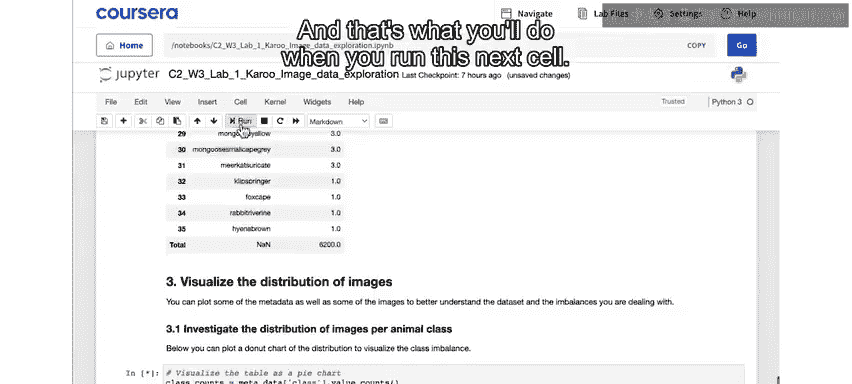

现在，这张图表显示了您拥有的每种动物图像总数所占的相对百分比。

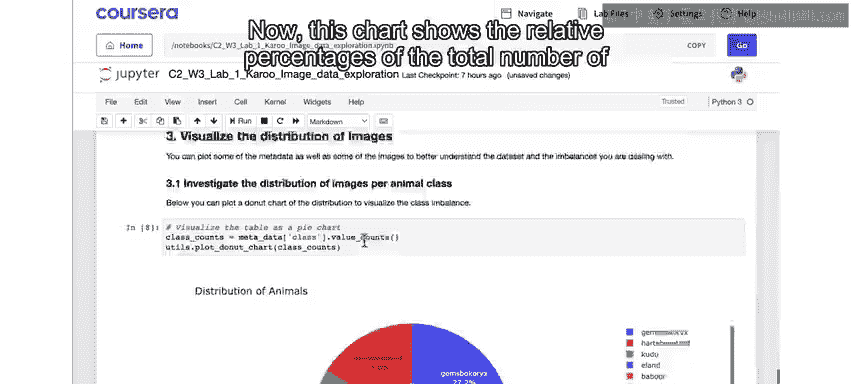

在数据探索的这个阶段，主要要理解的是，这是一个**不平衡的数据集**。正如我们所说，您的数据在所有希望识别的对象类别（本例中是动物类型）中分布并不均匀。

因此，如果您尝试用不平衡的数据集开发模型，将会遇到问题。例如，在这种情况下，您可以看到，即使是一个总是猜测南非林羚的模型，其正确率也会超过25%。在本项目的设计阶段，您将看到一些在建模前平衡数据的方法。

将这项调查更进一步，您可以运行下一个单元格，查看每个单独相机位置拍摄的动物的相对分布。

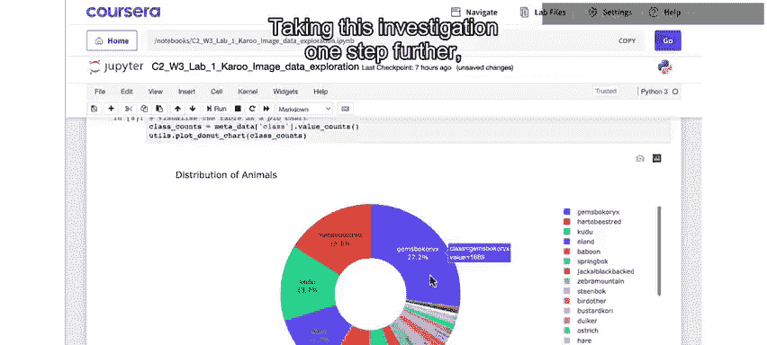

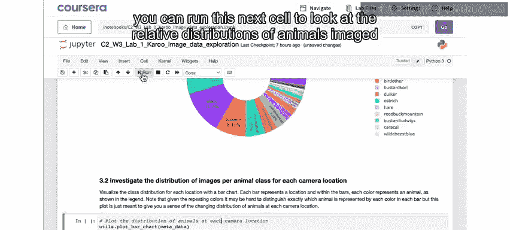

现在，在水平轴上，您有相机位置标识符的列表。在垂直轴上，您有每种类型动物（在图例中显示）在每个位置拍摄的图像中所占的比例。您可以看到，不仅数据集中动物的相对分布不平衡，而且毫不奇怪，分布也根据相机位置发生了相当显著的变化。

那些从事保护生物学工作的同学，可能已经能够从这些相对分布中得出关于动物在公园中的位置、哪些动物占据相同空间等重要信息。

我们将继续查看实际图像，并思考用于自动动物检测器的人工智能解决方案。请在下一个视频中与我一起开始查看此数据集中的图像。

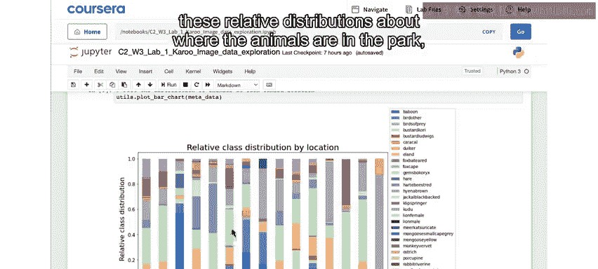

---

**总结**

在本节课中，我们一起学习了如何为一个生物多样性监测项目探索数据。我们查看了数据的结构，了解了它是一个不平衡的数据集，并且动物分布因相机位置而异。这些发现对于后续设计和构建有效的人工智能模型至关重要。在下一节中，我们将开始查看图像本身，并探讨构建自动动物检测器的可能性。