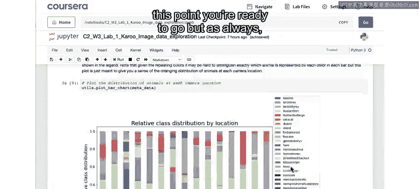
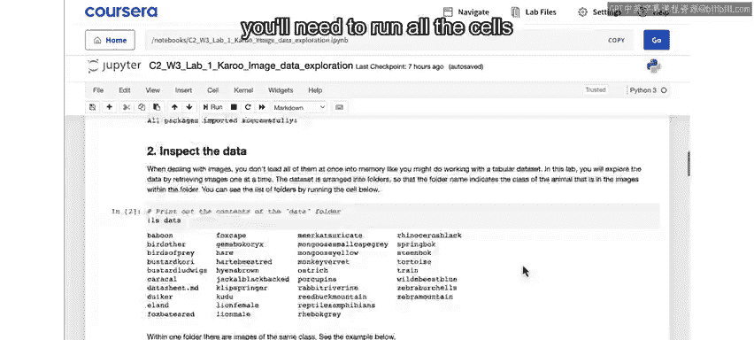
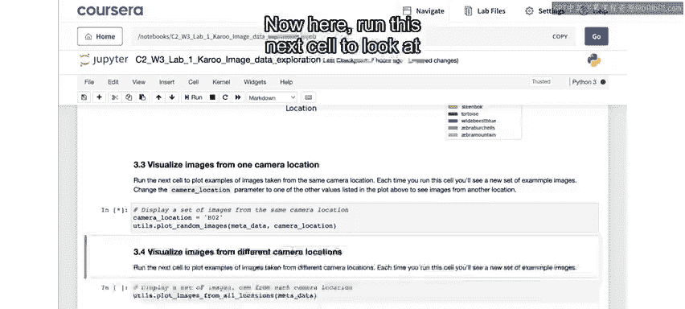
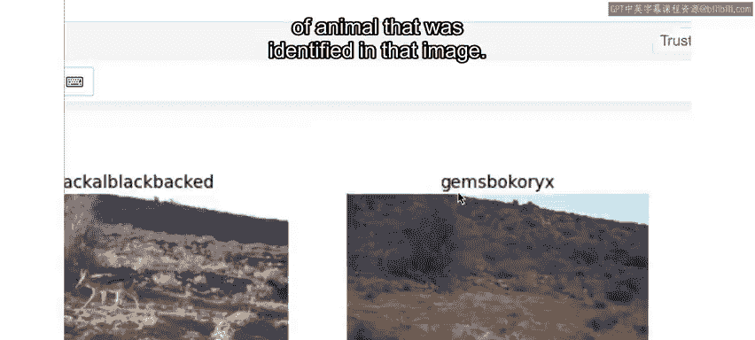
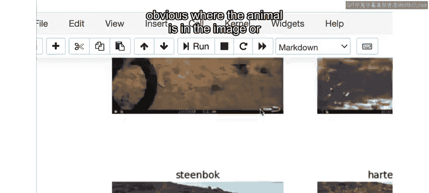
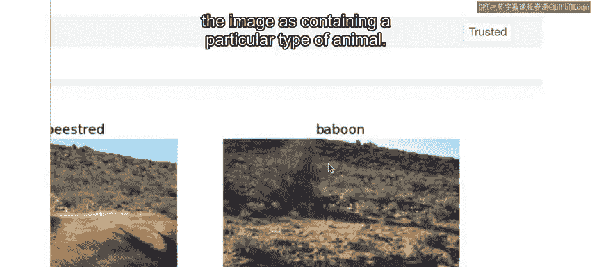
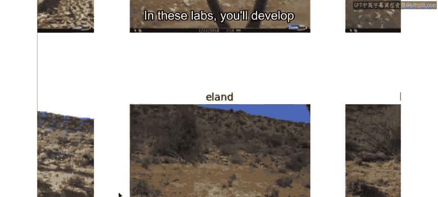
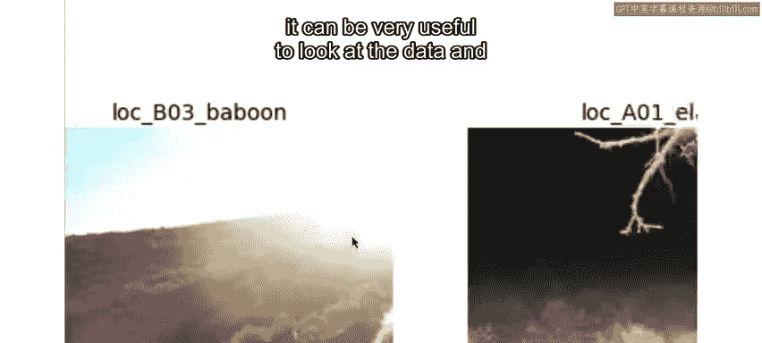
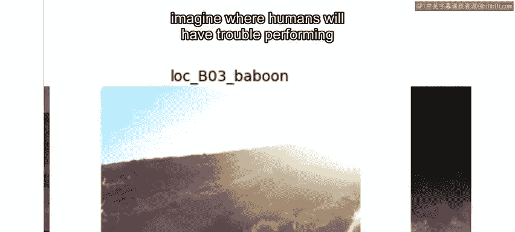
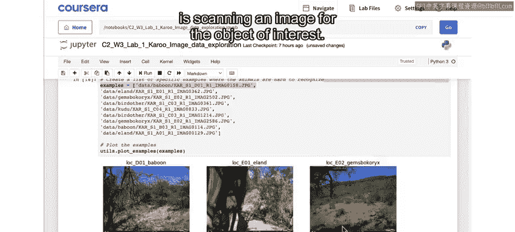

# 069：生物多样性数据可视化分析 🦁

在本节课中，我们将深入观察生物多样性监测项目中的图像数据，识别数据集中可能存在的挑战，并为后续构建动物检测模型做好准备。

## 概述

上一节我们探索了不同动物物种和不同相机位置之间的图像分布情况。本节中，我们将仔细查看图像本身，并调查此数据集可能存在的一些潜在问题。

## 查看同一相机位置的图像

以下是查看来自同一相机位置的一组图像的步骤。

1.  运行指定的代码单元格，查看从同一相机位置拍摄的一组图像。
2.  你可以反复运行该单元格，以查看从该位置随机选择的另一组图像。

仔细观察这些图像。你会发现，即使是同一相机位置拍摄的图像，由于天气和时间的不同，图像本身看起来也可能有很大差异。

每张图像都标有在该图像中识别出的动物类型。

## 识别数据标注的挑战

你会发现，在某些情况下，很难确定动物在图像中的位置，或者可能只看到看起来像动物的一小部分。

很难想象标注者是如何将图像标记为包含特定类型动物的。

至少在某些情况下，造成这种情况的原因是这些图像是作为一个序列拍摄的。

完整的序列可能显示动物从画面的一侧移动到另一侧。因此，基于在该序列的其他帧中看到的动物，可以标注一些仅包含动物一小部分、动物距离很远或被遮挡的图像。

在这些实验中，你将开发一个适用于单张图像的动物检测器。

但作为动物检测器规则或实现的一部分，值得考虑的是开发一个也能处理图像序列的模型。

每次运行此单元格，你都会获得一组新的图像进行调查。因此，请尝试多次运行它以更仔细地查看数据。

## 查看不同相机位置的图像

现在运行下一个单元格，以显示从不同位置拍摄的一组图像。

现在你可以了解不同环境下的相机陷阱图像会是什么样子。

同样，每次运行此单元格，你都会获得一组新的图像进行调查。

## 分析图像序列案例

运行下一个单元格，查看数据集中的一个特定图像序列，这次是一只狒狒穿过画面的序列。

如果你仔细观察第三帧，很难找到狒狒，我认为它可能根本不在那里。

因此，这是你在此数据集中将面临的一个挑战：图像被标记为包含动物，但在许多情况下，即使是人类都难以识别相关动物，更不用说机器学习算法了。😊

运行下一个单元格，查看其他被归类为序列一部分的图像示例，但这些单张图像本身很难分类。

## 数据探索的重要性

像这样详细查看数据是理解在开发任何AI解决方案时需要克服的挑战的关键一步。

😊，虽然一开始并不总是显而易见，但你的项目中哪些方面会给建模工作带来复杂性。在处理图像时，查看数据并设想人类在执行你希望AI执行的任务时可能遇到的困难是非常有用的。

在这种情况下，正如我之前提到的，你将创建一个基于机器学习的动物检测器，它适用于单张图像，而不是序列。因此，正如人类难以或无法判断某些图像中的内容一样，如果机器学习模型没有序列的完整上下文，预计它也会遇到困难。

## 项目设计阶段的考量

在本项目的设计阶段，你将开发一种方法，从训练数据中移除不包含任何可识别动物的图像。

人类相当擅长但AI可能难以完成的一项任务是扫描图像以寻找感兴趣的对象。我的意思是，我们人类可以浏览这些图像，并快速确定应将注意力集中在哪里，或者判断图像中是否没有感兴趣的内容。

确定图像中是否有感兴趣的内容，以及如果有需要识别的对象，应将模型的注意力集中在哪里，这些是几乎所有采用相机陷阱的生物多样性监测项目都面临的基本问题。

如前所述，这些相机陷阱由运动触发。触发因素可能是动物经过，也可能是车辆、行人，甚至只是强风导致树木摇晃。

在本实验中，你还发现了不同动物类型以及不同相机位置之间图像数量的不平衡。这类数据不平衡也是相机陷阱项目中的常见问题，你将在设计阶段的第二部分使用一种称为**数据增强**的技术来缓解这个问题。

## 项目聚焦视频

在结束探索阶段之前，我们为你准备了一个令人兴奋的项目聚焦视频。Sarah Bery是麻省理工学院的教授，也是利用AI技术进行生物多样性监测的专家。

在这个视频中，她将阐述生物多样性监测的重要性及其面临的挑战。

她还将向你介绍她在微软期间开发的**Mega Detector**模型。在接下来的实验周，你将有机会在自己的项目中应用Mega Detector。

## 总结

本节课中，我们一起学习了如何可视化分析生物多样性监测的图像数据，识别了数据集中因图像序列、环境差异和标注模糊性带来的挑战，并了解了在后续项目中处理数据不平衡和设计有效动物检测器时需要考虑的关键因素。