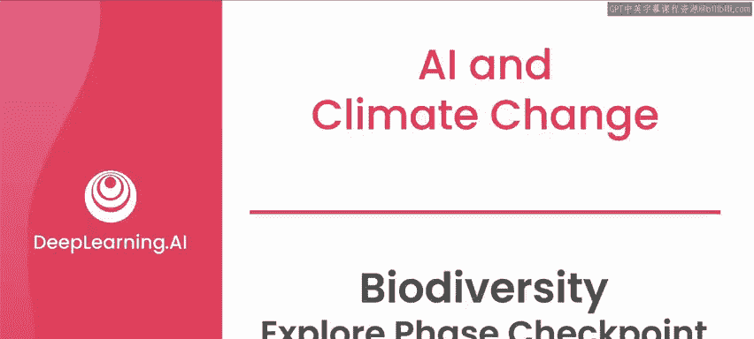
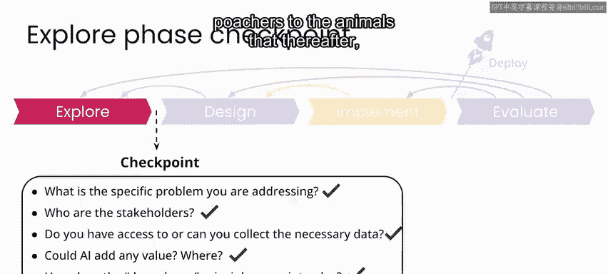

# 070：生物多样性探索阶段检查点 🧭



在本节课中，我们将回顾并检查在“生物多样性监测项目”探索阶段完成的工作。我们将依据“AI向善”项目框架，确认是否已具备进入设计阶段所需的所有要素。

---

## 概述

上一节我们介绍了在探索阶段对数据（如不平衡样本和难以分类的图像）的初步分析。本节中，我们将通过一系列关键问题，系统性地评估项目现状，确保可以顺利进入下一阶段。

以下是进入设计阶段前，你和团队需要确认的核心问题列表：

1.  **具体问题**：你正在解决的具体问题是什么？
2.  **利益相关者**：项目的利益相关者有哪些？
3.  **数据获取**：你是否能够获取或获得必要的数据？
4.  **AI价值**：AI能否增加价值？具体在何处以及如何增加？
5.  **无害原则**：“不伤害”原则在此如何体现？

---

## 项目回顾：卡拉国家公园生物多样性监测

对于你正在参与的卡拉国家公园生物多样性监测项目，你已撰写了以下问题陈述：

> 研究人员和保护生物学家需要每日获取卡拉国家公园内各地点观测到的动物数量信息，以监测动物种群趋势和生物多样性，从而为制定保护和维护公园生态系统的政策提供依据。

请注意，此类问题陈述通常需要数周或数月才能完善，本课程中我们加速了这一过程。该陈述明确了关键利益相关者、希望构建的解决方案类型以及项目成功的可能样貌。

### 利益相关者

你已识别出的利益相关者包括：
*   研究人员和保护生物学家
*   公园工作人员
*   政策制定者
*   当地社区

### 数据评估

你已探索了可访问的数据，并确认尽管存在数据不平衡和图像难以分类等问题需要处理，但总体上，你拥有所需类型的、已标注的图像样本，可用于预期的分类任务。

### AI的潜在价值

在确认数据基本可用后，AI确实有可能为此项目增加价值。前提是你能利用这些数据设计和训练一个**自动图像识别流程**。该流程的代码逻辑核心可概括为：

```python
# 伪代码：自动图像识别流程
def automatic_image_recognition_pipeline(image_batch):
    # 1. 预处理图像批次
    processed_images = preprocess(image_batch)
    # 2. 使用训练好的模型进行预测
    predictions = trained_model.predict(processed_images)
    # 3. 汇总并输出结果（如动物数量统计）
    daily_animal_counts = aggregate_predictions(predictions)
    return daily_animal_counts
```

此流程将能够快速处理每日产生的大量图像批次。

### “不伤害”原则的考量

在本项目中，你使用的是原始数据集的子集，仅包含动物图像。但原始数据集的详细信息显示，卡拉国家公园的相机陷阱还拍摄到了许多**人员和车辆**的图像。

*   人员图像已从公开数据集中移除。出于本项目目的，我们也移除了标记为“空”或包含“车辆”的图像。
*   对于此类可能拍摄到盗猎目标动物的项目，另一个潜在风险是：必须小心避免无意中发布可能引导盗猎者找到目标动物的信息。
*   在现实世界实施此类项目（或任何在公共空间记录图像、视频或音频的项目）时，必须**依法依规**确立是否可以这样做。如果可以，则需要制定计划来处理不可避免地记录到人员活动的问题，这应被视为敏感个人信息。
*   在项目实施中，理想情况是准备好快速**识别并删除**此类敏感个人信息，而非存储或发布。

如果你已准备好从数据集中识别并删除人员和车辆图像（本项目已为你完成此步骤），并且确信你的项目不会在刺激盗猎或产生其他负面影响方面对当地社区构成威胁，那么你就已准备好进入设计阶段。



---


## 总结


本节课中，我们一起学习了如何对项目的探索阶段进行系统性检查。我们回顾了问题陈述、利益相关者、数据状况，评估了AI的潜在价值，并重点讨论了“不伤害”原则在实际项目中的应用要点。至此，你已完成“Snapshot卡拉生物多样性监测项目”的探索阶段。

在下一个视频中，我们将总结本周内容，并在下周的课程材料中进入设计与实施阶段。