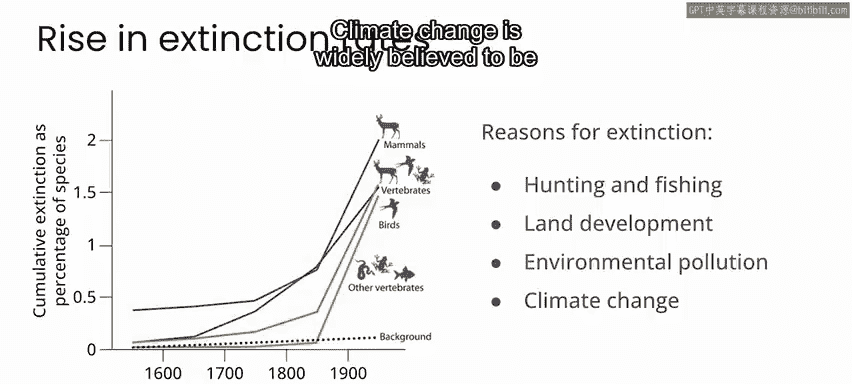
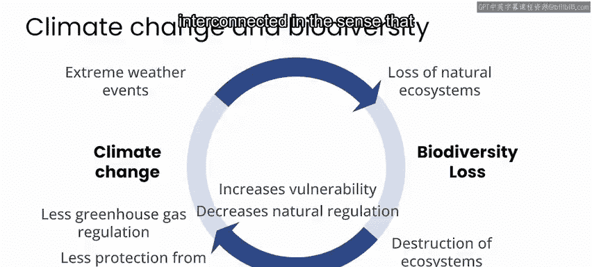
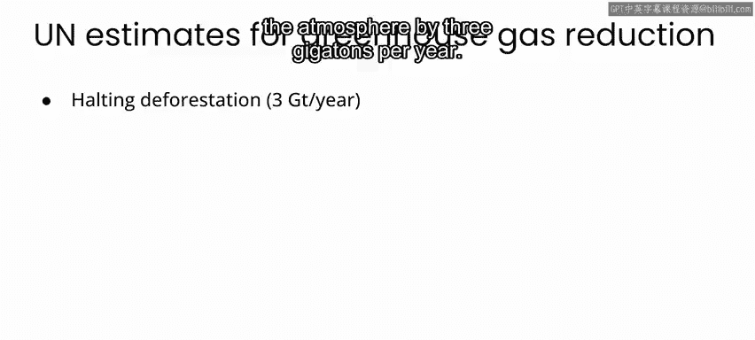
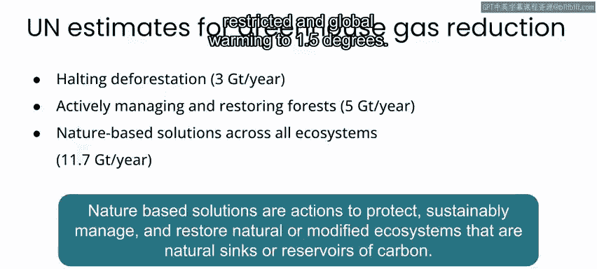
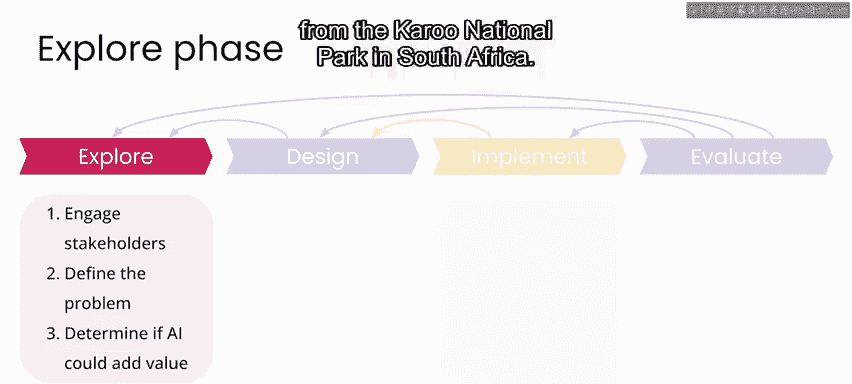

# 071：P71

## 概述

在本节课中，我们将总结第三周关于气候变化背景下生物多样性监测的学习内容。我们将回顾物种灭绝与气候变化的相互关联，探讨基于自然的解决方案的重要性，并介绍一个具体的AI实践项目。

---

## 第三周内容总结

本周，我们探讨了气候变化背景下的生物多样性监测。我们了解到，我们正处于保护生物学家所称的“第六次大灭绝”之中。这指的是自大约6600万年前恐龙以及75%的动植物物种灭绝以来，生物体正以最快的速度走向灭绝。

总体而言，灭绝率的上升归因于人类活动，例如狩猎和捕鱼、土地开发以及环境污染。人们普遍认为，气候变化加速了这些灭绝的速度。

### 气候变化与生态系统的相互影响

上一节我们介绍了物种灭绝的现状，本节中我们来看看气候变化与生态系统健康之间的深层联系。

当我们考虑到气候变化正在以剧烈的方式给自然生态系统施加压力并改变它们，从而对动植物物种构成压力时，这当然在直觉上是合理的。作为回应，许多动植物物种被迫迁入新的区域。这威胁到了那些区域现有的生态系统，同时它们在其原生环境中也面临着灭绝的威胁。

然而，需要强调的是，动植物灭绝速度的加快以及由此导致的自然生态系统生物多样性的丧失，不仅仅是气候变化的附带损害。相反，气候变化与自然生态系统的健康是深度相互关联的，因为两者相互驱动和调节。

### 基于自然的解决方案

以下是基于自然的解决方案在减缓气候变化方面的潜力数据：

*   联合国估计，仅通过停止森林砍伐，我们每年就可以减少大气中30亿吨的温室气体。
*   通过在所有生态系统中积极推行基于自然的解决方案，到2030年，我们每年可以减少约117亿吨的温室气体。这几乎代表了要将全球变暖限制在1.5摄氏度以内所需减排量的40%。

### 保护与恢复生态系统的重要性

除了作为减缓气候变化的强大工具外，保护和恢复自然生态系统对于适应气候变化也至关重要。湿地、森林和沿海生态系统有助于抵御由气候变化引发的洪水、火灾和其他极端天气事件。

在保护和恢复生态系统方面，重点不应仅仅放在特定物种或一组物种上，而应放在整个生态系统上。在某种意义上，生物多样性可以被视为这些生态系统健康状况的衡量标准。作为保护和恢复生态系统的第一步，生物多样性监测对于制定政策至关重要，这些政策可以扭转人类对自然环境的影响及其对气候变化的影响。

### 项目实践：Snapshot Caro

基于以上背景，我们开始了Snapshot Caro项目的探索阶段。在该项目中，您将使用来自南非卡鲁国家公园的相机陷阱数据，构建一个自动动物检测器。

以下是项目探索阶段的主要任务列表：

*   确定项目利益相关者。
*   写下问题陈述。
*   探索数据，以确认您拥有推进到项目设计阶段所需的一切。

### 引入机器学习工具：MegaDetector

我们听取了Sarah Bery关于大规模相机陷阱项目所面临的一些挑战的介绍，以及她与微软的合作者如何开发出一个名为MegaDetector的机器学习模型来应对其中一些挑战。

在下一周的材料中，我们将开始设计阶段。届时，您将在自己的工作中运用MegaDetector，来监测卡鲁国家公园的生物多样性。

---

## 总结

本节课中，我们一起学习了气候变化与生物多样性丧失之间的紧密联系，认识到保护和恢复生态系统对于减缓和适应气候变化的关键作用。我们还介绍了利用AI技术（如MegaDetector模型）进行生物多样性监测的实践项目Snapshot Caro，并完成了项目的初步探索阶段。下一阶段，我们将进入具体的设计与实施环节。