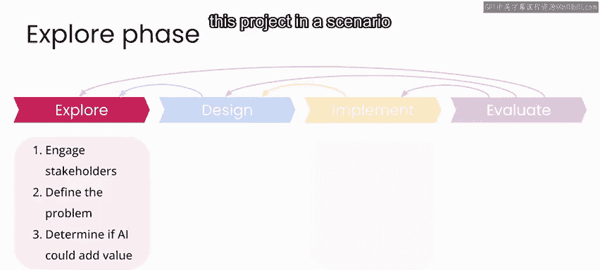
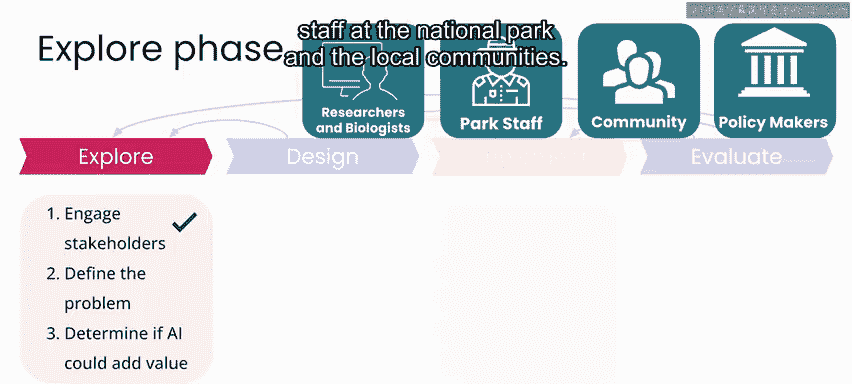
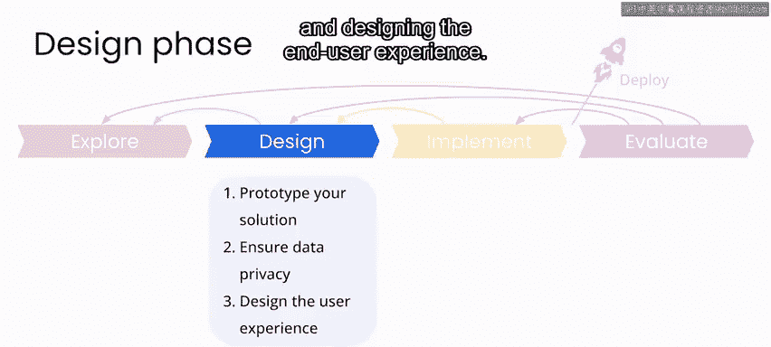
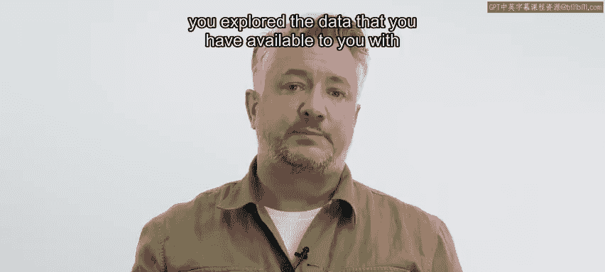
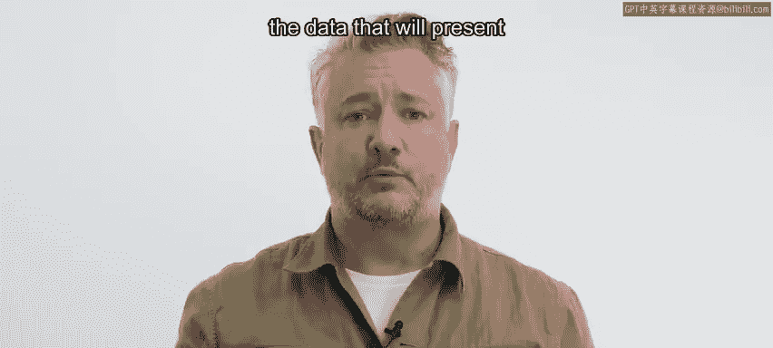
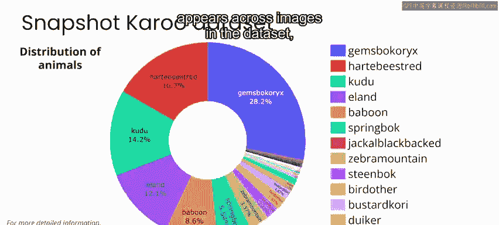
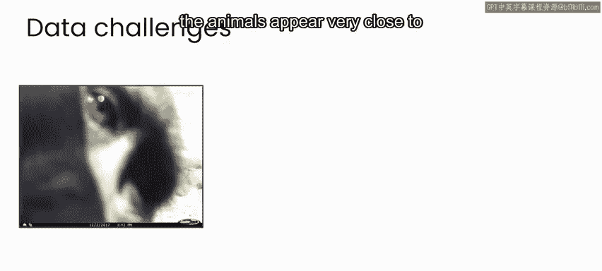

# 072：生物多样性监测项目实践 🦁

## 概述

在本节课中，我们将进入AI与气候变化课程的最后一周。本周我们将通过一系列实验，为南非卡鲁国家公园设计并实施一个生物多样性监测解决方案。我们将从项目探索阶段过渡到设计阶段，重点关注原型构建、数据隐私和最终用户体验设计。

---

## 从探索阶段到设计阶段

上一周，我们完成了项目的探索阶段。在该阶段，我们与包括保护生物学领域的研究人员、关心自然生态系统生物多样性保护的政策制定者、国家公园工作人员以及当地社区在内的利益相关者建立了联系。

我们的项目目标是为研究人员提供每日报告，内容是基于分布在整个国家公园的相机陷阱所记录图像中识别出的各种动物物种的目击数量。

通过探索数据，我们确定AI很可能在此项目中增加价值。因此，我们现在准备进入设计阶段。

在设计阶段，我们将专注于原型化新解决方案、思考数据隐私以及设计最终用户体验。

---

## 回顾数据挑战

在项目的上一阶段，我们探索了可用于构建自动动物检测系统的数据。

我们发现了数据中存在的一些问题，这些问题将在开发解决方案时构成挑战。

以下是我们在数据集中识别出的主要挑战：

*   **类别不平衡**：数据集中每种动物出现的图像数量存在不平衡。同时，每个相机位置出现的动物数量和类型也存在不平衡。
*   **图像识别难度**：在某些图像中，识别动物非常困难甚至不可能。这是因为许多图像是作为一个系列的一部分被标记的，动物可能在该系列的某些帧中容易识别，但在其他帧中则难以识别。
*   **目标尺度与数量变化**：在某些情况下，动物离相机非常近，而在其他情况下则非常远。此外，还有在同一帧中出现多个动物的情况。

对于创建自动动物检测器的目的而言，所有这些问题都构成了重大挑战，需要在开发解决方案时加以解决。

---

## 引入 Mega Detector 模型

事实证明，我们在此项目数据中发现的这些挑战，在几乎所有尝试使用相机陷阱数据进行自动动物检测的项目中都很常见。

克服这些挑战，正是Sarah Beri及其在微软的 collaborators 开发 Mega Detector 模型的主要原因之一。

Mega Detector 是一个经过数百万张图像预训练的模型，能够自动检测相机陷阱数据中最常出现的事物，即**动物、人物和车辆**。

除了能够判断图像是否包含动物、人物或车辆外，Mega Detector 还能通过提供所谓**边界框**的坐标，精确识别该物体在图像中出现的位置。

这个边界框会框住每个物体。此外，它还能在单张图像中同时检测多个物体。

训练一个机器学习模型，使其能在各种图像、相机位置和动物类型中稳健地完成这项任务，是一项巨大的工程。通常，任何一个仅使用少数几个相机陷阱数据的团队都无法独立完成。

因此，世界各地的团队在各种项目中都将 Mega Detector 用作其动物识别流程的第一步。

---

## 下一步：应用模型

在接下来的实验中，你将有机会在自己的数据上使用 Mega Detector 模型。通过首先识别哪些图像确实包含动物以及动物在图像中的位置，你将快速简化动物识别的任务。

请与我一起观看下一个视频，更详细地了解如何将预训练的 Mega Detector 模型作为你项目的起点。

---

## 总结

本节课中，我们一起学习了如何从项目探索阶段过渡到设计阶段，回顾了在构建自动动物检测系统时面临的数据挑战，并介绍了强大的 **Mega Detector** 预训练模型作为解决这些通用挑战的起点。在下一节，我们将动手应用这个模型。