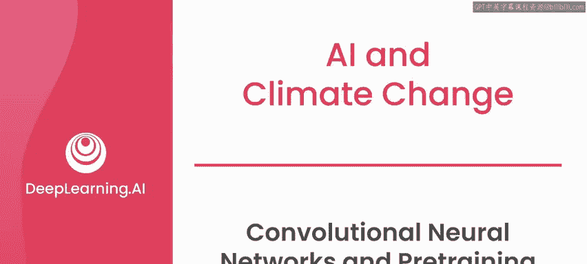
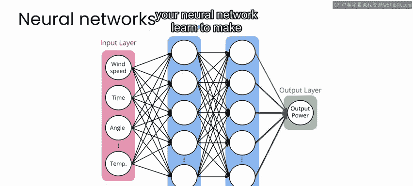
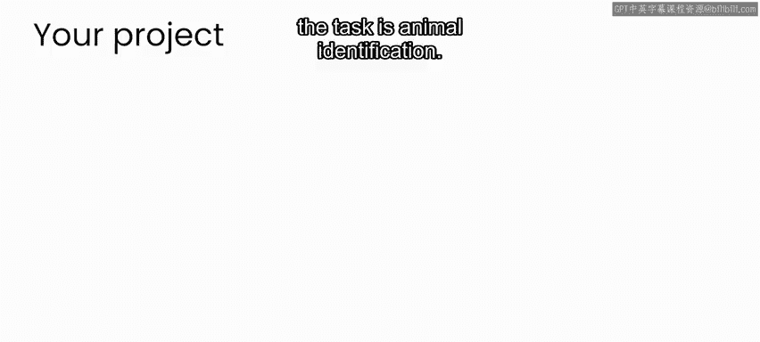
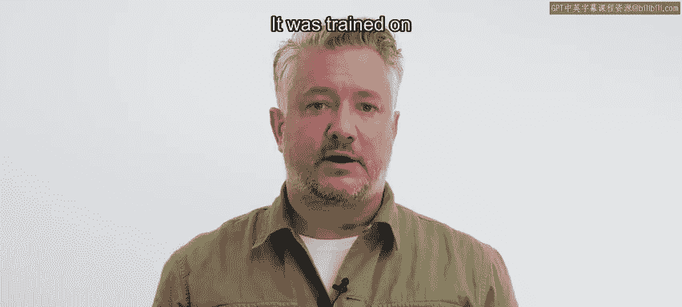
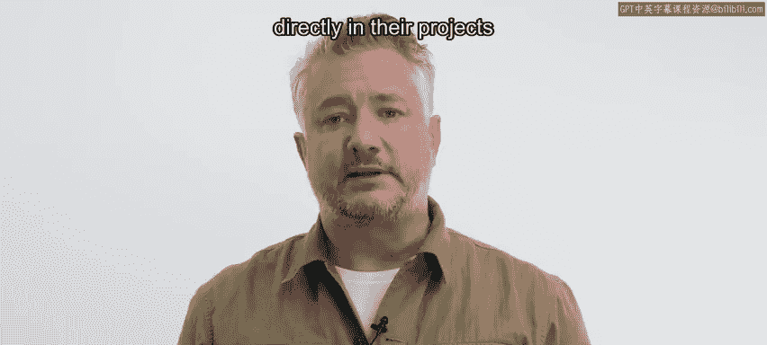
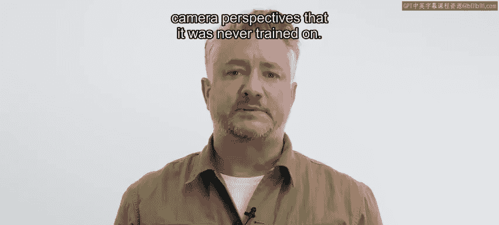

# 073：36_卷积神经网络与预训练 🧠

在本节课中，我们将要学习卷积神经网络（CNN）以及预训练模型的概念。我们将了解为何在某些情况下，使用他人已经训练好的模型比从零开始训练更为高效，特别是在处理图像识别任务时。

---

在本课程的第二周，你开发了多个不同的神经网络模型，用于风力发电预测。

如果你学习了本专业课程的第一门课，那么你还构建了一个用于估算空气污染水平的神经网络模型。

在上述每个案例中，你都是从零开始训练你的模型。

这意味着你首先定义了模型结构，例如决定神经元的数量和网络的层数。

然后，你通过向网络展示许多输入A（如传感器测量值或气象变量）和输出B（如课程第二周中的风力发电输出）的示例来训练网络。

通过这个训练过程，神经网络学会了越来越准确地预测输出。

---

虽然对于许多机器学习应用而言，从零开始训练神经网络是一种合理的方法，但在其他情况下，从一个为其他任务训练好的现有模型开始，可能更具优势。

这在处理图像数据时尤为常见，因为这类任务通常是识别图像中的内容。

在某些情况下，如果你能获得一个已经训练好、可以识别你感兴趣的特定类型物体的模型，你可以直接将该预训练模型用于你的任务。

例如，这里展示的是一个预训练物体检测模型的输出，该模型可在互联网上免费获取。

你可以查看幻灯片上显示的网站以获取更多详细信息。

该模型经过训练，能够识别城市环境中的汽车、人物等物体。

我在这里用它来识别一段交通路口视频素材中的这些物体。

因此，如果我的项目是监控某个特定路口的交通情况，那么我可以直接使用这个模型，并获得相当不错的结果。

对于你在这些实验中的项目，任务是动物识别。

完成该任务的挑战之一，是首先要能够识别图像中是否包含动物，然后确定动物在图像中的具体位置。

---

如前所述，这些挑战是所有相机陷阱项目共有的。幸运的是，Sarah Berry和她在微软的同事们开发了MegaDetector模型来应对这些挑战。

MegaDetector在数百万张相机陷阱图像上进行了训练，以识别图像中是否包含动物、人物或车辆。

它在如此多不同的相机视角和不同的动物上进行训练，以至于研究人员可以直接在他们的项目中使用它，来识别它可能从未见过的动物，或者从未训练过的相机视角下的动物。

---

作为AI驱动的动物检测器的开发者，MegaDetector应该能让你的项目工作轻松许多。

因此，在下一个视频中，请和我一起开始为你的项目使用MegaDetector模型。

---

本节课中我们一起学习了卷积神经网络与预训练模型的核心概念。我们了解到，从零开始训练模型是基础，但利用为通用任务（如图像识别）预训练好的强大模型（如MegaDetector），可以极大地提高特定项目（如动物识别）的开发效率和效果。下一节我们将开始实践应用。