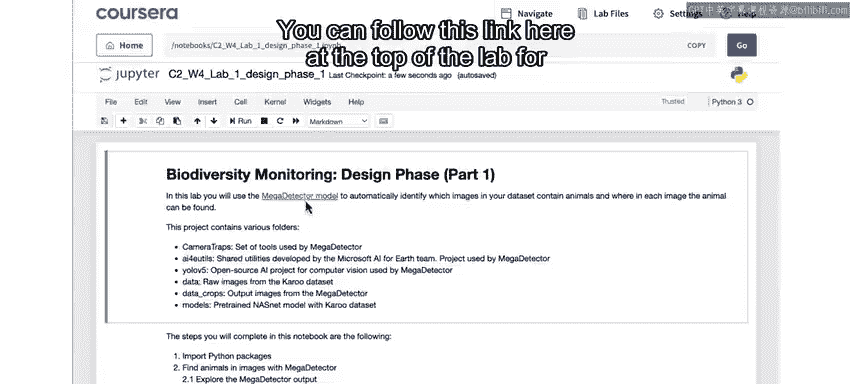
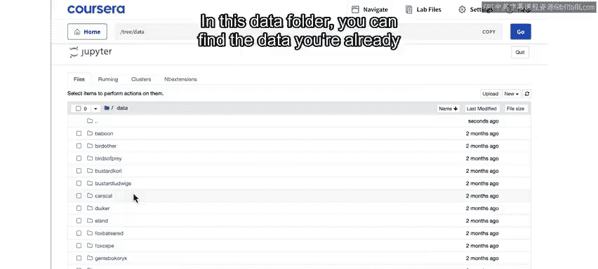
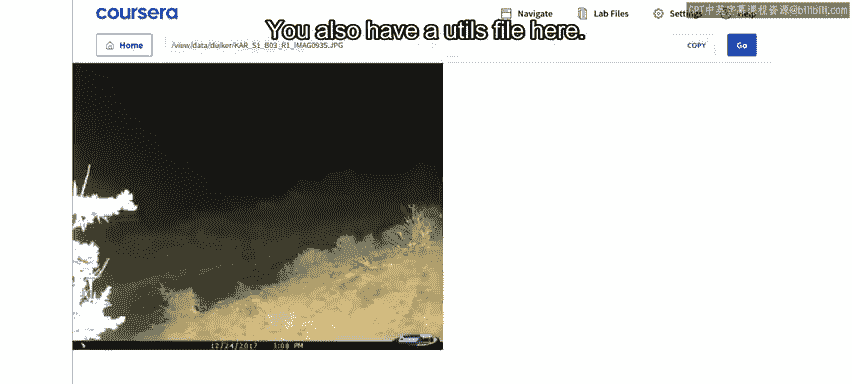
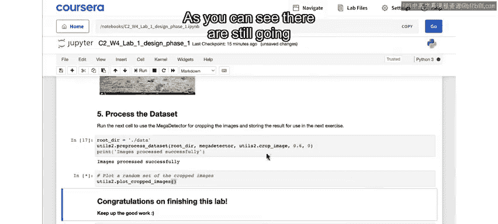
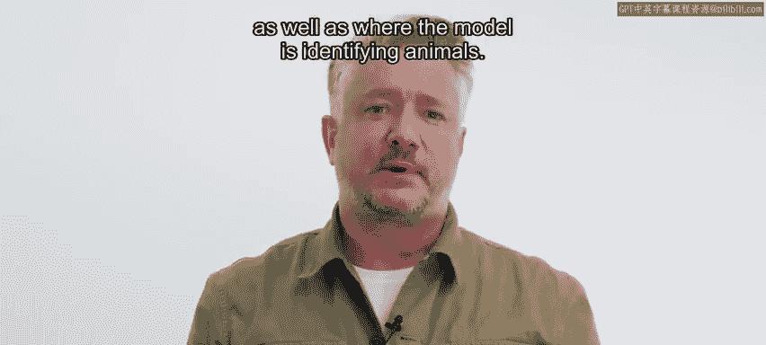

# 074：生物多样性监测项目设计阶段（一）——使用MegaDetector模型 🦁

## 概述

在本节课中，我们将学习生物多样性监测项目设计阶段的第一部分。我们将使用MegaDetector模型来识别数据集中哪些图像包含动物，并确定动物在每张图像中的具体位置。目前，我们暂不关注识别动物的具体种类，这将在后续步骤中完成。

## 项目设计阶段第一部分

上一节我们介绍了课程的整体目标，本节中我们来看看如何在项目中具体应用MegaDetector模型。

你可以通过实验室顶部的链接获取关于MegaDetector模型技术细节的更多信息。从那里，你还可以通过另一个链接开始使用MegaDetector，或了解如何将此模型集成到你的项目中。

接下来，点击Jupyter图标查看实验室文件夹中的内容。你会发现里面有两个笔记本文件，即扩展名为`.ipynb`的两个文件。目前，你将使用第一个文件进行工作，第二个文件将用于设计阶段的下一部分。此外，文件夹中还包含了MegaDetector模型文件（扩展名为`.p2`），以及运行模型所需的其他软件和资源照片。

在数据文件夹中，你可以找到之前实验中已经熟悉的数据集以及数据表。

与之前的实验一样，这里也有一个`utils`文件，其中抽象化了一些代码，以使笔记本更易于理解。

实际上，这个文件被命名为`utils2.py`，因为`utils`这个名字已被其他库占用，我们想避免混淆。如果你是Python程序员，并希望了解更多幕后细节，可以查看这个`utils2.py`文件。

回到笔记本，第一步始终是运行顶部的单元格，导入本实验所需的Python包。这里的代码主要是为了设置MegaDetector模型的使用环境。

然后，我们将通过下一个单元格检查不同动物的图像文件夹是否都存在。

## 加载并测试MegaDetector模型

通过下一个单元格，你现在可以读入MegaDetector模型。成功运行后，运行下一个单元格来读取并显示一张秃鹫的示例图像。你将使用这张图像作为第一个测试案例，观察MegaDetector模型的工作原理。

以下是MegaDetector模型的文本输出。每次在图像上运行该模型时，你都会看到类似的输出，其中包含了检测到的物体位置信息。

在下方，你可以看到对此文本输出每个组成部分的描述。

以下是每个输出字段的含义：

*   **文件**：这是正在处理的图像的路径名。
*   **最大检测置信度**：这是一个从0到1的置信度估计值。低值表示模型对该特定检测的信心较低，高值表示信心较高。本例中只有一个检测到的物体（动物）。如果图像中有多个物体被检测到，这个“最大检测置信度”数字将对应置信度最高的那个物体，并且会有一个更长的列表。在这里，检测到的最高置信度是`0.968`，即96.8%的置信度。
*   **检测列表**：如果未发现任何物体，此列表将为空；如果图像中发现多个物体（动物），则可能包含多个条目。此处的其余文本仅代表一个检测。

在检测文本内部，包含以下信息：

*   **类别**：`1`代表动物，`2`代表人类，`3`代表车辆。请注意，我们已从数据集中移除了人类和车辆图像，但请记住这些是敏感类别。在实际解决方案中，你可能需要确保快速删除或从不存储包含人类或车辆的图像。这也是为什么你可能需要依赖置信度阈值的一个好例子：超过某个置信度水平，你就能过滤掉几乎所有人类和车辆图像，或许可以将一些交给人类审核，同时避免漏报，从而保护个人隐私。鉴于我们的数据集，这里显示为`1`（动物）并不意外。
*   **置信度**：该检测的置信度。在本例中，最高置信度检测也是唯一的检测。
*   **边界框**：这个字段包含四个数字的列表，描述了一个围绕检测到的物体的边界框。

这四个数字的含义如下：

1.  边界框左上角的x和y坐标。这里的值范围是0到1，表示该角点距离图像顶部和左侧的距离占图像总尺寸的比例。如果你熟悉物体检测算法，可能会看到用具体像素值表示，但原理相同。例如，这里的角点位于x=`0.199`，意味着从左到右大约20%或1/5的位置；y=`0.354`，意味着从顶部向下大约35%或1/3的位置。因此，一个xy坐标为`(0, 0)`的点位于图像的左上角，而这个检测框的角点大约在`(0.2, 0.35)`。
2.  框的宽度和高度，同样以占整个图像的比例为单位。这里宽度约为`0.4`，意味着从这个x坐标约为`0.2`的角点开始，框向右延伸了`0.4`；高度约为`0.6`，意味着从这个y坐标约为`0.35`的角点开始，框向下延伸了`0.6`。

通过这个输出，MegaDetector告诉你它以很高的置信度在图像中发现了一个动物，并提供了围绕该动物的边界框坐标。但请注意，它没有给出这是哪种动物的任何指示，这将在后续步骤中完成。MegaDetector只是一个通用的动物检测器，适用于任何种类的动物。

这张图像经过注释，以明确边界框数字的含义。但通过运行下一个单元格，你将使用MegaDetector在原始图像上实际绘制那个边界框。

此时，你尚未识别出这是哪种动物，但通过首先确认这里确实有一个动物以及它在图像中的位置，你已向这个目标迈进了一步。

## 处理更多图像示例

接下来，你将对数据集中的其他随机图像运行相同的过程。你可以反复运行此单元格，查看图像中检测到动物的不同示例。

运行下一个单元格，查看同一图像中有多个动物时的有趣示例。在这里，你将看到与之前类似的输出，但MegaDetector识别出了三个动物。你可以在这里看到，检测列表包含三组边界框和与之关联的动物置信度。这里有一个类别为`1`（动物）的检测，置信度为`0.73`，以及一个像这样的边界框，然后是另一个类别为`1`的检测，以及第三个。在本例中，这三个检测对应于图片中三个被框起来的羚羊。

如果你放大看，会发现还有另一组腿。因此，看起来MegaDetector可能在这里漏掉了一只动物。尽管如此，在有些动物被遮挡且距离相机不同距离的情况下，能检测到四只中的三只，这已经是相当不错的结果了。

你最终的目标是利用这些检测结果，裁剪出每张图像中包含动物的部分，以便仅将包含动物的裁剪部分传递给下一步将要处理的模型。这将是用于识别你检测到的动物种类的模型。

## 图像裁剪与标准化

将裁剪后的图像传递给另一个模型的一个要求是，它们必须具有相同的大小和形状。这实际上是当前流行图像处理技术的一个限制。

正如你所见，边界框不是正方形的。但在下一步中，你将了解如何通过扩展边界框来使这些图像变为正方形。例如，对于这个检测，MegaDetector的边界框高度大于宽度，你将水平扩展这个框。在这种情况下，你在动物的左侧和右侧都添加了更多图像内容，而在框会超出原始图像边缘的地方，则用零值（全黑）填充。

运行这个单元格，查看MegaDetector输出的随机示例以及你将生成的裁剪图像，这些图像将用于后续训练分类模型。

因此，当你用随机图像运行此代码时，在某些情况下可能检测不到动物，你会收到相应的提示信息。MegaDetector的输出将有一个空列表，并且你会在这里看到一小段文本输出，说明“在此图片中未检测到动物”。

查看一些示例后，你可以运行下一个单元格，将此过程应用于整个数据集。这需要一点时间。

之后，运行下一个单元格，查看你生成的输出示例集合。同样，每次运行此单元格，你都会看到一组新的示例。正如你所见，这里仍然会有一些图像，无论对人类还是机器学习算法来说都难以识别。

但是，通过使用MegaDetector来识别动物在图像中的位置并隔离图像的那些部分，你使得人类或AI算法处理起来都更加直接。因为至少现在，你可以看到每张裁剪图像中出现的主要物体是动物或动物的一部分，这将使分类任务更容易处理。

## 设计阶段第一部分总结

以上就是设计阶段的第一部分。通过项目的这一部分，你研究了如何实现解决方案的一部分，并且也开始了解最终用户体验可能是什么样的。例如，你可以想象，除了关于动物数量的报告之外，你可能还想提供一个用户界面，允许用户查看原始图像以及模型识别动物的位置。

在下一个实验中，我们将处理分类任务。但首先，请和我一起观看下一个视频，了解你将如何使用另一种预训练模型来识别数据集中的动物。

## 本节课总结

在本节课中，我们一起学习了生物多样性监测项目设计阶段的第一部分。我们重点介绍了如何使用MegaDetector模型来检测图像中是否存在动物并定位其位置。我们了解了模型的输出格式，包括置信度和边界框坐标，并实践了如何根据这些输出裁剪图像，为后续的动物种类分类任务做准备。这个过程是构建有效AI解决方案的关键步骤，它简化了数据，使后续的分类工作更加可行。