# 075：迁移学习与微调 🧠➡️🦓

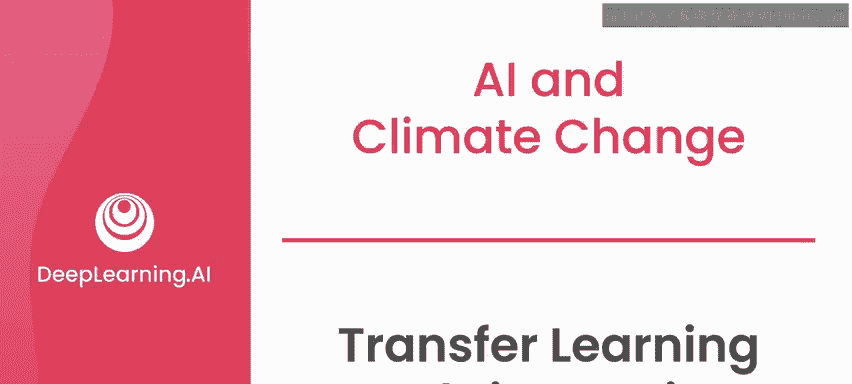

在本节课中，我们将要学习迁移学习与微调的核心概念。你将了解如何利用一个已训练好的模型，将其知识应用到新的、类似的任务上，从而节省大量训练时间和计算资源。

---

在之前的实验中，你使用了一个预训练模型——MegaDetector。这个模型用于识别数据集中哪些图像包含动物，并定位动物在图像中的位置。你学习了如何裁剪出检测到动物的图像部分，以供后续的分类模型使用。这对于你的AI动物检测项目而言，是一个巨大的进步。

下一步，是对检测到的动物进行分类，识别出具体是哪种动物。

## 为何需要迁移学习？🤔

对于MegaDetector，该模型恰好是针对你的用例（在图像中寻找动物）进行预训练的，因此你可以直接将其用于后续的分类任务。然而，在大多数其他项目中，你通常无法获得一个完全针对你特定用例训练的模型。

机器学习中的一个常见做法是：使用一个为不同分类任务训练的现有模型，然后使用你自己的数据集进行一些额外的训练，这个过程被称为**微调**。这样做可以结合两者的优势：既利用了现有模型中的知识，又融入了针对你新任务的新数据。

例如，如果你有一个能识别汽车的预训练模型，但你想要一个能识别飞机的模型。这个识别汽车的模型一开始可能无法很好地识别飞机。但如果你在一个包含飞机图像的标注数据集上对它进行少量额外训练，它就能快速学会识别飞机。事实上，这比从零开始训练一个新模型要快得多。

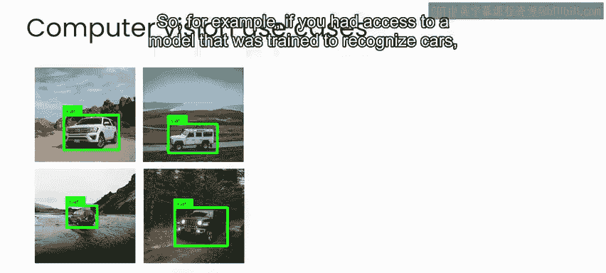

## 迁移学习为何有效？🔬

这之所以可能，是因为当神经网络模型学习执行一项任务时，你可以将模型中的每一层视为在学习该任务的不同方面。

对于物体检测任务，其中许多方面与你具体想在图像中识别什么几乎没有关系。相反，机器学习模型在任何物体识别任务上所做的大部分学习，都是对物体识别任务通用的学习。例如，学习检测物体的边缘或某些纹理。这种学习无论你希望检测什么类型的物体都可能有用。

因此，与其从零开始为你的任务训练一个模型，更常见的做法是从一个预训练模型开始，然后将该网络的学习成果**迁移**到类似任务中，并应用于你想要执行的任务。

在AI机器学习领域，这被称为**迁移学习**，即将学习从一个模型转移到另一个模型，以从两者中获益。

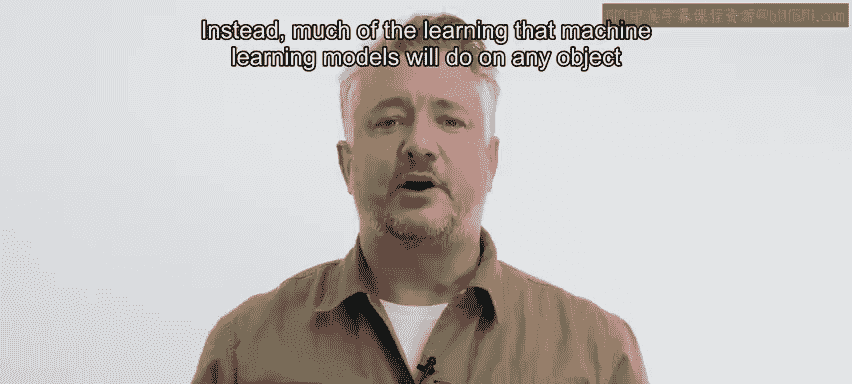

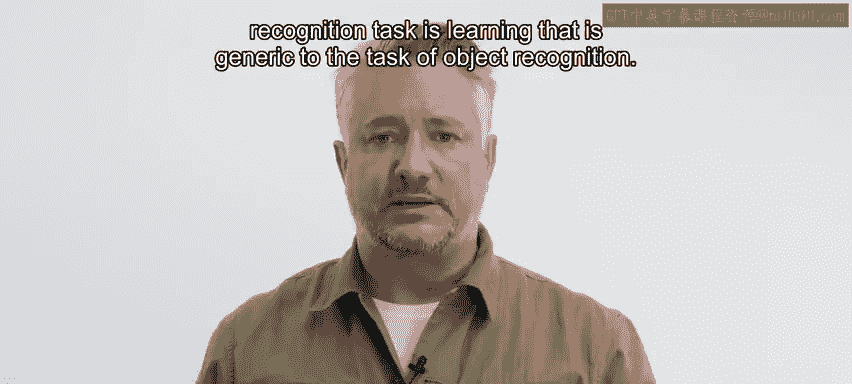

## 神经网络如何“看”图像？👁️

为了理解其工作原理，让我们仔细看看神经网络如何处理图像。

数字图像通常被表示为一个数字网格。在每个像素位置，都有一个数字代表该像素应显示的亮度或暗度。例如，在这张狐狸的灰度图中，如果我们放大图像的一小块，它可能看起来像这样：

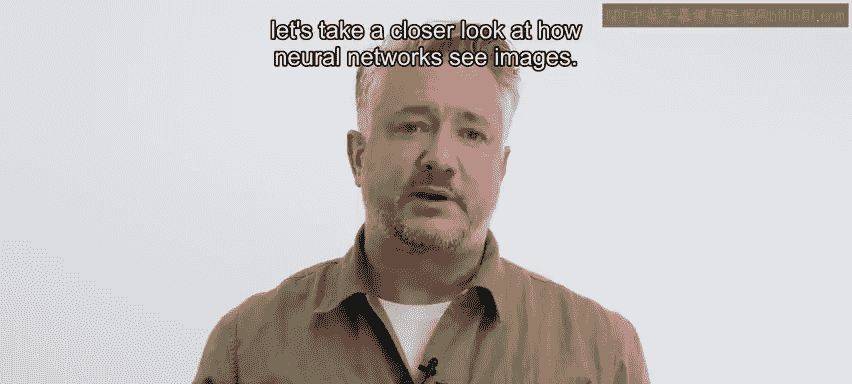

```
[[255, 240, 220],
 [230, 200, 180],
 [210, 190, 170]]
```

在这里，每个小方块代表一个像素。在每个像素内部，你会看到这样的数字集合，其中较大的数字代表更接近白色的颜色，较小的数字代表更接近黑色的颜色。

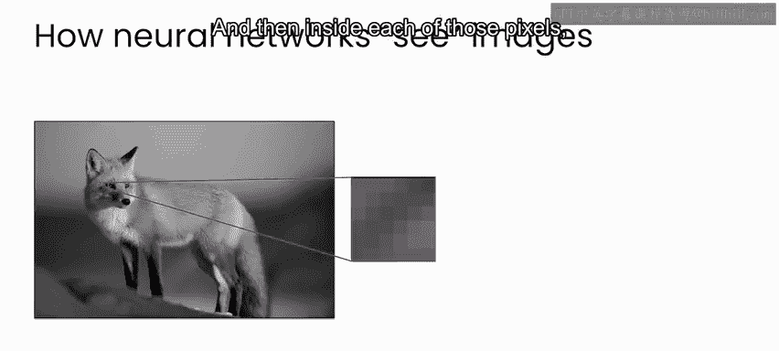

对于彩色图像，你看到的是由三层（有时是四层）或彩色通道组成的图像，每层代表图像在特定颜色通道中的亮度。

以这张彩色狐狸为例，你有蓝色通道、绿色通道和红色通道。

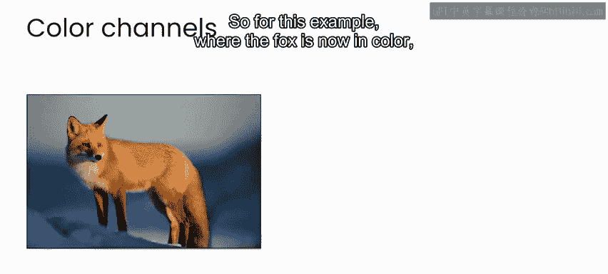


现在，在原始图像的每个像素位置，你都有这三个值，分别对应红、绿、蓝（简称RGB）。例如，狐狸鼻子上这个几乎全黑的像素，其所有通道的值可能都非常低，像这样：`[10, 10, 10]`。而狐狸皮毛上的另一个像素，其值可能像这样：`[220, 200, 180]`，表示一种更接近白色的亮色。

## 卷积神经网络（CNN）🔍

当使用图像作为神经网络的输入数据时，最常见的方法是使用**卷积神经网络**。网络的每一层都对图像的小块进行计算，每个图像小块包含一组数字。

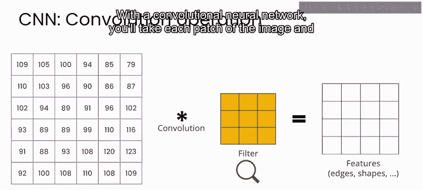

在CNN中，你会取图像的每个小块，并像这样在其上运行一个过滤器：


这个过滤器所做的就是进行计算。在你的训练过程的每一步，你都会重新运行这个卷积过程，并更新计算中使用的过滤器值，以识别出对识别物体重要的图像模式。

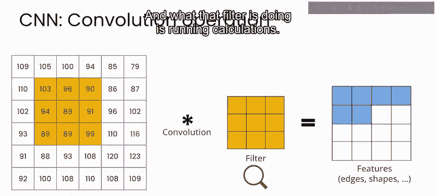

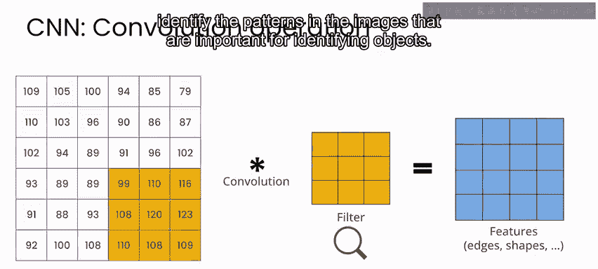

实际上，这意味着网络的早期层将学习非常基本的特征或模式，如边缘和角落。而在网络的更深层，过滤器将学会识别与你感兴趣的目标相关的特定特征。

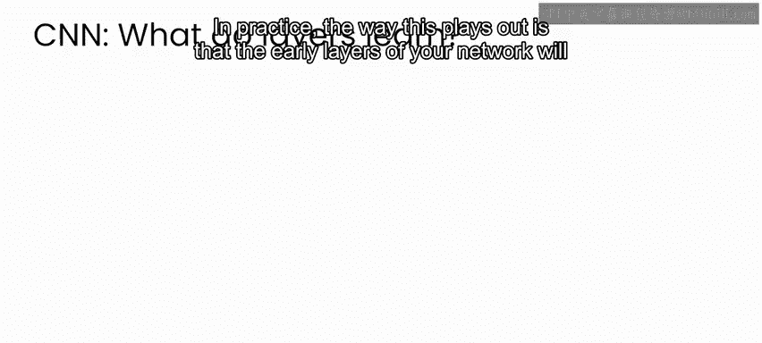

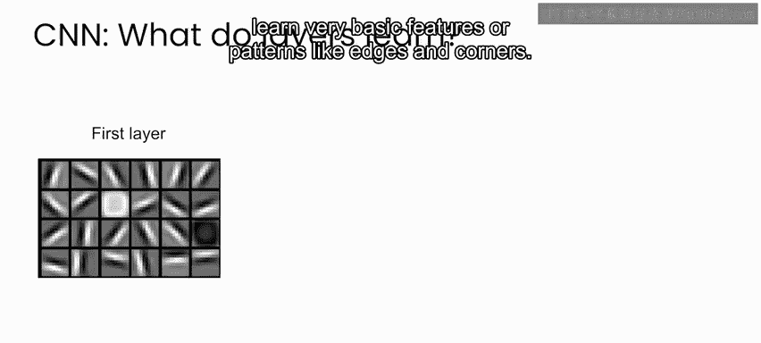


但仍然相当通用。在所示的例子中，感兴趣的目标是人脸。但在网络的中间层，你可以开始看到像眼睛、鼻子和嘴巴这样的特征，这些特征对于任何人脸检测模型都是通用的。

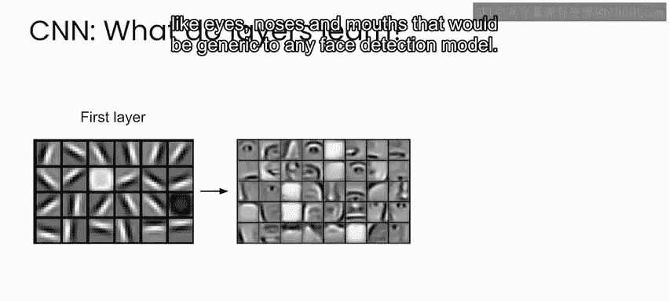


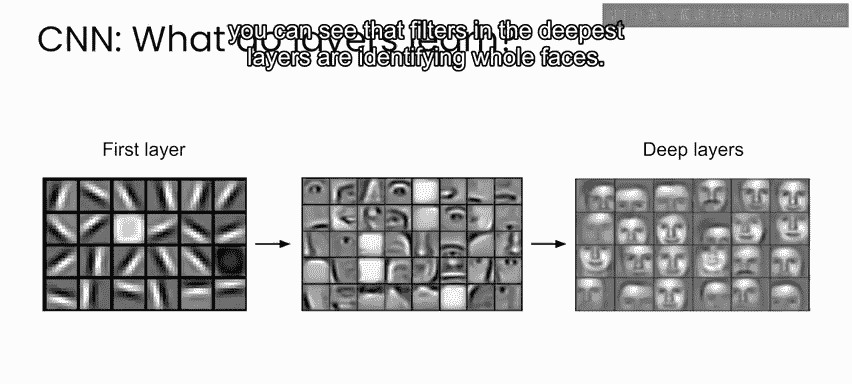

最后，在网络的最深层，你的模型学会识别与你感兴趣的目标相关的特定特征。例如在这里，你可以看到最深层的过滤器正在识别完整的人脸。


因此，在检测特定类型动物的情况下，你可以想象网络早期层的情况可能非常相似，只是识别边缘和角落等。然后在中间层，可能会出现更像动物的眼睛、耳朵、嘴巴，以及角、尾巴、腿等特征。最后，在最后一层，你将开始看到观察整个动物的过滤器，并且这些过滤器看起来是针对网络所训练的动物类型而特定的。

## 应用：动物分类模型 🦒

在下一个实验中，你将使用一个名为**神经架构搜索网络**的模型，简称NasNet。这是目前最先进的模型之一，但这个领域发展非常迅速。因此，当你观看此视频时，可能已有其他最先进的模型。不过，你在此课程中获得的直觉将适用于你使用的任何计算机视觉模型。

你将使用的模型已经在包含各种物体的数百万张图像上进行了训练。因此，它已经学会了如何识别许多物体。

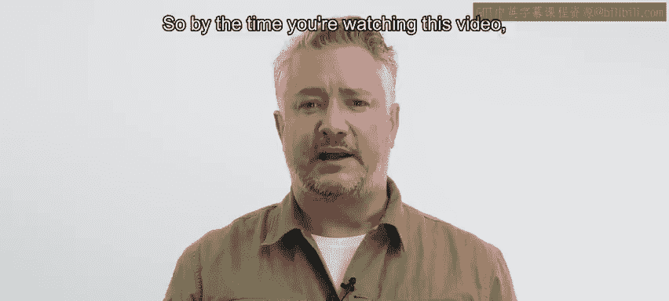

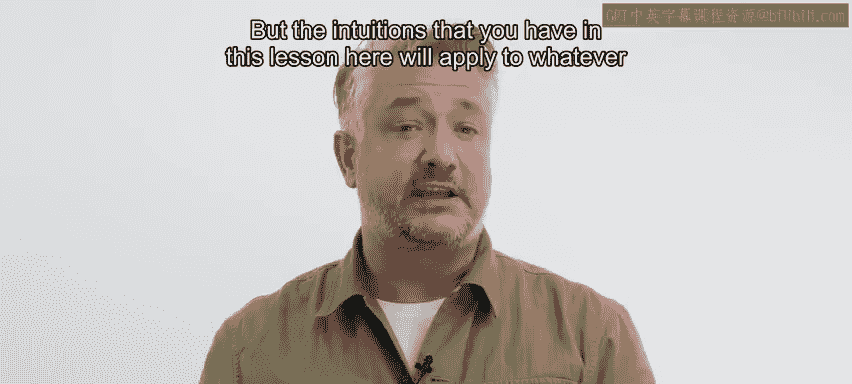


基于广泛的特征，它可能无法直接识别出羚羊或狷羚。但你会发现，只需进行少量训练，它就能快速学会区分羚羊和狷羚，或者区分捻角羚和弯角羚，这毫无困难。这非常令人印象深刻，因为我（以及大多数人）都无法区分这些动物中的大多数。这也告诉你，这类任务或许能够超越人类的识别能力。

---

本节课中，我们一起学习了迁移学习与微调的核心思想。我们探讨了为何可以利用预训练模型的知识来加速新任务的学习，了解了卷积神经网络如何处理图像，并看到了模型不同层次学习特征的抽象过程。在下一节视频中，我们将动手实践，使用预训练的NasNet模型进行动物分类的迁移学习。