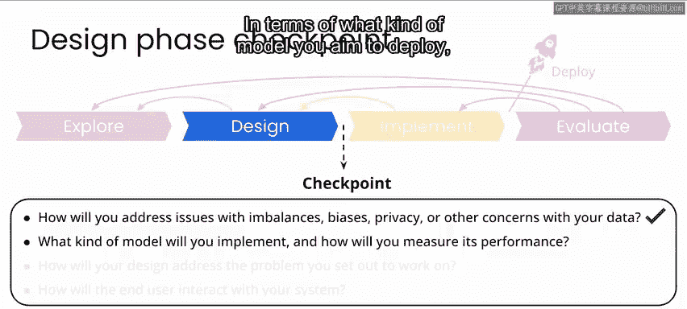

# 077：吴恩达《AI for Good专业课程》 P77 - 生物多样性项目设计阶段检查点 🧐

在本节课中，我们将回顾并总结生物多样性监测项目的设计阶段。通过前两个实验，我们已经构建了一个图像处理流程。现在，我们需要系统地审视整个设计，确保其具备进入实施阶段的条件。

上一节我们完成了动物分类模型的初步构建，本节中我们来看看如何评估设计的完整性，并准备进入实施阶段。

## 项目概述与当前进展

在之前的两个实验中，你使用了预训练的神经网络模型，构建了一个图像处理流程。该流程现在可用于对相机陷阱图像中的动物进行分类。

目前，你的模型远非完美。在真实世界实施该项目时，你很可能需要在设计阶段投入更多时间，例如收集更多带标签的数据，或调整方法以提升模型性能。然而，就本项目目的而言，你已经拥有了一个具备所有功能部件的设计。

现在，是时候通过回答以下问题来检查你是否具备进入实施阶段所需的一切。

## 设计阶段关键问题检查

以下是评估设计是否完备需要回答的几个核心问题。

### 1. 如何处理数据相关问题？

数据相关问题包括不平衡性、偏见、隐私等。

对于这个动物分类项目，你已识别出数据存在不平衡问题。这体现在两方面：一是某些动物的图片数量很多，而其他动物的图片相对较少；二是不同相机点位之间的动物分布差异很大。

在你的设计中，你通过**数据增强**部分解决了这个问题，尽管为代表性不足的类别收集更多带标签数据也会有所帮助。

关于隐私问题，你意识到在一个真实的相机陷阱项目中，很可能会拍摄到人和车辆的照片。在你的数据处理流程中，你需要将这些图像视为**机密个人信息**，并尽快删除，而不是存储或发布它们。

此外，从“不造成伤害”的角度出发，我们之前识别出的风险是：防止你的项目结果被偷猎者用于定位动物。事实上，在过去处理类似用例时，这是我们不更广泛分享数据的主要原因。

除此之外，关于偏见或隐私问题，你应继续留意可能对社区产生影响的其他任何潜在问题。

### 2. 将部署何种模型？如何衡量其性能？

你计划部署的模型类型如下：

首先，你使用了流行的 **MegaDetector** 预训练模型来识别图像中动物出现的位置。

然后，你对一个预训练的 **ResNet** 模型进行了**微调**，使其能够对 MegaDetector 识别出的动物进行分类。

你的模型在测试数据集上表现出合理的准确度。你探索了**混淆矩阵**以及单张图像，以了解模型在哪些地方表现良好，在哪些地方表现不佳。为了提升模型性能，你很可能需要收集更多的训练数据。

### 3. 你的设计如何解决预设问题？

你着手解决的问题是：研究人员和保护生物学家需要关于卡拉国家公园内各点位每日动物出现数量的信息，以监测生物多样性和动物种群趋势，从而为制定保护和维护公园生态系统的政策提供依据。

考虑到通过更多训练数据可能获得更好结果，你的设计将能够通过**自动分类每日数百或数千张图像**并在报告中提供结果来解决这个问题。

### 4. 最终用户将如何与你的系统交互？

在本案例中，最终用户很可能是研究人员或公园工作人员，他们需要定期获取公园内动物出现情况的更新，并且可能也希望直接查看图像数据，以了解动物是如何被识别的或其他细节。

在你目前的设计中，你已经研究了多种图像显示方式，例如叠加边界框以展示图像如何被裁剪用于分类，以及用各种指标（如**置信度**和**准确度**）来展示图像分类结果的图表。这些都可能是有趣的可视化方式，对你的用户也很有价值。

在项目的下一部分，你将探索如何将所有功能整合到一个简单的用户界面中。

## 总结与过渡

本节课中我们一起学习了如何对生物多样性监测项目的设计阶段进行系统性检查。我们审视了数据处理、模型选择、问题解决和用户交互等关键方面，确保设计具备实施的基础。

至此，本项目的设计阶段就结束了。在实施阶段，你将整合完整的图像处理流程，使其能够从输入图像开始，快速获得其中出现的任何动物的分类结果。