# 078：吴恩达《AI for Good专业课程》 P78 🧩 生物多样性项目实施阶段

在本节课中，我们将学习如何将图像处理流程的各个组件整合在一起，构建一个可用于从相机陷阱数据中自动检测动物的完整系统。我们将进入项目的实施阶段，专注于将模型投入生产、开发用户体验并与最终用户测试系统。

---

上一节我们介绍了模型的设计与调优，本节中我们来看看如何将它们整合成一个可运行的流程。

首先，你需要导入所有必需的Python包，并设置好使用模型和数据的环境。

以下是运行环境设置所需的步骤：

*   运行第一个代码单元以导入所有必需的Python包。
*   运行下一个代码单元以准备一些在运行模型和显示图像时将用到的元数据。

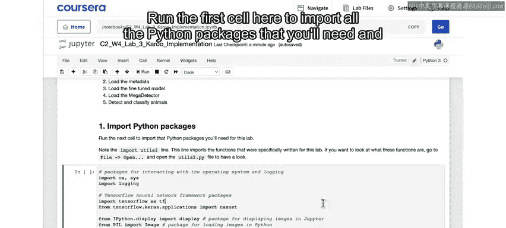

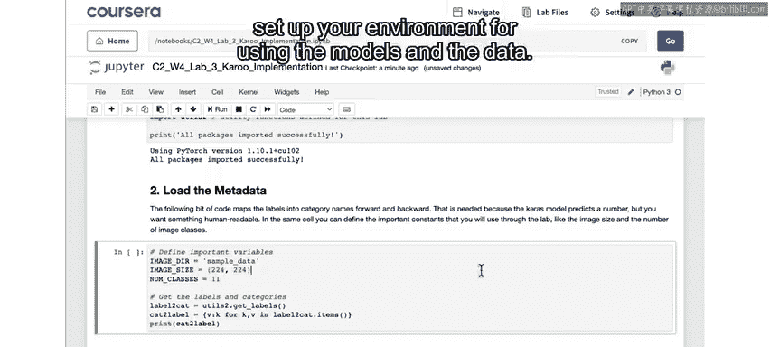

环境准备就绪后，接下来我们将加载用于检测动物的模型。

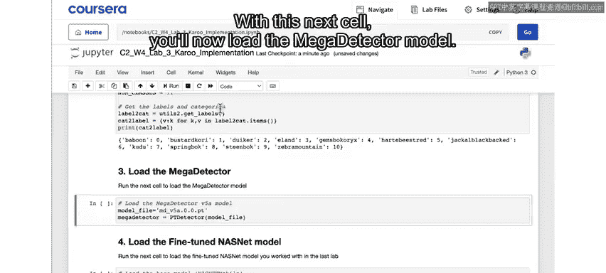

以下是加载核心模型的步骤：

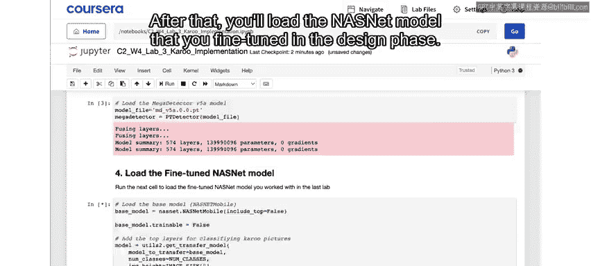

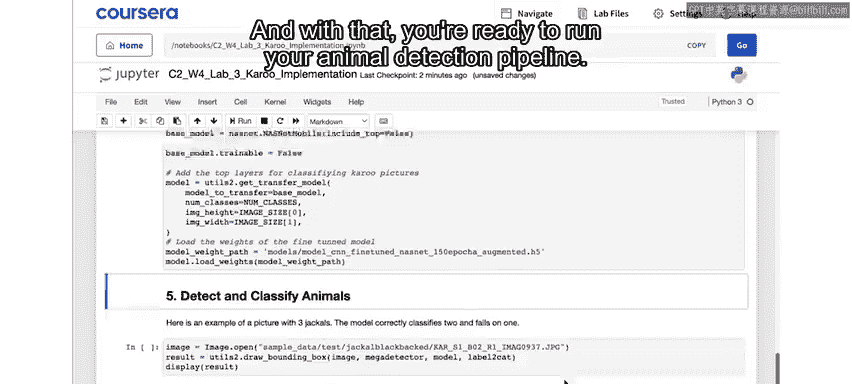

*   运行此代码单元以加载Mega Detector模型，该模型用于在图像中识别并框出动物。
*   随后，加载你在设计阶段微调好的NASNet模型，该模型用于对检测到的动物进行分类。

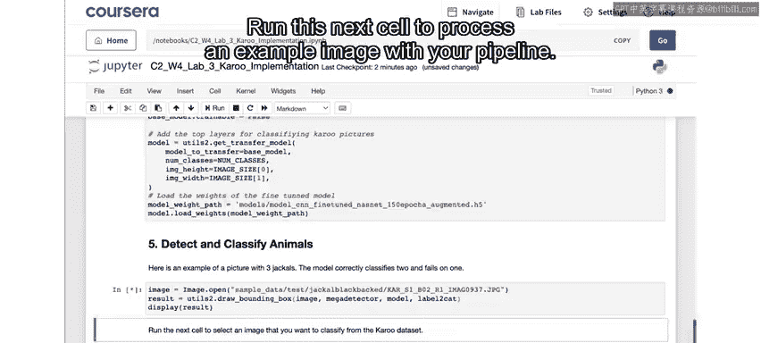

现在，你已经准备好运行完整的动物检测流程了。

让我们通过一个示例图像来测试整个流程。

以下是测试流程的步骤：

*   运行下一个代码单元，使用你的流程处理一张示例图像。
*   你将看到图像中包含三只黑背胡狼，其中一只似乎在地上打滚。在每个检测框上方，会显示模型预测的前三个类别及其对应的置信度，这与你在设计阶段实验室中看到的类似。

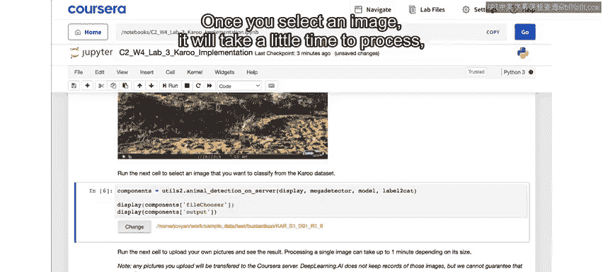

为了更灵活地测试，你可以从数据集中选择任意图像进行处理。

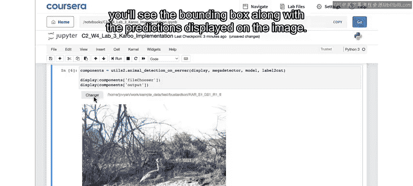

以下是交互式测试的步骤：

*   运行此代码单元，你将能够从数据集中选择任何图像并通过流程运行它。
*   点击选择按钮后，你可以进入测试或训练文件夹并选择一张图像。
*   选择图像后，系统需要一些时间进行处理。如果检测到动物，你将在图像上看到边界框以及显示的预测结果。

在实际应用中，相机陷阱每次被触发时都会上传新图像。为了模拟这一过程，你可以在此代码单元中上传自己的图像进行测试。

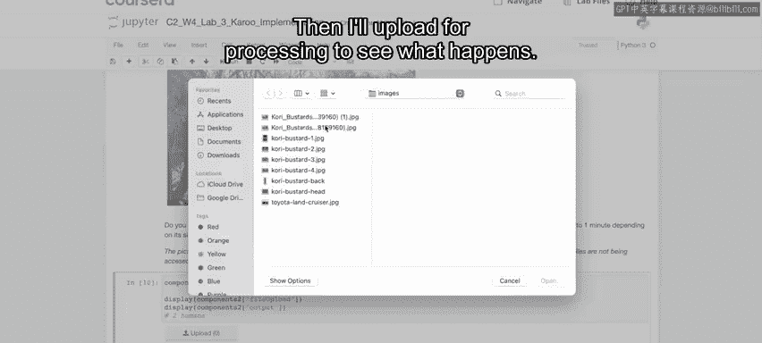

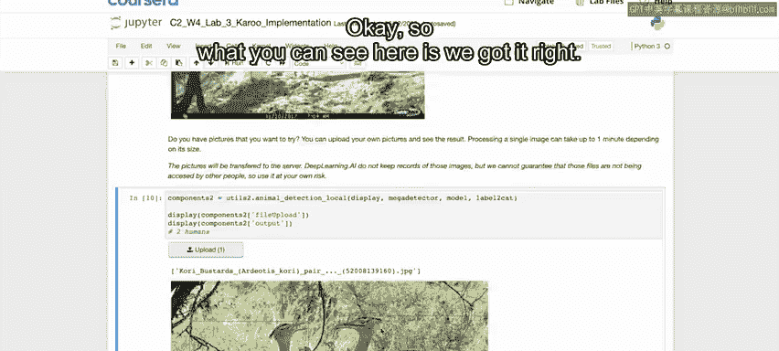

例如，你可以上传一些鸟类图片，系统会尝试识别它们。如果图片是创作共享许可的，你可以下载到本地然后上传进行处理，以观察系统的表现。

此外，我们还需要关注系统对潜在敏感图像（如人物或车辆）的处理能力。

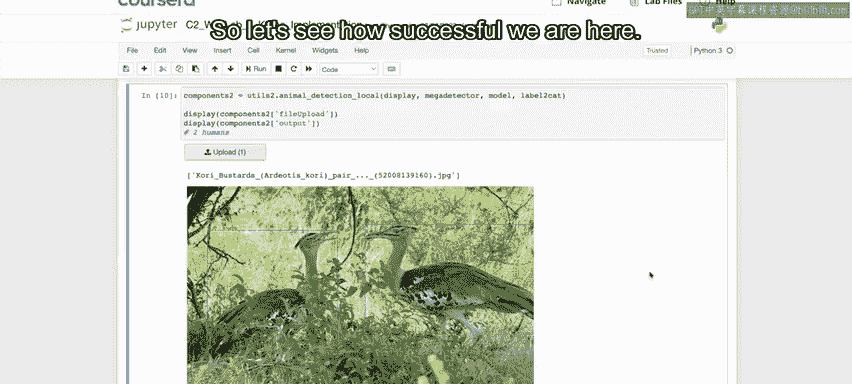

以下是测试敏感图像识别的步骤：

*   Mega Detector模型能够识别这些敏感类别。
*   我们可以找一张车辆的图片，确保它是创作共享许可的，下载到本地后上传给系统处理。
*   你会看到系统正确地识别出这是一辆车辆。

至此，本项目的实施阶段就完成了。当然，要实际部署这样一个系统，还需要做更多工作，例如实现图像的自动上传、分类、编目、生成报告，并确保敏感图像不会被不当处理或泄露。

但一个用于自动动物检测的图像处理流程的关键要素都已齐备。

本节课中我们一起学习了如何整合图像处理流程的各个组件，构建了一个从相机陷阱数据中自动检测动物的原型系统。我们实践了环境设置、模型加载、流程测试以及对敏感内容的识别，为项目的实际部署奠定了基础。