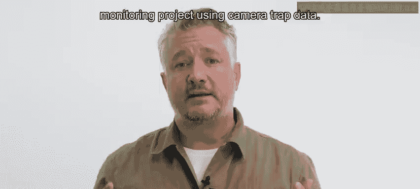
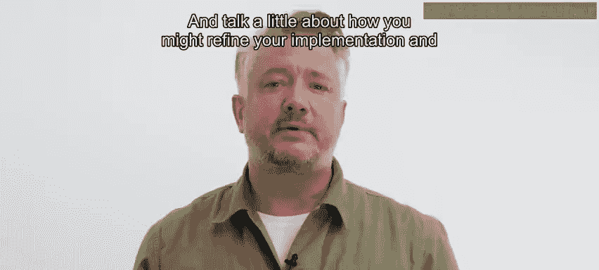
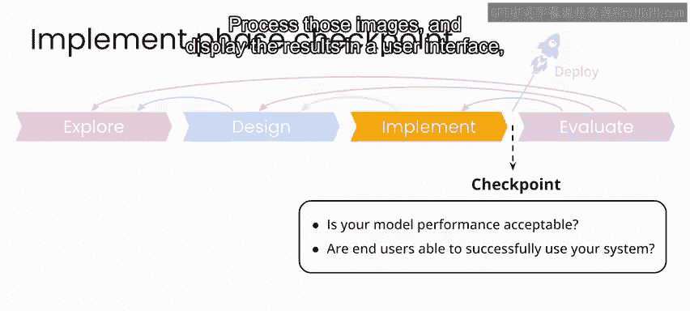
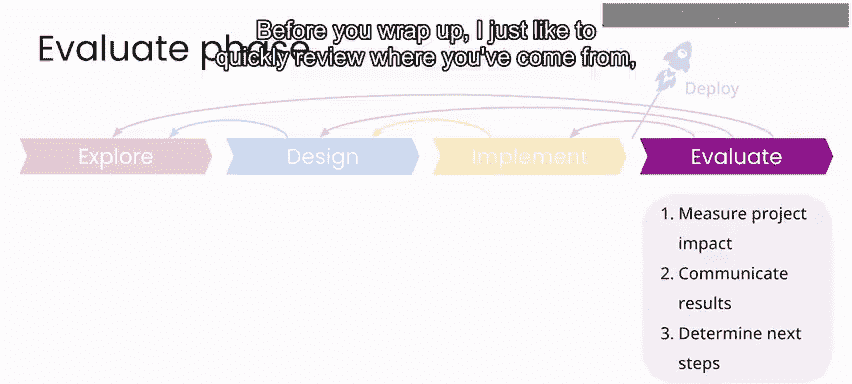
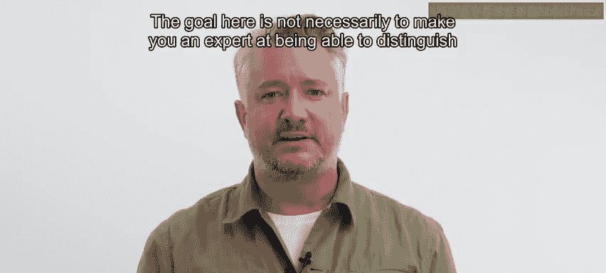
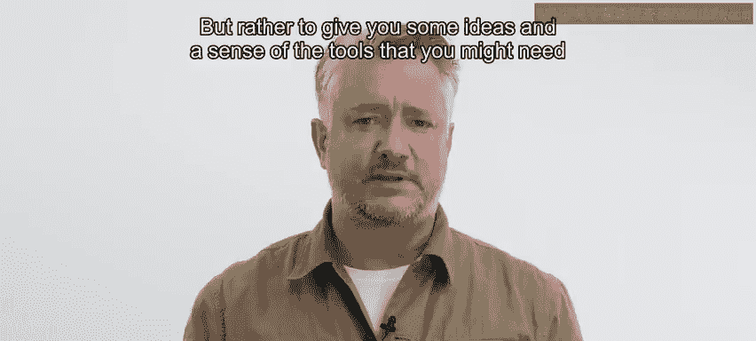
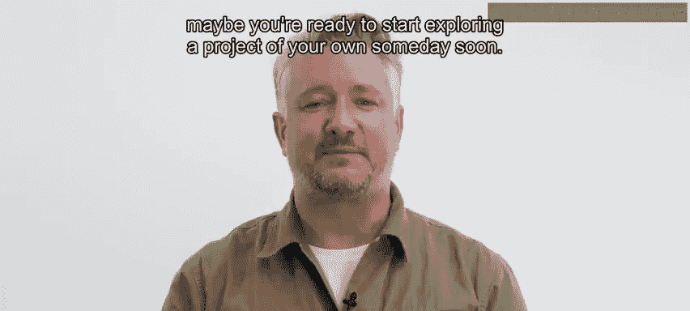

# 079：生物多样性项目总结 🌿

在本节课中，我们将回顾并总结之前几节实验课中构建的生物多样性监测项目。我们将梳理整个图像处理流程的关键组成部分，讨论如何评估与改进系统，并展望项目在现实世界中的应用与潜在发展方向。

---

## 项目概述

在过去的几节实验课中，我们共同构建了一个图像处理流程。该流程可以作为一个自动动物检测工具，用于生物多样性监测。当然，要在现实世界中实施这样的项目，需要考虑更多细节，项目的每个阶段也会更加复杂。

但你现在已经了解了所有关键组成部分，包括如何构建一个**最先进的神经网络模型**。原则上，你可以基于此，利用相机陷阱数据进一步开发成任何生物多样性监测项目。

---

## 实施阶段回顾与评估

上一节我们介绍了项目的整体流程，本节中我们来看看如何评估和改进我们的实现。

在实施阶段结束时，你需要能肯定地回答以下两个问题：
1.  你的模型性能可以接受吗？
2.  最终用户能否成功与你的系统交互？

目前，你的模型性能尚可，但如果能获得更多训练数据，性能很可能得到显著提升。你构建的原型用户界面允许用户浏览数据库中的现有图像，或上传自己的图像进行处理。

如果你有软件工程经验或与相关团队合作，那么你可能已经准备好部署你的系统。通过进一步迭代，你可以将模型的准确率提升到对最终用户更有用的水平。

与课程中的其他项目类似，部署步骤包含许多我们在此不涉及的技术挑战。但原则上，你可以应用这样一个程序来接收来自相机陷阱的自动图像上传、处理这些图像、在用户界面中显示结果，并生成结果摘要报告。

---

## 项目影响评估

对于一个这样的项目，在评估阶段，你可以从以下几个方面衡量其影响：
*   为保护生物学领域的研究人员提供的价值。
*   能够提供给政策制定者的信息。
*   从长期来看，你的项目在多大程度上帮助引导必要资源用于自然生态系统的保护和恢复。

在结束之前，让我们快速回顾一下这个项目从开始到结束的整个过程。

---

## 项目全流程梳理

### 探索阶段

在探索阶段，除了与利益相关者沟通并定义你想要解决的问题外，你还需要一个带标签的图像数据集才能开始本项目。

本项目使用的带标签数据集来自 **Snapshot Serengeti** 项目，这些数据是在 **Zooniverse** 平台上借助公民科学家的帮助完成标注的。虽然能够从他人已标注的数据开始很好，但你也看到了，通过利用**预训练模型**，你能够从一个相对较小的带标签图像集开始，构建出一个可工作的动物检测流程。

原则上，如果你想明天启动自己的相机陷阱项目，收集和标注类似规模项目的数据并不会花费太长时间。

### 现实挑战与改进思路

Snapshot Serengeti 数据带来了一些有趣的挑战，例如在标注图像中，动物并不总是容易被识别。

在现实世界的项目实现中，你可能会考虑开发一个处理**图像序列**的系统。这样，即使在某张特定图像中你只看到了一只角或一条尾巴，你的分类置信度也能更加稳健。

处理图像序列的另一个合理原因是，你的目标是计数动物。例如，如果有一只狒狒在视野范围内来回走动，你可能会多次计数它，而仔细检查图像序列可能会发现这只是同一只动物被反复拍摄。

说到这一点，如果你真的想认真统计个体动物，你可能会尝试构建一个动物识别流程，类似于人类的**人脸识别系统**。这样你可以区分个体动物，从而尝试对种群中的个体进行计数和追踪，这样你就能知道同一只狒狒是否在不同时间多次经过你的相机。

但这显然超出了本项目的范围。实际上，即使你不考虑追踪图像序列或识别个体动物，仅仅通过收集更多训练数据，你就能提升模型性能。然后通过统计方法，了解公园内动物种群和生物多样性的普遍情况。

本质上，你可以平滑处理同一动物的多次计数。这对于研究人员和政策制定者可能很有价值。

---

## 总结与展望

本节课中，我们一起学习了生物多样性监测项目的完整构建与评估流程。希望你觉得这个项目有趣、鼓舞人心且充满乐趣。就像本课程中的其他项目一样，这里的目标不一定是让你成为能区分角马和红羚的专家，而是给你一些思路，并让你了解如果你要着手处理这样一个现实项目，可能需要哪些工具。

希望你的脑海中已经开始构思，也许你已经准备好不久后开始探索你自己的项目了。

---

## 项目聚焦：气候变化与AI

在本周课程结束前，我想再与你分享一个项目聚焦。

**Priya Donti** 是 **Climate Change AI** 的联合创始人兼董事，也是麻省理工学院的准教授。她将简要介绍她在 Climate Change AI 方面的工作，以及你如何能参与到感兴趣的气候变化工作中。