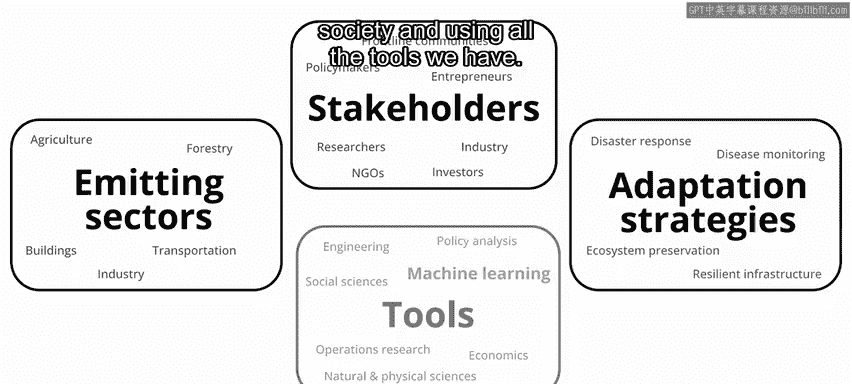
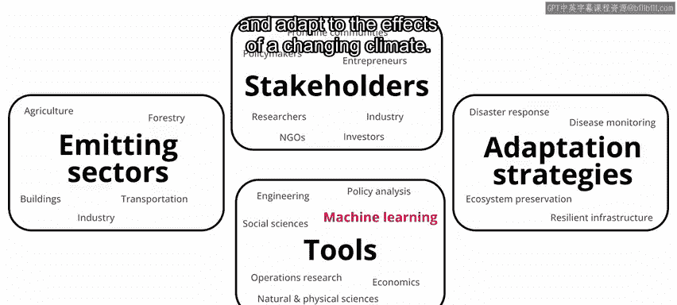
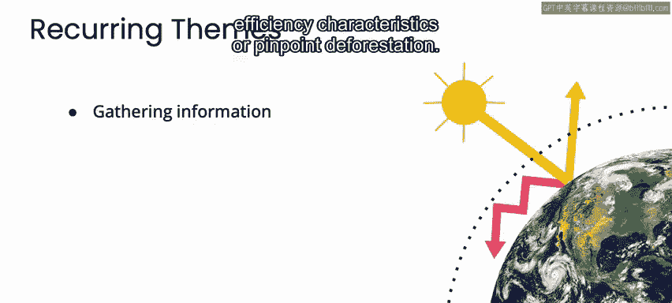
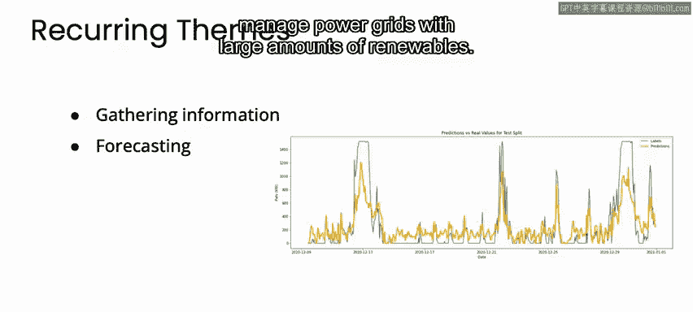
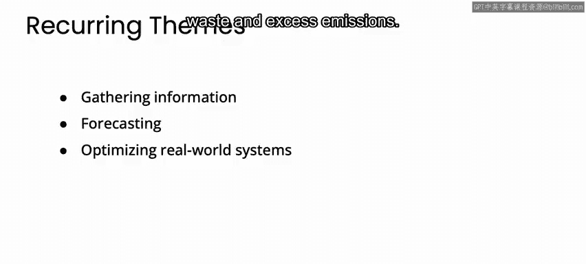
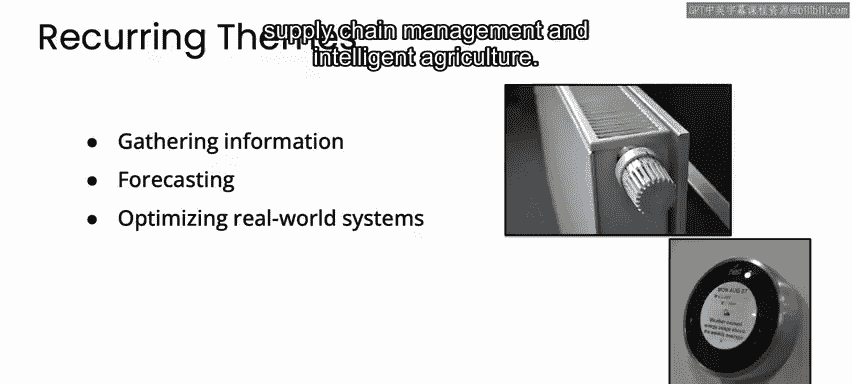
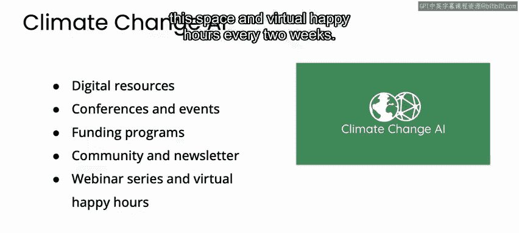
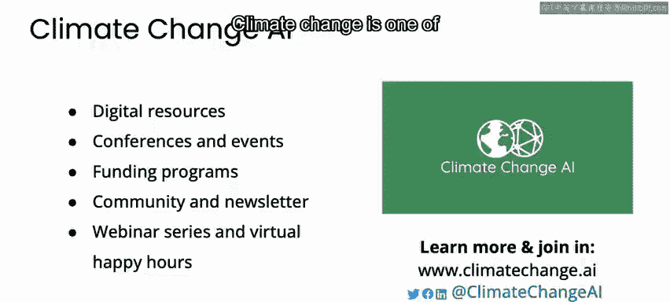

# 080：机器学习应对气候变化 🌍🤖

## 概述

在本节课中，我们将学习机器学习如何应用于应对气候变化这一全球性挑战。课程将介绍机器学习在气候变化领域的几个核心应用主题，并探讨如何开始参与这一重要工作。

---

## 自我介绍与背景

我叫普里亚·多蒂，是卡内基梅隆大学的博士研究生。

我的研究工作专注于开发机器学习方法，以优化整合了大量可再生能源的电网。

我也是“气候变化人工智能”组织的联合创始人兼主席。

该组织旨在通过教育、资助和社区建设，促进气候变化与机器学习领域产生有影响力的工作。

---

## 机器学习在气候变化中的作用

我想退一步，对这个领域进行一个广泛的概述，并谈谈你如何参与其中。

为了应对气候变化，我们需要社会各界的行动，并利用我们掌握的所有工具。这包括机器学习。

机器学习可以通过支持减少温室气体排放和适应气候变化影响的策略，在气候行动中发挥关键作用。

---

## 应用领域概览

认识到这一点后，我和一些同事共同撰写了一篇名为《用机器学习应对气候变化》的论文，详细介绍了该领域的数十个机会。

这些机会涵盖能源、交通、农业、灾害响应等多个领域。

虽然我们没有时间涵盖所有这些应用，但我强烈建议你查阅这篇论文以了解更多信息。

---

## 核心应用主题

我想重点介绍贯穿所有这些应用的几个关键主题。

### 主题一：信息收集

在许多情况下，获取额外的数据有助于为气候行动提供信息。

例如，准确了解温室气体排放的时间和地点，可以使政策制定者更有效地监管这些排放。

机器学习可以通过分析大型数据集中的模式，为其中一些信息提供估算。

以下是机器学习在信息收集方面的几个应用实例：

*   机器学习可应用于卫星图像，以检测全球温室气体排放或甲烷泄漏。
*   机器学习可用于收集有关建筑能效特征的信息。
*   机器学习可用于精确定位森林砍伐区域。

### 主题二：预测

预见性在许多气候变化情境中至关重要。

例如，太阳能和风能的发电量会随天气变化，提前获得准确的发电量预测可以帮助电网运营商管理含有大量可再生能源的电网。

在适应气候变化的背景下，提前预测气候引发的干旱、洪水或饥荒同样有用，以便为农民或疏散规划者提供关键预警。

在这些以及许多其他情境中，机器学习可以利用传感器或物理模型等异构数据源来预测相关量。

### 主题三：优化现实世界系统

现实世界系统通常存在许多低效之处，导致浪费和过量排放。

例如，建筑物的供暖和制冷系统通常消耗比实际所需更多的能源。

通过动态考虑天气、人员占用模式和建筑物理特性，可以显著提高其效率。

另一个例子是，全球供应链庞大而复杂，通过智能地将货物捆绑运输，或自适应地调整货运时间表以适应中断或延误，可以节省大量资源。

机器学习可用于优化此类现实世界系统，应用领域包括供暖和制冷、供应链管理和智能农业。

不过，这里有一个重要的注意事项：提高系统效率通常会导致其使用量增加，从而可能抵消部分减排效益。

这被称为“反弹效应”。在这一领域进行应用时，应注意减少这些反弹效应。

### 主题四：加速科学实验

科学发现的过程往往很缓慢。

例如，据说托马斯·爱迪生尝试了数千种灯泡配置才找到一种可行的方案。

机器学习可以通过学习过去的实验来建议下一步尝试哪些实验，从而帮助加速科学发现的过程。

此类技术可用于以下应用：

*   设计更好的电池。
*   制造低碳合成燃料。
*   寻找最佳设备设置以指导太阳能电池板的制造。
*   设计更有效的二氧化碳吸附剂（基本上就像从大气中去除二氧化碳的海绵）。

---

## 重要考量与协作

虽然这些代表了机器学习在气候变化方面的许多有影响力的应用，但值得注意的是，机器学习并非万能灵药。

即使有用，它也只是一个更宏大拼图中的一块。

例如，虽然我之前描述了机器学习可以提供太阳能和风能预测，但为了产生影响力，这些预测最终需要被使用。

例如，将其整合到现有的电力系统优化模型中，或与鼓励使用低碳电力的政策激励措施相结合。

气候变化本质上也是一个跨学科问题，涉及多个领域。

因此，与来自这些背景的利益相关者进行协作和共同开发，是开展有影响力工作的关键。

---

## 如何开始参与

你如何找到想要解决的具体问题？如何找到合适的合作者，或者如何开始？

首先，我鼓励你查看“气候变化人工智能”组织提供的一些资源，以便了解更多信息并与他人建立联系。

有很多方式可以参与其中。

以下是你可以参与的几种途径：

*   **数字资源**：我们有数字资源可供查阅，提供关于气候变化和机器学习领域的更多信息，包括我们的基础报告、摘要、教程、资源维基和博客。
*   **研讨会**：我们在主要的机器学习会议上举办研讨会，你可以在那里了解更多信息、结识他人，如果你有相关工作，也可以展示自己的成果。
*   **导师计划**：如果你是这个领域的新手，我们还有一个导师计划，你可以与专家导师配对，以帮助进一步发展你的工作。
*   **资助计划**：我们有针对有影响力研究的资助计划，你可以申请。
*   **社区参与**：我们还有各种方式让你持续参与，结识他人并了解更多关于整个领域的信息。例如，我们有一个在线社区讨论平台，你可以在那里提问、结识他人和参与讨论；一个社区目录，你可以在其中注册并发现其他人；以及一份每月通讯，介绍活动、读物和工作机会。
*   **线上活动**：我们还每月举办一次网络研讨会系列，邀请该领域的专家分享，并每两周举办一次虚拟社交聚会。

你可以访问我们的网站或在社交媒体上关注我们，以了解更多信息。

---

## 总结

气候变化是我们这个时代最严峻的挑战之一。

我希望你能加入我们，共同应对这一挑战。谢谢。

😊