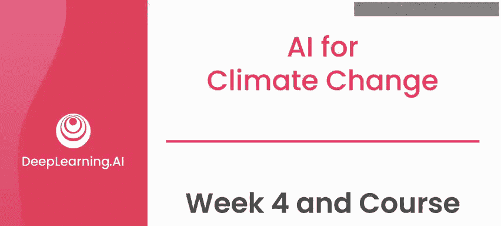
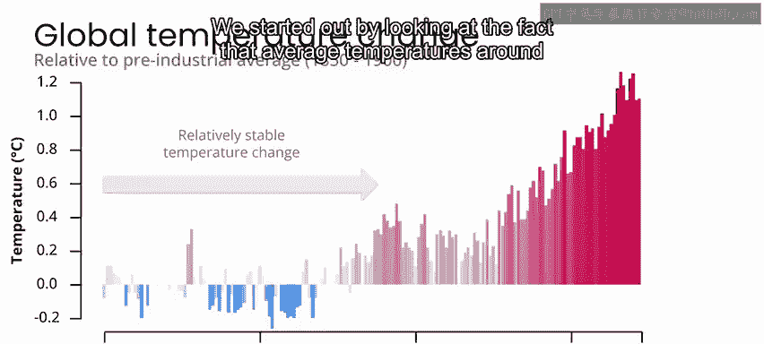
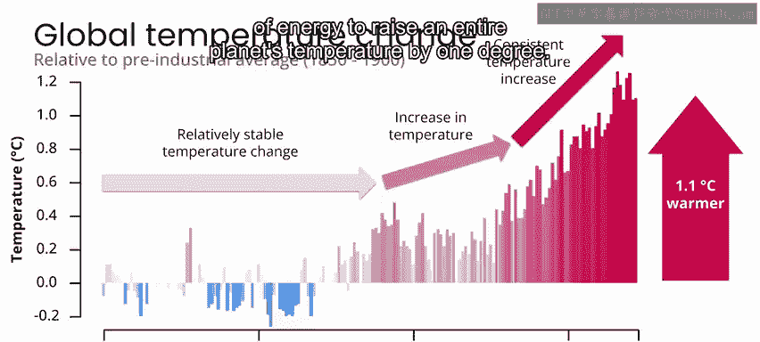
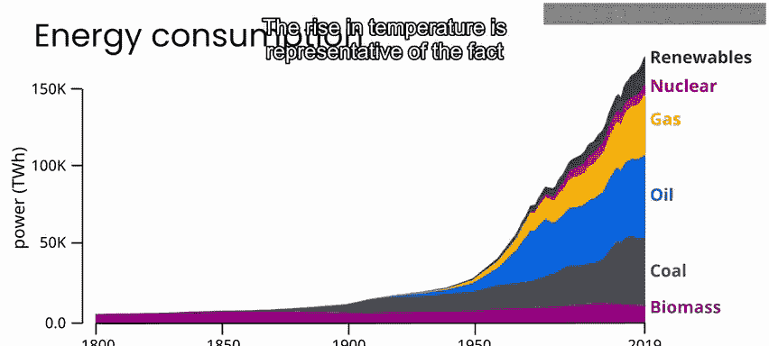
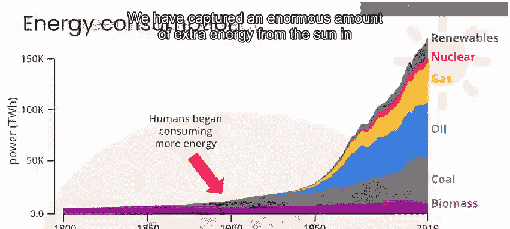
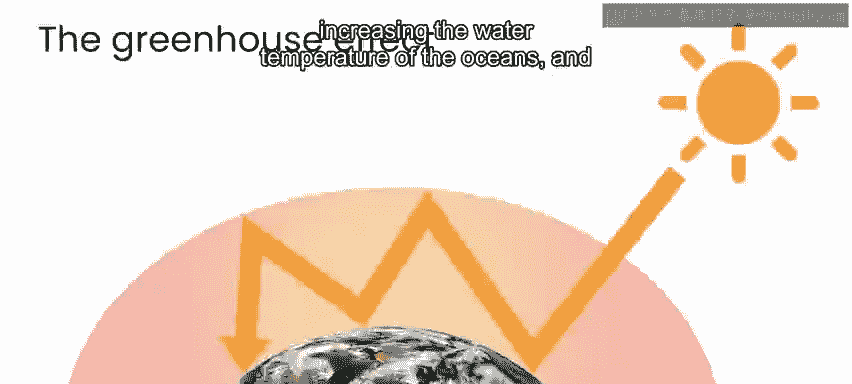
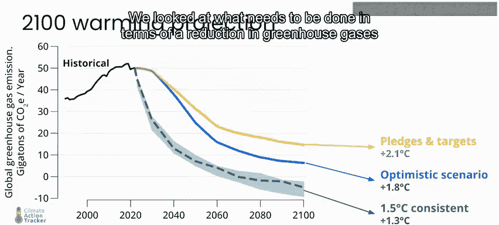
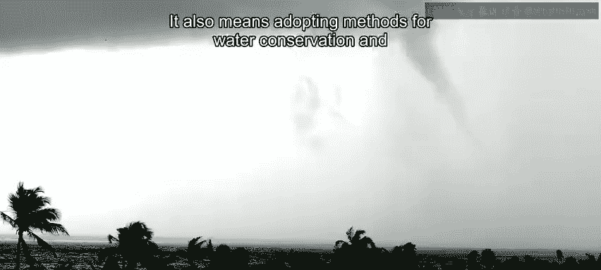

# 081：AI与气候变化 🌍 第4周与课程总结

在本节课中，我们将回顾整个课程的核心内容，总结人工智能在应对气候变化领域的关键应用，并展望未来的学习方向。

---

恭喜你完成这门关于人工智能与气候变化的课程。

我们首先审视了全球平均气温正在上升的事实。目前的气温已比100年前的平均水平高出超过1摄氏度。虽然1摄氏度听起来不多，但要使整个星球的温度升高一度，需要消耗巨大的能量。气温上升代表着一个事实：由于大气中温室气体增加，近几十年来我们从太阳捕获了巨量的额外能量。正是这些额外能量导致了更极端的天气事件、海洋水温升高，并加速了动植物物种的灭绝。

上一节我们介绍了气候变化的基本事实，本节中我们来看看应对气候变化需要采取的行动。

我们探讨了为实现将全球变暖限制在1.5摄氏度以内的目标，需要如何减少大气中的温室气体，以及未能实现这些目标可能带来的一些后果。

必要的温室气体减排将通过以下组合方式实现：
*   用更清洁的可再生替代能源（如风能和太阳能）取代化石燃料。
*   采取基于自然的解决方案，保护和恢复森林及其他自然生态系统。

在我们通过减少温室气体来缓解气候变化的同时，鉴于即使在最乐观的情况下其影响也不可避免，开发适应气候变化的方法同样重要。

适应气候变化意味着：
*   更好地准备应对极端天气和其他自然灾害。
*   采用节水方法和可持续农业，以增强对干旱和热浪的抵御能力。

---

在探讨了气候变化的挑战与应对策略后，我们来看看人工智能在其中扮演的角色。

人工智能可以在许多方面帮助旨在缓解和适应气候变化的项目。

在本课程中，你看到了人工智能如何被用于降低商业太阳能装置的影响，并使其发电输出更可预测。

你完成了一个项目，使风能成为比化石燃料更可行的替代能源。

你了解了人工智能如何用于天气预报，使应对极端天气的准备更加充分。

在本课程的最终项目中，你构建了一个示例，展示了人工智能如何用于监测生态系统的生物多样性。

---

我希望你从这门课程中获得的是：
*   一种紧迫感。
*   对参与缓解和适应气候变化项目的多种可能方式感到鼓舞。
*   认识到机器学习可以成为解决方案中强大的一部分。

凭借你在这里学到的知识，我鼓励你开始探索自己的项目。

我也邀请你加入本专业系列的下一门课程。在那里，我将深入探讨我的专业领域——人工智能在灾害管理中的应用。

期待在下一门课程中与你相见。

---

**本节课总结**

本节课中我们一起回顾了气候变化的核心挑战、减排与适应策略，并总结了人工智能在可再生能源优化、灾害预警和生态监测等关键领域的具体应用。课程旨在激发行动，并展示了技术作为解决方案一部分的潜力。