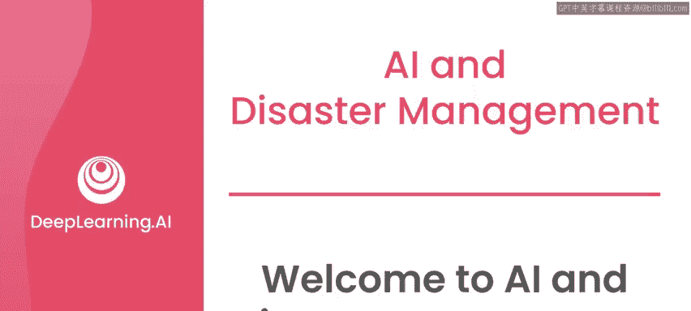
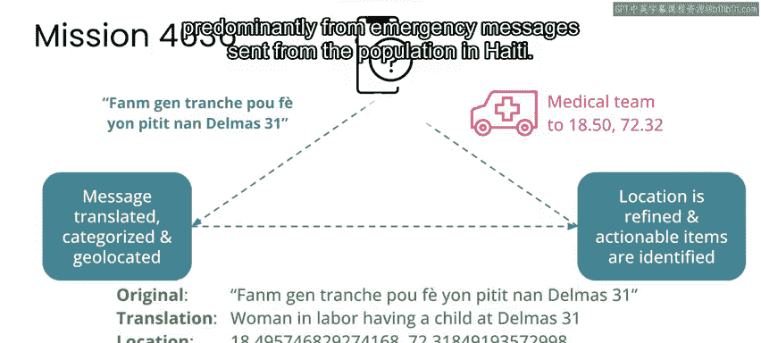
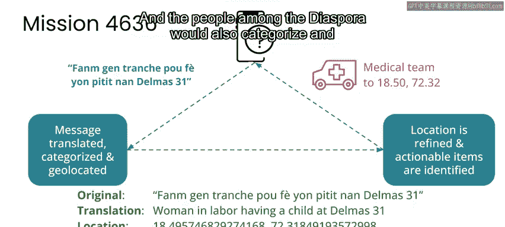

# 082：🤖 人工智能与灾害管理

在本课程中，我们将学习人工智能如何应用于灾害响应与管理。我们将通过具体案例，探讨AI技术如何在自然灾害发生后提供关键支持，并了解在应用技术时必须考虑的重要原则，如隐私保护。

---

欢迎来到“人工智能与灾害管理”，这是“AI for Good”专业系列的第三门课程。

在前两门课程中，我们学习了人工智能如何在公共卫生和气候变化这两个重大挑战中发挥作用。在这门专业系列的第三门也是最后一门课程中，我们将着眼于自然灾害的案例研究，探讨人工智能如何协助灾害响应和管理。

再次由罗伯特·蒙什担任本课程的讲师。除了在硅谷开发了许多人工智能产品外，罗伯特也是灾害响应领域的资深专家。在过去的几十年里，他参与了众多灾害响应和恢复工作。

罗伯特在进入硅谷之前，曾在联合国于塞拉利昂和利比里亚从事冲突后发展工作。移居硅谷后，他继续投身于灾害响应，例如在美国，他经营的公司曾在飓风“桑迪”登陆后立即为联邦应急管理局进行航空影像分析。他的工作还涉及2010年海地地震、同期巴基斯坦洪水，以及最近与多个组织合作应对新冠疫情。

罗伯特的工作表明，即使在他接触AI之前，他的技术专长也已经帮助了世界各地许多人更好地从悲剧中恢复。他最初学习AI时，并未想到它与灾害响应会有太多交集。但随着时间推移，AI变得无处不在，这意味着在人们因灾害而面临最大风险时，AI可以成为帮助他们自我恢复的解决方案的一部分。

---

上一节我们介绍了课程和讲师的背景，本节中我们来看看课程将涉及的核心项目与原则。

以下是本课程将深入探讨的两个主要项目：

1.  **卫星影像评估灾害损失**：第一个项目将展示如何使用卫星影像来评估飓风等灾害后的损失，并辅助恢复工作。其中将强调一个关键概念——**隐私保护**。卫星影像可能是非常敏感的数据，即使在追求快速响应的灾害场景中，也必须尊重隐私。例如，在飓风“桑迪”的响应中，所使用的航空影像分辨率足以识别单个房产。响应期结束后，数据仅与一个用于评估质量的组织共享，随后所有人便删除了数据，确保其未被公开或长期存储。
2.  **灾后文本信息分析**：第二个项目涉及理解灾害发生后发送的文本信息。以2010年海地地震为例，当时国际响应人员通用英语，而大多数海地人只说海地克里奥尔语。罗伯特组织了约2000名海外海地人进行实时翻译，并对信息进行分类和地理定位。本课程的实践部分将使用**隐含狄利克雷分布** 等机器学习方法，分析这些信息，理解灾后人群沟通话题随时间的变化。

---

在应用AI技术时，尤其是在公共卫生和灾害响应等关键情境下，我们必须遵循“不伤害”原则。我们的目标不是像学术论文那样追求算法净准确率的提升，而是寻求在确保没有人因此受到额外伤害的前提下产生积极影响。

---

本节课中，我们一起学习了“人工智能与灾害管理”课程的概述。我们了解到AI可以通过卫星影像分析和灾后通讯处理来辅助灾害响应，同时也必须高度重视数据隐私和“不伤害”伦理原则。接下来的视频将开始深入讲解这些重要的概念和案例。