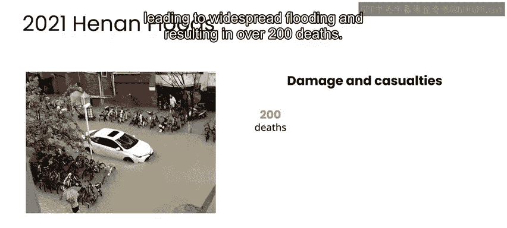
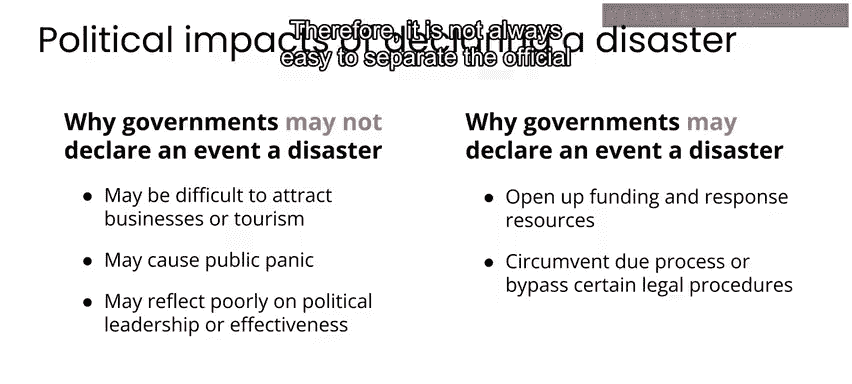

# 083：什么是灾害？🌪️

在本节课中，我们将要学习灾害的基本定义、不同类型以及灾害管理的核心概念。课程将重点探讨人工智能如何帮助我们在灾害的减缓、准备、响应和恢复阶段发挥作用。

---

灾害是指对人员、财产或环境造成广泛损害的事件或情况。本课程的重点是探讨人工智能如何帮助减缓灾害、进行灾害准备，以及在灾害发生后的响应和恢复工作。

首先，关于什么构成灾害，目前并没有一个被广泛认同的定义。但联合国减少灾害风险办公室将灾害定义为：对社区或社会功能的严重破坏，涉及广泛的人员、物质、经济或环境损失与影响。

---

## 灾害的实例：2021年河南洪灾

上一节我们介绍了灾害的抽象定义，本节中我们来看看一个具体的实例。

2021年7月，中国河南省经历了有记录以来最严重的洪灾之一。连续三天的强降雨迅速超出了该地区的排水系统承载能力，导致大面积洪水，造成超过200人死亡。

以下是此次洪灾造成的主要影响：

*   超过150万人流离失所。
*   造成约140亿美元的经济损失。
*   道路、桥梁等关键基础设施被毁，交通和通信网络中断，导致许多人被困于洪水中。
*   河南省作为中国主要的农业和制造业中心之一，此次洪灾还造成了重大的经济损失，并扰乱了全球供应链。

---

## 灾害的类型：自然与人为

灾害也可以是人为造成的，例如武装冲突的结果或工业事故（如核电站故障）。在某些情况下，灾害的成因实际上是两者结合或有些模糊。

例如，2018年11月8日，强风导致电线倒塌，引发了北加州最具破坏性的野火之一。气候变化加剧的极端高温和干旱条件，以及数十年的灭火努力，共同导致火势迅速失控。这场大火烧毁了超过600平方公里土地，摧毁了超过18000座建筑，并夺走了85人的生命。

在这种情况下，很难简单界定这究竟是一场自然灾害还是人为灾害。一方面，它始于大风，损害由野火造成；但另一方面，是电线引发了火灾，而人为造成的气候变化和数十年的灭火政策使得火势比原本可能的情况更为严重。

在本课程中，我们不会纠结于区分自然灾害和人为灾害，因为有时灾害的根本原因很难完全厘清。自然灾害甚至可能导致人为灾害，特别是通过政治不稳定和受灾社区流离失所人群的脆弱性。无论如何，在本课程中，我们将主要关注至少源于自然因素的灾害，即由风暴、洪水、地震、野火和干旱等情况造成的事件。

---

## 灾害管理的核心：风险管理

在灾害管理领域，你会经常听到人们谈论风险管理，这确实是灾害管理的核心。

例如，某个地区异常干燥的条件可能导致更高的野火风险。然而，野火本身并不一定是坏事。事实上，许多植物依赖野火来发芽。但当火灾对人员和财产造成损害时，其结果通常就被视为一场灾害。在这种情况下，风险管理可能意味着采取灭火活动以使火势远离建筑物，以及进行早期疏散以使人员远离危险。

同样，地震和火山喷发是自然现象，它们在陆地和海洋中定期发生，并存在影响人员和基础设施的风险。在许多情况下，它们发生在远离人口中心的地方，不会造成损害。然而，当这些事件发生在人口中心附近时，它们可能导致广泛的破坏和人员伤亡。通常，损害的程度更多地反映了事件发生前所采取的风险管理或风险降低措施，而非事件本身的严重性。

---

## 突发性灾害与缓发性灾害

灾害可以根据其发展速度进行分类。

以下是两种主要类型：

*   **突发性灾害**：指迅速或意外发生的灾害，如地震、海啸、洪水、火灾或飓风造成的损害。
*   **缓发性灾害**：指逐渐发展的危机或事件，通常持续数周、数月或数年，如干旱、饥荒和流行病。

---

## 灾害的官方认定与政治因素

一个事件是否被官方指定为灾害，可能取决于特定政府通过宣布灾害状态所能获得的利益或可能遭受的损失。在某些情况下，政府可能由于潜在的负面影响而不愿将某个事件归类为灾害。

例如，报告灾害可能使一个国家或地区更难吸引商业或旅游业，引发公众恐慌或社区动荡，或反映出政治领导力或效能的不足。反之亦然，在一个地区宣布官方灾害可以开启用于抗击灾害的资金和响应资源，并且更具争议的是，可以以效率为名规避正当程序，例如宣布戒严。

因此，将灾害的官方宣布与政治因素完全分开并不总是容易的。

---

## 总结与展望

无论灾害的性质如何，政府、应急管理机构、人道主义组织和受危机影响的人群都需要思考如何应对这种情况，不仅仅是在灾害发生后，还包括如何采取措施来准备和减轻灾害的影响。

本节课中我们一起学习了灾害的定义、实例、类型（自然/人为、突发/缓发），并了解了风险管理是灾害管理的核心，以及灾害认定中可能涉及的政治因素。在下一个视频中，我将带你了解灾害响应组织如何努力减少灾害的影响。