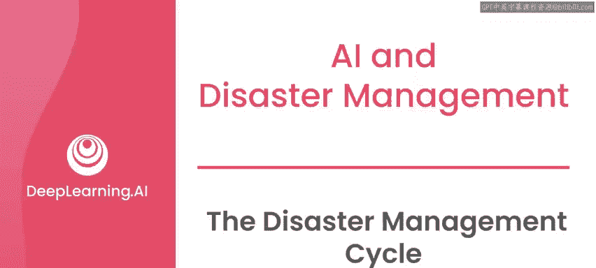
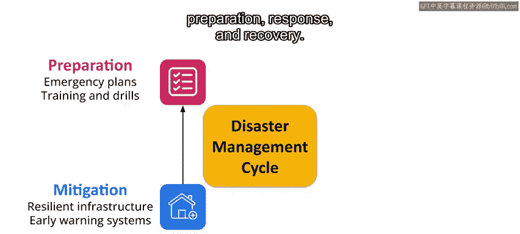
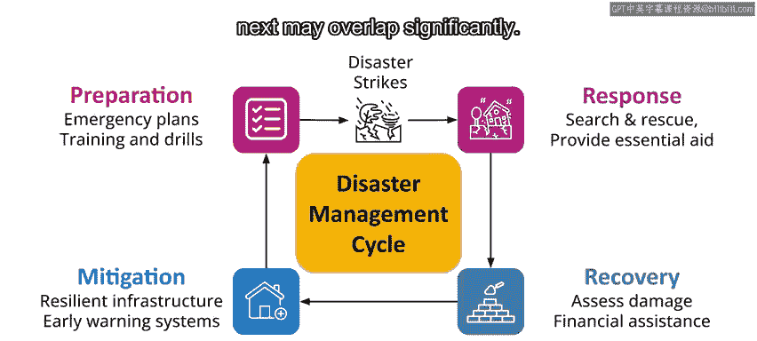
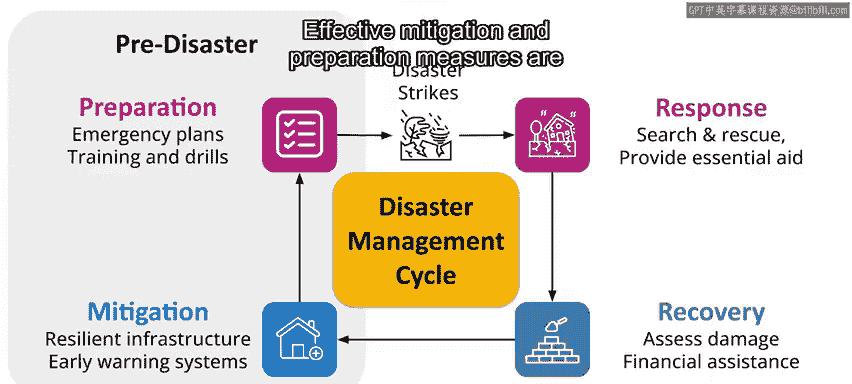
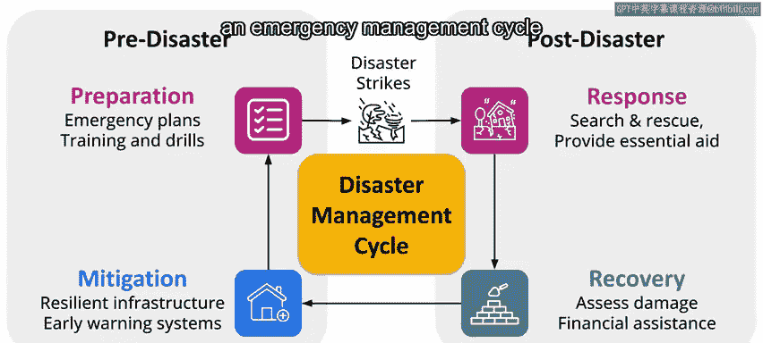
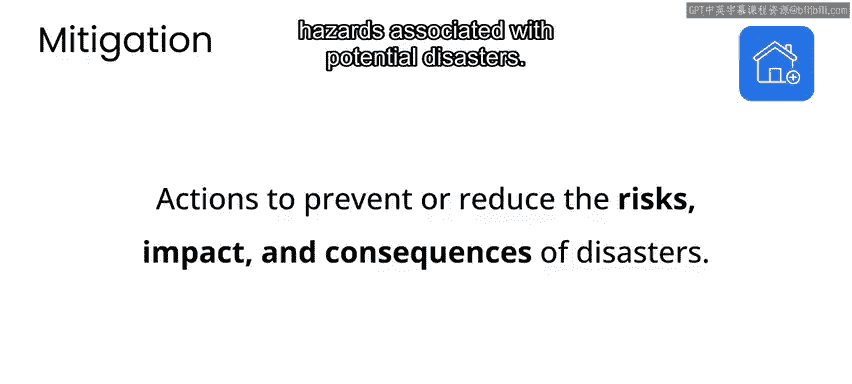
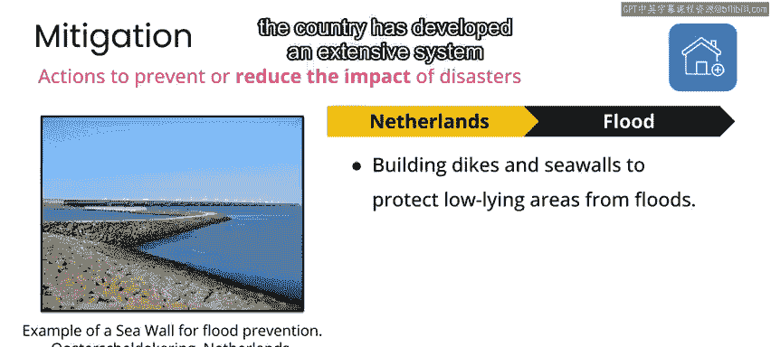
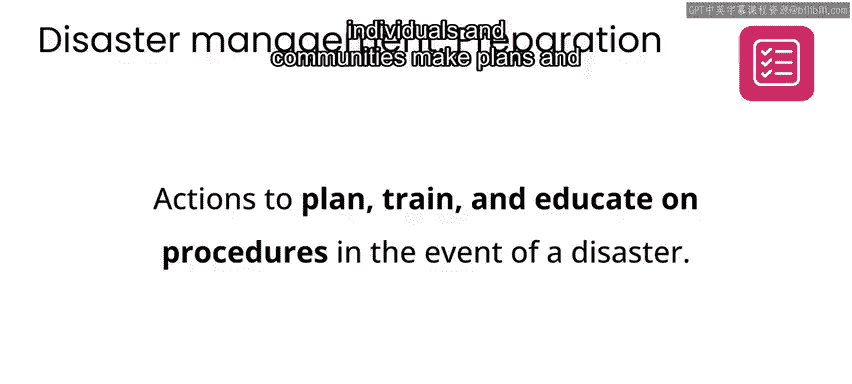
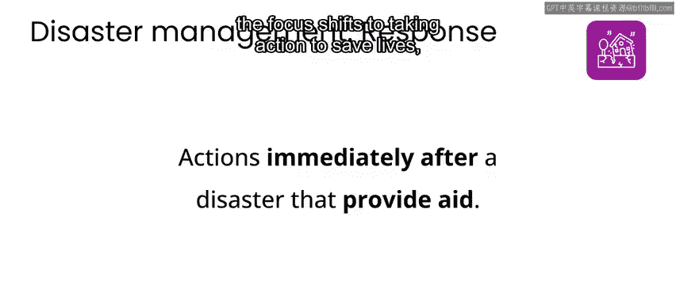
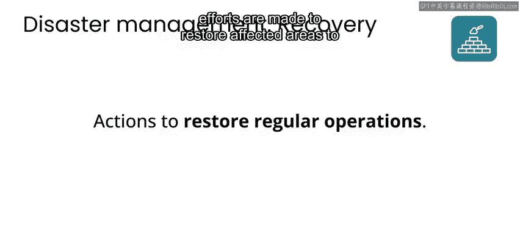

# 084：灾害管理周期 🔄

在本节课中，我们将学习灾害管理的核心框架——灾害管理周期。我们将了解其四个阶段，并探讨每个阶段的目标与行动，以及数据与人工智能在其中可能扮演的角色。

灾害会对受灾社区产生长期影响。这种影响可能包括基础设施的重大损坏，以及经济和社会的中断。一些社区可能需要数月、数年甚至数十年才能从灾害中恢复，在某些情况下，受灾社区可能永远无法完全恢复。

通常，受灾社区的恢复程度与灾害发生前后的**风险管理、响应和恢复工作**密切相关。这正是我们接下来要讨论的内容。

## 灾害管理周期的四个阶段

你可以将灾害管理视为由四个阶段组成：**减灾、准备、响应和恢复**。

这些阶段在某种意义上可以被看作是一个循环的一部分，每个阶段都导向下一个阶段。这个循环没有必然的起点或终点，且各阶段的工作可能存在显著的重叠。

有效的减灾和准备措施对于减少灾害对受灾社区的影响至关重要。在突发性灾害发生后，响应工作在紧随其后的数小时和数天内至关重要，而长期的恢复工作则有助于社区重建。

基于灾后吸取的经验教训，减灾和准备工作将持续进行，以减少未来事件的影响。

在本课程的背景下，需要指出的是，灾害刚发生后通常是向社区或灾害响应组织引入新技术的最糟糕时机。因此，人工智能与灾害响应的许多工作都集中在**准备和减灾阶段**。

这个灾害管理周期是许多组织用来规划和减少灾害影响的一个框架序列。你可能会看到不同组织发布的不同版本，它甚至可能被称为应急管理周期，并应用于广泛的场景。

根据特定灾害的性质和相关风险，这个周期中每个阶段的细节可能略有不同，但总体而言，每个阶段的目标在不同类型的灾害或紧急情况下通常是一致的。

接下来，我们来看看在灾害管理周期的每个阶段，针对不同风险和灾害所采取的一些具体行动示例。

## 各阶段行动示例

以下是每个阶段的具体行动示例。

### 减灾阶段

在减灾阶段，应急管理专业人员专注于采取行动，以减少或消除与潜在灾害相关的风险和危害。

例如，在荷兰，该国大部分地区处于或低于海平面，海洋本身因可能引发洪水而被视为一种风险。为了降低洪水风险，该国建立了广泛的堤坝系统。

### 准备阶段

在准备阶段，个人和社区会制定计划并为灾害发生时的响应做准备。

例如，在日本，建立了先进的地震和海啸预警系统，并开展了广泛的公众教育活动，以提高对自然灾害风险的认识。

### 响应阶段

在响应阶段，重点转向采取行动拯救生命、满足基本需求和管理灾害的直接后果。

例如，在菲律宾，1991年皮纳图博火山喷发期间，政府协调了对受灾地区的搜救工作，以帮助被困或受伤的人员。设立了临时避难所和救济中心提供援助，国际援助组织也提供了食品、其他物资和医疗护理。

### 恢复阶段

最后，在恢复阶段，努力恢复受灾地区至灾前状态，并帮助社区重建。

例如，在美国，2005年卡特里娜飓风过后，政府实施了一系列恢复计划。这包括为受影响企业和个人提供财政援助、重建受损基础设施（包括建筑物和堤坝）的计划，以及为流离失所者提供的住房援助计划。

## 数据与人工智能的作用

贯穿灾害管理周期所有阶段的一个共同挑战是，在大多数情况下，**数据驱动的决策**至关重要。虽然需要一定量的手动处理和分析，但手动处理大量数据可能耗时且容易出错。

这正是人工智能可以成为解决方案一部分的机会所在。

*   **在响应阶段**，需要快速分析和处理的数据包括卫星图像、气象传感器数据、文本和语音通信等。
*   **随着工作从响应转向恢复**，需要数据来为长期的物流规划和资源分配做出明智决策。
*   **在减灾阶段**，数据在许多预警系统中发挥着关键作用，包括预测和实时测量数据集。
*   **在准备阶段**，分析有关灾害原因和结果的历史数据有助于制定更稳健的应急响应计划。

如果成功实施，人工智能可以通过提供及时准确的信息、优化资源和物流，帮助减少灾害对受灾社区的影响，从而在灾害管理周期的所有阶段发挥重要作用。

正如你在之前课程的案例研究中看到的，需要注意的是，并非所有的灾害管理工作都能从人工智能中受益。如果数据在问题中扮演重要角色，那么可能值得考虑人工智能方法。但在实践中，人工智能可能不会提供附加价值，甚至可能分散对更直接解决方案的注意力，因此审视所有选项非常重要。

同样值得注意的是，许多人在灾害发生后立即感到有采取行动的动力。考虑到灾害的影响可能出现在媒体报道中，并且存在紧迫感，这是很自然的。然而，如果你希望参与救灾工作，响应阶段通常是最糟糕的起步时机，因为应急响应人员通常已经不堪重负，他们最迫切需要的是拥有现有专业技能的人员以及稳健的数据处理和决策系统的帮助。

相反，如果你想要提供帮助，通常更好的做法是参与长期的恢复工作，或者致力于灾害的减灾和准备工作。一旦你通过其他阶段的工作明确了需要解决的问题，那么你在响应阶段的努力才更可能产生影响力。

## 总结

本节课中，我们一起学习了灾害管理周期的四个阶段：**减灾、准备、响应和恢复**。我们了解了这是一个循环的、各阶段可能重叠的框架，并通过具体例子看到了每个阶段的行动重点。我们还探讨了数据驱动决策的重要性，以及人工智能在提供信息、优化资源以帮助减少灾害影响方面的潜在作用，同时也认识到需要根据实际情况评估AI的适用性。最后，我们明确了在减灾和准备阶段进行长期投入，比在灾害响应高峰期仓促介入更为有效。

接下来，我们将以2019年莫桑比克接连遭受两次气旋袭击的具体案例，来审视灾害管理周期的各个阶段是如何展开的。

