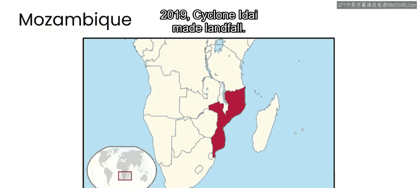
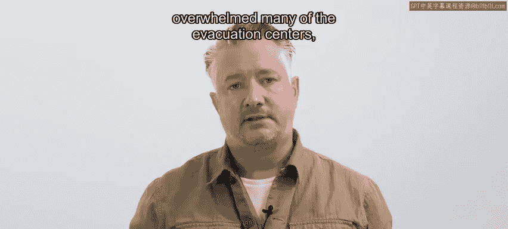
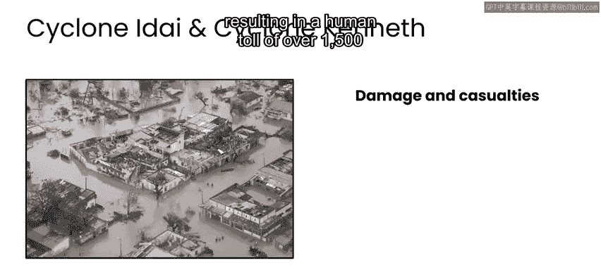

# 085：台风伊代与肯尼思案例概述 🌪️

在本节课中，我们将了解2019年先后袭击莫桑比克的两场气旋（台风）事件的基本情况及其直接冲击。我们将看到灾难的规模、造成的破坏以及初期响应的挑战。

---

## 灾难事件背景

上一节我们介绍了课程的整体框架，本节中我们来看看2019年莫桑比克遭遇的具体灾难事件。

莫桑比克位于非洲南部东海岸。2019年3月14日，气旋“伊代”登陆。气旋是一种热带风暴，通常伴随强风和暴雨。根据您所在地区，您可能更熟悉将其称为飓风或台风。

当气旋“伊代”来袭时，风暴带来了强降雨、洪水和高达每小时195公里的强风。作为对比，每小时195公里的风足以卷起混凝土块甚至汽车等重物。在这种风力下，站立或移动几乎是不可能的。

## 预警与疏散行动

在风暴来临前，莫桑比克发布了红色警报，并敦促居民到高地或坚固建筑中避难。在某些地区，应急服务人员挨家挨户鼓励人们撤离。因此，风暴袭击前有超过80万人被疏散。

然而，尽管有警告和疏散努力，受影响地区的许多人仍对风暴的严重性措手不及，一些人未能及时撤离。灾难的巨大规模使许多疏散中心不堪重负，导致过度拥挤和卫生条件恶劣。

## 灾难造成的直接冲击

以下是风暴造成的主要直接破坏：

*   **基础设施与基本服务破坏**：风暴导致停电。
*   **生计与粮食安全受损**：风暴对农作物造成损害，导致粮食短缺。
*   **次生伤害与伤亡**：在某些情况下，强风卷起了房屋的铁皮等危险碎片，造成了进一步的破坏、严重伤害和死亡。

## 第二次打击：气旋肯尼思

2019年4月25日，就在气旋“伊代”过后仅六周，气旋“肯尼思”在莫桑比克北部登陆。

风暴对关键基础设施造成重大破坏，包括道路、桥梁和机场，这导致援助物资运抵受影响社区的时间被延迟。

由于“肯尼思”袭击了莫桑比克的不同地点，救援力量被分散，这进一步加剧了基本资源和援助的稀缺。

## 灾难的总体影响

根据莫桑比克政府2020年5月的最终报告，两次气旋的影响是广泛的。

**人员伤亡与流离失所**：造成超过1500人死亡，16万人流离失所。

**经济损失**：给该地区造成约32亿美元损失。

**房屋与生计破坏**：风暴还损坏或摧毁了超过70万所房屋，使许多家庭无家可归。洪水对农作物造成严重损害，重创了经济，并导致受影响地区的粮食不安全。

## 灾后初期的挑战

在气旋“伊代”登陆后的最初几个小时，受影响社区面临大范围洪水、停电和通信中断，这使得当局难以评估损害程度并启动响应工作。

为了确保快速有效的响应，现场的协调和关键信息共享至关重要。

---

本节课中我们一起学习了2019年袭击莫桑比克的两次强气旋“伊代”与“肯尼思”的基本情况。我们看到了灾难的规模、预警疏散的努力、造成的巨大生命财产损失以及灾后初期面临的严峻挑战。下一节，我们将详细探讨灾后的具体响应和恢复工作。