# 086：台风“伊代”与“肯尼思”的响应与恢复 🌪️

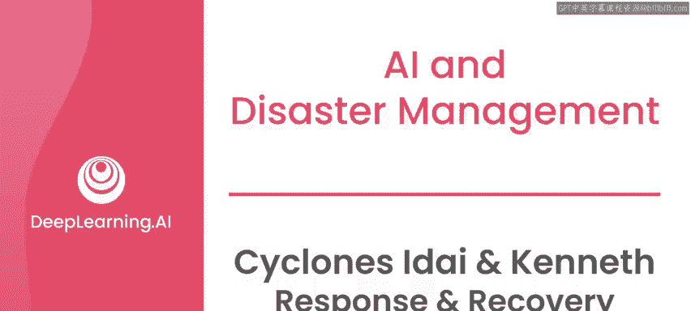

## 概述

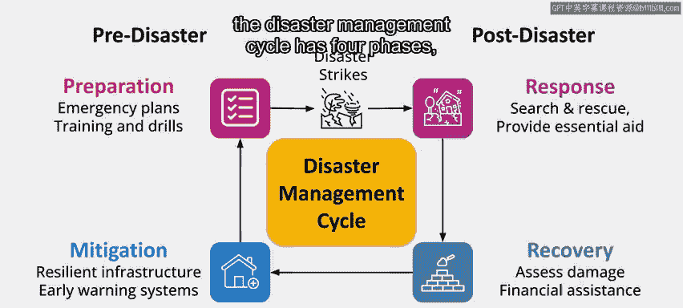

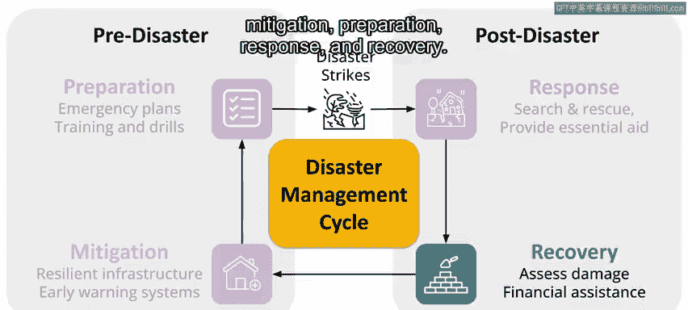

在本节课中，我们将学习人工智能（AI）在灾害响应与恢复阶段的具体应用。我们将以2019年先后袭击莫桑比克的台风“伊代”和“肯尼思”为案例，探讨AI技术如何帮助评估灾情、协调救援、预测疫情并支持社区重建。

---

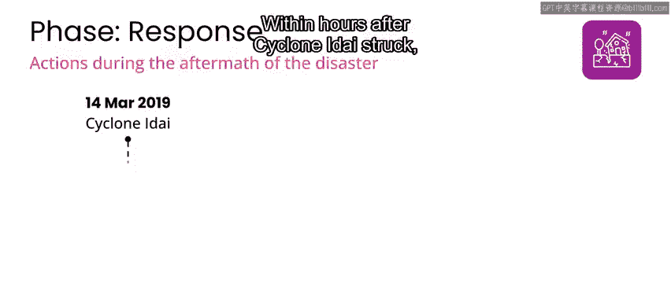

## 灾害响应阶段的快速行动

上一节我们介绍了灾害管理的完整周期。本节中我们来看看响应阶段的具体行动。

2019年3月14日台风“伊代”登陆后，灾害响应组织必须迅速行动，以评估损失、定位安全避难所、派遣搜救团队并确定受灾地区的需求。

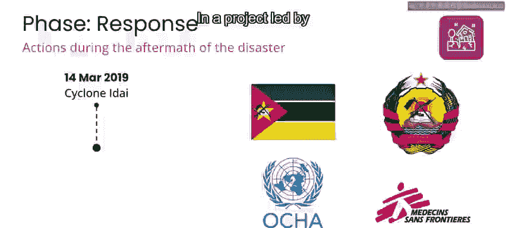

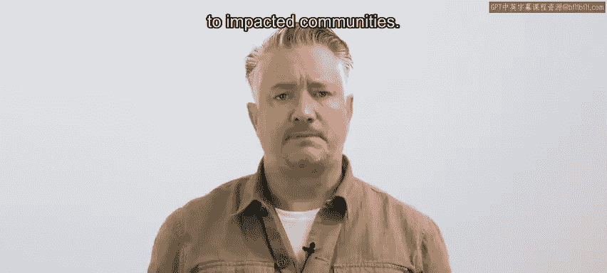

“伊代”袭击数小时内，莫桑比克政府便部署了国家灾害管理研究所，以协调包括搜救在内的紧急响应工作。

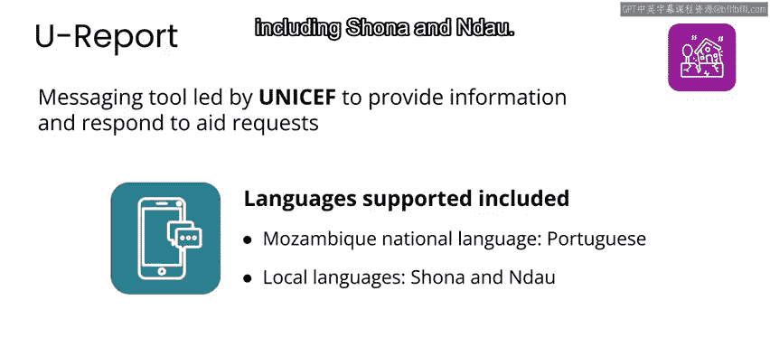

## AI在灾情评估中的应用

以下是AI技术在此次灾害响应中的关键应用。

*   **卫星图像分析**：在联合国训练研究所和欧洲航天局领导的一个项目中，AI被用于分析卫星图像，以识别和绘制受损基础设施地图。这使得组织能够快速评估损害程度并确定响应工作的优先级。
*   **优化救援路径**：AI分析还能定位受洪水影响的道路和桥梁，从而优化向受灾社区运送紧急物资的路线。

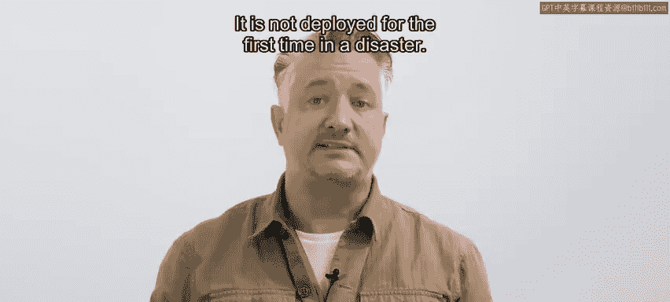

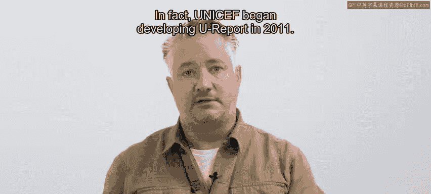

## 沟通与援助请求处理

为了收集并响应个人和社区的援助请求，联合国儿童基金会（UNICEF）使用了其U报告系统中的AI驱动聊天机器人。

该聊天机器人能分析请求并确定适当的援助响应。该项目支持包括葡萄牙语以及绍纳语和贝拉语等当地语言在内的多种语言。

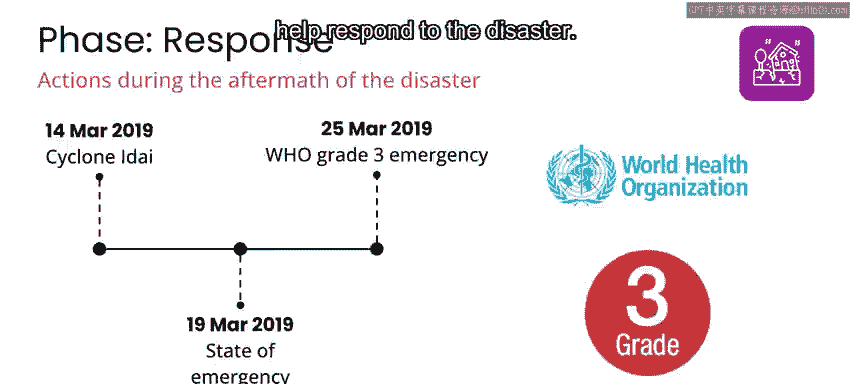

需要说明的是，此类聊天机器人需要多年的试错才能完善，并非首次在灾害中部署。UNICEF从2011年就开始开发U报告。早期在尼日利亚的母婴健康项目中，曾尝试构建AI系统来自动分类和优先处理短信。虽然该项目最终未成功，但从该项目及其他类似项目中汲取的经验教训，使U报告工具在莫桑比克响应等情况下变得更加稳健。

## 紧急状态与国际响应

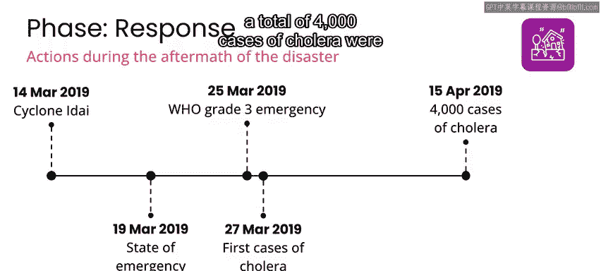

随着灾情发展，正式的紧急状态宣告启动了更广泛的国际援助。

3月19日，即“伊代”登陆五天后，莫桑比克政府宣布进入紧急状态，并建立了紧急行动中心，作为协调响应工作和国际援助联络的中心点。

3月25日，世界卫生组织（WHO）将局势宣布为三级紧急情况（其应急框架中的最高级别）。这些宣告是重要行动，使得国际社会的资源和专业知识得以动员起来帮助应对灾害。

## AI在公共卫生危机预警中的应用

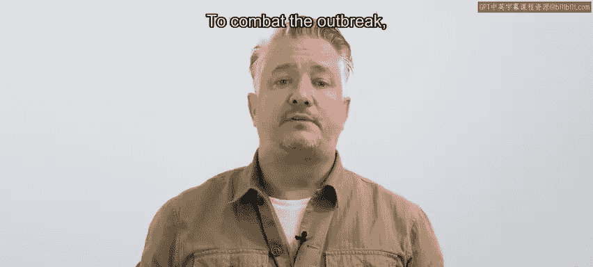

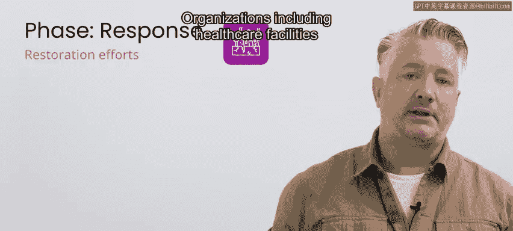

台风引发的洪水导致了水源污染、卫生设施损坏、居住条件拥挤且不卫生，以及医疗服务获取受限。这些因素共同创造了霍乱等水传播疾病快速传播的完美环境。

3月27日报告了首批霍乱病例，随后疫情迅速蔓延。到4月15日，即首例病例报告仅三周后，共确诊了4000例霍乱病例，并报告了28例死亡。

世界卫生组织部署的早期预警系统中包含一个**机器学习算法**。该算法通过分析降雨模式、水位和水质数据，来预测霍乱等水传播疾病最可能爆发的区域。

这些机器学习信号，连同大量人工收集的信号，共同帮助指导医疗人员和资源部署到高风险地区。

为抗击疫情，世卫组织提供了技术支持，帮助建立霍乱治疗中心并为高风险人群提供霍乱疫苗。该地区现有的医疗机构、UNICEF、无国界医生以及红十字会与红新月会国际联合会等组织，协助建立了治疗中心、医疗团队，并提供了医疗设备和应急物资（如净水片、卫生包和肥皂）。

## 恢复阶段的目标与行动

当局势稳定后，恢复阶段开始。但需注意，恢复阶段的开始并不一定意味着响应阶段的结束，仅意味着一些组织开始商讨社区的修复和重建工作。

一般而言，任何灾害的恢复阶段都有四个主要目标：
1.  **恢复基本服务**：如获取食物、水、卫生设施、医疗保健和学校开学，以及关于如何获取这些服务的信息。
2.  **重建基础设施**：包括道路、桥梁和建筑物。
3.  **为受灾社区提供支持**：以重建家园和生计。
4.  **支持减灾工作**：为未来的灾害做好准备。

以下是莫桑比克政府及各组织在“伊代”过后的恢复工作中提供的部分援助：
*   **国际移民组织**：以修复受损房屋和向家庭提供重建材料的形式提供支持。
*   **世界卫生组织**：协助恢复卫生设施并提供医疗护理。
*   **联合国儿童基金会**：促进学校修复，为儿童提供教育材料，并提供心理社会支持以帮助儿童应对台风造成的创伤。
*   **联合国开发计划署**：通过支持农业、渔业和小型企业，协助恢复受影响社区的生计，并提供职业培训，试图建立新的经济机会。

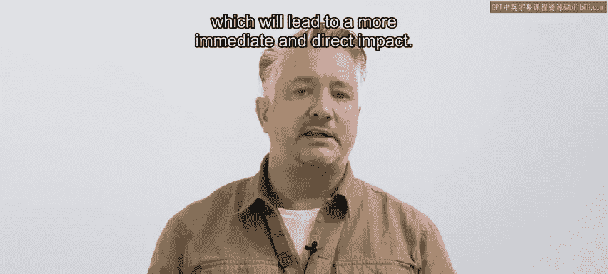

## 本地组织的关键作用

绝大多数灾害响应者通常不是国际组织，而是本地组织和个人，他们在灾后重建和支持社区方面至关重要。他们通常更善于识别和应对受影响人群的具体需求，并能与该社区建立信任、促进沟通。

尽管作用关键，但本地组织和个人获得的媒体关注往往少于资源更丰富、 outreach 能力更强的国际同行。例如，作者曾在利比里亚为联合国难民署工作，但技术上受雇于一个本地组织，由当地长大的人管理，只是由联合国提供资金和卡车等后勤援助。

认识到并支持本地组织的工作非常重要，他们通常是第一时间到达现场，并在国际组织离开后仍长期工作。在本地组织的支持下，社区能够可持续且公平地重建和恢复。因此，支持灾害响应工作的最佳方式是直接与本地组织合作，这将产生更直接、更即时的影响。

## 二次灾害的挑战与教训

在应对“伊代”的响应与恢复工作期间，台风“肯尼思”于4月25日袭击了莫桑比克，这距离上一场风暴仅六周。

这第二场台风引发了政府和援助组织的立即响应，但其严重性和影响摧毁了正在进行的人道主义救援工作，并对道路、桥梁和机场造成进一步破坏，使得援助人员难以进入受灾地区，并延误了基本援助的交付。

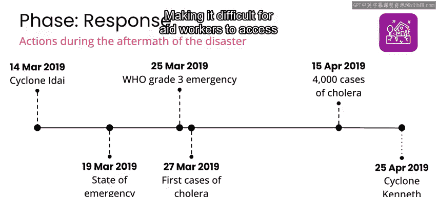

在台风发生前的几年里，莫桑比克已努力改善防灾准备，建立了自然灾害管理机构并制定了减灾战略。然而，这些努力仍处于早期阶段，并未对这场毁灭性的连续台风做好充分准备。

这里的启示是：为了在灾害管理的响应和恢复阶段工作中最高效，你在减灾和准备阶段的工作至关重要。这正是我们接下来要讨论的内容。

---

## 总结

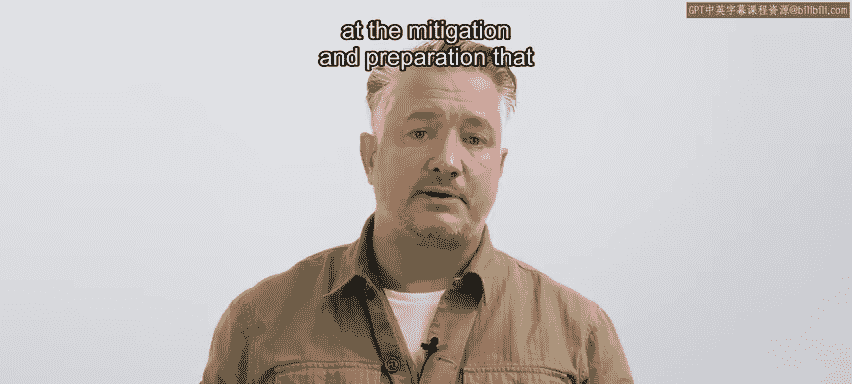

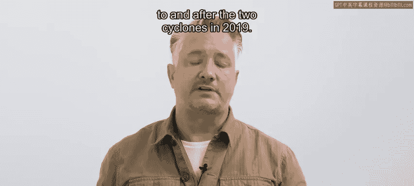

本节课中，我们一起学习了AI在2019年莫桑比克台风灾害响应与恢复中的实际应用。我们看到AI如何通过卫星图像分析加速灾情评估，通过聊天机器人处理援助请求，以及通过机器学习预测疾病爆发。同时，我们也认识到恢复工作的多维目标，以及本地组织在长期重建中不可替代的关键作用。最后，连续灾害的案例凸显了扎实的减灾和准备工作对于有效应对极端事件的重要性。