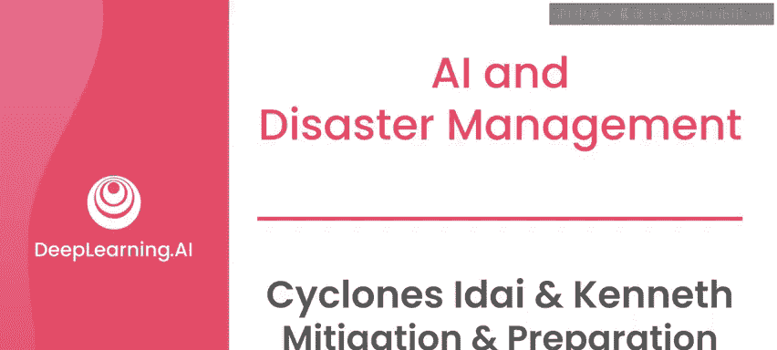
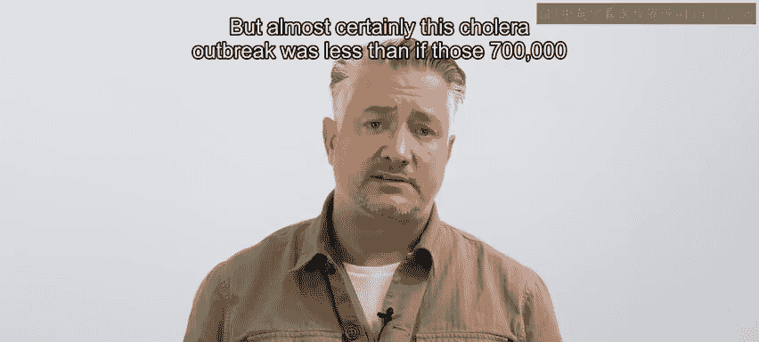
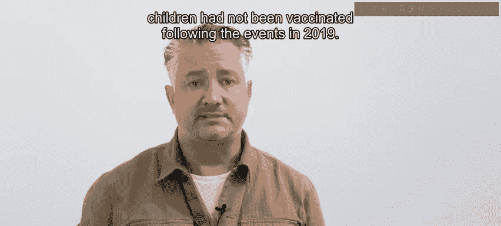
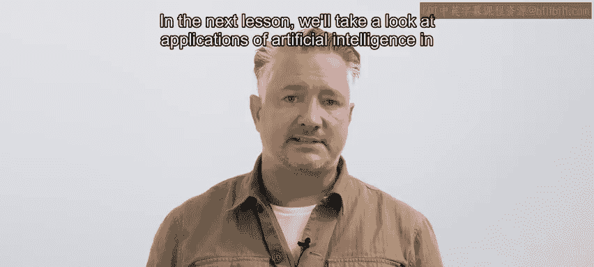
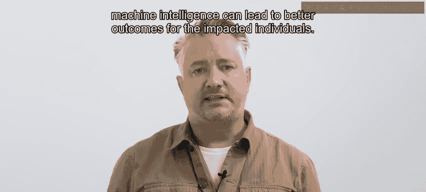

# 087：台风伊代与肯尼思的缓解与准备 🌀

在本节课中，我们将学习莫桑比克在经历了“伊代”和“肯尼思”两次强台风后，如何通过投资预警系统、加固基础设施和开展社区培训等措施，从被动应对转向主动的灾害管理。这些经验对于任何面临自然灾害的地区都至关重要。

---

## 灾害暴露的脆弱性

莫桑比克原有的基础设施和通信系统无法应对“伊代”和“肯尼思”台风的强度。这些风暴突显了转向更积极主动的灾害管理方式的必要性。

## 投资于缓解措施

为了减轻未来灾害的影响，莫桑比克在早期预警系统上进行了大量投资。联合国开发计划署参与了安装气象监测站的工作，这些监测站提供了天气模式的实时数据，并帮助预测极端天气事件的可能性。

此外，基于电话的警报系统也得到了改进。改进包括更广泛、更可靠的覆盖范围，以及对更多语言（如绍纳语和恩扬加语）的支持。

为了使基础设施具备抗灾能力，许多建筑使用混凝土和钢材重建，以更好地抵御极端天气事件。建筑师还考虑了该地区的地形，在更高的地方建造了新基础设施，并实施了排水系统和湿地以防止洪水。

为了预防未来的疾病爆发，医疗专业人员为超过70万名儿童接种了霍乱疫苗。

## 转向准备阶段

除了实施各种缓解措施，工作重点随后转向了准备阶段，旨在增强国家预测、准备、培训和应对未来灾害的能力。

莫桑比克政府与国际伙伴合作，以提高未来灾害发生时的备灾和应对能力。

以下是准备阶段采取的关键行动列表：

*   **改进应急计划**：包括在靠近可能受影响的社区的地点，预先储备基本救援物资。
*   **社区培训**：国际移民组织培训社区制定灾害风险降低策略，包括疏散和应急响应计划。
*   **卫生宣传**：包括联合国儿童基金会、世界卫生组织和当地非政府组织在内的许多组织开展了卫生宣传活动，培训社区卫生工作者和志愿者如何推广安全用水实践，并进行卫生和清洁活动。

社区参与对于提高认识和建立对未来灾害的抵御能力至关重要。人们接受了备灾和降低风险措施的培训，并被鼓励在监测和应对潜在危险方面发挥积极作用。

## 后续考验与成效

自2019年“伊代”和“肯尼思”台风以来，莫桑比克又经历了三次重大的台风。其中，2023年2月在印度洋形成的“弗雷迪”台风，被测定为有记录以来持续时间最长、威力最强的台风。

该台风于当年3月2日在莫桑比克登陆，伴有暴雨和每小时270公里的持续风速。

得益于社区预警系统，莫桑比克得以在“弗雷迪”到来之前，通过多种语言的短信、地方广播和电视公告向居民发出警报。这为人们提供了更多时间转移到避难所，导致的死亡人数远低于以往的灾害。

不幸的是，对水和卫生系统以及医疗设施的影响是广泛的，霍乱的爆发甚至比2019年台风后更严重。但几乎可以肯定的是，如果没有在2019年事件后为那70万名儿童接种疫苗，这次霍乱爆发的情况会更糟。

## 总结与启示

希望这能说明，为什么在任何面临自然灾害事件的地区，为疾病爆发和其他风险或持续挑战进行缓解和准备是如此重要。

研究和分析灾害在这些缓解和准备阶段的影响，有助于找到改进应急响应系统、基础设施和未来事件准备工作的方法。

通过将这些经验教训纳入未来的规划和行动，社区和政府可以努力减少未来灾害的影响，并最终挽救更多生命。

在下一课中，我们将探讨人工智能在灾害管理中的应用，以及如何结合人类与机器的智慧，为受灾个体带来更好的结果。