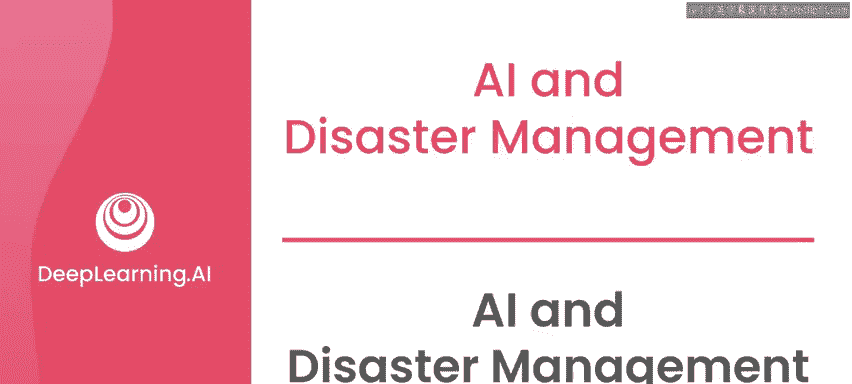
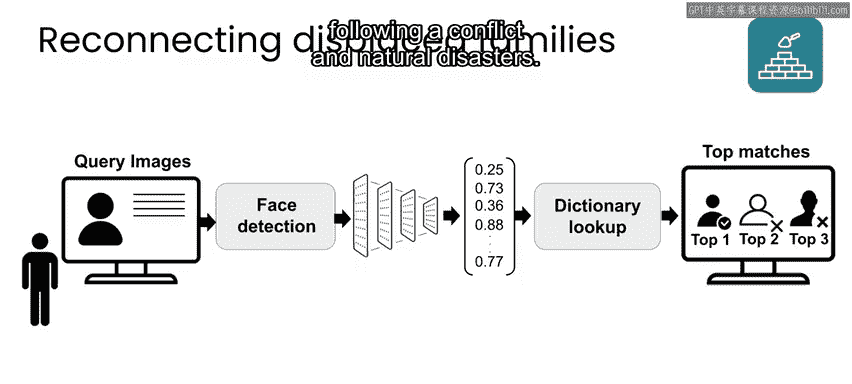
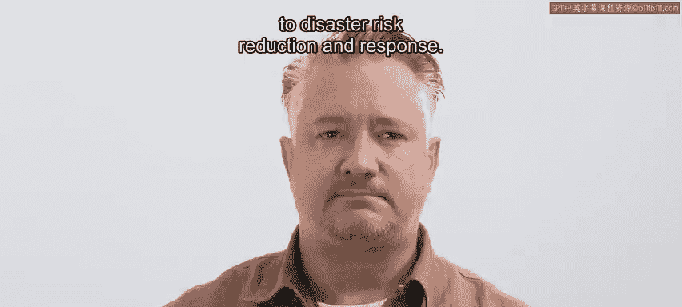

# 088：人工智能与灾害管理 🚨

在本节课中，我们将探讨人工智能（AI）在灾害管理领域的应用、具体案例以及其潜在的益处与局限性。我们将了解AI如何帮助监测灾害、预警、优化响应以及协助灾后恢复工作。

---

灾害管理涉及多种信息来源，包括数字通信、预报和传感器数据、航空影像等。这些数据可用于监测和预测灾害发展、识别高风险区域，并帮助确定响应工作的优先级。

在许多情况下，人工手动处理所有相关数据既耗时，有时甚至不可能。这正是AI能够发挥价值的地方。

事实上，如果你使用像英语这样的主流语言，你可能会对一些通用的AI产品习以为常，例如搜索引擎和翻译应用。这些工具在灾害后促进沟通和信息传播，或作为预警系统的一部分时，可能非常有用。

不幸的是，世界上大多数语言在搜索或翻译应用中并未得到支持。因此，帮助支持灾害准备和响应工作的一个有效途径，是为使用资源匮乏语言的人群构建更多通用AI应用。这将帮助他们更轻松地沟通、查找信息或辨别新闻真伪。

接下来，我们来看看AI可以参与灾害管理的几个具体例子。

---

## AI在灾害风险预警中的应用 🌍

为了提升全球的灾害风险降低和早期预警能力，联合国开发计划署创建了一个多灾种早期预警系统。该系统利用AI处理和分析各种数据源，包括气象数据、水文数据、地震与地球物理数据以及卫星图像，以提供严重事件的准确预报和灾害地图。这包括诸如风暴、干旱、野火等事件。

该工具利用数据丰富地区的历史数据，然后进行外推，以协助现场观测数据相对较少的地区。该项目的最终目标是减少社区、生计和基础设施暴露于天气相关灾害的风险。

一旦数据分析完成，该工具会使用AI基于特定标准自动检测并触发预警警报，以快速动员响应工作。包括孟加拉国、印度、印度尼西亚和菲律宾在内的几个国家已经启用了该系统。

---

## AI在野火响应中的应用 🔥

一家名为Pano AI的公司采用超高分辨率摄像头和AI技术来检测、评估和精确定位新的野火位置。因为火灾发生后的最初几分钟对于最小化对生命和财产的潜在损害至关重要。

Pano AI的深度学习计算机视觉算法及其“人在回路”监控中心能够实时快速检测、验证和分类事件。传统上，旁观者会向地方当局报告野火，有时需要数小时才能精确定位火灾位置并派遣首批响应人员。然而，当Pano AI检测到潜在威胁时，它可以立即提醒火灾监控专业人员，并提供经过增强的智能自动生成图像，使专业人员能够确认或排除特定地点是否真的发生了火灾。

---

## AI在灾后家庭团聚中的应用 👨‍👩‍👧‍👦

微软的“人道主义行动AI项目”与土耳其红新月会合作，开发了一个AI驱动的平台，帮助在灾害或冲突中失散的家庭团聚。这项工作是红十字会“重建家庭联系”项目的延伸，该项目数十年来一直致力于在冲突和自然灾害后重新联系人们。

我在2010年海地地震后与谷歌合作开发了一个类似的系统，该项目后来演变成一个通用工具，供人们在灾害后发布信息并与亲人重新取得联系。你可以在本周课程结束时的资源部分找到关于这两个项目的更多信息。

---

## AI的益处与局限性 ⚖️

AI在灾害管理中有潜力带来诸多益处，例如改善态势感知、加快响应时间以及更有效地分配资源。

然而，AI在此背景下也存在一些重要的局限性，包括：
*   **对准确数据的需求**：AI模型的性能严重依赖于输入数据的质量。
*   **数据偏见与非代表性的潜在风险**：如果训练数据不能代表所有受影响群体，AI系统可能会产生偏见或无效的结果。
*   **与受影响社区沟通的挑战**：AI解决方案需要考虑到当地语言、文化和技术可及性。
*   **部署所需的资源与技术专长**：实施AI系统可能需要大量的资源和专业知识。
*   **伦理考量**：在使用AI时，隐私、问责制等伦理问题往往会被放大。

因此，在灾害管理中，必须评估AI的潜在益处和局限性，并将其作为更广泛的、综合性的灾害风险降低与响应方法的一部分。

---

## 总结 📝

本节课中，我们一起学习了人工智能在灾害管理中的多种应用。我们看到了AI如何通过分析多源数据来提升早期预警能力，如何利用计算机视觉加速对野火等紧急事件的响应，以及如何协助灾后的人道主义工作，如家庭团聚。

同时，我们也认识到AI的应用并非没有挑战，它依赖于高质量的数据，并需要谨慎处理偏见、资源需求和伦理问题。将AI作为综合灾害管理策略的一部分，并充分考虑其局限性，对于最大化其积极影响至关重要。

在接下来的几个视频中，我将介绍一些我用来确保我所参与或评审的项目能够成功设置并最大限度减少伤害的指导原则。