# 089：AI与灾难管理中的社区自助 🆘

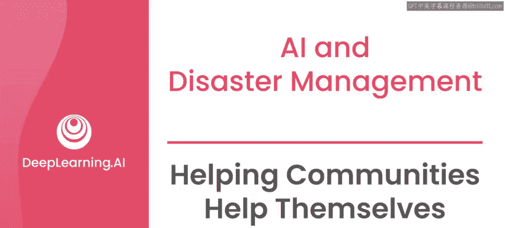

在本节课中，我们将探讨如何应用机器学习工具来帮助社区在灾难中进行自助，并了解其中的关键原则与潜在风险。

---

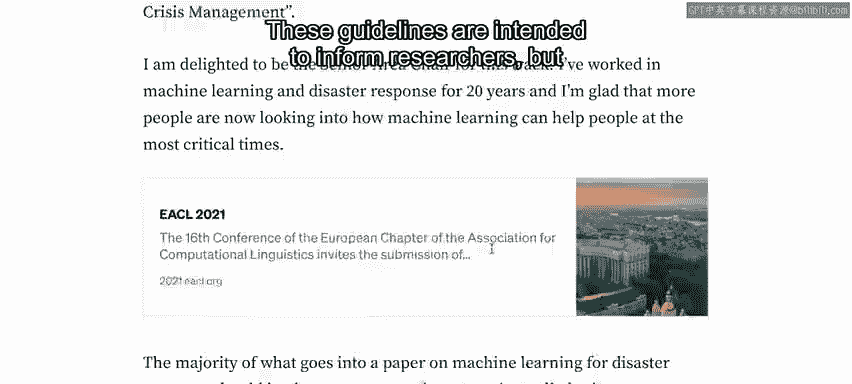

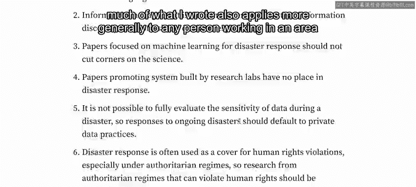

全球有许多个人和团体正在积极研发旨在帮助灾难管理的机器学习工具。这些人的目标大多是产生积极影响，并且许多人确实在致力于能带来积极成果的解决方案。几年前，我主持了一个主要机器学习会议的首个专注于灾难响应的专题讨论会。该专题名为“用于紧急情况和危机管理的自然语言处理技术”。尽管它在COVID-19高峰期以线上形式举行，但其更广泛地关注自然语言处理与灾难响应。

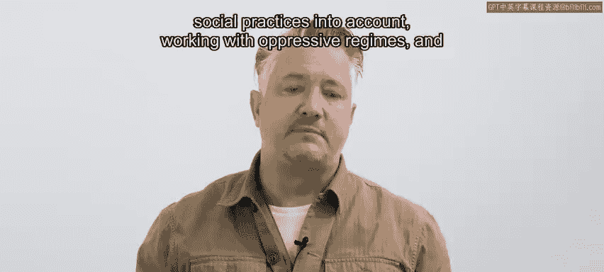

当时，我撰写了一篇文章，阐述了将机器学习应用于灾难管理的一些通用准则。这些准则旨在为研究人员提供信息，但我所写的大部分内容也普遍适用于任何在AI和灾难管理领域工作的人。在这里，我将简要总结那篇文章的一些要点，你也可以在本周课程末尾的资源部分找到完整文章的链接。

在开始介绍这些准则之前，需要预先提醒一下：我们将要涉及灾难管理工作中一些相当沉重的内容。即使怀着最好的意图，也可能弊大于利。数据处理不当、未能考虑当地语言或社会习俗、与压迫性政权合作以及其他失误，都可能导致生命处于危险之中。

接下来的几个视频中，我们将触及所有这些要点。但首先，对于任何大型灾难，我们根本没有足够的资源直接帮助大多数人。例如，在大流行期间，个人自身必须直接负责保持社交距离和卫生。地震后，你的邻居比专业的搜救队更有可能将你从倒塌的房屋中救出。

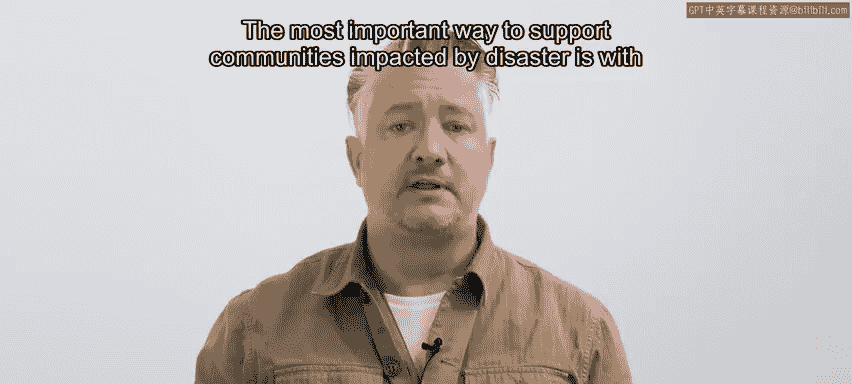

因此，在任何地方帮助减轻灾难影响，最重要的事情之一就是帮助社区做好准备进行自助。支持受灾难影响社区的最重要方式是清晰的沟通。使用低资源语言的人更可能成为自然灾害和人为灾害的受害者。所谓“低资源语言”，我指的是那些在搜索引擎或翻译应用等技术应用中通常得不到像英语和其他更主流语言那样支持的语言。

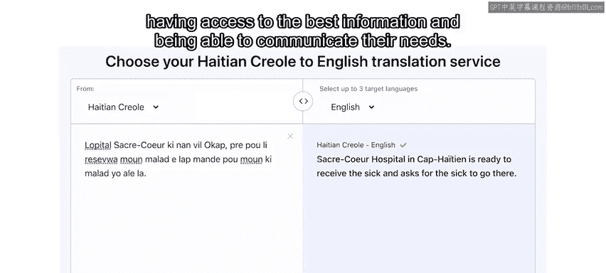

当涉及到社区获取最佳信息和表达自身需求时，这类技术绝对至关重要。任何有助于将信息传递给语言多样化社区的技术，都将在包括灾难在内的许多情况下帮助他们。事实上，我相信，我帮助大公司在更多语言中部署技术的一些工作，可能比我为联合国在难民营工作所花费的一些时间，对灾难响应产生了更大的影响。

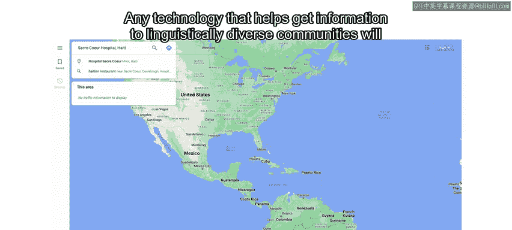

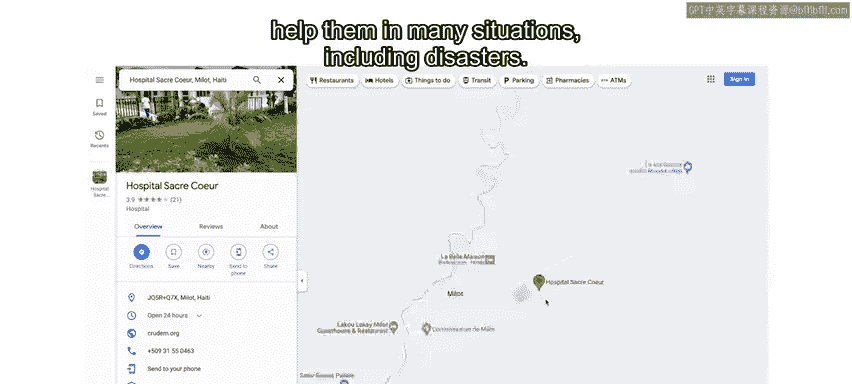

例如，当疾病爆发时，它们最有可能首先在一种低资源语言中被讨论。这是因为世界上大部分的语言多样性，与大部分陆地生态多样性（包括病原体）一样，都发生在同一条狭窄的热带带中。因此，如果你恰好致力于改进搜索引擎和翻译应用等设备和应用的语言支持，那么我有一个好消息要告诉你：你已经致力于解决机器学习在灾难响应中最重要的单一问题之一。这些工具将帮助灾难响应者与受影响社区沟通，并帮助受影响社区在线搜索正确的资源进行自助。

我曾多次目睹翻译和沟通出错带来的负面影响。例如，在塞拉利昂的埃博拉危机期间，一家国际新闻机构在一个说林巴语（Limba）的地区用曼德语（Mende）广播公告，这造成了不信任，因为曼德语在当时被视为执政的反对党派的语言。结果，林巴语使用者更可能因为害怕在那里感染埃博拉而避开医疗诊所。

后来，我与援助机构合作，得出了一个非常令人悲伤的结论：每有一个死于埃博拉的人，附近就有十个人死于其他可预防的疾病，因为他们以这种方式避开诊所。将富裕国家的恐惧通过当地媒体进行广播放大，再加上对当地语言的关注太少，导致死亡人数是埃博拉本身致死人数的十倍。

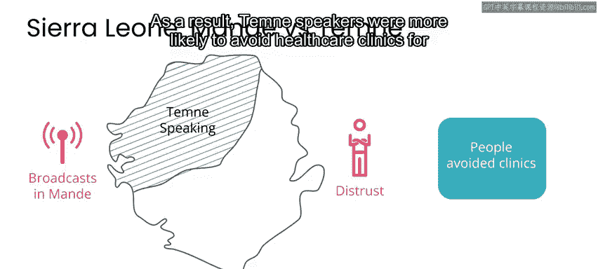

正确的语言和沟通也能产生积极影响。例如，2010年海地地震后，数千名海地侨民通过在海地克里奥尔语（Haitian Creole）和国际响应者使用的英语之间进行翻译，帮助了海地境内的人们。翻译人员的工作挽救了许多生命。它也为灾难响应的机器学习研究提供了支持，作为多语言灾难响应数据集的一部分，该数据集现在被广泛使用。事实上，在本课程的最后一周，你将有机会使用那个数据集。

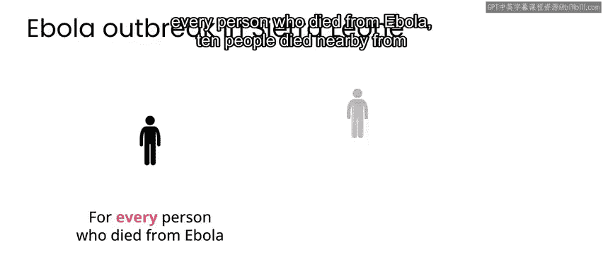

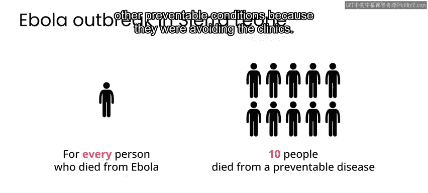

因此，任何为低资源语言提供更好技术支持的工作，都可能对灾难管理有用，因为它可以成为基础技术的一部分，使受灾难影响的人群能够更容易地沟通、获取信息和服务。

---

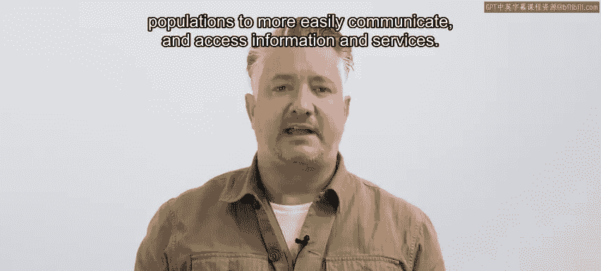

本节课中，我们一起学习了在灾难管理中应用AI帮助社区自助的重要性。核心在于通过技术，特别是对低资源语言的支持，改善沟通和信息获取，从而赋能社区进行自救。同时，我们必须认识到，不当的技术应用可能带来严重的负面影响，因此在工作中必须保持谨慎，充分考虑当地的语言、文化和社会背景。