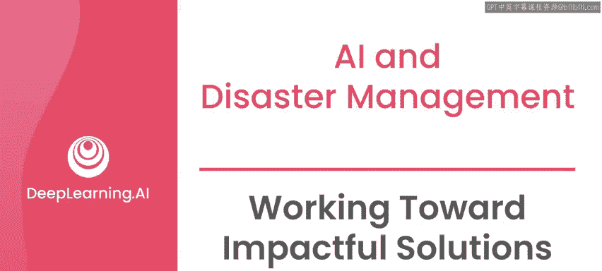
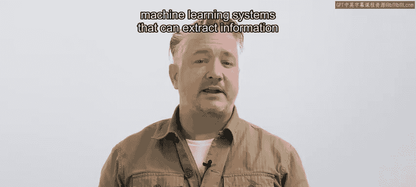
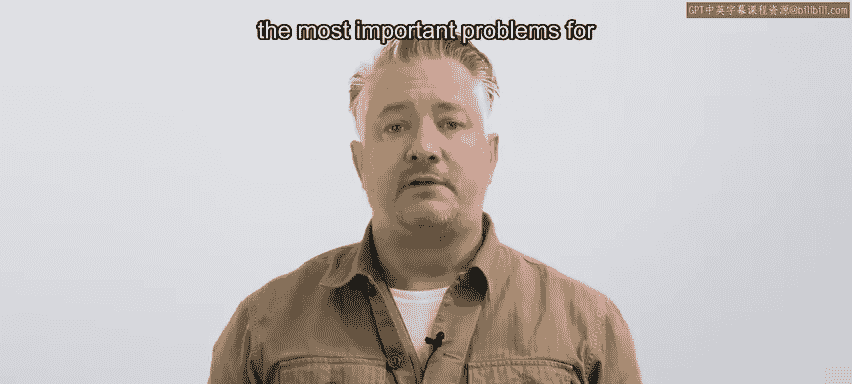
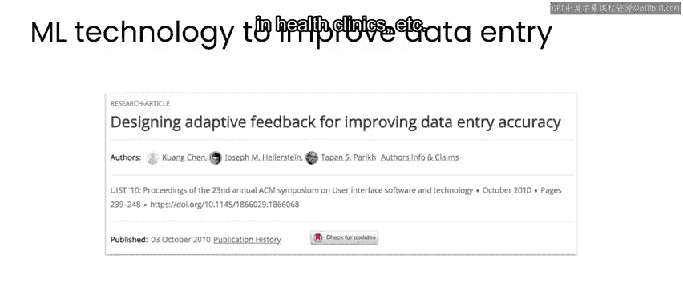
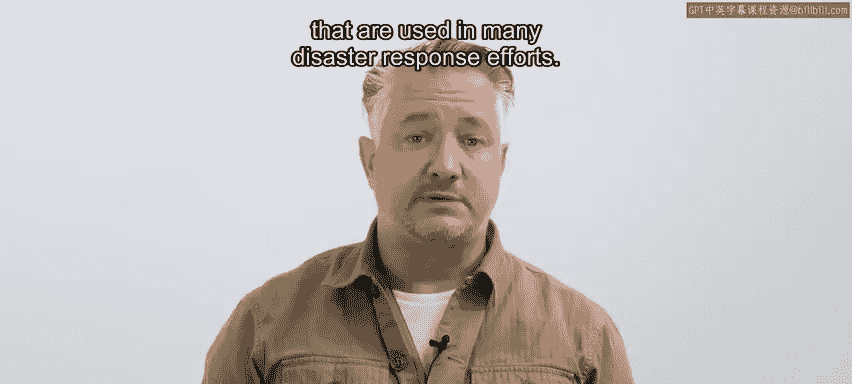
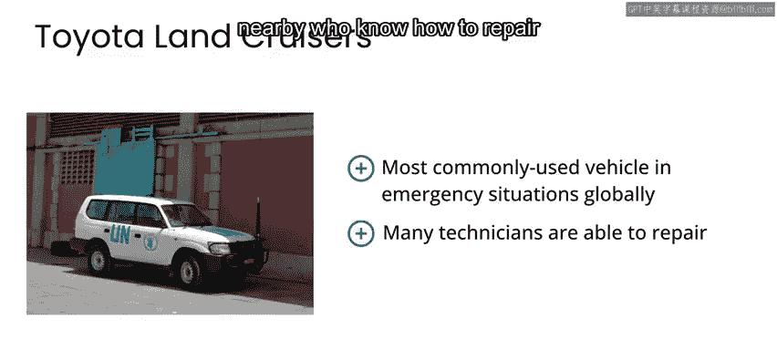

# 090：努力获得有影响力的解决方案 🎯

在本节课中，我们将探讨如何在灾难管理等关键领域开发有实际影响力的AI解决方案。我们将重点关注信息管理这一核心挑战，并理解为何通用型技术往往比前沿但未经测试的方案更具价值。

## 信息管理的核心挑战

信息管理是灾难响应者最常面临的最大问题之一。这个问题并非灾难管理所独有，而是广泛存在于公共卫生、政治或供应链物流等任何领域。在这些领域中，信息可能通过电子表格、调查问卷、表格或其他文档等多种不同方式收集，都会面临相同的信息管理挑战。

灾难响应的大部分工作涉及物流，大多数灾难响应专业人员通过电子表格或其他结构化或半结构化文档（如PDF）共享信息。许多电影造成了一个误解，认为灾难期间的分析和机器学习主要专注于预测下一个热点区域。这类用例确实存在，但非常罕见。事实上，我认为电影中模拟这类场景的预算，超过了实际灾难响应中用于此类态势感知的预算。

## 从文档中提取信息的价值

例如，一位负责规划饮用水分配的灾难响应负责人，可能会收到来自不同地区、不同机构的数百份报告。每份报告都包含估算总体需求所需的部分信息。然后，需要可靠地从每份报告中提取这些信息，而目前这通常是一个非常手动的过程。

因此，如果你能开发出可以从半结构化表格、表单、电子表格和PDF文档中提取信息的机器学习系统，那么你已经在为解决支持灾难响应专业人员的最重要问题之一而努力。

一个至今仍具相关性的、十多年前的好例子，是Quem Chen及其合作者发表的论文《**Deing adaptive feedback for improving data entry accuracy**》。这篇论文评估了机器学习辅助技术，旨在帮助专业数据录入员将乌干达农村诊所的病人数据数字化，这些诊所服务着大量刚果难民。

除了在乌干达农村的工作，Kangchn也在美国工作，并建立了一个组织，致力于处理来自纳税申报表等来源的非结构化文本。我认为这是一个很好的例子，说明了那些在非灾难情况下有用的技术，如何也能应用于难民营、健康诊所等场景的关键数据处理中。

## 开发通用型技术

我在此强调，在灾难管理中可以做的、最具影响力的工作之一，是开发通用型技术，例如搜索引擎、低资源语言的翻译支持，或从非结构化文档中进行信息检索。

然而，我也想强调，与领域专家和受影响社区合作非常重要，以确保你没有为错误的事情进行优化，或者没有在开发一个在现实世界中无实际应用的“实验室解决方案”。一个有用的类比是思考许多灾难响应工作中使用的车辆。

## “陆地巡洋舰”软件哲学

如果你曾在援助领域工作过，你就会知道丰田陆地巡洋舰是一个经典车型。在我所见过的某些响应场景中，它们通常是车辆中的大多数。陆地巡洋舰并非专门为优化援助交付而设计，但几十年来，它们在全球绝大多数国家被使用，因此在紧急情况出现时，它们可靠且可预测。

当它们出现问题时，附近会有很多人知道如何修理它们，并且更有可能找到合适的替换零件。

那么，一个学术研究实验室能否设计出比陆地巡洋舰更适合灾难响应的车辆？毫无疑问，他们可以。但这些车辆是否应该在关键情况下首次部署？绝对不行。备用零件将很难获得，能够修理它们的人可能只有少数已经转向其他工作、或许根本无法帮助解决机械问题的学者。

因此，来自学术实验室的科学可能会为未来的发展提供信息，但他们不应该制造实际的车辆。这同样适用于任何软件解决方案。软件原型可以为科学提供信息，并在非关键时期的受控环境中使用，特别是当存在重要的人机交互组件需要测试时。

## 在实践中应用可靠方案

例如，正如我在本专业课程的第一门课中所说，当我在尼日利亚与联合国儿童基金会合作开展母婴健康项目时，我们没有为希望解决的问题构建一个全新的AI系统，而是依赖于我们已经在许多行业应用中测试并扩展的系统。通过这种方式，我们部署了一个“陆地巡洋舰”式的软件解决方案，而不是试图构建一个前沿但未经测试的解决方案。

即使在我任职于斯坦福大学——可以说是最注重工业应用的顶尖技术大学时，当我在灾难响应情况下需要快速开发工具时，我也没有与那里的同事合作。我选择了商业软件解决方案，因为可靠性比创新更重要。只有在特定响应工作结束后，我才领导研究机器学习如何改进未来的响应。

因此，无论你决定从事什么工作，请记住，在通用型技术的基础上进行扩展或构建，通常是你在灾难管理中可以做的、最具影响力的工作之一。

在下一视频中，我将讨论灾难管理中数据隐私这一重要问题。

---

本节课中，我们一起学习了在灾难响应等关键领域开发AI解决方案的核心思路。我们认识到，信息提取是应对现场混乱数据的关键，而采用经过验证的、可靠的“通用型技术”（类比丰田陆地巡洋舰），往往比追求前沿但脆弱的“实验室方案”更能产生实际影响力。成功的AI for Good项目需要紧密结合领域需求，优先考虑可靠性、可维护性和可扩展性。