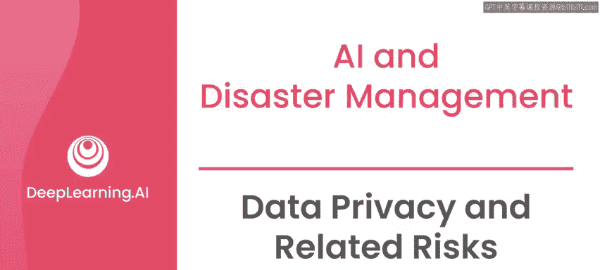
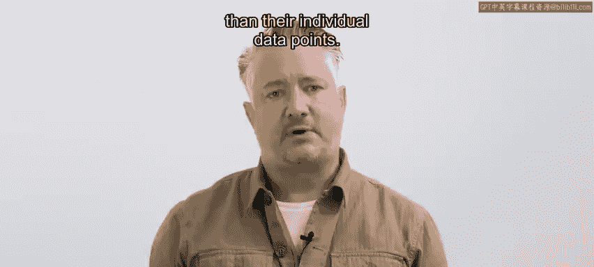
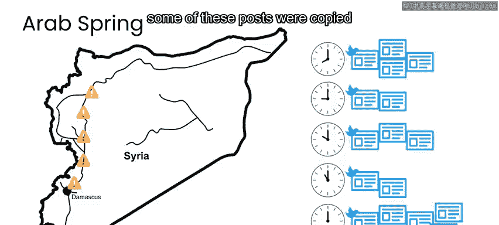
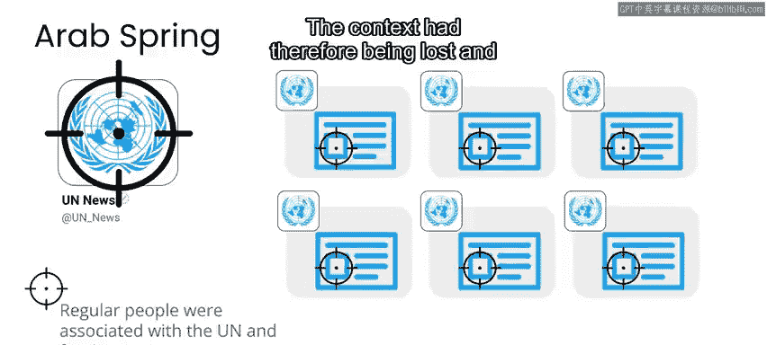
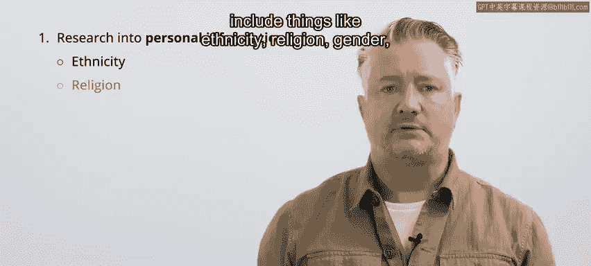
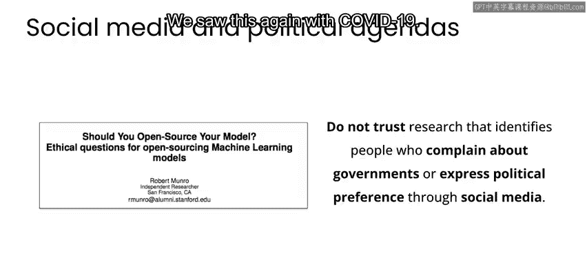
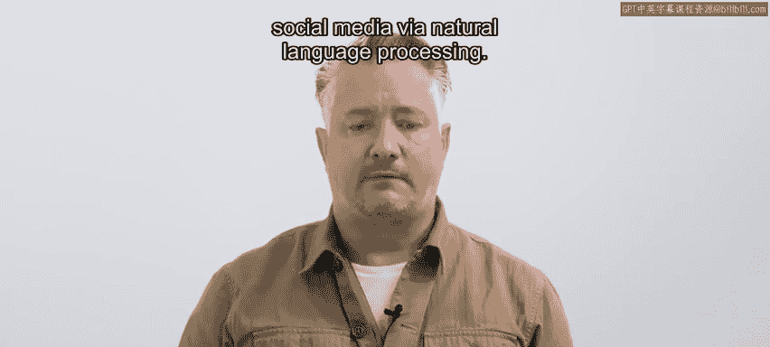
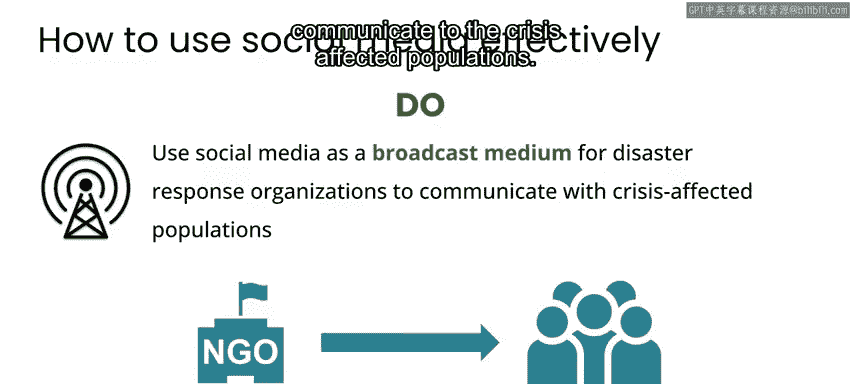
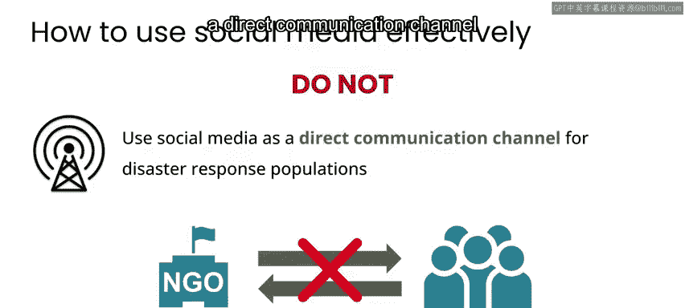

# 091：数据隐私与相关风险 🔒

在本节课中，我们将要学习在AI应用于公共卫生、气候变化和灾难管理等“向善”领域时，如何处理数据隐私问题以及识别相关的伦理与政治风险。我们将探讨为何默认应遵循隐私保护实践，以及在不同情境下，即使是公开数据也可能带来意想不到的危害。

---

无论你从事何种工作，你的默认实践都应是保护数据隐私。在持续的灾难期间尤其如此。

今天看似不敏感的数据，未来可能变得敏感，因此无法确定。所以不要发布任何个人数据，这包括重新发布社交媒体上已有的公开信息。相反，应等待受影响人群不再处于风险之中，然后与隐私专家及受影响社区合作，共同决定哪些信息可以或不可以分享。

即使对于被视为公开且不敏感的数据，也需要知道，如果你在新的语境下重新发布这些数据，它也可能变得敏感。

此外，**聚合数据**，包括机器学习模型本身，可能比其单个数据点更为敏感。

---

上一节我们介绍了数据再语境化的风险，本节中我们来看一个具体的案例。

例如，在“阿拉伯之春”期间，我看到许多人在社交媒体上分享当地情况，比如道路封闭、难民等信息。虽然这些是公开帖子，但它们显然只是为少量关注者而写。人们可能没有意识到，报告道路封闭也会帮助描绘军队的动向。

作为一个反面教材，其中一些帖子被复制到一个联合国控制的网站上重新发布，并且原作者无法从联合国网站上删除它们。

---

当时，中东和北非地区的许多行为者将联合国视为负面的外国影响者，甚至是最坏的入侵者。因此，发布这些帖子的人被视为合作者。

语境因此丢失了，该地区压制性政权的当局并不关心这些人是否只是打算与少数关注者分享实用信息。

---

所以你需要问自己：重新语境化数据或模型，使其现在由你、你的组织或其他组织发布，会产生什么影响？

灾难响应也经常被用作侵犯人权的掩护。虽然灾难后犯罪率通常会下降，但少数掠夺者和机会主义者会试图从混乱中获利。这在压迫性政府中尤其如此，他们利用灾难作为掩护来识别和压制批评者。

如果你正在考虑涉及个人信息的项目（这可能包括种族、宗教、性别或政治偏好等信息），那么你应该考虑其使用场景，以及它是否可能被用于侵犯人权。这种情况在世界各地都可能发生，但在威权政体下更为普遍。

---

作为评估世界各地风险水平的一般指南，可以查看经济学人智库（EIU）编制的民主指数。

EIU对各国进行排名，并将其分为四类：完全民主国家、有缺陷的民主国家、混合政体和威权政体。

如果存在敏感的使用场景，比如识别在社交媒体上抱怨政府或表达政治观点的人，那么该领域的研究通常不能保证对这些人是安全的。这种情况非常频繁。

在我几年前于KDD会议上的一次演讲中，我谈到了一些国家如何利用第一次主要的冠状病毒爆发（SARS或MERS）作为掩护来识别异见人士。我们在COVID-19疫情中再次看到了这种情况。

---

通常，为威权政体工作的研究人员无法像民主国家公共机构的研究人员通常独立于政府那样保持独立。但请注意，民主指数高的国家仍然存在侵犯人权的行为，因此这并不意味着任何人可以在不考虑风险的情况下，在世界这些地区部署机器学习。

EIU的民主指数主要关注国家内部因素。一个对任何国家来说都复杂的领域是军队。世界各国的军队也是最大的灾难响应组织，这使得风险评估变得复杂，通常需要逐案调查。

---

有些案例是明确积极的。2012年，我们一小群非军事灾难响应人员参加了美国海军研究生院主办的演习，旨在探索灾后从航空影像进行损害评估的更好方法。

我们研究了FEMA中的民间空中巡逻队，他们在技术上是美国军方和国土安全部的一部分。民间空中巡逻队在灾后立即飞越灾区拍照，然后FEMA使用这些照片进行损害评估以协助响应。

就在2012年这次演习的几个月后，我们使用这些新技术帮助应对飓风桑迪。毫无疑问，这完全是积极的。如果使用民间空中巡逻队和FEMA当时使用的现有方法，我们无法将响应规模扩大到那种灾难级别。

---

然而，美国军方也参与了2010年海地地震的响应。正如我在那次地震的事后报告中所述，存在一种不安的紧张关系，因为许多海地人将美国军方视为前占领者。

在其他情况下，比如我与联合国儿童基金会合作支持西非的孕产妇健康时，我们选择不与任何美国政府组织合作，因为在帮助其他国家时，这会被视为缺乏独立性。

因此，无论研究人员或响应者的雇主是谁，都需要逐案考虑政府参与的伦理问题，特别是当灾难和响应者来自多个不同国家时。

---

过去我曾多次看到，社交媒体分析被描绘成灾难中的积极干预，但这几乎总是错误的。

正如我所说，在灾难管理和响应工作中分析社交媒体的大部分工作，都是由怀有不可告人动机的压迫性政权进行的。

例如，在COVID-19大流行期间，许多项目使用自然语言处理技术来检查社交媒体帖子。不幸的是，资助这些项目的一些政府机构，其目的是追踪异见人士。

一些国家在COVID-19开始时通过了法律，规定在大流行期间传播虚假信息是非法的。虽然表面上听起来不错，但当你查看法律条文时，其中许多规定任何对政府的批评都算作虚假信息。

因此，这些国家建立了一种手段来逮捕，在某些情况下甚至杀害任何批评政府的人。随后，这些国家立即资助并启动了通过自然语言处理识别社交媒体中虚假信息的项目。

---

即使在英语这样广泛使用的语言中，社交媒体通常对灾难响应者也没有用处。英语国家往往已经拥有资金最充足的灾难响应组织，因此这是英语相关性被放大的一个领域。

除此之外，压迫性政权经常将知识分子视为政治对手。说英语通常标志着一个人受教育程度更高，并且是在向国际受众发言。

无力应对灾难会使政府显得软弱，这尤其会暴露那些通过展示力量来领导的威权领导人。

例如，2013年台风海燕袭击菲律宾时，在批评政府响应的人中，我们识别出一些说英语的人，由于他们在社交媒体上拥有大量国际受众，他们特别容易遭到政府的报复。因此，在这种情况下，我们认为将英语社交媒体数据作为灾难响应数据集的一部分发布是不道德的。

---

对于我们这些从事灾难响应工作的人来说，我们通常建议的最佳实践是，将社交媒体用作灾难响应组织向受危机影响人群传播信息的广播媒介。

但是，不应将开放的社交媒体用作受灾人群的直接沟通渠道。

---

最后，作为对灾难管理工作感兴趣的人，我希望你能为成功做好准备，而不是陷入我在这个领域工作中看到的常见陷阱。

因此，请和我一起观看下一个视频，了解一些关于如何最好地参与其中并在工作中不造成伤害的指导方针。

---

**本节课中我们一起学习了**：在AI for Good项目中，尤其是在灾难响应等敏感领域，必须将数据隐私保护作为默认实践。我们认识到，数据的敏感性会随语境变化，聚合数据和模型可能带来更大风险。通过具体案例，我们分析了数据再发布、政府参与、社交媒体分析等环节中潜在的伦理与政治风险，特别是威权政体下技术可能被滥用于侵犯人权。最终，我们明确了谨慎处理数据、逐案评估风险、优先考虑受影响人群安全的重要性。