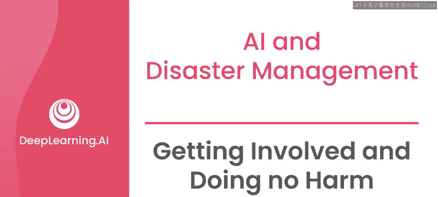
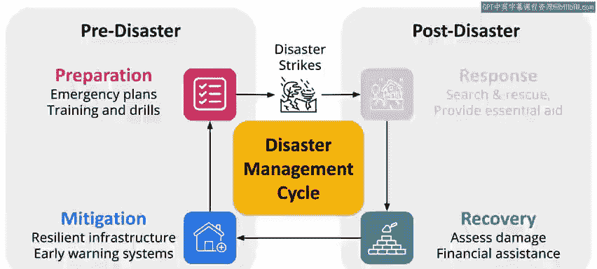
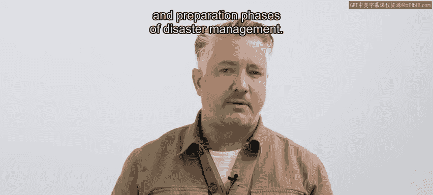
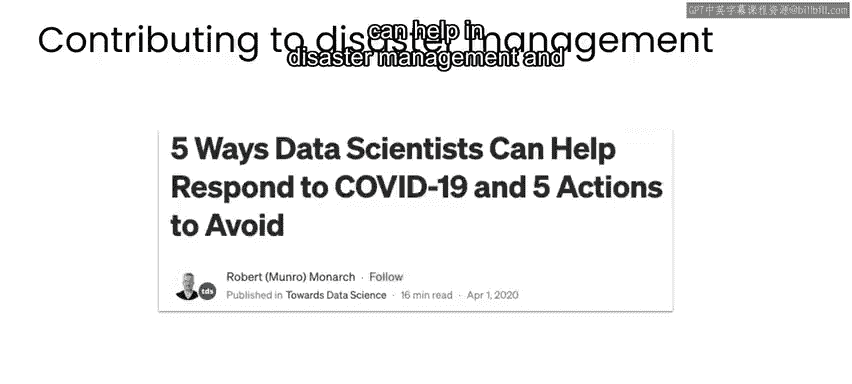

# 092：参与而不造成伤害 🛡️

在本节课中，我们将学习在AI for Good项目中至关重要的“不伤害原则”。我们将探讨该原则的具体含义、如何在灾难管理的不同阶段应用它，以及如何以最有效且安全的方式参与到相关工作中。

---

## 不伤害原则的核心

前面讨论的所有案例和用例都有一个共同点，即强调无论你从事什么工作，在评估工作影响时，都应遵循“不伤害原则”来做出决策。

正如我在本专业系列课程中提到的，灾难管理中的“不伤害原则”与许多医疗专业人员遵循的原则相似。其核心是：**任何人都不应因为你的干预而遭受比原本情况下更多的伤害或风险**。

在灾难管理中，“不伤害”不仅指避免身体伤害，还包括尊重受影响社区的尊严和社会规范，并以优先考虑他们的需求和观点的方式与他们互动。

---

## 原则的延伸含义

上一节我们介绍了原则的核心定义，本节中我们来看看它更广泛的含义。

这也意味着确保个人隐私的保护。如果项目涉及个人数据，你需要调查使用这些数据是否会**对原本不会受到伤害的人造成伤害风险**。

请记住，作为AI for Good项目的工作者，你并非唯一有权判断如何“不伤害”的人。当地社区成员和组织是你项目设计、实施以及风险评估的主要利益相关者。

因此，仅论证你的工作有“净收益”是不够的。**如果一个项目存在明确的负面用例，可能伤害到原本不会受伤害的人，那么这个项目就不应该进行**。

此外，认识到这一点很重要：在人道主义工作中，最重大的影响可能发生在恢复、缓解和准备阶段，而非响应阶段。

---

## 如何有效参与

了解了原则及其重要性后，你可能会问：我该如何开始参与？以下是参与灾难管理工作的建议路径。

人们常问我如何开始或参与灾难响应。事实证明，如果你想在“不伤害”的前提下产生持久的积极影响，那么**从灾难管理的恢复阶段、或缓解/准备阶段开始工作，最有可能成功**。

这是因为在这些阶段，行动的时间敏感性较低，可获得更多信息，并且工作重点是评估和解决长期问题，经过深思熟虑的准备，因此与通常仓促的灾难响应工作相比，造成意外伤害的风险更小。

话虽如此，如前所述，响应阶段通常获得更多关注和资金，也往往是人们最受触动而想要采取行动的时候。

如果你想在正在发生的灾难中提供帮助，但缺乏经验，请记住：在灾难的即时响应期间，人们最没有时间培训你。所以，如果你最有价值的技能是一些非常基础的工作，如体力劳动或数据录入，请不要惊讶。

同理，如果你没有任何医疗培训却去医院急诊室帮忙，就不应抱怨他们只给你拖把和水桶。灾难响应也是如此。

因此，如果你想参与，灾难响应当然可以是你工作的领域，但**若想产生持久影响并最小化伤害，从灾难管理的恢复、缓解和准备阶段开始你自己的工作是成功率最高的**。

---

## 给初学者的实践建议

如果你没有经验但想立即开始工作，可以考虑以下用例方向：

*   **支持低资源语言**：开发相关工具。
*   **从半结构化文本中提取信息**：例如处理电子表格和PDF文档。

这些用例也能帮助医疗保健和环境等其他影响领域，因此具有巨大的潜在影响力，同时无意中造成伤害的几率要小得多。

在构建AI系统时，通常需要人类参与数据整理和系统评估。在灾难管理场景中，参与构建任何解决方案的最重要的人类成员，就是受影响社区本身的成员。

无论你是为低资源语言使用者开发沟通工具，还是从非结构化文档中提取信息，都可能需要大量熟悉当地社区语言和文化背景的个人深度参与。

---

## 本周总结

本节课中，我们一起学习了“不伤害原则”在AI for Good项目中的应用。我们明确了该原则要求避免对任何人造成额外伤害，并延伸到尊重社区和隐私保护。我们了解到，在灾难管理的恢复、缓解和准备阶段开展工作，比在紧急响应阶段更能有效降低风险并产生持久影响。最后，我们为初学者指出了可以从支持低资源语言和信息提取等相对安全的领域入手，并强调了让受影响社区成员参与项目全过程的重要性。