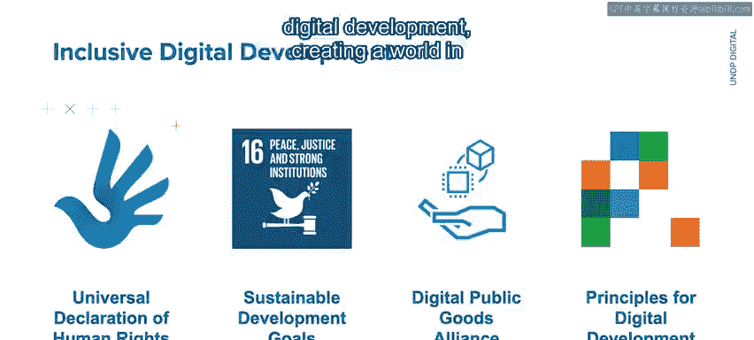
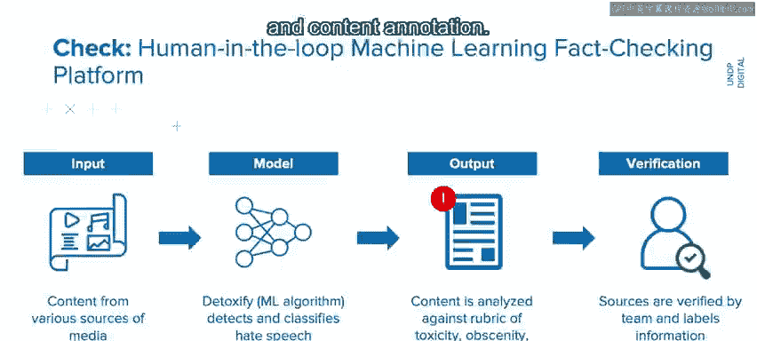
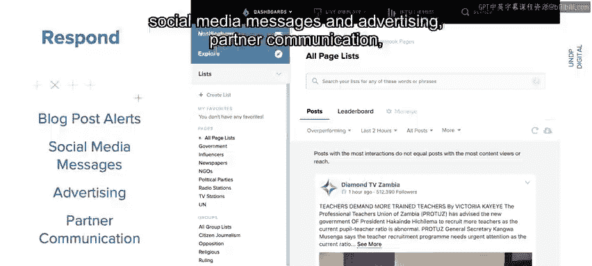
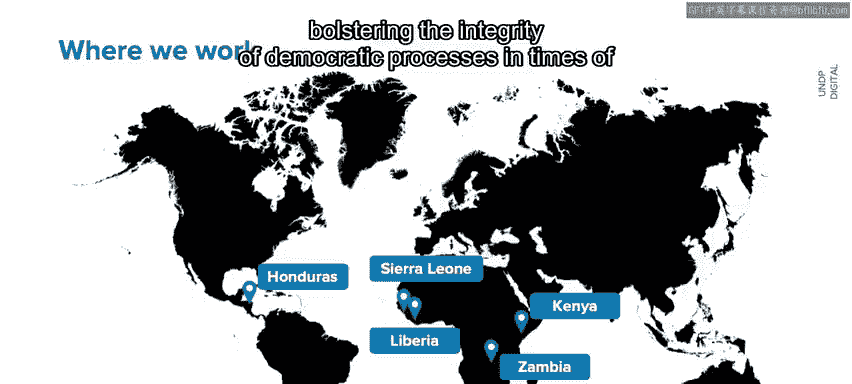
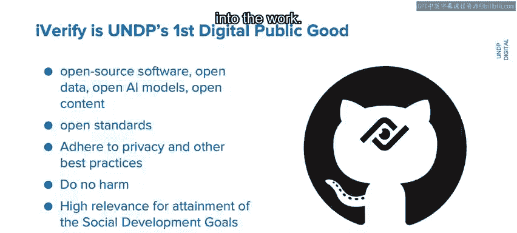
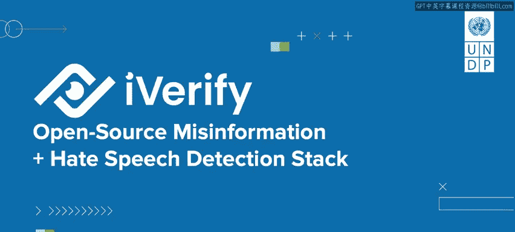

# 093：虚假信息与仇恨言论检测 🛡️

在本节课中，我们将学习联合国开发计划署如何利用人工智能技术应对数字时代的挑战，特别是通过开源工具“I Verify”来检测和应对虚假信息与仇恨言论，以维护选举公正和社会稳定。

---

## 概述：数字时代的挑战与机遇 🌐

我是马克·贝林斯基，来自联合国开发计划署。作为联合国最大的机构，我们在超过170个国家开展工作，致力于消除贫困和减少不平等。

在日益数字化的世界中，我们面临着一个重大挑战：互联网在这项工作中的角色。互联网有启迪我们的力量，但也有误导的潜力。例如，全球选举中令人不安的虚假信息回响，或在公共平台上出现的、煽动不和与分裂的仇恨言论，而我们需要的是对话与理解。

一个具体的例子是，曾有关于COVID-19疫苗的虚假信息流传，谎称疫苗含有牛血，因此违背了印度教的传统。结果，这些社区的一些人因此对接种疫苗产生了犹豫。互联网可以是推动进步的强大工具，但我们也必须正视其潜在的破坏力。

在联合国开发计划署，我们致力于提供符合道德、以社区为中心的解决方案。具体来说，我所在的团队专注于包容性数字发展，目标是创造一个数字技术为人民和地球赋权的世界。

---

## 核心挑战：选举与信息完整性 🗳️

每年，全球有数亿甚至可能超过十亿人受到国家选举的影响。这是全球人口中相当大的一部分，他们受到所接收信息完整性的影响。

我们经常在那些寻求我们帮助以确保选举公正性的国家开展工作。为了应对这些挑战，并恪守我们对道德和社区中心解决方案的承诺，我们开发了“I Verify”——一个开源的虚假信息和仇恨言论检测工具。

---

## 解决方案：“I Verify”工具的三步工作流程 ⚙️

“I Verify”在三个协作阶段中工作：**识别**、**事实核查**和**响应**。这些步骤由人工智能驱动，但由人类的判断力主导。

以下是其工作流程的详细步骤：

**1. 识别阶段：搜索潜在问题**
通过与社交媒体公司的API集成，“I Verify”快速筛查在线内容，搜索潜在的虚假信息和仇恨言论。公民也可以通过热线提交问题，询问他们看到的信息是否准确。

**2. 事实核查阶段：机器与人工协同验证**
所有输入内容首先会由一个名为“Thetify”的机器学习工具扫描，以检测仇恨言论。我们使用一个评估标准来分析内容，包括：
*   **毒性**
*   **淫秽内容**
*   **威胁**
*   **侮辱**
*   **身份攻击**
*   **色情内容**

每个方面都会被打分，这提供了一个我们可以查看的总体分数，或者我们可以查看这些类别中的峰值。接下来，此步骤的输出结果会由我们专门的核查员团队进行验证，他们检查信息来源并为信息打上标签，使用的是另一个机器学习工具“Me Dan”。这个“人在回路”的机器学习步骤确保了由人类进行的严格而准确的评估，并利用人工智能确保相同信息无需被重复核查。机器学习工具与人工核查员的结合，实现了规模化的事实核查和内容标注。

**3. 响应阶段：警报与沟通**
最后，在响应阶段，我们的合作伙伴网络和公众会通过博客文章、社交媒体消息和广告，收到关于虚假信息和仇恨言论实例的警报。此外，我们还通过合作伙伴沟通和一个用于监测与评估的仪表板来跟进。

---

## 应用与影响：守护民主进程 🛡️

我们已在非洲和拉丁美洲的选举前部署了该工具，通常作为唯一的资源，帮助在虚假信息被武器化之前揭穿它，并在不确定时期增强民主进程的完整性。

---

## 未来展望：扩展覆盖与持续创新 🚀

展望未来，我认为“I Verify”将扩展其覆盖范围。我们仍需做更多工作来直接识别虚假信息，特别是在国际背景下。为了扩大覆盖范围，我们需要改进语言支持。虽然“I Verify”支持数十种语言，但我们关注的是数千种语言。此外，还有更多的媒介需要整合，从广播到新近发展的社交媒体平台。

随着更多的数字内容被审查和标记，我们可以赋能所有互联网用户辨别真伪。我们将“I Verify”开发为一个数字公共产品。对我们而言，这项工作以负责任、透明的方式进行，并拥有一个开源社区来帮助持续推动创新，这一点非常重要。

---

## 总结：构建可信的数字未来 🤝

作为一名开发者，我相信像“I Verify”这样的工具的潜力。凭借道德准则以及人工智能与人类努力的结合，我们的目标是帮助每个人更自信地驾驭数字世界。共同努力，我们可以将我们的数字环境转变为一个信息灵通的对话空间。

---

本节课中，我们一起学习了联合国开发计划署如何利用“I Verify”这一开源AI工具，通过识别、核查、响应三步流程，有效应对虚假信息和仇恨言论的挑战，以保护选举公正性和社会凝聚力，并展望了通过技术创新和社区合作构建更可信数字未来的愿景。