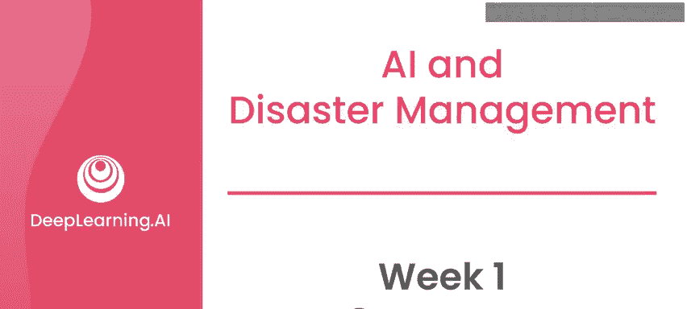
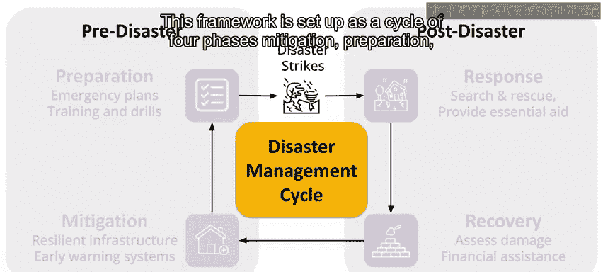
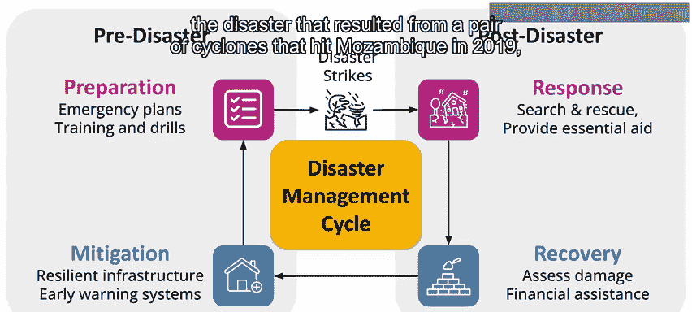
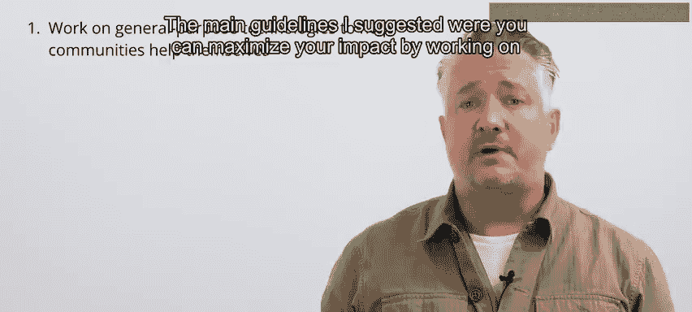
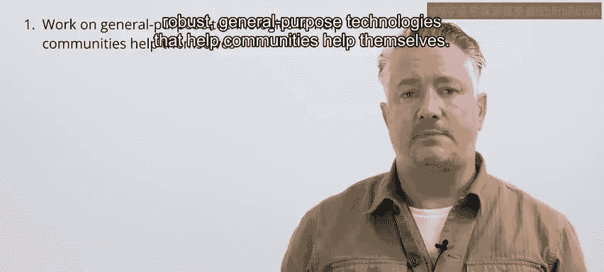
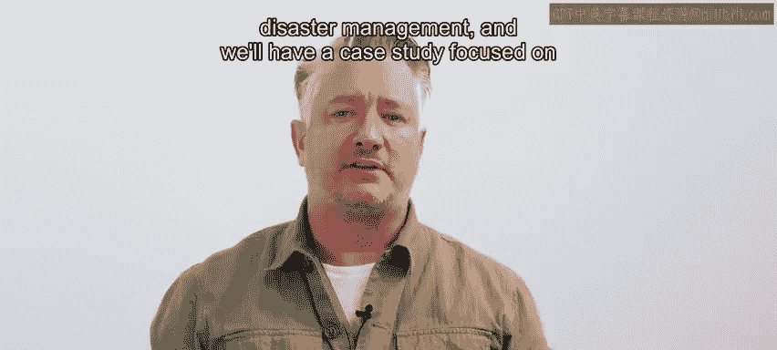
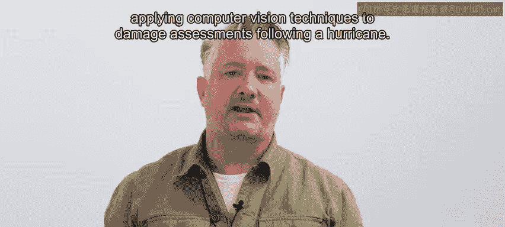

# 094：第1周总结 📚

在本节课中，我们将回顾第一周课程的核心内容，总结关于AI在灾难管理中应用的关键概念与指导原则。

你已经完成了本课程第一周的学习。在进入第一个案例研究——关于如何使用卫星图像进行飓风后的损害评估——之前，我将简要回顾本周的主要观点。

## 本周核心概念回顾 🔄

上一节我们介绍了课程的整体框架，本节中我们来具体看看第一周涵盖的核心内容。

我们本周首先讨论了灾难的确切构成要素，以及灾难对当地社区、基础设施和环境可能产生的影响。你学习了一个被许多灾难响应组织采纳的灾难管理框架。该框架被设置为一个包含四个阶段的循环：**减灾、准备、响应和恢复**。我们以2019年袭击莫桑比克的一对气旋所造成的灾难为例，探讨了这四个阶段如何展开，以及AI如何参与这些不同阶段。

在此之后，我们探讨了AI在其他灾难管理工作中的应用，并分享了一些指导原则，以确保在你自己的项目中，能够优化以产生积极影响并避免伤害。

## 关键指导原则 📋

以下是确保AI项目在灾难管理中产生积极影响、避免伤害的关键指导原则列表：

*   **聚焦通用技术**：通过开发**稳健的通用技术**来最大化你的影响力，这些技术能帮助社区实现自助。
*   **支持低资源语言**：利用**翻译和搜索**等技术更好地支持低资源语言的工作，将对灾难响应和恢复产生积极影响。
*   **默认保护隐私**：在所有工作中默认采用**隐私数据实践**，并记住聚合数据和机器学习模型本身可能会放大隐私风险。
*   **规避风险项目**：避免涉及分析社交媒体数据的项目，以及由压迫性政权资助的工作。
*   **与受影响社区互动**：与受影响的社区互动，以确保你的项目有最高的成功机会，并将造成伤害的可能性降至最低。

如果你牢记这些指导原则，无论具体情境如何，你在帮助减少灾难影响方面的努力都将更有可能成功。

## 总结与预告 🎯

本节课中我们一起学习了灾难管理的基本框架、AI在其中的应用实例，以及开展相关项目时需遵循的重要伦理与实践原则。

在下一周的材料中，我们将深入探讨AI与灾难管理中一些更技术性的方面，并将进行一个案例研究，重点是将计算机视觉技术应用于飓风后的损害评估。期待在课程的下周与你相见。