# 095：基于卫星图像的灾后损害评估案例 🛰️


## 概述

在本节课中，我们将学习如何利用人工智能技术，特别是卫星图像分析，进行灾后损害评估。我们将通过一个具体案例——2017年美国飓风“哈维”——来探索这一过程。课程将涵盖从数据收集、模型构建到实际应用的全流程，并强调在灾难管理的不同阶段（特别是缓解和准备阶段）提前开展工作的重要性。

---

## 空中图像在灾难管理中的应用

上一节我们介绍了AI在灾难管理中的整体框架。本节中，我们来看看一种关键的数据来源：空中图像。

空中图像是多种应用中的重要工具，例如地图绘制、导航、天气预报。它也被用于追踪森林砍伐、冰川和海冰融化，或观察动物种群。

在灾难管理中，俯瞰图像可用于评估灾难对某个区域或社区的影响范围和程度。它能提供进入难以到达或危险区域的途径和视野，这些区域在地面可能难以接近。

以下是获取俯瞰图像的几种主要平台及其特点：

*   **卫星**：覆盖范围广，但图像分辨率可能相对较低，且云层覆盖可能使卫星图像无法用于评估地面损害。
*   **飞机**：有时能在云层下飞行，收集分辨率相对较高的图像，并能快速覆盖较大区域。
*   **无人机**：小巧灵活，能更靠近地面飞行，但飞行距离有限。

---

## 案例研究：飓风“桑迪”的损害评估

现在，让我们通过一个实际案例来理解这个过程。我将分享我在飓风“桑迪”灾后评估工作中的经验。

2012年飓风“桑迪”袭击美国东部后，隶属于美国军方的民间空中巡逻队飞越受损区域，拍摄了超过35,000张图像。使用飞机的一个优势是，持相机的人员可以观察到受损更严重的区域，从而在数据收集环节重点关注这些区域。

然而，处理35,000张图像是一个巨大挑战。为此，美国政府机构首次与第三方合作，包括我当时所在的公司Idibon等，以支持信息处理流程。

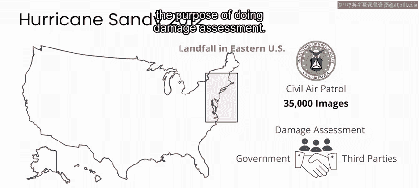

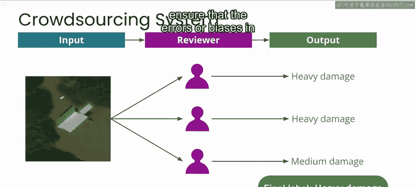

我们建立了一个系统，让数千名非专业的公众志愿者通过在线众包系统评估图像中的损害程度。贡献者每次查看一张图像，并给出三档判断：**无损害**、**中度损害**或**重度损害**。为确保个体误差或偏见最小化，我们将同一张图像分发给多人进行评估。

```python
# 伪代码示例：众包标签聚合逻辑
def aggregate_labels(image_id, all_responses):
    # all_responses: 针对同一image_id，所有志愿者提交的标签列表
    # 例如: ['轻度', '重度', '中度', '轻度']
    label_counts = count_occurrences(all_responses)
    # 采用多数投票等策略确定最终标签
    final_label = majority_vote(label_counts)
    return final_label
```

利用这些标注数据，我们得以研究如何部署一个分类器来自动进行初步损害评估。这里我想强调一个关键点：我们构建的系统之所以成功，是因为我们提前数月进行开发、测试，确保飓风来袭时它可以立即部署。

我们后来还邀请了专业损害评估员查看部分相同数据，以验证众包结果的准确性。我们发现，**只要将同一任务分发给多人并汇总结果**，非专家提供的损害评估可以与专家一样准确。这是一种通过集体智慧弥补个体误差的有效方式。

---

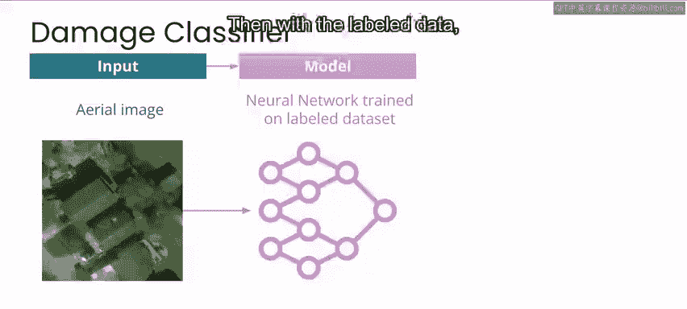

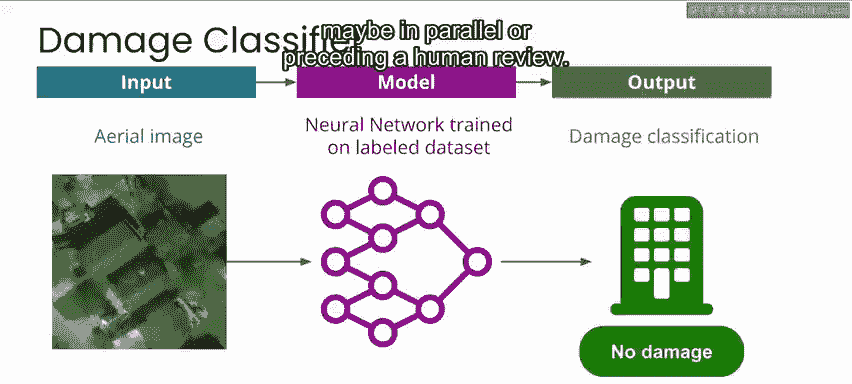

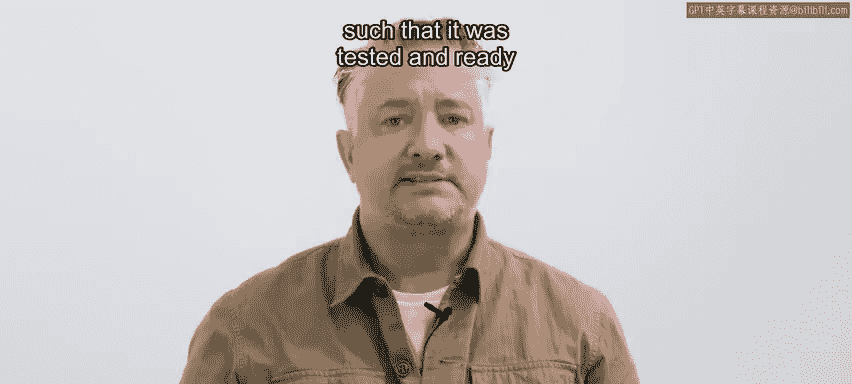

## 有效介入的重要性：经验与教训

上一节我们看到了一个成功的合作案例。本节中，我们来看看一个反面教训，以理解在灾难响应中建立长期关系的重要性。

我们的一位合作者，人道主义OpenStreetMap的凯特·查普曼，讲述了一个关于2015年尼泊尔地震后的故事。一些人在响应阶段才介入，之前未与当地社区建立联系，并试图在受损区域部署无人机。这引起了当地居民的困惑甚至恐惧，因为该地区历史上曾与尼泊尔中央政府关系紧张。最终，尽管投入了大量资源，这些人的努力未能对响应结果产生积极影响。

因此，即使意图良好，在灾难发生时才首次介入一个地区，是最不可能成功的，并且在许多情况下可能弊大于利。若想在灾难响应阶段有效发挥作用，最好在长期的恢复、缓解和准备阶段就开始你的工作。

---

## 本周实验：飓风“哈维”损害评估项目

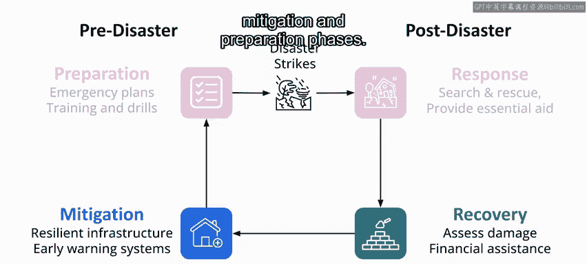

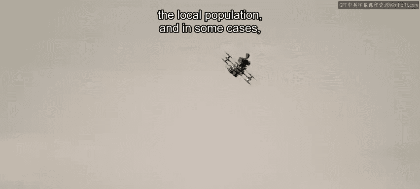

基于以上背景，在本周的实验中，你将探索受飓风“哈维”影响区域的卫星图像，进行类似于我们在飓风“桑迪”后所做的损害评估。

你将构建一个模型，将每张图像分类为**受损**或**未受损**，并将每张图像的位置标记在地图上，从而为灾难管理人员提供信息。

请为这个项目设想以下场景：你正在开发一个系统，旨在飓风后为损害评估提供自动化的图像分析。这是一个你将在**缓解和准备阶段**进行的项目。

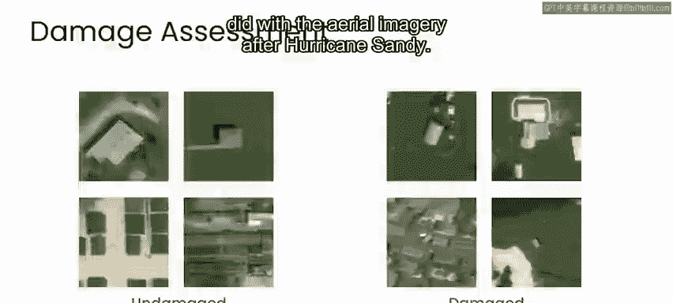

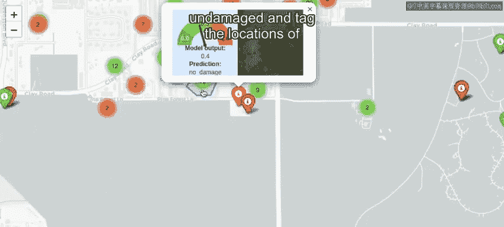

以下是此类工具可能带来的帮助：

*   帮助灾难响应者确定资源部署地点。
*   估算区域损害成本。
*   确定重建工作的优先顺序。

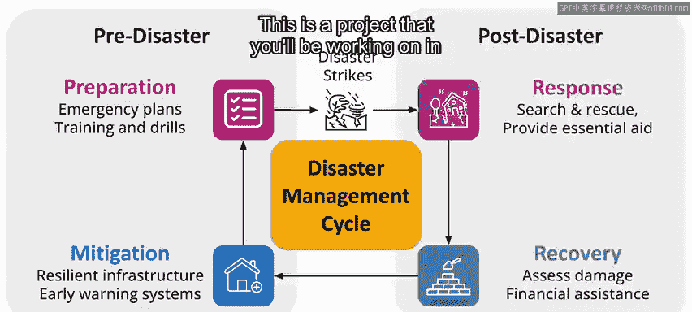

---

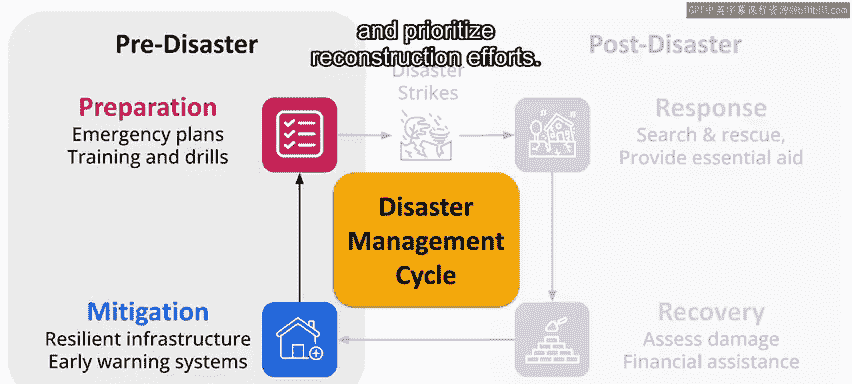

## 总结与下节预告

本节课中，我们一起学习了空中图像在灾难管理中的应用，分析了飓风“桑迪”损害评估的案例，理解了提前准备和社区参与的重要性，并介绍了本周即将动手实践的飓风“哈维”评估项目。

在下一个视频中，我们将快速回顾“AI for Good”框架。如果你刚学完前两门课程，对该框架的四个阶段记忆犹新，可以跳过下一个视频。在随后的视频中，我们将详细了解飓风“哈维”的具体情况以及风暴过后的即时状况。之后，我们将正式进入本项目的探索阶段。