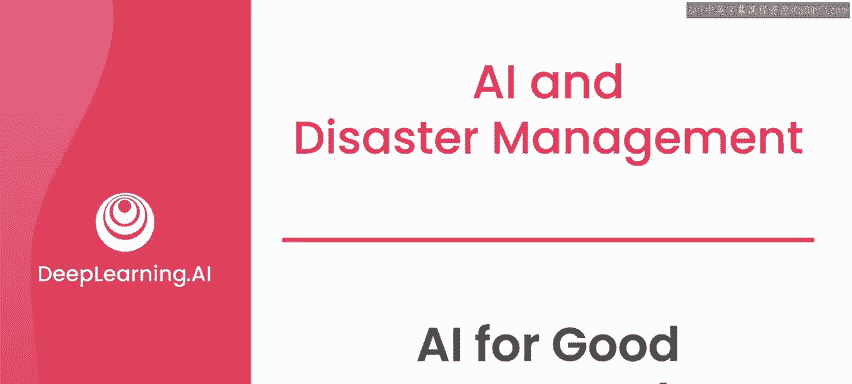
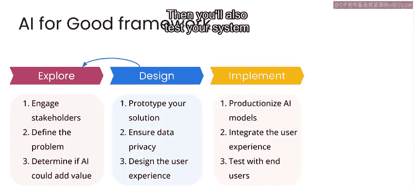
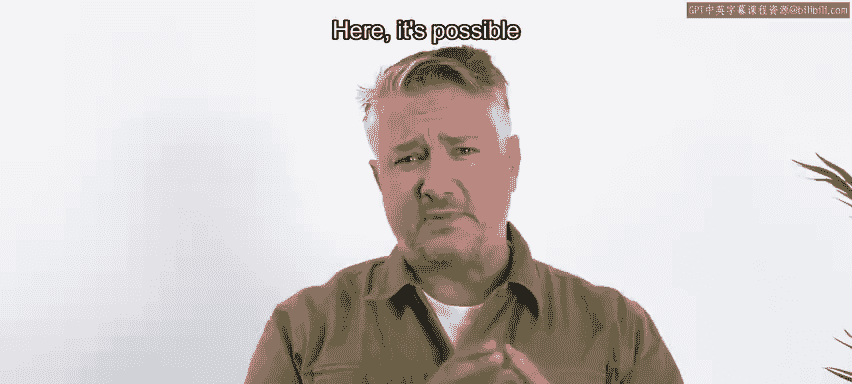
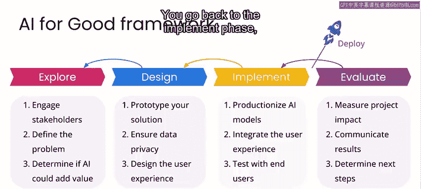

# 096：人工智能为善框架 🧭

在本节课中，我们将学习“人工智能为善”项目框架，并通过“哈维飓风损害评估”项目来实践该框架。该框架包含四个阶段：探索、设计、实施与评估。我们将逐一解析每个阶段的核心任务与目标。

---

## 探索阶段 🔍

上一节我们介绍了课程的整体目标，本节中我们来看看框架的第一个阶段：探索。

在探索阶段，你需要与利益相关者建立联系，明确要解决的问题，评估项目的可行性，并确定人工智能是否能为解决方案带来价值。

以下是探索阶段的核心步骤：

*   **联系利益相关者**：与项目相关的人员或组织进行沟通。
*   **定义问题**：清晰界定你希望解决的具体问题。
*   **评估可行性**：分析项目在技术、数据和资源方面的可行性。
*   **确定AI价值**：判断人工智能技术是否能有效提升解决方案。

如果探索阶段的结果显示项目前景良好，便可以进入下一阶段。

---

## 设计阶段 ✏️

完成了问题的初步探索后，我们进入设计阶段。

在设计阶段，你需要构建解决方案的原型，制定模型策略，深入研究数据，并思考如何确保数据隐私以及用户将如何与你的系统交互。

**设计阶段可能是一个迭代过程**。有时，你可能会发现探索阶段的一些假设并不成立，这时需要返回探索阶段，与利益相关者进行更多讨论，或者重新修订问题陈述。这个过程可以用以下方式表示：

`设计阶段 -> 返回 -> 探索阶段`

一旦确定了最终的设计方案，就可以进入实施阶段。

---

## 实施阶段 ⚙️

设计蓝图完成后，接下来就是将想法变为现实，即实施阶段。

在实施阶段，你需要将设计环境中测试的模型“产品化”，这意味着为部署和与用户界面集成做好准备。同时，你还需要对系统的性能和可用性进行测试。

**实施阶段同样可能存在迭代**。在实施过程中，你可能会发现设计的某些方面无法奏效，这时需要返回设计阶段进行调整。这个过程可以表示为：

`实施阶段 -> 返回 -> 设计阶段`

当你对实施结果感到满意时，便为部署做好了准备。

---

## 部署与评估阶段 🚀

系统实施完成后，便是部署与评估阶段。

部署涉及大量技术细节，远不止“按下按钮，上线运行”那么简单。成功部署后，你需要评估项目的影响，沟通你的发现，并决定下一步行动。

评估后，通常会有几种常见的后续路径：

*   **返回实施阶段**：你可能希望微调系统的某些实现，然后重新发布更新版本。
*   **返回设计阶段**：你可能发现设计的某些部分未达预期，需要重新思考系统组件。
*   **返回探索阶段**：你可能决定探索初始问题的新方向，或开始研究一个全新的问题。

实际项目的过程往往比这个简化的框架图更为复杂。但牢记这个框架，能帮助你在每个阶段保持方向，更有可能获得成功，或至少能在偏离轨道时及时发现并有效回归。

---

## 总结 📝

本节课中，我们一起学习了“人工智能为善”项目框架的四个阶段：**探索、设计、实施与评估**。这是一个非线性的迭代过程，各阶段之间可能需要根据实际情况灵活回溯。接下来，我们将以“哈维飓风损害评估”项目为例，开始本项目的探索阶段。