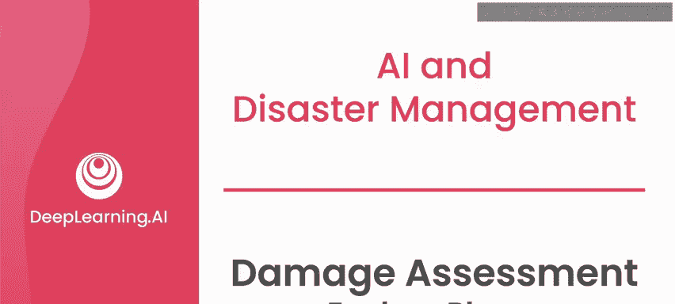
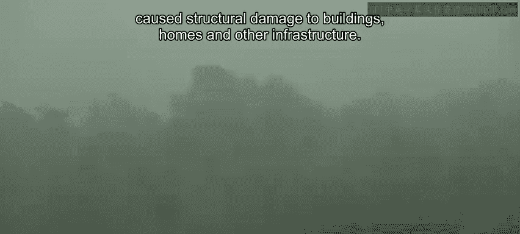
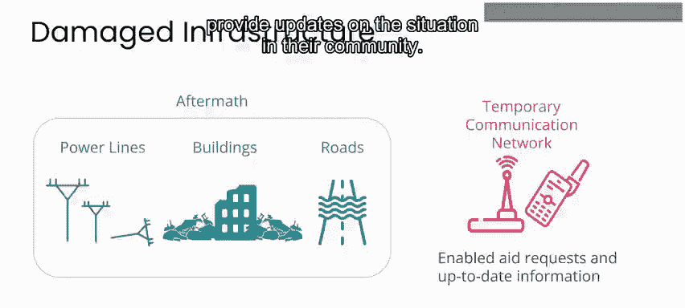
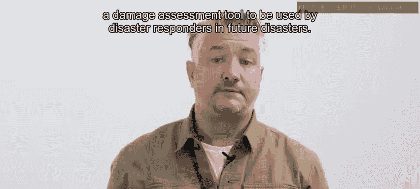
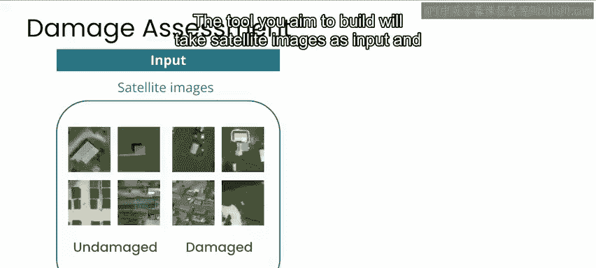
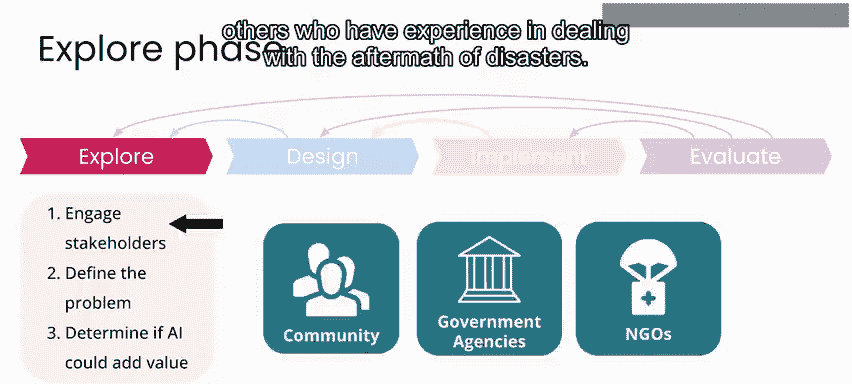
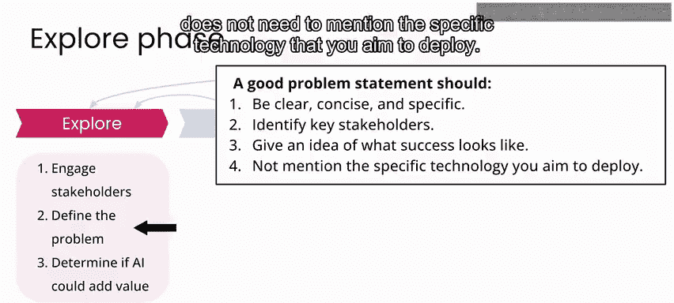
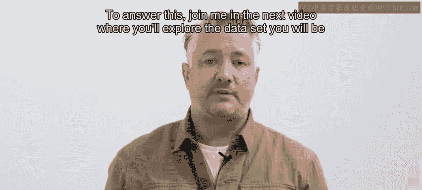

# 097：损害评估探索阶段 🧭

在本节课中，我们将学习如何为一个灾害响应项目进行探索阶段的工作。我们将以2017年飓风“哈维”后的损害评估为例，了解如何识别关键利益相关者、定义问题陈述，并初步判断人工智能是否能为此类项目带来价值。

---

## 飓风“哈维”的灾害背景

飓风“哈维”是一场强大的风暴，于2017年8月25日袭击了美国墨西哥湾沿岸各州。

风暴为该地区带来了破纪录的降雨，许多地区在四天内降雨量超过一米。

其结果是灾难性的洪水，造成超过100人丧生和1250亿美元的经济损失。

飓风“哈维”过后，政府响应机构立即行动。

这些机构包括联邦紧急事务管理局（FEMA）、国民警卫队和美国海岸警卫队，他们被部署去援助因洪水上涨而受困的人们。

美国红十字会和地方食品银行在建立临时避难所、为受风暴影响的人们提供食物、水和其他物资方面发挥了关键作用。除了强降雨，风暴还带来了高达每小时250公里的强风。

强风刮倒了树木，损坏了电线，并对建筑物、房屋和其他基础设施造成了结构性破坏。

---

## 灾后通信与响应挑战

随着停电、电话线中断和手机信号塔受损，许多人失去了电话或互联网服务，这使通信和获取关键信息变得复杂。

联邦通信委员会与公司合作建立了临时通信网络，包括卫星电话和便携式手机信号塔。此外，社交媒体和其他在线平台使人们能够分享信息、请求援助，并提供他们所在社区的情况更新。

到了九月中旬，即风暴过去几周后，响应工作开始稳定，许多临时避难所因需要紧急援助的人数减少而开始关闭。

---

## 从应急响应转向重建

随后，FEMA开始协调修复和重建受损基础设施的工作。

虽然强风造成了重大破坏，但风暴最大的影响是大范围的洪水。你将在探索数据时看到更多细节。

一场重大灾害发生后，卫星图像可以成为获取地面状况信息的一种方式。对于这个项目，请设想一个场景：你作为一个团队的一员，正在为未来的灾害响应人员构建一个损害评估工具。

---

## 项目目标：构建损害评估工具

你计划构建的工具将以卫星图像作为输入，并生成一张标有受损和未受损位置的地图。

这张地图随后将被灾害管理人员用来为他们的决策提供信息，以分配援助和确定重建工作的优先级。需要指出的是，此类项目的结果不应是识别受损位置的唯一真相来源，而是应与其他信息来源结合，为地面救援和资源分配团队提供信息并指导部署。

由于这个工具是为人类决策者提供信息，这也会影响你评估工具准确性的方式。例如，你可能希望强调工具不能遗漏任何潜在的受损区域，因此其准确性将由**召回率**决定，而不是图像中识别受损与非受损区域的整体准确率。我们将在后续的实验中，从**精确率**和**召回率**两方面来评估这个项目。

---

## 探索阶段的关键步骤

此时，你正处于项目的探索阶段。你需要采取的关键步骤是：与利益相关者沟通、定义你的问题陈述，并确定人工智能是否能增加价值。

以下是探索阶段需要完成的主要任务列表：

首先，也是最重要的利益相关者是受灾社区的成员。你提供的损害评估不仅有助于向这些社区分配资源，还可能影响他们在长期恢复阶段如何获得政府救济资金或保险索赔。当地社区成员还拥有关于该地区基础设施的宝贵知识，这些知识有助于为损害评估过程提供信息。

关键利益相关者还可能包括像FEMA这样的政府机构、州和地方政府，以及参与响应的任何军事组织。其他利益相关者可能是非政府组织，例如美国红十字会和其他有处理灾害善后经验的组织。

---

## 定义问题陈述

确定了关键利益相关者后，是时候撰写你的问题陈述了。

请记住，一个好的问题陈述应清晰、简洁、具体，能识别关键利益相关者，并且不需要提及你计划部署的具体技术。

在这种情况下，你为这个项目撰写的问题陈述可能是：
**“灾害管理人员需要利用大量高空图像来识别和评估受损区域，以确定响应工作的优先级、分配资源并规划和开展恢复与重建活动。”**

如果你学习过之前的课程，你会知道我要在这里提醒你，一个好的问题陈述通常需要与利益相关者进行数周或数月的反复迭代，才能最终确定你试图实现的目标。

---

## 判断AI是否能增加价值

探索阶段的下一步是确定人工智能是否能为你项目增加价值。

要回答这个问题，请与我一起进入下一个视频。你将探索用于飓风“哈维”后损害评估的数据集。

---

## 总结

本节课中，我们一起学习了灾害响应项目探索阶段的核心工作。我们以飓风“哈维”为例，了解了灾害背景、通信挑战以及从应急到重建的过渡。我们明确了构建一个基于卫星图像的损害评估工具的目标，并学习了探索阶段的关键步骤：识别利益相关者、撰写清晰的问题陈述，以及初步评估人工智能的应用价值。下一节，我们将开始探索具体的数据集。