# 098：损害评估项目 - 数据探索阶段 🛰️


在本节课中，我们将学习如何为卫星图像损害评估项目进行数据探索。在明确了关键利益相关者并定义了问题陈述之后，下一步就是探索数据，以确定人工智能是否能为解决方案带来价值。

## 数据来源与背景

上一节我们介绍了项目背景，本节中我们来看看具体的数据集。本实验探索的数据集来自2017年飓风“哈维”案例研究，由IE Dataport平台托管。该平台托管了用于推进研究的各种数据集。

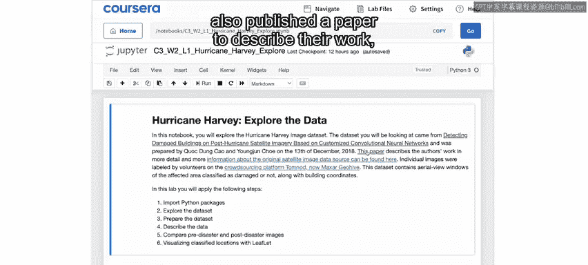

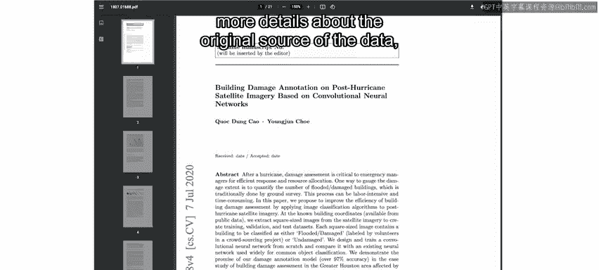

以下是关于数据集的详细信息：
*   **数据来源**：原始数据来自一颗名为GOI1的商业遥感卫星。
*   **数据标注**：数据通过Tomnod平台（现更名为Maxar Geohive）上的众包方式进行标注。

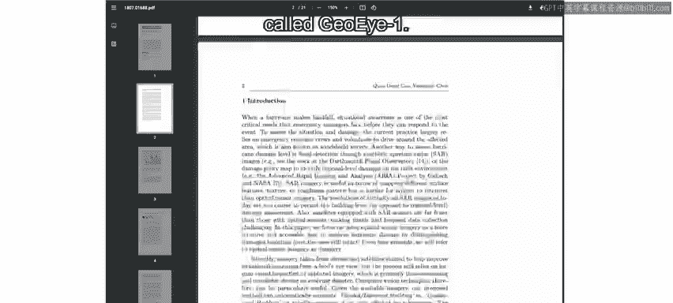


## 实验环境与数据概览


在深入实验之前，需要先熟悉Jupyter环境中的数据组织方式。


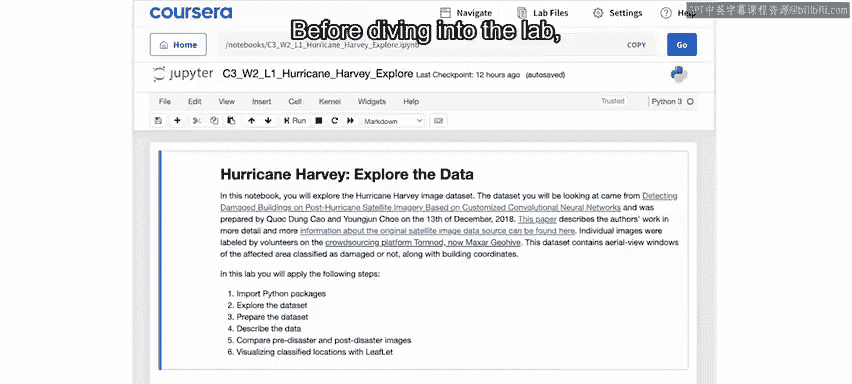

首先，在窗口左上角点击Jupyter图标。在此视图中，可以查看文件夹内容。打开`data`文件夹，会看到一个数据表，它描述了数据集的来源以及任何潜在的注意事项。

数据文件夹下包含三个子文件夹：`test`、`train`和`validation`。每个文件夹内又包含`damage`和`no_damage`两个子文件夹，里面存放着相应的图像文件。

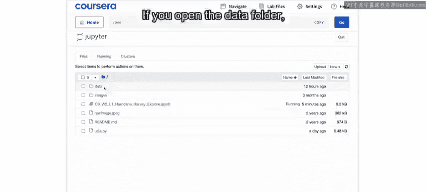

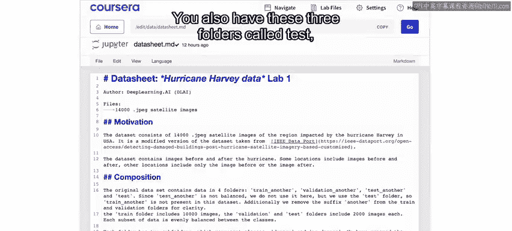

图像文件相对较小，有时甚至难以辨认内容，特别是显示损坏的图像。总体而言，这些是建筑物和财产的图像，由人类志愿者标注为显示损坏证据或未显示损坏证据。

此外，还有一个`utils.py`文件，其中存储了实验中将运行的部分代码。熟悉Python的用户可以查看此文件以了解部分函数背后的逻辑。

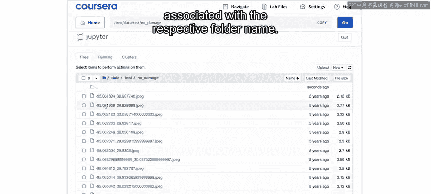

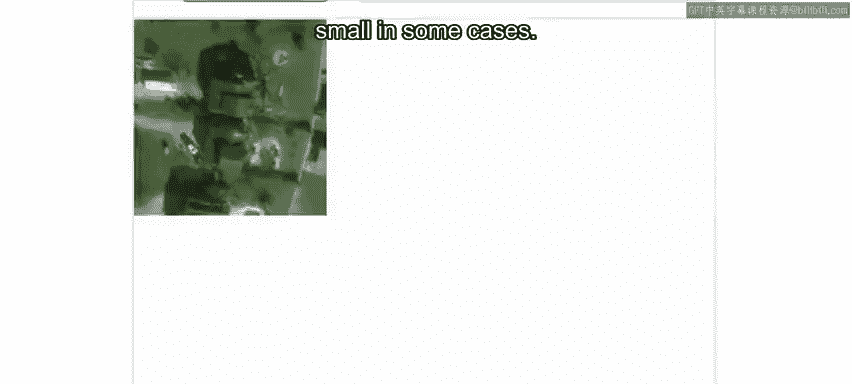

## 数据加载与初步分析

回到主笔记本，第一步是导入本实验所需的Python包。

```python
# 导入必要的Python包
import pandas as pd
import numpy as np
import matplotlib.pyplot as plt
# ... 其他导入语句
```

当看到包成功导入的消息后，就可以继续下一步。

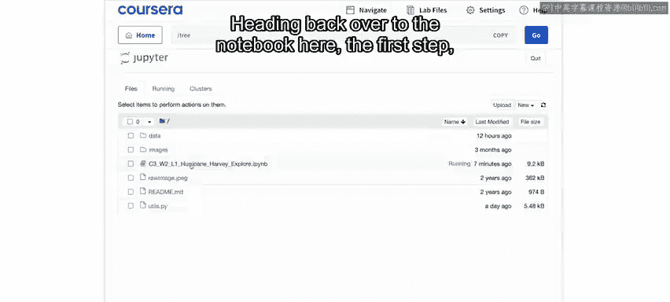

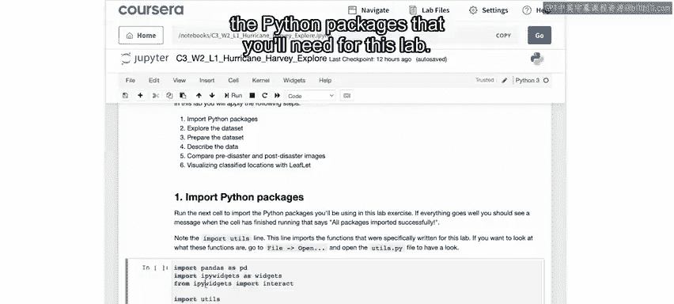

接下来，运行一个单元格，会出现一个选择按钮，允许你浏览之前查看的文件夹中的图像数据。你可以在`test`文件夹中，也可以导航到`train`和`validation`文件夹。

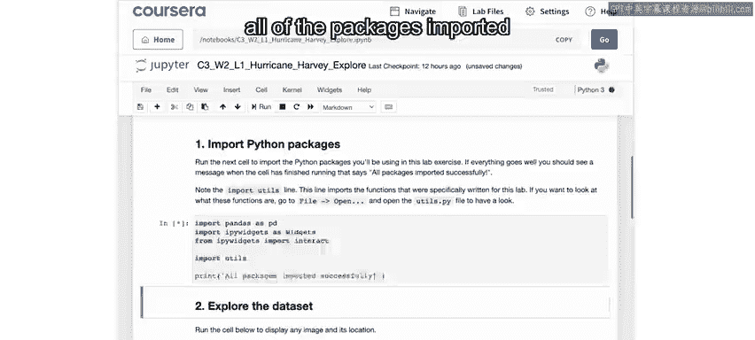

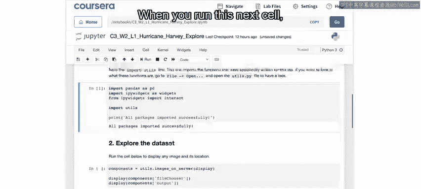

图像文件名中包含的数字是图像在地面上的经纬度坐标。通过此工具，可以查看每张图像及其在地图上的位置。

所有图像都位于`data`文件夹下，其结构可以总结如下：


```
data/
├── train/
│   ├── damage/
│   └── no_damage/
├── validation/
│   ├── damage/
│   └── no_damage/
└── test/
    ├── damage/
    └── no_damage/
```

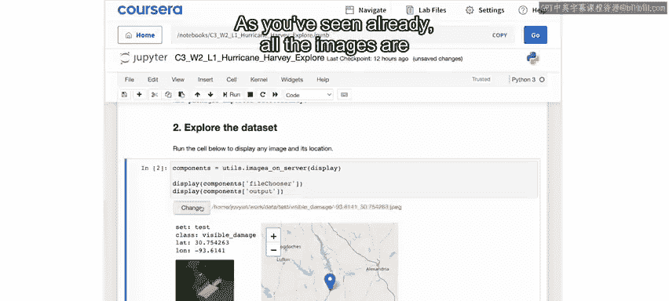

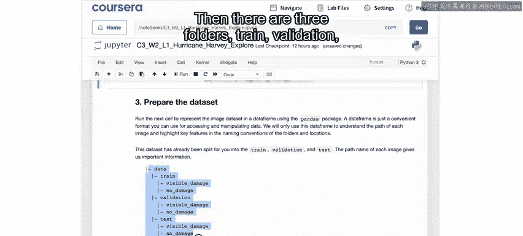

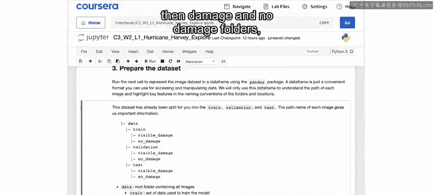

运行下一个单元格，会将所有文件名解析到一个表格数据框中。数据框包含以下列：
*   `subset`：图像来源（训练、验证或测试）。
*   `label`：被识别为`damage`或`no_damage`。
*   `lat` 和 `lon`：纬度和经度。
*   `path`：图像的完整路径。

这个数据框将用于处理图像，并为不同步骤选择所需的数据。

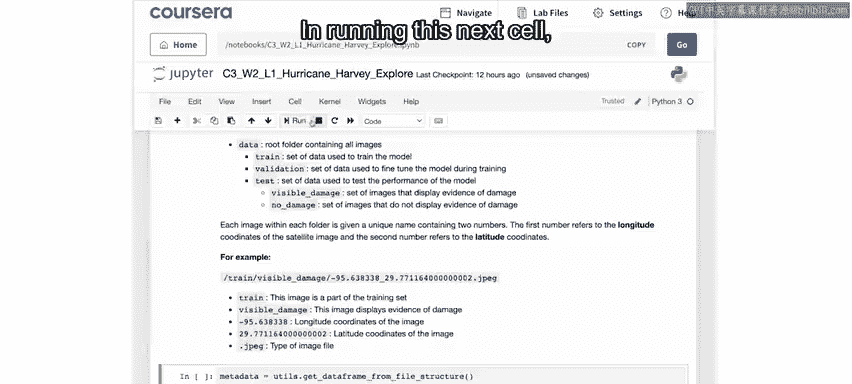

## 数据统计与观察

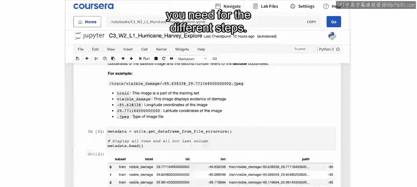

接下来，可以创建一个数据透视表，查看每个子集中`damage`和`no_damage`图像的数量。

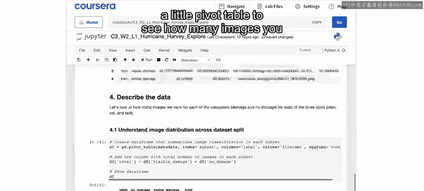

从统计结果可以看到，总共有14，000张图像，其中10，000张用于训练，2，000张用于验证，2，000张用于测试。每个子集中，`damage`和`no_damage`的图像数量相等。

这提示我们，这是一个经过高度整理的数据集。在现实中，灾后航拍图像中未损坏的图像数量很可能远多于可见损坏的图像。因此，在评估所构建模型的质量时，需要理解这一数据偏差。

## 图像对比分析

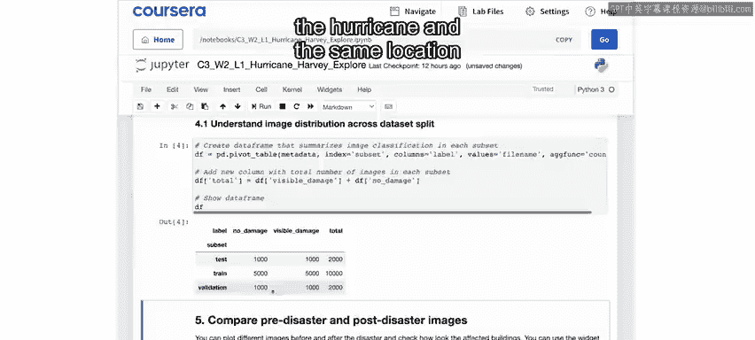

现在，我们可以对比查看飓风前后同一地点的图像。可以使用滑块滚动浏览不同的图像，或使用键盘上的方向键逐一查看。

需要注意的是，前后图像并不总是完全对准同一位置的中心。因此，有时可能需要一点时间来识别共同的特征。

例如，在查看图像时，可能会发现飓风前完好的游泳池和池边小屋，在飓风后的图像中，游泳池不再可见，而那个结构可能也完全消失了。这很可能是人类标注者判定该特定图片存在可见损坏的原因。

在许多图像中，建筑物看起来完好无损，但出现平坦的棕褐色区域，那就是洪水。洪水通常是损坏图像中最一致、最可识别的特征。

我们的目标是区分显示损坏和未损坏的照片。通过查看不同的图像，你可以感受这项任务的难易程度，从而对算法完成相同任务的成功率有一个初步判断。

## 数据地理分布可视化

最后，运行最后一个单元格，将在地图上显示所有图像的位置。

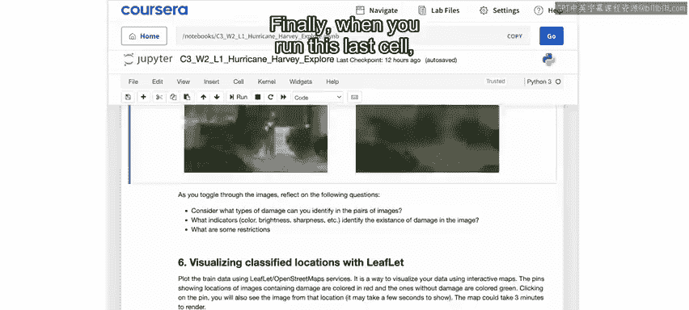

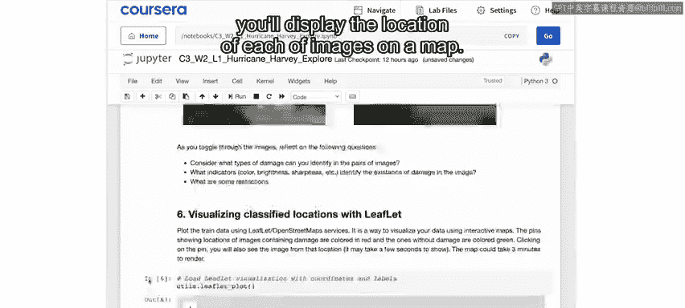

从地图上可以看到，数据集中在德克萨斯州的休斯顿地区。飓风从东南方向袭来，在德克萨斯州海岸登陆。

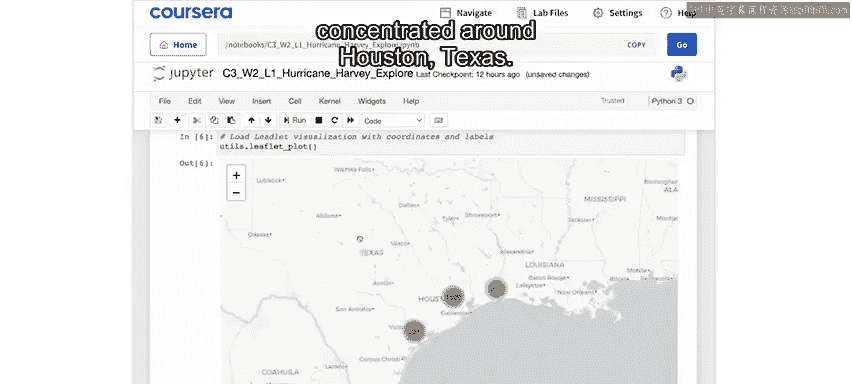

放大地图时，数据分布会以更精细的方式显示，展示不同区域的记录数量，最终显示为单个图钉。

单个图钉显示了图像的拍摄地点。点击图钉，可以看到分类（红色图钉表示`damage`，绿色图钉表示`no_damage`）以及该位置的图像。通过浏览地图，可以了解数据的地理分布以及损坏在该区域的分布情况。

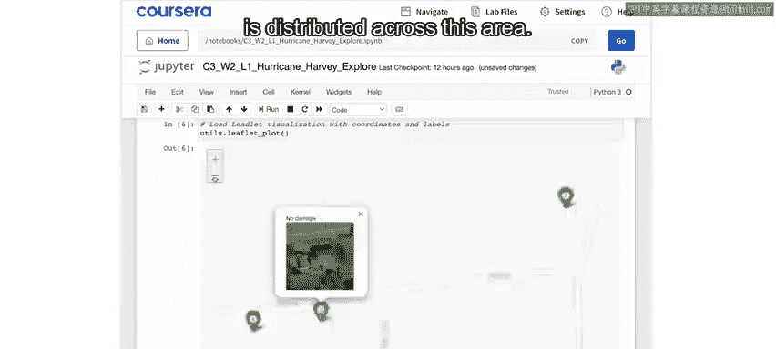

## 总结

本节课中，我们一起学习了损害评估项目的数据探索阶段。我们探索了一个包含数千个已标注的损坏和未损坏财产示例的数据集。通过对比查看特定地点的前后图像，了解了损坏的表现形式。我们还学习了如何将数据显示在地图上，以理解其地理分布。

接下来，我们将着手训练一个模型来自动识别损坏。但在开始建模之前，请继续观看下一个视频，我们将总结探索阶段的工作。