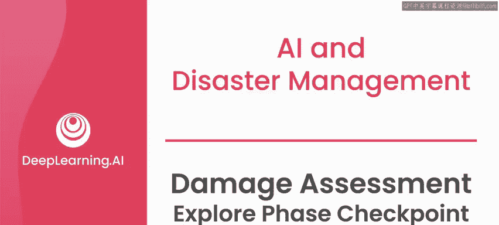
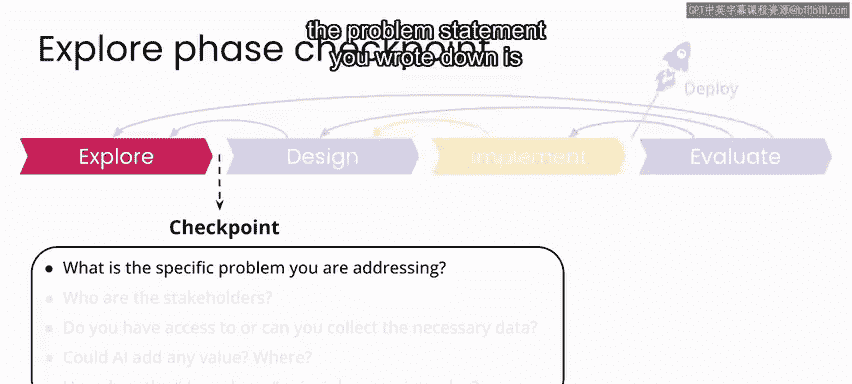
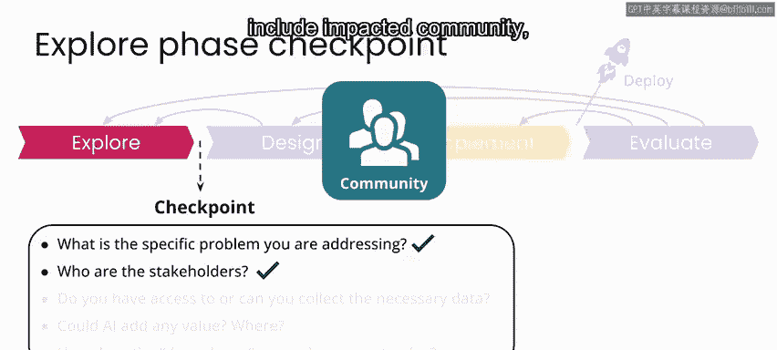
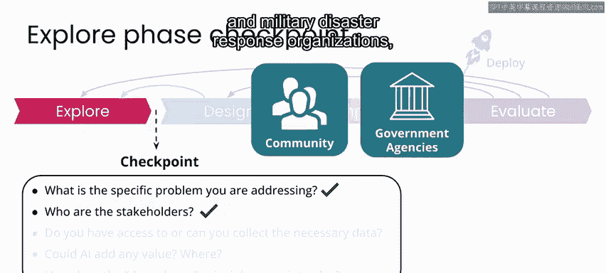
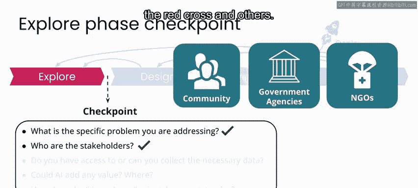
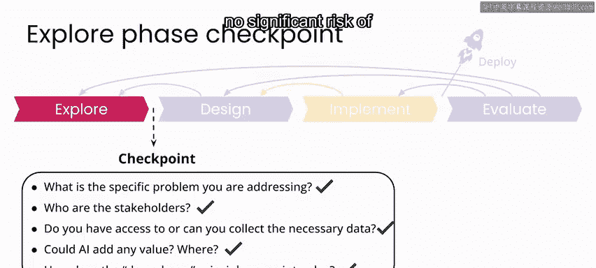

# 099：损害评估探索阶段检查点 📋

在本节课中，我们将回顾并检查在“利用卫星图像进行飓风哈维灾后损害评估”项目探索阶段所完成的工作。我们将确认是否已具备进入下一设计阶段的所有必要条件。

上一节我们介绍了如何利用卫星图像进行灾后损害评估的初步探索。本节中，我们来看看在进入设计阶段前，需要完成哪些关键检查点。

根据我们一直遵循的“AI for Good”项目框架，此时你和你的团队需要考虑以下几个核心问题。

以下是需要回答的关键问题列表：
*   需要解决的具体问题是什么？
*   利益相关者是谁？
*   是否能够获取或获得必要的数据？
*   人工智能能否增加价值？具体在何处以及如何实现？
*   “不伤害”原则在此如何应用？

---

## 问题陈述回顾

在本案例研究中，你写下的问题陈述是：**灾难管理者需要利用大量高空图像来识别和评估受损区域，以优先安排响应工作、分配资源，并规划恢复和重建活动。**

在这个问题陈述中，关键的利益相关者、希望构建的解决方案以及项目成功的愿景都已清晰界定。

## 利益相关者确认

你识别出的利益相关者包括：
*   受灾社区。
*   政府机构，例如联邦紧急事务管理局、州和地方政府，以及军事灾难响应组织。
*   非政府组织，例如红十字会等。

## 数据与AI价值评估

你拥有大量包含标签的卫星数据，这些标签标明了图像是否包含可见损害。

鉴于拥有这个带标签的数据集，可以合理假设，**如果你能利用这些数据训练一个自动图像分类系统，人工智能就可能增加价值**。

## “不伤害”原则考量

关于“不伤害”原则，与任何对公共或私人场所的成像一样，数据可能包含人员或财产的图像，其中隐私和安全将成为关注点。

特别是在灾难进行期间部署此类项目时，确保数据的安全存储，并且不发布任何可能泄露风险社区或受损财产细节的信息至关重要。

在我参与飓风桑迪的响应工作中，我们处理的图像分辨率非常高，包含了可辨识的个人和受损财产图像。在那次响应结束后，我们让另一家组织私下审查了我们收集和标记的数据以验证结果，然后我们所有人都删除了数据。

尽管这些数据可能为其他希望提供类似本课程工具的组织带来价值，但在飓风桑迪的案例中，我们无法保证发布数据不会造成伤害，因为某些区域需要数月或数年才能完全恢复。

在你当前的项目中，事件本身发生在五年多以前，因此图像中显示的区域大部分已从灾难中恢复。此外，图像分辨率相当低，无法识别任何个人。可以合理地假设，这个特定项目不存在重大的伤害风险。

然而，你可以设想，如果你对这些数据不那么确定（特别是如果这些数据不是为本课程提供的），那么你可能还需要考虑一个额外的标记任务：除了损害评估，人员还可以评估特定图像是否敏感，并立即将其从数据集中移除。

---

本节课中我们一起学习了如何对AI项目的探索阶段进行系统性检查。我们回顾了问题陈述、利益相关者、数据与AI潜力，并重点讨论了至关重要的“不伤害”原则及其在实际项目中的应用考量。

至此，你已完成飓风哈维项目的探索阶段。在下一课中，我们将共同进入项目的设计阶段。