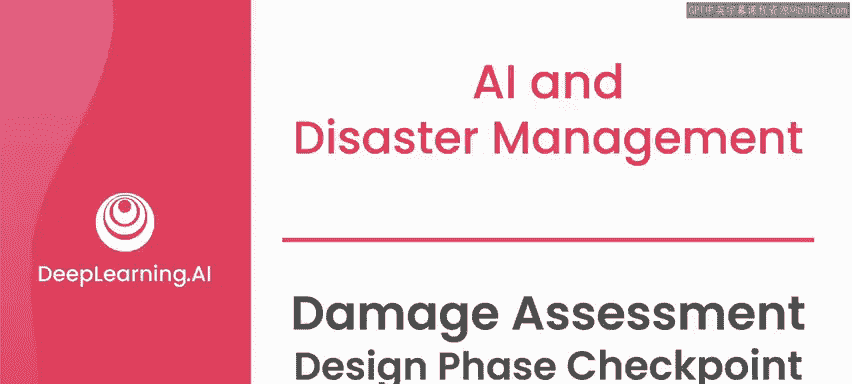
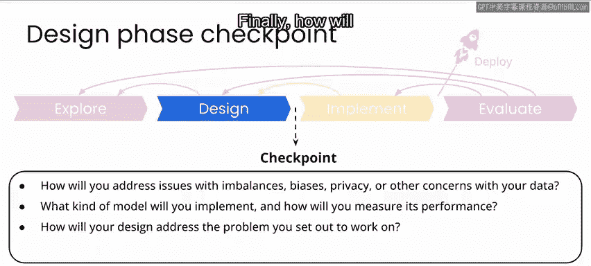
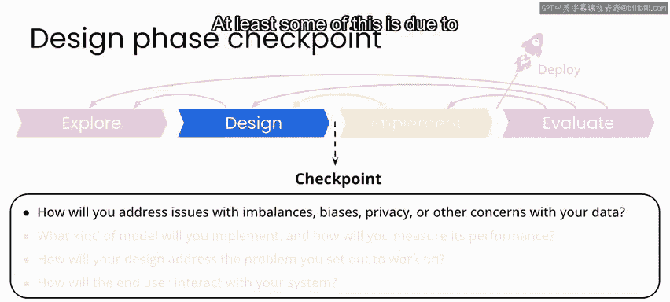
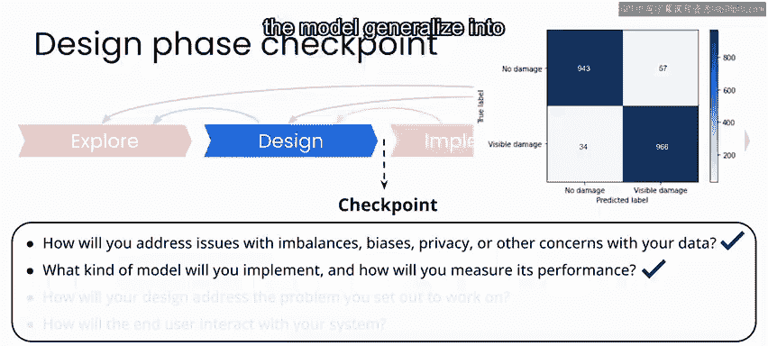
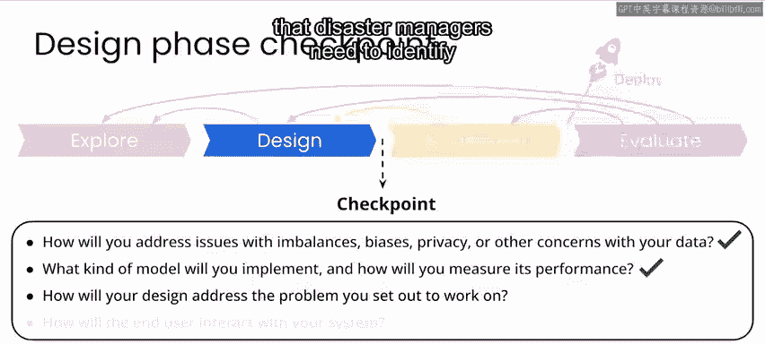
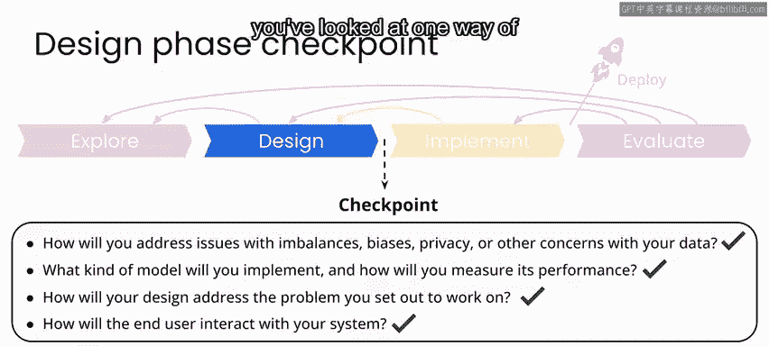

# 101：损害评估项目设计阶段检查点 🧐

在本节课中，我们将回顾并总结损害评估图像分类项目的设计阶段。我们将检查在数据、模型、问题解决和用户体验方面的关键考量，以确保项目具备进入实施阶段的条件。

---

## 数据考量与处理

上一节我们介绍了用于飓风后损害图像分类的神经网络模型。本节中，我们来看看如何处理数据相关的核心问题。

对于这个损害分类项目，我们认识到在许多情况下，即使是人类也很难正确识别图像中的损害。这至少部分是由于洪水是主要的损害原因，而建筑物本身常常保持完好。

以下是针对数据问题的处理方案：

*   **数据不平衡与模型鲁棒性**：在设计阶段，我们实施了**数据增强**技术，以使模型更加鲁棒。虽然从其他灾害中收集更多带标签的数据有助于模型更好地泛化到其他场景。
*   **隐私问题**：我们意识到，对于一个真实世界的灾害响应项目，可能会处理包含人员和财产的照片。在我们的数据处理流程中，这些需要被视为**机密个人信息**，并在项目完成后尽快删除，而不是存储或公开发布。
*   **偏见与社区关切**：除此之外，关于偏见或隐私问题，我们应持续关注任何受影响社区中可能出现的其他关切。

---

## 模型选择与性能评估

在明确了数据基础后，我们来看看为实现分类目标所选择的模型及其评估方式。

我们训练了一个基础的**卷积神经网络**模型，用于将图像分类为“显示损害”或“无损害”。我们的模型在测试数据集上表现出相对较高的准确率，并且我们通过混淆矩阵以及单个图像的检查，来了解模型的工作情况及其不足之处。

为了提升模型性能，可以考虑从其他灾害响应场景中收集训练数据，以帮助模型泛化到不同的条件和环境。

模型性能的核心评估指标可以总结为以下公式：
`性能 = f(准确率， 精确率， 召回率)`
我们需要根据项目目标（如最小化漏报）来选择最合适的评估指标。

---

## 解决方案与问题匹配

接下来，我们需要确认我们的设计方案是否真正解决了最初设定的问题。

我们着手解决的问题是：灾害管理人员需要使用大量航空影像来识别和评估受损区域，以便优先安排响应工作、分配资源以及规划恢复和重建活动。

考虑到目前我们的模型可能无法很好地泛化到其他灾害场景，但我们的设计能够通过快速自动分类数千张图像，并在某种用户界面中提供结果，来应对这个问题。

---

## 最终用户与交互设计

最后，我们聚焦于系统的使用者，思考他们将如何与我们的系统互动。

在本案例中，最终用户很可能是一位灾害响应人员，他需要考虑资源分配、特定区域的准入许可以及长期恢复计划等问题。

在我们目前的设计中，我们已经探讨了针对特定图像显示模型结果的一种方式，即同时展示模型预测结果和置信度，使其易于可视化。

这可以成为可视化工具的一部分，帮助响应人员理解损害的状况以及模型的工作情况。

---

## 总结与下一阶段展望

本节课中，我们一起学习了损害评估项目设计阶段的检查要点。我们回顾了如何处理数据不平衡、隐私和偏见问题；选择了卷积神经网络模型并讨论了其性能评估与改进方向；确保了设计方案能有效解决灾害管理中的核心问题；并初步规划了面向灾害响应人员的用户交互界面。

至此，本项目的设计阶段就结束了。在接下来的实施阶段，你将整合图像处理流程，以便能够从一批图像开始，快速显示分类结果并将其位置标注在地图上。