# 102：损害评估实施阶段 🚀


在本节课中，我们将学习如何将设计阶段训练好的模型，推进到实施阶段。我们将重点构建用户界面，以可视化模型预测的依据，并将所有预测结果在地图上展示出来。

---

## 导入必要的Python包

首先，我们需要导入本实验所需的Python包。

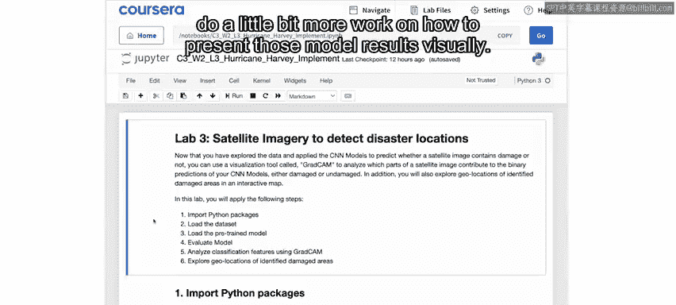

```python
import numpy as np
import pandas as pd
import matplotlib.pyplot as plt
# ... 其他必要的库
```

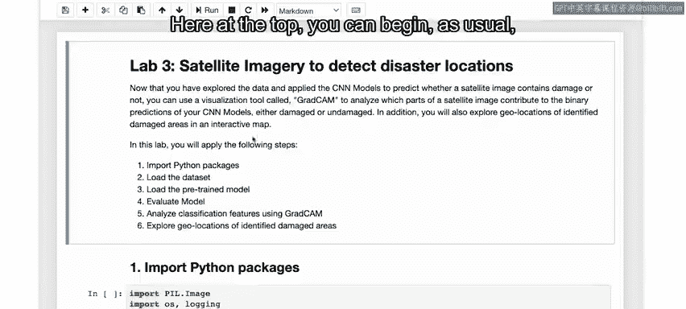

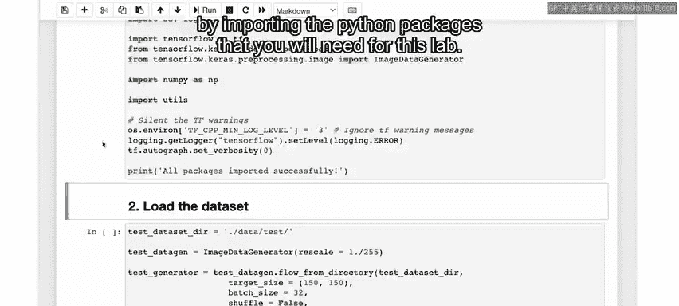

---

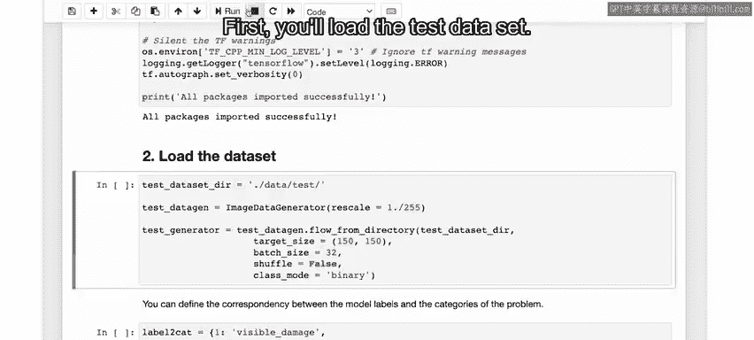

## 加载数据与模型

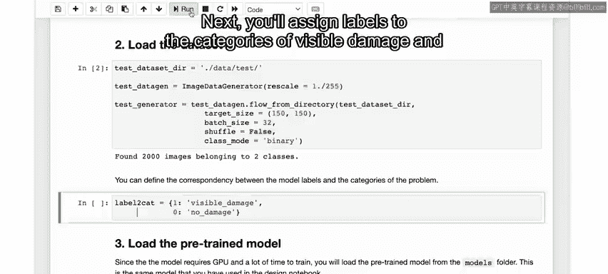

上一节我们介绍了实施阶段的目标，本节中我们来看看具体的操作步骤。首先，我们需要加载测试数据集。

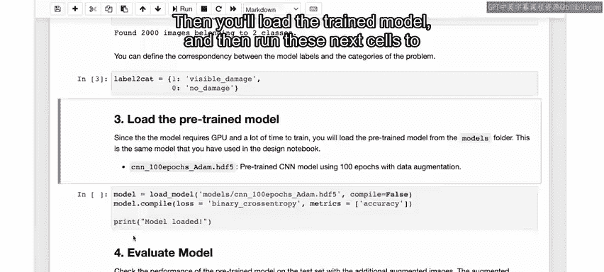

```python
test_data = load_dataset('test_set_path')
```

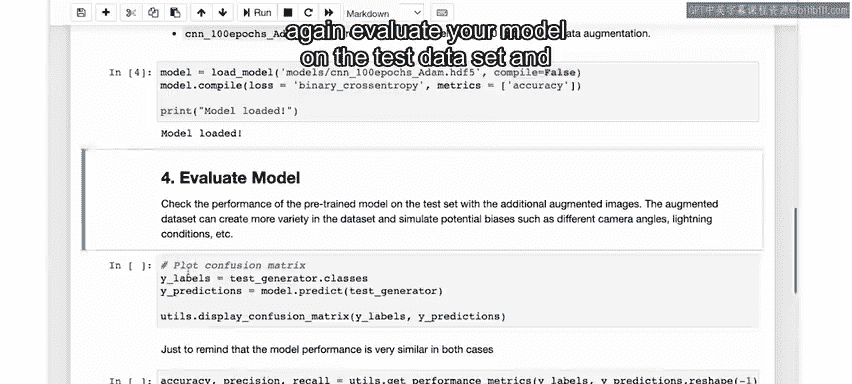

接下来，为“可见损害”和“无损害”这两个类别分配标签。

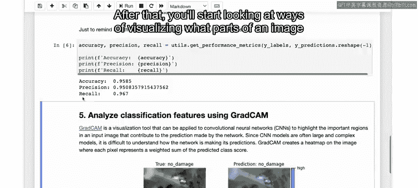

```python
labels = {0: '无损害', 1: '可见损害'}
```

然后，加载在设计阶段训练好的模型，并在测试数据集上评估其性能，同时绘制混淆矩阵以回顾模型表现。

```python
model = load_model('trained_model.h5')
evaluation_results = model.evaluate(test_data)
plot_confusion_matrix(true_labels, predictions)
```

---

## 可视化模型关注点：Grad-CAM方法

评估完模型后，我们将开始探索如何可视化模型在做出每个预测时所关注的图像区域。

这里使用一种名为 **Grad-CAM** 的方法。你无需担心其具体实现细节，只需知道Grad-CAM可以展示图像中哪些像素对模型的预测最为重要。

以下是两个示例，一个显示“无损害”，另一个显示“损害”。在每个图像的右侧，有一个类似热图的覆盖层和一个颜色条，颜色从浅蓝（低重要性）过渡到粉色（高重要性）。

*   在这些热图中显示为蓝色的像素，表示它们对模型预测的相对重要性较低。
*   显示为粉色的像素，则表示它们具有高重要性。

在上方的图像中，模型似乎捕捉到了一些尖锐的线条和阴影。
在下方的图像中，模型看起来更多地关注了洪水和树木区域。

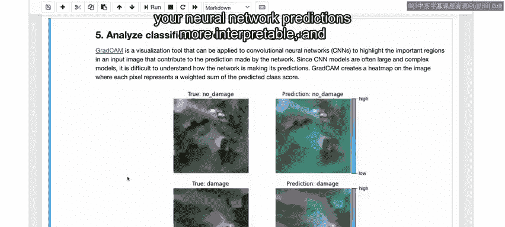

值得注意的是，对于人眼而言，有时并不总是能立刻理解图像中的某些特征为何对分类重要。但Grad-CAM提供了一种相对用户友好的方式，让我们能一窥神经网络内部的运作。因为神经网络有时就像一个黑箱，输入数据，输出结果，但得出特定结论或预测的过程可能并不直观。本质上，你可以将Grad-CAM视为一种让神经网络预测变得更可解释的方法，这对许多应用至关重要。

---

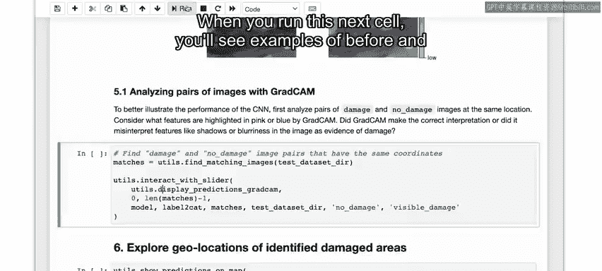

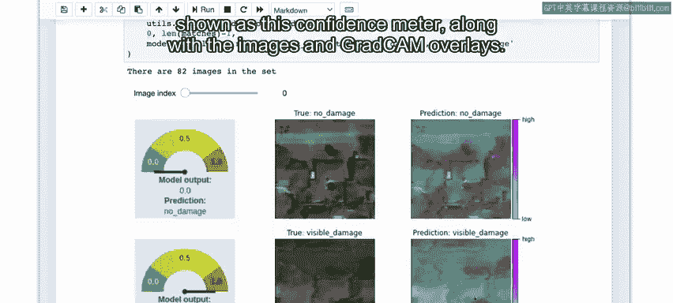

## 交互式查看预测结果

运行下面的代码单元格，你将看到飓风前后的图像对、模型输出的置信度指示器，以及叠加了Grad-CAM热图的图像。

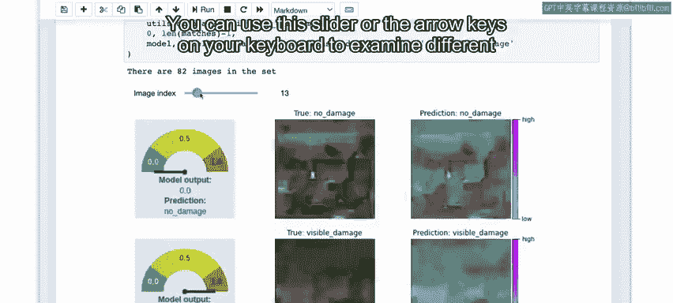

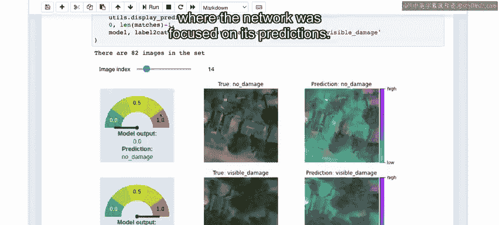

```python
display_interactive_comparison(test_data, model)
```

你可以使用滑块或键盘方向键来检查不同的图像对，从而了解模型的结果以及网络在预测时的关注点。

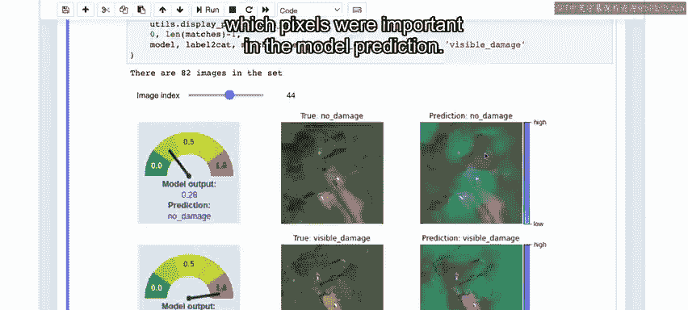

需要澄清一点，在这些比较中，Grad-CAM覆盖层中显示的粉色像素，仅仅指示了哪些像素在模型预测中很重要。它们**并非**在预测损害最严重的位置，而是告诉你图像的哪些部分对预测“损害”或“无损害”最具指示性。

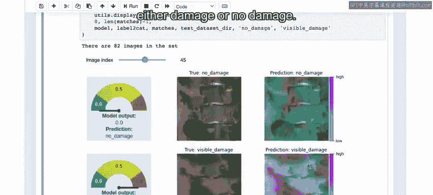

---

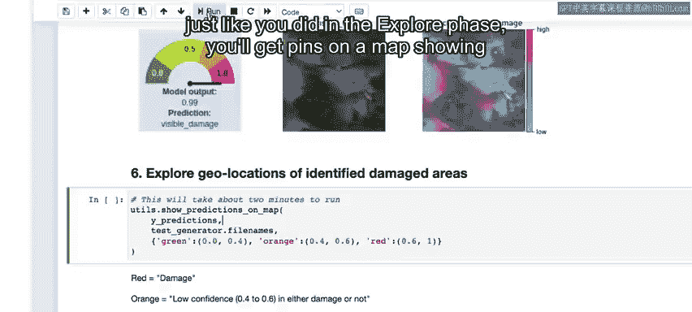

## 在地图上展示预测结果

最后，运行最后一个单元格，将所有预测结果展示在地图上。就像在探索阶段所做的一样，地图上将显示数据集中每张图像位置的图钉。

然而，此时展示的是测试数据集。图钉根据模型预测被分为三类：

*   **红色图钉**代表“损害”，由模型预测值大于 **0.6** 表示。
*   **绿色图钉**代表“无损害”，由模型预测值小于 **0.4** 表示。
*   **橙色图钉**代表建议人工复核的情况，因为模型预测值在 **0.4 到 0.6** 之间，这本质上表明模型对此预测的信心较低。

你可以根据需要调整这些阈值，以设置更宽的人工复核范围或其他标志。可以想象，预测模型置信度并调整该置信度本身就是一个广阔的研究领域。

点击任意图钉，你可以看到模型的预测结果以及对应的图像。请花些时间查看地图上的结果，看看你能发现什么。

---

## 总结

本节课中，我们一起完成了损害评估项目的实施阶段。当然，你的实施和用户界面仍然是一个原型。但我希望你能看到，通过几个简短的Notebook，你已成功从探索阶段的初始数据分析，推进到了一个有趣的原型，它至少展示了最终用户体验的某一部分可能是什么样子。

在下一个视频中，我们将完成实施阶段的检查点并总结整个项目。