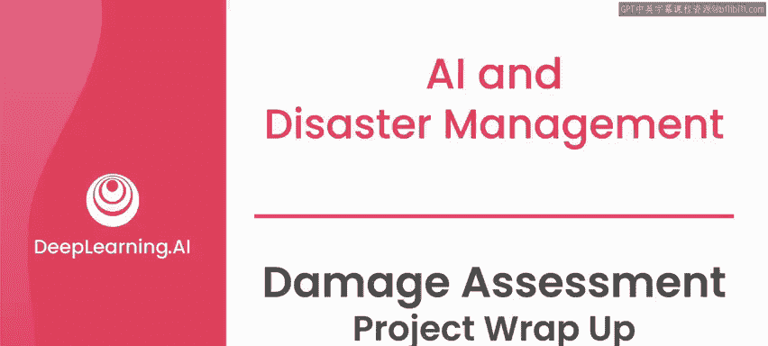
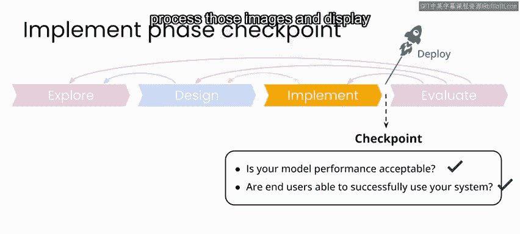
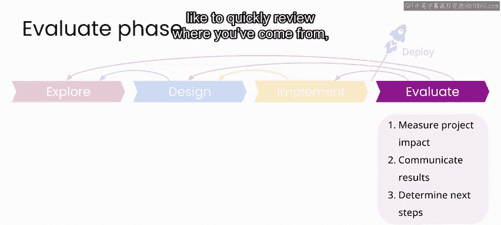
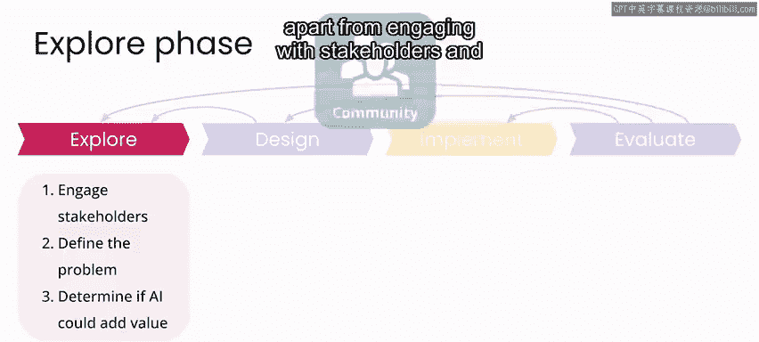
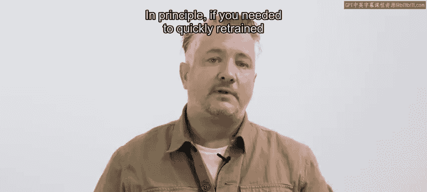
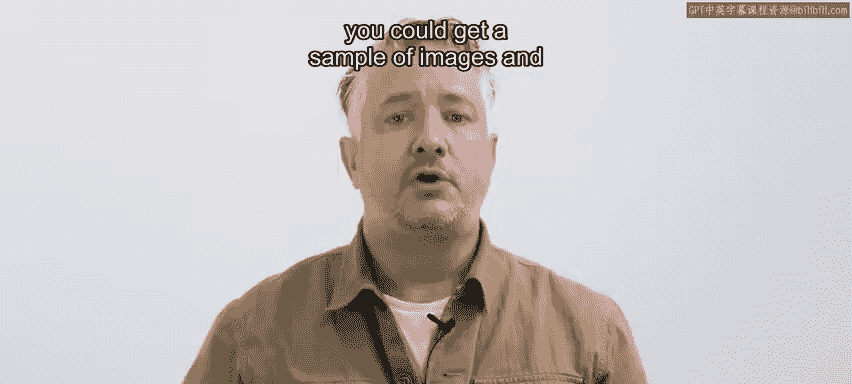
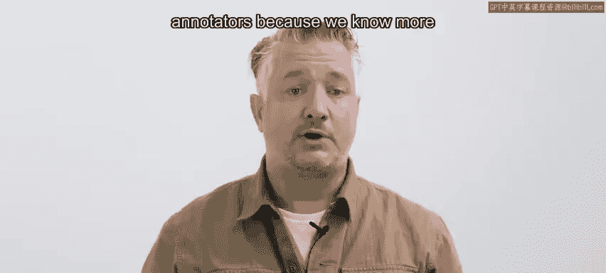
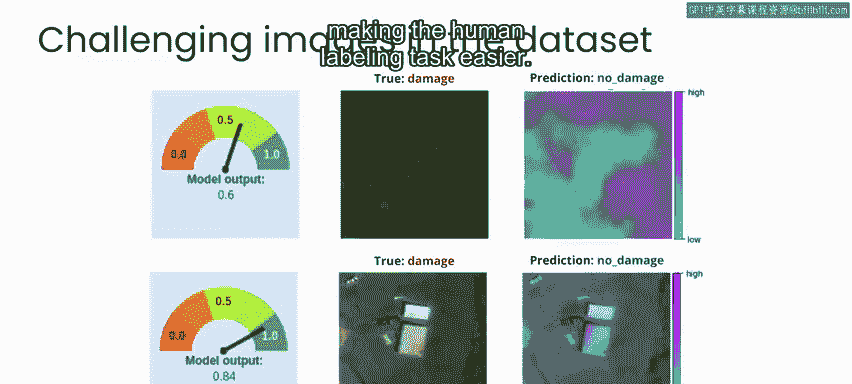

# 103：损害评估项目总结 🏁

在本节课中，我们将回顾并总结之前课程中构建的自动损害评估工具项目。我们将梳理整个项目流程的关键组成部分，讨论模型评估与部署的考量，并思考如何将此类项目应用于现实世界。

---

在之前的几个课程实验中，你已经构建了一个图像处理流程，它可以作为一个自动损害评估工具，用于灾难响应和恢复工作。

当然，要在现实世界中实施这样一个项目，还需要处理更多细节，项目的每个阶段也会更长、更复杂。

但你现在已经掌握了所有关键组件，包括已实现的神经网络模型。因此，原则上你可以进一步开发它，将其应用于任何涉及航拍图像的救灾项目中。

在本视频中，我将回顾你实现中的这些关键组件，并简要讨论如何改进你的实现以及评估结果。

要完成实施阶段，你需要能肯定地回答两个问题：你的模型性能是否可接受？最终用户能否成功与你的系统交互？

在这个案例中，你的模型性能相当不错。但你需要意识到，你训练的图像来自一个特定场景，你的分类器在灾后环境和条件完全不同的地区可能效果不佳。

你构建的原型用户界面允许用户通过地图应用程序探索已分类的图像，他们可以看到单个图像的位置和模型结果。如果你具备软件工程经验或与相关团队合作，你就可以着手部署你的系统。

与这些课程中的其他项目类似，部署步骤会包含许多我们在此不涉及的技术挑战。但原则上，你可以部署一个类似的应用，以接收来自新图像采集活动的自动上传图像，处理这些图像，并将损害评估结果与交互式地图一同展示。

对于此类项目的评估阶段，你可以通过为现场响应人员或其他参与灾后响应和恢复工作的利益相关者提供的价值来衡量项目的影响。

从长远来看，你可以通过项目在多大程度上帮助将所需资源导向受灾社区，以及在没有此类工具的情况下可能更困难的恢复工作中所提供的帮助来衡量成功。

在我们结束之前，我想快速回顾一下你在这个项目中从开始到结束的历程。

在探索阶段，除了与利益相关者接触并定义你想要解决的问题，你还需要一个带标签的图像数据集才能开始这个项目。

你在本项目中使用的带标签数据集最初由一家私人卫星成像公司提供，并由Tomnod平台上的志愿者进行标注。虽然从他人已标注的数据开始很不错，但你看到，你能够从一个相对较小的带标签图像集合开始，构建出一个可用的损害评估模型。

原则上，如果你需要为新的灾难响应场景快速重新训练这样一个系统，你可以获取一批新场景下的图像样本，并让人工对其进行标注，就像本案例和我之前在飓风桑迪中的工作一样。这可以是志愿者，但在当今实际的灾难响应场景中，我们倾向于更多地依赖专业的众包工作者或标注员，因为我们更了解他们的经验，并且与向互联网上的业余工作者开放任务相比，与专业标注公司合作时，我们更容易解决安全和隐私问题。

来自飓风哈维的这些数据带来了一些有趣的挑战，因为标签图像中的损害在现实世界中并不总是容易识别。在这个项目的实际实施中，你永远不会知道是否能够获取受灾区域的灾前和灾后图像。如果你确实能获取，这可能是简化人工标注任务的一个潜在方法。你甚至可以考虑开发一个系统，在神经网络模型的输入中同时包含灾前和灾后图像，前提是你的项目能同时获得这两种图像。

我希望你觉得这个项目既有趣又鼓舞人心。就像这些课程中的其他项目一样，这里的目标不一定是让你成为识别德克萨斯州飓风后洪水损害的专家，而是给你一些想法，并让你感受到未来某天你可能感兴趣并需要为此类项目进行原型设计和解决的工具。

我希望这激发了你的一些思考，也许你已经准备好在未来某天开始探索你自己的项目了。

---

**本节课总结**

在本节课中，我们一起回顾了自动损害评估项目的完整流程。我们从**探索阶段**的数据集获取与标注开始，讨论了**模型构建**的关键组件，并展望了**部署与评估**阶段需要考虑的实际问题。我们认识到，虽然原型项目展示了核心概念，但现实应用需要处理数据泛化、用户交互、安全隐私以及长期影响评估等更复杂的挑战。这个项目为你提供了一个框架，未来你可以基于此框架，为特定的救灾场景开发和优化你自己的AI工具。